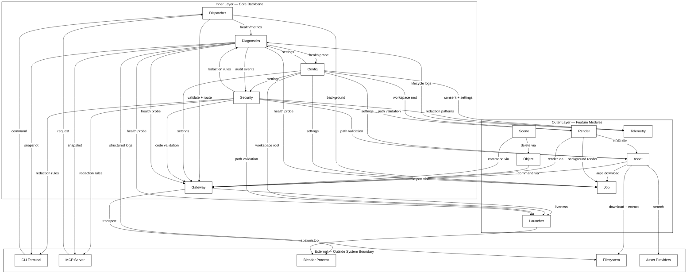

# Module: gateway (v1.7.0)

This document contains the source code for module `gateway` along with related and imported definitions from the `shared` module.

## File List

- [.agents/skills/add-docs-python/SKILL.md](<.agents/skills/add-docs-python/SKILL.md>)
- [.agents/skills/add-docs-rust/SKILL.md](<.agents/skills/add-docs-rust/SKILL.md>)
- [.agents/skills/add-docs-typescript/SKILL.md](<.agents/skills/add-docs-typescript/SKILL.md>)
- [.agents/skills/cleanup-consolidate-python/SKILL.md](<.agents/skills/cleanup-consolidate-python/SKILL.md>)
- [.agents/skills/cleanup-consolidate-rust/SKILL.md](<.agents/skills/cleanup-consolidate-rust/SKILL.md>)
- [.agents/skills/cleanup-consolidate-typescript/SKILL.md](<.agents/skills/cleanup-consolidate-typescript/SKILL.md>)
- [.agents/skills/create-agent-python/SKILL.md](<.agents/skills/create-agent-python/SKILL.md>)
- [.agents/skills/create-agent-rust/SKILL.md](<.agents/skills/create-agent-rust/SKILL.md>)
- [.agents/skills/create-agent-typescript/SKILL.md](<.agents/skills/create-agent-typescript/SKILL.md>)
- [.agents/skills/create-capabilities-python/SKILL.md](<.agents/skills/create-capabilities-python/SKILL.md>)
- [.agents/skills/create-capabilities-rust/SKILL.md](<.agents/skills/create-capabilities-rust/SKILL.md>)
- [.agents/skills/create-capabilities-typescript/SKILL.md](<.agents/skills/create-capabilities-typescript/SKILL.md>)
- [.agents/skills/create-contract-python/SKILL.md](<.agents/skills/create-contract-python/SKILL.md>)
- [.agents/skills/create-contract-rust/SKILL.md](<.agents/skills/create-contract-rust/SKILL.md>)
- [.agents/skills/create-contract-typescript/SKILL.md](<.agents/skills/create-contract-typescript/SKILL.md>)
- [.agents/skills/create-root-python/SKILL.md](<.agents/skills/create-root-python/SKILL.md>)
- [.agents/skills/create-root-rust/SKILL.md](<.agents/skills/create-root-rust/SKILL.md>)
- [.agents/skills/create-root-typescript/SKILL.md](<.agents/skills/create-root-typescript/SKILL.md>)
- [.agents/skills/create-skill-all/SKILL.md](<.agents/skills/create-skill-all/SKILL.md>)
- [.agents/skills/create-surface-python/SKILL.md](<.agents/skills/create-surface-python/SKILL.md>)
- [.agents/skills/create-surface-rust/SKILL.md](<.agents/skills/create-surface-rust/SKILL.md>)
- [.agents/skills/create-surface-typescript/SKILL.md](<.agents/skills/create-surface-typescript/SKILL.md>)
- [.agents/skills/create-taxonomy-python/SKILL.md](<.agents/skills/create-taxonomy-python/SKILL.md>)
- [.agents/skills/create-taxonomy-rust/SKILL.md](<.agents/skills/create-taxonomy-rust/SKILL.md>)
- [.agents/skills/create-taxonomy-typescript/SKILL.md](<.agents/skills/create-taxonomy-typescript/SKILL.md>)
- [.agents/skills/create-test-python/SKILL.md](<.agents/skills/create-test-python/SKILL.md>)
- [.agents/skills/create-test-rust/SKILL.md](<.agents/skills/create-test-rust/SKILL.md>)
- [.agents/skills/create-test-typescript/SKILL.md](<.agents/skills/create-test-typescript/SKILL.md>)
- [.agents/skills/create-utility-python/SKILL.md](<.agents/skills/create-utility-python/SKILL.md>)
- [.agents/skills/create-utility-rust/SKILL.md](<.agents/skills/create-utility-rust/SKILL.md>)
- [.agents/skills/create-utility-typescript/SKILL.md](<.agents/skills/create-utility-typescript/SKILL.md>)
- [.agents/skills/fix-bypass-python/SKILL.md](<.agents/skills/fix-bypass-python/SKILL.md>)
- [.agents/skills/fix-bypass-rust/SKILL.md](<.agents/skills/fix-bypass-rust/SKILL.md>)
- [.agents/skills/fix-bypass-typescript/SKILL.md](<.agents/skills/fix-bypass-typescript/SKILL.md>)
- [.agents/skills/lint-arwaky-python/SKILL.md](<.agents/skills/lint-arwaky-python/SKILL.md>)
- [.agents/skills/lint-arwaky-rust/SKILL.md](<.agents/skills/lint-arwaky-rust/SKILL.md>)
- [.agents/skills/lint-arwaky-typescript/SKILL.md](<.agents/skills/lint-arwaky-typescript/SKILL.md>)
- [ARCHITECTURE.md](<ARCHITECTURE.md>)
- [modules/gateway/FRD.md](<modules/gateway/FRD.md>)
- [modules/gateway/pyproject.toml](<modules/gateway/pyproject.toml>)
- [modules/gateway/src/__init__.py](<modules/gateway/src/__init__.py>)
- [modules/gateway/src/agent_gateway_orchestrator.py](<modules/gateway/src/agent_gateway_orchestrator.py>)
- [modules/gateway/src/capabilities_code_execution.py](<modules/gateway/src/capabilities_code_execution.py>)
- [modules/gateway/src/capabilities_connection_maintenance.py](<modules/gateway/src/capabilities_connection_maintenance.py>)
- [modules/gateway/src/capabilities_connection_manager.py](<modules/gateway/src/capabilities_connection_manager.py>)
- [modules/gateway/src/capabilities_scene_queue.py](<modules/gateway/src/capabilities_scene_queue.py>)
- [modules/gateway/src/capabilities_transport_executor.py](<modules/gateway/src/capabilities_transport_executor.py>)
- [modules/gateway/src/root_gateway_container.py](<modules/gateway/src/root_gateway_container.py>)
- [modules/gateway/src/utility_scene_coordinator.py](<modules/gateway/src/utility_scene_coordinator.py>)
- [modules/shared/src/common/__init__.py](<modules/shared/src/common/__init__.py>)
- [modules/shared/src/common/contract_command_catalog_protocol.py](<modules/shared/src/common/contract_command_catalog_protocol.py>)
- [modules/shared/src/common/taxonomy_command_catalog_constant.py](<modules/shared/src/common/taxonomy_command_catalog_constant.py>)
- [modules/shared/src/common/taxonomy_core_vo.py](<modules/shared/src/common/taxonomy_core_vo.py>)
- [modules/shared/src/common/taxonomy_domain_error.py](<modules/shared/src/common/taxonomy_domain_error.py>)
- [modules/shared/src/gateway/__init__.py](<modules/shared/src/gateway/__init__.py>)
- [modules/shared/src/gateway/contract_code_execution_protocol.py](<modules/shared/src/gateway/contract_code_execution_protocol.py>)
- [modules/shared/src/gateway/contract_code_validation_protocol.py](<modules/shared/src/gateway/contract_code_validation_protocol.py>)
- [modules/shared/src/gateway/contract_connection_protocol.py](<modules/shared/src/gateway/contract_connection_protocol.py>)
- [modules/shared/src/gateway/contract_event_protocol.py](<modules/shared/src/gateway/contract_event_protocol.py>)
- [modules/shared/src/gateway/contract_maintenance_protocol.py](<modules/shared/src/gateway/contract_maintenance_protocol.py>)
- [modules/shared/src/gateway/contract_scene_queue_protocol.py](<modules/shared/src/gateway/contract_scene_queue_protocol.py>)
- [modules/shared/src/gateway/contract_transport_protocol.py](<modules/shared/src/gateway/contract_transport_protocol.py>)
- [modules/shared/src/gateway/taxonomy_gateway_constant.py](<modules/shared/src/gateway/taxonomy_gateway_constant.py>)
- [modules/shared/src/gateway/taxonomy_gateway_error.py](<modules/shared/src/gateway/taxonomy_gateway_error.py>)
- [modules/shared/src/gateway/taxonomy_gateway_event.py](<modules/shared/src/gateway/taxonomy_gateway_event.py>)
- [modules/shared/src/gateway/taxonomy_gateway_vo.py](<modules/shared/src/gateway/taxonomy_gateway_vo.py>)
- [modules/shared/src/gateway/utility_schema_helper.py](<modules/shared/src/gateway/utility_schema_helper.py>)
- [modules/shared/src/gateway/utility_validator_checker.py](<modules/shared/src/gateway/utility_validator_checker.py>)
- [modules/shared/src/job/__init__.py](<modules/shared/src/job/__init__.py>)
- [modules/shared/src/job/taxonomy_job_error.py](<modules/shared/src/job/taxonomy_job_error.py>)
- [modules/shared/src/job/taxonomy_job_vo.py](<modules/shared/src/job/taxonomy_job_vo.py>)
- [modules/shared/src/security/__init__.py](<modules/shared/src/security/__init__.py>)
- [modules/shared/src/security/taxonomy_security_error.py](<modules/shared/src/security/taxonomy_security_error.py>)
- [modules/shared/src/security/taxonomy_security_vo.py](<modules/shared/src/security/taxonomy_security_vo.py>)
- [PRD.md](<PRD.md>)
- [pyproject.toml](<pyproject.toml>)
- [README.md](<README.md>)
- [RULES_AES.md](<RULES_AES.md>)

---

## File: .agents/skills/add-docs-python/SKILL.md

```markdown
---
name: add-docs-python
description: "Add proper docstrings, type hints, and crate-level PRD.md/FRD.md/README.md to Python packages following PEP 257 and project conventions."
metadata:
  tags: [python, docs, docstring, type-hints, prd, frd, readme, pep257]
  triggers:
    - "add docs python"
    - "add docstring python"
    - "add type hints python"
    - "add prd python"
    - "add frd python"
    - "add packag
```

---

## File: .agents/skills/add-docs-rust/SKILL.md

`````markdown
---
name: add-docs-rust
description: "Add proper doc comments, type annotations, and crate-level PRD.md/FRD.md/README.md to Rust crates following project conventions."
metadata:
  tags: [rust, docs, doc-comments, prd, frd, readme]
  triggers:
    - "add docs rust"
    - "add crate readme rust"
    - "add prd rust"
    - "add frd rust"
    - "add doc comments rust"
    - "document public api rust"
  dependencies: []
  related:
    - lint-arwaky-rust
    - cleanup-consolidate-rust
---

# add-docs-rust

## Rules

- Every crate directory MUST contain THREE crate-level docs: `PRD.md`, `FRD.md`, and `README.md`.
- **PRD.md** = Product Requirements Document — describes **WHAT** and **WHY** for stakeholders, PM, Design, and Eng alignment.
- **FRD.md** = Functional Requirements Document — describes **HOW** (functionally) for engineers, QA, and Tech Lead.
- **README.md** = Developer onboarding — describes **HOW TO USE/RUN** for developers.
- Relationship: **PRD (what/why) → FRD (how) → README (how to use)**. Each serves a different audience.
- All public structs and methods MUST have `///` doc comments (visible in `cargo doc`).
- Doc comments MUST explain "what" and "why", not "how" (code shows how).
- Example code in doc comments MUST be valid Rust.

## Purpose

Add crate-level documentation and `///` doc comments:

- `PRD.md` — stakeholder alignment (Problem Statement / Goals & Success Metrics / User Personas / Scope / Feature Requirements / Non-functional Requirements).
- `FRD.md` — engineering specs (Functional Requirements with IDs / API Contract / Integration Points / Test Scenarios).
- `README.md` — developer onboarding (Quick Start / Architecture / Project Structure / Available Commands / Configuration / Testing / Contributing).
- `///` doc comments on all public items for `cargo doc` visibility.

## When to Use

- New crate has no `PRD.md`, `FRD.md`, or `README.md`.
- Documents are conflated (wrong audience for wrong doc) — split them.
- Public structs/methods lack `///` doc comments.
- `cargo doc` output is incomplete or missing.
- User asks to document the crate or add docs.

## The Fundamental Question

> **"Can a stakeholder understand this crate's purpose in 30 seconds?"**

If no -> **Add PRD.md (what/why).**

> **"Can an engineer implement this from the spec?"**

If no -> **Add FRD.md (how).**

> **"Can a developer clone → build → run in < 10 minutes?"**

If no -> **Add README.md (how to use).**

## Document Audience Matrix

| Document  | Audience                     | Focus                | Length    |
| --------- | ---------------------------- | -------------------- | --------- |
| PRD.md    | Stakeholder, PM, Design, Eng | _What_ & _Why_       | 1-2 pages |
| FRD.md    | Engineer, QA, Tech Lead      | _How_ (functionally) | 2-5 pages |
| README.md | Developer (new/existing)     | _How to use/run_     | 1-2 pages |

## Detection Patterns

### Missing PRD.md / FRD.md / README.md (Create)

```
crates/<name-folder>/
├── src/
│   ├── lib.rs
│   └── ...
├── tests/
├── PRD.md        # stakeholder alignment (what/why)
├── FRD.md        # engineering specs (how)
└── README.md     # developer onboarding (how to use)
```

### Missing Doc Comments (Add)

```rust
// PURPOSE explain file in one sentence
pub struct ImportOrchestrator {
    mandatory: Arc<dyn IImportMandatoryProtocol>,
}

// [OK] /// doc comment — appears in cargo doc
/// Orchestrates <name-feature>.
///
/// Execution order:
/// 1.
/// 2.
/// 3.
/// 4.
pub struct ImportOrchestrator {
    mandatory: Arc<dyn IImportMandatoryProtocol>,
}
```

## PRD.md Template (STAKEHOLDER ALIGNMENT — what/why)

```markdown
# PRD — <crate-name>

> Product Requirements Document. Describes WHAT this crate does and WHY.
> Audience: Stakeholders, PM, Design, Engineering leads.

## Problem Statement

<One paragraph: what problem does this crate solve?>

## Goals & Success Metrics

- Goal 1: <measurable outcome>
- Goal 2: <measurable outcome>

## User Personas

- **Persona 1**: <who they are, what they need>
- **Persona 2**: <...>

## Scope

- In scope: <...>
- Out of scope: <...>

## Feature Requirements (Prioritized)

### P0 — Must Have

- [ ] <feature with acceptance criteria>

### P1 — Should Have

- [ ] <feature with acceptance criteria>

### P2 — Nice to Have

- [ ] <feature with acceptance criteria>

## Non-functional Requirements (High-level)

- Performance: <...>
- Security: <...>
- Scalability: <...>

## Open Questions / Risks

- <question or risk>
```

## FRD.md Template (ENGINEERING SPECS — how)

```markdown
# FRD — <crate-name>

> Functional Requirements Document. Describes HOW this crate works functionally.
> Audience: Engineers, QA, Tech Lead.

## Reference

- PRD: <link to PRD.md>

## System Overview

<Architecture diagram or high-level description>

## Functional Requirements

### FR-001: <Feature Name>

- **Description**: <what it does>
- **Input**: <input data>
- **Output**: <output data>
- **Business Rules**: <validation logic>
- **Edge Cases**: <edge case handling>
- **Error Handling**: <error scenarios>

### FR-002: <Feature Name>

- ...

## API Contract

| Operation | Input | Output | Description |
|-----------|-------|--------|-------------|
| `<name>`  | ...   | ...    | ...         |

## Integration Points

- **3rd Party**: <service name, purpose>
- **Internal**: <service name, purpose>

## Non-functional Requirements (Detailed)

- Performance: <response time, throughput>
- Security: <auth, encryption, compliance>
- SLA: <availability, uptime>

## Test Scenarios / QA Checklist

- [ ] <test scenario with expected result>

## Assumptions & Constraints

- <assumption or constraint>

## Glossary

- **Term**: <definition>
```

## README.md Template (DEVELOPER ONBOARDING — how to use)

```markdown
# <crate-name>

> One-liner: what this crate does and who it's for.

## Prerequisites

- Rust 1.70+
- <other dependencies>

## Quick Start

```bash
git clone ...
cd crates/<name>
cargo build
cargo run
```
````

## Architecture

<High-level diagram or link to full docs>

## Project Structure

```
src/
├── lib.rs
├── modules/
└── ...
```

## Available Commands

| Command       | Description     |
| ------------- | --------------- |
| `cargo build` | Build the crate |
| `cargo test`  | Run tests       |
| `cargo run`   | Run the binary  |

## Configuration

<Environment variables, config files>

## Testing

```bash
cargo test
```

## Contributing

<Branching strategy, PR conventions>

## License

<License type>
```

## Workflow

### Step 1: Analyze Crate

- List files in `crates/<name>/src/`
- Identify public structs and methods
- Check existing docs (PRD.md / FRD.md / README.md / `///` comments)

### Step 2: Create / Fix PRD.md (stakeholder alignment)

Write crate-level PRD.md following the PRD template. It MUST contain:

1. Problem Statement
2. Goals & Success Metrics
3. User Personas
4. Scope
5. Feature Requirements (prioritized)
6. Non-functional Requirements (high-level)

Write for non-engineers. Avoid technical jargon. Use acceptance criteria.

### Step 3: Create / Fix FRD.md (engineering specs)

Write crate-level FRD.md following the FRD template. It MUST contain:

1. Reference to PRD
2. System Overview
3. Functional Requirements (with unique IDs: FR-001, FR-002)
4. API Contract
5. Integration Points
6. Test Scenarios

Use precise, unambiguous language. Include edge cases and error handling.

### Step 4: Create / Update README.md (developer onboarding)

Write README.md following the README template. It MUST contain:

1. Quick Start (clone → build → run in < 10 minutes)
2. Architecture (high-level)
3. Project Structure
4. Available Commands
5. Configuration
6. Testing
7. Contributing

Keep concise. Link to PRD/FRD for details. Update when setup changes.

### Step 5: Add Doc Comments

For each public struct and method:

1. Convert `//` comments to `///` doc comments
2. Add summary line
3. Add explanation if >10 lines of logic
4. Add `# Example` block if applicable

````rust
/// Taxonomy value objects for import rules.

/// Value object representing an import rule with pattern and message.
pub struct ImportRuleVO {
    pattern: String,
    message: String,
}

/// Check if path matches the import rule.
///
/// # Arguments
///
/// * `path` - File path to check
///
/// # Returns
///
/// `true` if path matches the rule
///
/// # Errors
///
/// Returns `Err` if path is empty
///
/// # Example
///
/// ```
/// let rule = ImportRuleVO::new("*.test.ts", "Test file");
/// assert!(rule.check("foo.test.ts"));
/// ```
pub fn check(&self, path: &str) -> Result<bool, Error> {
    // ...
}
````

### Step 6: Add Type Annotations

- Use Rust type annotations for all function parameters and return types
- Use traits for abstract behavior
- Use enums for sum types

```rust
pub fn validate(&self, data: &HashMap<String, Value>) -> Result<(bool, String), Error> {
    // ...
}
```

## Verification Checklist

- [ ] PRD.md exists with Problem Statement, Goals, Personas, Scope, Features
- [ ] FRD.md exists with Functional Requirements (FR-001 IDs), API Contract
- [ ] README.md exists with Quick Start, Architecture, Commands, Testing
- [ ] Documents serve correct audience (PRD=stakeholders, FRD=engineers, README=developers)
- [ ] All public structs have `///` doc comments
- [ ] All public methods have `///` doc comments with Args/Returns/Errors
- [ ] All function signatures use type annotations
- [ ] Example code in doc comments is valid Rust

## Quick Commands

```bash
# Check files without doc comments
find crates/ -name "*.rs" | while read f; do
    head -1 "$f" | grep -q '^///' || echo "NO DOC COMMENT: $f"
done

# Run cargo doc
cargo doc --open
```

## Common Mistakes (AVOID)

- ❌ **PRD contains SQL schema or API details** — move to FRD
- ❌ **FRD without acceptance criteria** — add testable conditions per FR
- ❌ **README = essay 10 pages** — keep concise, link to other docs
- ❌ **One document for all audiences** — split by audience
- ❌ **Documents "write & forget"** — review each sprint/release
- ❌ **Missing doc comments**: Every public item needs `///` doc comment
- ❌ **Using `//` instead of `///`**: Use `///` for cargo doc visibility
- ❌ **Incomplete parameter documentation**: All parameters must be documented
`````

---

## File: .agents/skills/add-docs-typescript/SKILL.md

````markdown
---
name: add-docs-typescript
description: "Add proper JSDoc comments, type annotations, and crate-level PRD.md/FRD.md/README.md to TypeScript packages following project conventions."
metadata:
  tags: [typescript, docs, jsdoc, type-hints, prd, frd, readme]
  triggers:
    - "add docs typescript"
    - "add jsdoc typescript"
    - "add type hints typescript"
    - "add prd typescript"
    - "add frd typescript"
    - "add package readme typescript"
  dependencies: []
  related:
    - cleanup-consolidate-typescript
    - add-docs-rust
---

# add-docs-typescript

## Purpose

Add documentation at correct locations following project conventions.

## Document Location Matrix

| Document  | Location            | Audience                     | Focus                |
| --------- | ------------------- | ---------------------------- | -------------------- |
| PRD.md    | Root workspace      | Stakeholder, PM, Design, Eng | _What_ & _Why_       |
| README.md | Root workspace      | Developer (new/existing)     | _How to use/run_     |
| FRD.md    | Each feature module | Engineer, QA, Tech Lead      | _How_ (functionally) |

## References

Read these files for detailed rules:

| File                                  | Content                              |
| ------------------------------------- | ------------------------------------ |
| `references/prd-rules.md`             | PRD rules, audience, anti-patterns   |
| `references/frd-rules.md`             | FRD rules, IDs, test scenarios       |
| `references/readme-rules.md`          | README rules, Quick Start, structure |
| `references/jsdoc-rules.md`           | JSDoc comment rules and templates    |
| `references/type-annotation-rules.md` | Type annotation rules and patterns   |

## Templates

Use these templates when creating new files:

| File                  | Purpose                      |
| --------------------- | ---------------------------- |
| `templates/PRD.md`    | New PRD at root workspace    |
| `templates/FRD.md`    | New FRD in feature module    |
| `templates/README.md` | New README at root workspace |

## Definition of Done

1. PRD.md exists at root with Problem Statement, Goals, Personas, Scope, Features.
2. README.md exists at root with Quick Start, Architecture, Scripts, Testing.
3. FRD.md exists in each feature module with Functional Requirements (FR-001 IDs).
4. Documents serve correct audience (PRD=stakeholders, FRD=engineers, README=developers).
5. All modules have one-liner JSDoc docstrings.
6. All classes have descriptive JSDoc docstrings.
7. All public methods have parameter/return documentation.
8. All function signatures use type annotations.
9. Complex types use interfaces or type aliases.

## Workflow

### Step 1: Analyze Project

- List feature modules in `packages/`
- Identify public modules, classes, and functions
- Check existing docs (PRD.md / README.md / FRD.md / JSDoc / type annotations)

### Step 2: Create / Fix PRD.md (root workspace)

Write root-level PRD.md following `templates/PRD.md`. See `references/prd-rules.md` for rules.

### Step 3: Create / Fix FRD.md (each feature module)

For each feature module, write FRD.md following `templates/FRD.md`. See `references/frd-rules.md` for rules.

### Step 4: Create / Update README.md (root workspace)

Write root-level README.md following `templates/README.md`. See `references/readme-rules.md` for rules.

### Step 5: Add JSDoc Comments

See `references/jsdoc-rules.md` for rules and templates.

### Step 6: Add Type Annotations

See `references/type-annotation-rules.md` for rules and patterns.

## Quick Commands

```bash
# Check files without docstrings
find packages/ -name "*.ts" | while read f; do
    head -1 "$f" | grep -q '^/\*\*' || echo "NO DOCSTRING: $f"
done

# Run TypeScript type checker
npx tsc --noEmit
```

## Common Mistakes

- PRD contains SQL schema or API details → move to FRD.
- FRD without acceptance criteria → add testable conditions per FR.
- README = essay 10 pages → keep concise, link to other docs.
- One document for all audiences → split by audience.
- Documents "write & forget" → review each sprint/release.
- FRD in root instead of feature module → FRD belongs with the feature code.
- Missing module docstrings → every file needs a one-liner at the top.
- Incomplete parameter documentation → all parameters must be documented.
- Using @ts-ignore without reason → fix the root cause instead of suppressing errors.
````

---

## File: .agents/skills/cleanup-consolidate-python/SKILL.md

````markdown
---
name: cleanup-consolidate-python
description: "Find and remove dead code, unused files, stubs, thin wrappers, and duplicates across Python packages, then merge overlapping files into single cohesive modules."
metadata:
  tags:
    [
      python,
      cleanup,
      consolidation,
      bloat,
      stubs,
      thin-wrappers,
      dead-code,
      orphan,
      unused-files,
      merge,
      deduplication,
      single-file,
      ruff,
      vulture,
      black,
    ]
  triggers:
    - "cleanup python"
    - "clean bloat python"
    - "fix formatting python"
    - "remove unused imports python"
    - "remove stubs python"
    - "remove thin wrappers python"
    - "find unused files python"
    - "find dead code python"
    - "remove dead code python"
    - "cleanup module python"
    - "pep8 python"
    - "consolidate python"
    - "merge files python"
    - "combine modules python"
  dependencies: []
  related:
    - add-docs-python
    - create-capabilities-python
---

# cleanup-consolidate-python

## Purpose

Unified Python codebase cleanup skill combining **dead code removal** and **file consolidation**. First find and remove dead code, unused files, stubs, thin wrappers, and duplicates. Then detect overlapping files that share the same domain and merge them into single cohesive modules. The result is a cleaner codebase with fewer files, less bloat, and maximum signal-to-noise ratio.

**CRITICAL: Two-Phase Approach** — Phase 1 removes dead code. Phase 2 merges overlapping files. Never skip Phase 1 — consolidating files with dead code wastes effort.

---

## Rules

- **Never remove real logic** — only remove code not relevant to FRD scope
- **Always update `__all__`** — when removing functions/classes, remove from `__all__` too
- **Always update `__init__.py`** — when deleting modules, remove their imports/re-exports
- **Always run lint + tests after changes** — verify no breakage
- **Always snapshot before cleanup** — git commit or stash before any deletion
- **Respect `# noqa`** — developer explicitly suppressed a lint; investigate intent before removing
- **Respect `# type: ignore`** — may indicate intentional dynamic typing
- **Respect `# pragma: no cover`** — code intentionally excluded from coverage; investigate why
- **Respect decorator-registered code** — `@app.route`, `@pytest.fixture`, `@celery.task`, `@receiver` etc. are NOT dead code even if never directly called
- **Respect `if TYPE_CHECKING:` blocks** — these imports are used by type checkers, not at runtime
- **Respect `try/except ImportError` fallbacks** — conditional imports for optional dependencies
- **File with 0 inbound imports AND not an entry point** = likely unused (verify with multi-pattern check)
- **File with only re-exports in `__init__.py`** = evaluate whether re-export adds value
- **Single Responsibility** (consolidation): each file should have ONE clear purpose
- **Related classes/functions belong in the same file** (consolidation)

---

## When to Use

- After refactoring modules
- Before committing changes
- When user asks to clean bloat from a package
- After merging branches (accumulated dead code)
- Before release (final bloat + format pass)
- When cleaning up accumulated commented-out code
- When onboarding new developers (reduce noise)
- Files with scattered responsibilities
- Multiple small files that belong together
- After refactoring that split code across files

---

## The Fundamental Questions

### For Cleanup (Phase 1)

Before keeping any function, class, or file, ask:

> **"Why does this function/class/file need to exist?"**

| Answer | Verdict |
| ---------------------------------------------------------------------- | ------------------------------------------ |
| "Because it was always there" | **REMOVE** |
| "Because it might be useful someday" | **REMOVE** |
| "Because it handles edge cases we don't have" | **REMOVE** |
| "Because it's required by FRD" | **KEEP** |
| "Because it's called by a method required by FRD" | **KEEP** |
| "Because it's registered via decorator (route, fixture, task, signal)" | **KEEP** |
| "Because it's in `__all__` and consumed by downstream packages" | **KEEP** |
| "Because it's behind `if TYPE_CHECKING:` for type annotations" | **KEEP** |
| "Because it's a `try/except ImportError` fallback for optional dep" | **KEEP** (unless dep is confirmed removed) |
| "Because `importlib` loads it dynamically at runtime" | **KEEP** |
| "Because `conftest.py` or `pyproject.toml` entry_points reference it" | **KEEP** |
| "Because it's a Protocol / ABC that defines a contract" | **KEEP** |

### For Consolidation (Phase 2)

> **"Do these files serve the same purpose?"**

If yes → **Consolidate into single module**

---

## Phase 1: Dead Code Cleanup

### Detection Patterns: Function-Level Bloat

#### Stubs (Remove)

```python
# ❌ Empty implementations providing no value
def process(self) -> None:
    pass

def get_value(self) -> str:
    return ""

def get_items(self) -> list:
    return []

def get_mapping(self) -> dict:
    return {}

def compute(self) -> None:
    ...

def transform(self, data):
    raise NotImplementedError  # with no subclass implementing it
```

**Exception — KEEP stubs when:**

- They are abstract methods in an ABC/Protocol with active subclasses implementing them
- They are placeholder for a confirmed next-sprint FRD item (add `# TODO(FRD-XXX): implement`)
- They are `__init__.py` package markers (empty file is valid)

#### Thin Wrappers (Remove)

```python
# ❌ Simple attribute return — direct access is simpler
def get_name(self) -> str:
    return self.name

# ❌ Simple comparison — trivially inlineable
def is_active(self) -> bool:
    return self.status == "active"

# ❌ Single-field delegation — no logic added
def get_id(self) -> int:
    return self._inner.id

# ❌ Trivial passthrough
def save(self, data):
    self.repository.save(data)
```

**Exception — KEEP thin wrappers when:**

- They are part of a public API / ABC / Protocol contract
- They add validation, logging, or transformation (not just passthrough)
- They are `@property` accessors that enforce encapsulation on a public class
- They exist solely to satisfy a framework interface (e.g., Django `get_queryset`)

#### Duplicate Functions (Remove)

Same logic in multiple modules — keep in the module that **owns the domain logic**.

```python
# ❌ In utils/helpers.py AND services/processor.py:
def clamp(value: float, min_val: float, max_val: float) -> float:
    return max(min_val, min(value, max_val))
# KEEP in utils/helpers.py (owns utility logic). Remove from services/.
```

**Detection:** Match on function body similarity, not just name. Two functions with different names but identical bodies are also duplicates.

#### Overengineered Patterns (Remove)

```python
# ❌ Metaclass registries, plugin discovery systems, circular dep detectors,
#    event buses, temporal enforcers — if NOT in MVP → REMOVE
```

**3-Point Decision Test — ALL must be true to remove:**

1. ✅ The pattern is **NOT referenced** in any FRD requirement document
2. ✅ Removing it does **NOT break** any existing test (`pytest` passes)
3. ✅ The pattern adds **>20 lines** of code for **<3 lines** of actual consumed logic

If **any** check fails → **KEEP** and add comment: `# REVIEW: candidate for removal post-MVP`

#### Commented-Out Code (Remove)

```python
# ❌ Dead code left as comments
# def old_process(self):
#     result = self.transform(data)
#     return result.validate()

# ❌ Commented imports
# import pandas as pd
# from old_module import legacy_func
```

**Exception — KEEP comments when:**

- They are explanatory documentation (`# This handles the edge case where...`)
- They are `# TODO`, `# FIXME`, `# HACK` with ticket references
- They are `# noqa`, `# type: ignore`, `# pragma: no cover` directives

#### Unused Variables (Remove)

```python
# ❌ Assigned but never read
result = compute_something()  # result never used after this line
_ = some_function()           # intentional discard — KEEP this pattern

# ❌ Loop variable never used
for item in items:  # item never referenced in loop body
    count += 1
# Fix: for _ in items:
```

### Detection Patterns: File-Level Orphans

#### Unused Modules

Files not imported by any other file in the package:

```
my_package/orphan_feature.py  # 0 inbound refs
```

#### Re-Export Only `__init__.py`

```python
# ❌ my_package/subpkg/__init__.py — just a passthrough
from my_package.subpkg.real_impl import MyClass
from my_package.subpkg.real_impl import my_func
# WHY: If no downstream code imports from this path, consolidate.
```

**Exception — KEEP re-exports when:**

- They form a deliberate public API surface (documented in README / used by downstream packages)
- They are referenced in `pyproject.toml` `[tool.setuptools.packages]` or `setup.py`
- Changing the import path would be a breaking change for consumers

#### Empty / Near-Empty Files

```python
# ❌ module with only a docstring and no code
"""This module handles X."""
# (nothing else)

# ❌ module with only imports and no definitions
import os
import sys
# (nothing else)
```

**Exception:** `__init__.py` files may legitimately be empty (package marker).

### AES Layer-Specific Orphan Detection (AES501–AES506)

After generic orphan detection, run layer-specific orphan checks using the `orphan-detector` tool:

```bash
# Run full orphan scan (detects AES501–AES506 layer violations)
cargo run --bin lint-arwaky-cli -- orphan <project-path> --format json
```

The tool builds a full import reachability graph and checks:

| Rule | Layer | Orphan If... | Severity |
|------|-------|-------------|----------|
| **AES501** | Taxonomy | No non-taxonomy file imports it | MEDIUM |
| **AES502** | Contract | No implementation (`class X(Protocol)`) exists, or no callers | MEDIUM |
| **AES503** | Capabilities | Not wired in any container and not reachable from entry points | HIGH |
| **AES504** | Utility | Imported only by other utility files (utility-only chain = dead) | MEDIUM |
| **AES505** | Agent | Not referenced by any surface, entry point, or container | **HIGH** |
| **AES506** | Surface | Not reachable in `Entry→Smart→Utility→Passive` chain | MEDIUM |

### Exceptions (NEVER Remove Without Explicit Approval)

| File / Pattern | Reason |
| ------------------------------------------------------------------------------ | ------------------------------------------------------------------ |
| `__init__.py` | Package marker (may be empty by design) |
| `__main__.py` | Entry point for `python -m package` |
| `conftest.py` | pytest fixture discovery (not imported directly) |
| `setup.py` / `pyproject.toml` | Build / packaging config |
| `py.typed` | PEP 561 marker for typed packages |
| Protocol / ABC classes | Define contracts for subclasses |
| `if TYPE_CHECKING:` imports | Used by type checkers, invisible at runtime |
| `try/except ImportError` blocks | Optional dependency fallbacks |
| Decorator-registered functions | `@app.route`, `@pytest.fixture`, `@celery.task`, `@receiver`, etc. |
| `importlib`-loaded modules | Dynamically imported at runtime |
| `# noqa` / `# type: ignore` items | Developer explicitly suppressed — investigate intent |
| `# pragma: no cover` items | Intentionally excluded from coverage — investigate why |
| Entry points in `pyproject.toml` `[project.scripts]` / `[project.entry-points]` | Referenced by packaging, not by Python imports |
| Migration files (Django, Alembic) | Must be preserved for migration history |
| `__version__`, `__author__` dunder assignments | May be read by packaging tools |

### Phase 1 Workflow

#### Step 1.1: Safety Snapshot

```bash
# ALWAYS do this first — non-negotiable
git add -A && git commit -m "pre-cleanup snapshot: <package>" --allow-empty
git checkout -b cleanup/<package>-$(date +%Y%m%d)
```

If anything goes wrong:

```bash
git checkout main
git branch -D cleanup/<package>-$(date +%Y%m%d)
# Or restore specific files:
git checkout HEAD~1 -- <package>/<file>.py
```

#### Step 1.2: Read Requirements

Read the FRD / requirements document to understand MVP scope. List all required modules, classes, functions, and behaviors. Identify:

- Entry points (`pyproject.toml` scripts, `__main__.py`)
- Public API surface (`__all__`, documented imports)
- Framework registrations (routes, fixtures, tasks, signals)
- Optional dependency features

#### Step 1.3: Run Primary Detection (Tooling)

Use Python-native tooling FIRST — it understands the language semantics:

```bash
# Primary: ruff (replaces flake8, isort, pycodestyle, pycln, pyupgrade)
# Lint + unused imports + import sorting in one pass
ruff check <package>/ --select F,E,W,I --fix --unsafe-fixes 2>&1 | tee /tmp/ruff_report.txt

# Dead code detection (unused functions, classes, variables, attributes)
vulture <package>/ --min-confidence 80 --exclude "venv,.venv,__pycache__" 2>&1 | tee /tmp/vulture_report.txt

# Format check (do NOT auto-fix yet — review first)
black --check --diff <package>/ --line-length 88 2>&1 | tee /tmp/black_report.txt

# Type check (reveals unreachable code, unused ignores)
mypy <package>/ --warn-unused-ignores --warn-unreachable 2>&1 | tee /tmp/mypy_report.txt
# OR: pyright <package>/ 2>&1 | tee /tmp/pyright_report.txt

# Test compilation (catches test-only references)
pytest <package>/ --collect-only -q 2>&1 | tee /tmp/pytest_collect.txt
```

#### Step 1.4: Run Secondary Detection (File-Level Scan)

Multi-pattern scan for files not referenced anywhere:

```bash
#!/usr/bin/env bash
# find_unused_files.sh — comprehensive orphan detection for Python
PKG_DIR="<package>"

for f in $(find "$PKG_DIR" -name "*.py" -not -path "*/venv/*" -not -path "*/__pycache__/*"); do
  name=$(basename "$f" .py)
  rel_path="${f#$PKG_DIR/}"
  module_path=$(echo "$rel_path" | sed 's|/|.|g; s|\.py$||')

  # Skip protected files
  [[ "$name" =~ ^(__init__|__main__|conftest|setup)$ ]] && continue
  [[ "$name" =~ ^py$ ]] && continue  # py.typed

  refs=0

  # 1. Direct imports: "import name" or "from name import" or "from pkg.name import"
  refs=$((refs + $(grep -rnE "(import\s+${name}|from\s+.*\b${name}\b\s+import)" "$PKG_DIR" \
    --include="*.py" | grep -v "^$f:" | grep -v "__pycache__" | wc -l)))

  # 2. importlib dynamic imports: importlib.import_module("pkg.name")
  refs=$((refs + $(grep -rnE "import_module\s*\(\s*['\"].*${name}" "$PKG_DIR" \
    --include="*.py" | grep -v "^$f:" | wc -l)))

  # 3. __init__.py re-exports
  refs=$((refs + $(grep -rnE "\b${name}\b" "$PKG_DIR"/*/__init__.py 2>/dev/null \
    | grep -v "^$f:" | wc -l)))

  # 4. Entry points in pyproject.toml / setup.py / setup.cfg
  refs=$((refs + $(grep -rnE "\b${name}\b|\b${module_path}\b" \
    pyproject.toml setup.py setup.cfg 2>/dev/null | wc -l)))

  # 5. conftest.py references (fixtures, plugins)
  refs=$((refs + $(grep -rnE "\b${name}\b" "$PKG_DIR"/**/conftest.py 2>/dev/null \
    | grep -v "^$f:" | wc -l)))

  # 6. String references (dynamic loading, config files)
  refs=$((refs + $(grep -rnE "['\"]${module_path}['\"]|['\"]${name}['\"]" "$PKG_DIR" \
    --include="*.py" --include="*.toml" --include="*.cfg" --include="*.ini" --include="*.yaml" --include="*.yml" \
    | grep -v "^$f:" | wc -l)))

  # 7. Test files referencing this module
  refs=$((refs + $(grep -rnE "\b${name}\b" tests/ 2>/dev/null | wc -l)))

  if [ "$refs" -eq 0 ]; then
    echo "UNUSED: $f (0 references across all patterns)"
  fi
done
```

#### Step 1.5: Detect Function-Level Bloat

```bash
# Find stubs (functions with pass, ..., empty return, raise NotImplementedError)
grep -rnP "def\s+\w+\([^)]*\)[^:]*:\s*$" -A1 "$PKG_DIR" --include="*.py" | \
  grep -E "(pass$|\.\.\.$|return None$|return \[\]$|return \{\}$|return \"\"$|raise NotImplementedError)" | head -40

# Find thin wrappers (single-return-statement functions)
grep -rnP "def\s+\w+\(self[^)]*\)[^:]*:\s*$" -A1 "$PKG_DIR" --include="*.py" | \
  grep -E "return self\.\w+$|return self\._\w+$" | head -30

# Find duplicate function names across files
grep -rn "^\s*def " "$PKG_DIR" --include="*.py" | \
  sed 's/.*def \([a-z_0-9]*\).*/\1/' | sort | uniq -d | while read dup; do
    echo "DUPLICATE: $dup"
    grep -rn "def ${dup}" "$PKG_DIR" --include="*.py"
    echo "---"
  done

# Find commented-out code blocks (2+ consecutive commented lines with code patterns)
grep -rn "^#\s*\(def \|class \|import \|from \|return \|if \|for \|while \)" "$PKG_DIR" --include="*.py" | head -30

# Find # noqa items (INVESTIGATE, don't auto-remove)
grep -rn "# noqa" "$PKG_DIR" --include="*.py" | head -20

# Find # type: ignore items (INVESTIGATE)
grep -rn "# type: ignore" "$PKG_DIR" --include="*.py" | head -20

# Find # pragma: no cover items (INVESTIGATE)
grep -rn "# pragma: no cover" "$PKG_DIR" --include="*.py" | head -20

# Find decorator-registered functions (DO NOT REMOVE)
grep -rnB1 "^\s*def " "$PKG_DIR" --include="*.py" | \
  grep -E "@(app\.|router\.|pytest\.fixture|celery|receiver|register|hook)" | head -20
```

#### Step 1.6: Analyze and Categorize

For each flagged item, apply **The Fundamental Question**. Categorize findings:

| Category | What It Is | Action | Confidence |
| ---------------------------- | ---------------------------------------------------------------- | ---------------------------------- | --------------- |
| **Stubs** | `pass`, `...`, empty return, `NotImplementedError` (no subclass) | Remove | High |
| **Thin Wrappers** | Single `return self.x`, trivial passthrough | Remove (unless API/ABC/property) | High |
| **Duplicates** | Same logic in multiple files | Keep in owning module, remove rest | High |
| **Overengineered** | Patterns failing 3-point test | Remove | Medium — verify |
| **Unused Imports** | `import X` never referenced | Remove (ruff --fix) | High |
| **Unused Variables** | Assigned but never read | Remove or rename to `_` | High |
| **Commented Code** | `# def old_func():` blocks | Remove | High |
| **Unused Files** | 0 inbound refs (all patterns checked) | Delete | High |
| **Re-export Only** | `__init__.py` with only passthrough imports | Consolidate | Medium |
| **Maybe Unused** | 0 direct refs but string/dynamic reference possible | Manual review | Low — verify |
| **`# noqa` items** | Lint explicitly suppressed | Investigate intent | Low — ask |
| **Decorator-registered** | `@app.route`, `@pytest.fixture`, etc. | **KEEP** | N/A |
| **`TYPE_CHECKING` imports** | Type-checker-only imports | **KEEP** | N/A |
| **`try/except ImportError`** | Optional dep fallbacks | **KEEP** unless dep removed | N/A |

#### Step 1.7: Report Phase 1

Generate a per-file report:

```markdown
## Cleanup Report: <package>

### Summary

- Files scanned: X
- Functions/classes analyzed: Y
- Items flagged for removal: Z
- Estimated lines removed: N
- Formatting fixes pending: M

### Per-File Findings

#### `services/processor.py`

| Item                     | Type           | Lines | Verdict | Reason                      |
| ------------------------ | -------------- | ----- | ------- | --------------------------- |
| `get_name()`             | Thin wrapper   | 2     | REMOVE  | Direct `self.name` access   |
| `clamp()`                | Duplicate      | 3     | REMOVE  | Owned by `utils/helpers.py` |
| `process()`              | Real logic     | 22    | KEEP    | Required by FRD-012         |
| `import pandas`          | Unused import  | 1     | REMOVE  | Never referenced            |
| `# def old_transform():` | Commented code | 8     | REMOVE  | Dead comment block          |

#### `orphan_feature.py`

| Item        | Type        | Lines | Verdict | Reason                                            |
| ----------- | ----------- | ----- | ------- | ------------------------------------------------- |
| Entire file | Unused file | 87    | DELETE  | 0 inbound refs, not in entry_points, not in tests |

#### `services/api_routes.py`

| Item                    | Type                 | Lines | Verdict | Reason                      |
| ----------------------- | -------------------- | ----- | ------- | --------------------------- |
| `@app.route("/health")` | Decorator-registered | 5     | KEEP    | Flask route — not dead code |

### Items Requiring Manual Review

- `utils/legacy.py` — `# noqa` on 3 items. Developer intent unclear.
- `plugins/experimental.py` — Loaded via `importlib` in config-driven path. Verify if config still active.
- `compat/py38_shim.py` — `try/except ImportError` fallback. Is Python 3.8 still supported?

### Formatting Fixes (auto-applied by ruff/black)

- 14 unused imports removed
- 6 import order violations fixed
- 23 lines exceeding 88 chars reformatted
```

#### Step 1.8: Get Approval for Phase 1

Present report to user. Get **explicit per-file approval** before making changes.

For "Maybe Unused", `# noqa`, decorator-registered, and `TYPE_CHECKING` items, require **explicit confirmation** — do not batch-remove.

#### Step 1.9: Execute Phase 1 Cleanup

```bash
# === Auto-fixable (safe, tool-driven) ===

# Remove unused imports + fix import ordering + PEP 8 lint fixes
ruff check <package>/ --select F,E,W,I --fix --unsafe-fixes

# Format code
black <package>/ --line-length 88

# === Manual removals (after approval) ===

# Remove unused file(s)
rm <package>/orphan_feature.py

# Update __init__.py — remove imports/re-exports of deleted module
# Update __all__ — remove names of deleted functions/classes
# Update pyproject.toml / setup.py if entry_points reference deleted module
```

#### Step 1.10: Verify Phase 1

```bash
# Lint clean (ruff replaces flake8 + isort + pycodestyle + pycln)
ruff check <package>/ --select F,E,W,I 2>&1 | grep -v "All checks passed"

# Format clean
black --check <package>/ --line-length 88

# Type check (if project uses mypy/pyright)
mypy <package>/ --warn-unused-ignores --warn-unreachable 2>&1 | grep -E "error:"

# Tests pass
pytest <package>/ -x -q 2>&1 | tail -5

# Test collection (catches broken imports in test files)
pytest <package>/ --collect-only -q 2>&1 | grep -E "ERROR|error"

# Check downstream packages / full project
pytest --co -q 2>&1 | grep -E "ERROR"  # full project collection

# Verify no broken imports
python -c "import <package>" 2>&1
```

---

## Phase 2: File Consolidation

### Detection Patterns: Same-Purpose Files (Merge)

```python
parser.py
parser_utils.py
parser_helpers.py
# All parse-related → merge into parser.py
```

### Detection Patterns: Same-Domain Files (Merge)

```python
validators_email.py
validators_phone.py
validators_url.py
# All validate inputs → merge into validators.py
```

### Detection Patterns: Split Functionality (Merge)

```python
services/user_creator.py
services/user_updater.py
services/user_deleter.py
# All handle user CRUD → merge into services/user_service.py
```

### The Consolidation Pattern

#### Before Merge (Two Files)

```
my_package/services/user_creator.py
  - class UserCreator
  - Methods: create, validate_input

my_package/services/user_validator.py
  - class UserValidator
  - Methods: validate_email, validate_name
```

#### After Merge (One File)

```python
"""User service — handles creation, validation, and management."""

from my_package.shared import UserVO


class UserValidator:
    """Validates user data before persistence."""

    def validate_email(self, email: str) -> bool:
        # merged logic from UserValidator
        ...

    def validate_name(self, name: str) -> bool:
        # merged logic from UserValidator
        ...


class UserCreator:
    """Creates new user accounts."""

    def __init__(self, validator: UserValidator):
        self._validator = validator

    def create(self, data: dict) -> UserVO:
        # merged logic from UserCreator
        ...

    def validate_input(self, data: dict) -> bool:
        # merged logic from UserCreator
        ...
```

### Phase 2 Workflow

#### Step 2.1: Analyze File Responsibilities

Read files and identify related functionality:

```bash
# List classes/functions in files
grep -rn "^class \|^def " modules/*/src/ | sort
```

#### Step 2.2: Identify Consolidation Candidates

Files that should be merged:

- Multiple files with related classes (e.g., `parser.py`, `parser_utils.py`)
- Files that only import from each other
- Split functionality across multiple small files

#### Step 2.3: Pick Target File

Select the file with the most logic (most lines, most methods, most classes) as the merge target.

#### Step 2.4: Merge Related Code

Move classes/functions to target file:

```python
# Before: parser.py and parser_utils.py
# After: Single parser.py with all related code
```

**Merge carefully**: If both files define the same class/function name, keep only one (prefer the more complete version).

#### Step 2.5: Update Imports

Fix all imports across the codebase:

```bash
# Find files importing from removed modules
grep -rn "from parser_utils import" modules/
```

#### Step 2.6: Update `__init__.py` and `__all__`

```python
# Update __init__.py — remove imports of deleted module
# Update __all__ — remove names of deleted classes/functions
```

#### Step 2.7: Delete Source File(s)

Remove the file(s) whose functionality was merged:

```bash
rm my_package/services/user_validator.py
```

#### Step 2.8: Verify Phase 2

```bash
python -c "import <module>"
pytest modules/ -v
```

---

## Final Verification (Both Phases)

```bash
# Lint clean
ruff check <package>/ --select F,E,W,I 2>&1 | grep -v "All checks passed"

# Format clean
black --check <package>/ --line-length 88

# Type check
mypy <package>/ --warn-unused-ignores --warn-unreachable 2>&1 | grep -E "error:"

# Tests pass
pytest <package>/ -x -q 2>&1 | tail -5

# Verify no broken imports
python -c "import <package>" 2>&1
```

---

## Commit

```bash
git add -A
git commit -m "cleanup(<package>): remove N dead items + merge M files (K lines)

Removed:
- X stubs
- Y thin wrappers
- Z duplicate functions
- W unused files
- V unused imports
- U commented-out code blocks

Consolidated:
- A files merged into B files

Formatted: black + ruff (line-length 88)
All pytest / ruff / mypy passing."
```

---

## Verification Checklist

### Phase 1: Dead Code Cleanup

- [ ] Git snapshot created before any changes
- [ ] Working on dedicated cleanup branch
- [ ] FRD / requirements read and MVP scope understood
- [ ] `ruff check` run as primary lint/import detection
- [ ] `vulture` run for dead code detection
- [ ] File-level scan uses multi-pattern detection (import, importlib, `__init__.py`, entry_points, conftest, string refs, tests)
- [ ] Each function evaluated against Fundamental Question
- [ ] Decorator-registered functions NOT removed
- [ ] `if TYPE_CHECKING:` imports NOT removed
- [ ] `try/except ImportError` fallbacks NOT removed (unless dep confirmed gone)
- [ ] `# noqa` / `# type: ignore` / `# pragma: no cover` items investigated, not auto-removed
- [ ] `importlib` dynamic imports checked
- [ ] `conftest.py` and `pyproject.toml` entry_points checked
- [ ] Report generated showing keep/remove per file with reasons
- [ ] Approval received before making changes
- [ ] `__all__` updated when functions/classes removed
- [ ] `__init__.py` updated when modules deleted
- [ ] `ruff check <package>/` passes clean
- [ ] `black --check <package>/` passes clean
- [ ] `pytest <package>/` passes
- [ ] `python -c "import <package>"` succeeds

### Phase 2: File Consolidation

- [ ] Files analyzed and consolidation candidates identified
- [ ] Target file selected (most logic)
- [ ] Related classes/functions merged into single file
- [ ] All imports updated to reflect new structure
- [ ] `__init__.py` exports consolidated module correctly
- [ ] Source file(s) deleted
- [ ] `python -c "import <module>"` succeeds
- [ ] `pytest modules/ -v` passes

### Final

- [ ] Committed with descriptive message

---

## Quick Reference Commands

```bash
# === PHASE 1: PRIMARY DETECTION ===
ruff check <package>/ --select F,E,W,I --fix --unsafe-fixes   # lint + imports + format
vulture <package>/ --min-confidence 80                          # dead code
black --check --diff <package>/ --line-length 88                # format check

# === PHASE 1: FILE-LEVEL ORPHAN SCAN ===
# (Use the full script from Step 1.4 above)

# === PHASE 1: FUNCTION-LEVEL BLOAT ===
# Stubs:
grep -rnP "def\s+\w+\([^)]*\)[^:]*:\s*$" -A1 <package>/ --include="*.py" | \
  grep -E "(pass$|\.\.\.$|return None$|return \[\]$|return \"\"$)"

# Thin wrappers:
grep -rnP "def\s+\w+\(self[^)]*\)[^:]*:\s*$" -A1 <package>/ --include="*.py" | \
  grep -E "return self\.\w+$"

# Duplicates:
grep -rn "def " <package>/ --include="*.py" | \
  sed 's/.*def \([a-z_0-9]*\).*/\1/' | sort | uniq -d

# Commented-out code:
grep -rn "^#\s*\(def \|class \|import \|from \|return \)" <package>/ --include="*.py"

# Decorator-registered (DO NOT REMOVE):
grep -rnB1 "def " <package>/ --include="*.py" | \
  grep -E "@(app\.|router\.|pytest|celery|receiver|register)"

# noqa / type: ignore / pragma (INVESTIGATE):
grep -rn "# noqa\|# type: ignore\|# pragma: no cover" <package>/ --include="*.py"

# === PHASE 2: OVERLAP DETECTION ===
grep -rn "^class \|^def " modules/*/src/ | sort
grep -rn "^from \. import \|^import \." modules/*/src/__init__.py

# === FORMATTING ===
ruff check <package>/ --select I --fix     # sort imports
black <package>/ --line-length 88           # format
ruff check <package>/ --select E,W --fix   # PEP 8 fixes

# === VERIFICATION ===
ruff check <package>/ --select F,E,W,I     # lint clean
black --check <package>/ --line-length 88   # format clean
pytest <package>/ -x -q                     # tests pass
python -c "import <package>"                # import works
mypy <package>/ --warn-unreachable          # types clean (if applicable)

# === ROLLBACK ===
git checkout HEAD~1 -- <package>/<file>.py  # restore one file
git reset --hard HEAD~1                      # nuclear option
```

---

## Common Mistakes (AVOID)

| Mistake | Why It's Dangerous | Prevention |
| -------------------------------------------- | ---------------------------------------------------- | ------------------------------------------------------- |
| Removing real MVP logic | Breaks required functionality | Fundamental Question + FRD cross-reference |
| Removing decorator-registered functions | Breaks routes, fixtures, tasks, signal handlers | Grep for decorators before removing any function |
| Removing `if TYPE_CHECKING:` imports | Breaks mypy/pyright type checking | Exception list; never auto-remove |
| Removing `try/except ImportError` fallbacks | Breaks optional dependency support | Check `pyproject.toml` `[project.optional-dependencies]` |
| Forgetting to update `__all__` | `from pkg import *` breaks; public API inconsistency | Always edit `__all__` when removing exports |
| Forgetting to update `__init__.py` | `ImportError` at runtime | Always edit `__init__.py` when deleting modules |
| Deleting `conftest.py` | Breaks all pytest fixtures in that directory | Exception list; never auto-remove |
| Deleting migration files | Breaks migration history (Django/Alembic) | Exception list; never auto-remove |
| Removing `# noqa` items without investigating | Developer suppressed a false positive intentionally | Investigate git blame / ask author |
| Removing `importlib`-loaded modules | Runtime `ModuleNotFoundError` | Check for `import_module()` string references |
| Skipping `--all` / full test run | Misses breakage in conditional code paths | Run `pytest` full suite, not just changed files |
| Batch-removing "Maybe Unused" items | Dynamic imports or string refs may reference them | Require manual review + explicit approval |
| Keeping commented-out code "for reference" | Noise; git history preserves old code | Remove; use `git log` to recover if needed |
| Mixing import groups | PEP 8 / isort violation | ruff `--select I --fix` handles automatically |
| Ignoring line length | Black reformats unexpectedly in CI | Run `black` as part of cleanup, not just check |
| Skipping git snapshot | Cannot rollback if cleanup breaks something | Step 1.1 is non-negotiable |
| Consolidating files with dead code | Wastes effort merging code that should be deleted | Always run Phase 1 before Phase 2 |
| Forgetting to update `__init__.py` after merge | `ImportError` at runtime | Grep for old module names after merge |
| Leaving orphan references after merge | Runtime errors from stale imports | Grep for old class/function names after merge |

---

## Decision Flowchart

```
START
│
├─ PHASE 1: DEAD CODE CLEANUP
│  │
│  ├─ Item flagged for removal
│  │  │
│  │  ├─ Is it in the Exceptions list?
│  │  │  (__init__.py, conftest.py, py.typed, migrations, Protocol/ABC, etc.)
│  │  │  └─ YES → KEEP (stop)
│  │  │
│  │  ├─ Is it decorator-registered?
│  │  │  (@app.route, @pytest.fixture, @celery.task, @receiver, etc.)
│  │  │  └─ YES → KEEP (stop)
│  │  │
│  │  ├─ Is it inside `if TYPE_CHECKING:` or `try/except ImportError`?
│  │  │  └─ YES → KEEP unless dep/feature confirmed removed (stop)
│  │  │
│  │  ├─ Does it have `# noqa` / `# type: ignore` / `# pragma: no cover`?
│  │  │  └─ YES → Investigate intent. Ask author. Do NOT auto-remove. (stop)
│  │  │
│  │  ├─ Is it referenced by importlib / string-based dynamic loading?
│  │  │  └─ YES → KEEP (stop)
│  │  │
│  │  ├─ Is it referenced by entry_points / pyproject.toml / conftest?
│  │  │  └─ YES → KEEP (stop)
│  │  │
│  │  ├─ Apply Fundamental Question:
│  │  │  ├─ "Required by FRD?" → KEEP
│  │  │  ├─ "Called by FRD-required method?" → KEEP
│  │  │  ├─ "Always there / might be useful / edge case?" → REMOVE
│  │  │  └─ Unclear? → Flag for manual review (do NOT auto-remove)
│  │  │
│  │  ├─ If Overengineered pattern:
│  │  │  └─ Pass 3-point test? → REMOVE. Fail any point? → KEEP + comment.
│  │  │
│  │  ├─ If formatting issue (unused import, line length, import order):
│  │  │  └─ Auto-fix with ruff/black (no approval needed for format-only changes)
│  │  │
│  │  └─ Execute removal → Update __all__ → Update __init__.py → Verify
│  │
│  └─ Phase 1 Complete → Proceed to Phase 2
│
├─ PHASE 2: FILE CONSOLIDATION
│  │
│  ├─ Do files serve the same purpose / share the same domain?
│  │  └─ NO → Skip consolidation for these files
│  │
│  ├─ YES → Consolidate into single module:
│  │  ├─ Pick target (most logic)
│  │  ├─ Merge classes/functions
│  │  ├─ Update all imports
│  │  ├─ Update __init__.py and __all__
│  │  ├─ Delete source file(s)
│  │  └─ Verify compilation
│  │
│  └─ Phase 2 Complete → Final Verification
│
└─ FINAL VERIFICATION
   ├─ ruff check
   ├─ black --check
   ├─ mypy (if applicable)
   ├─ pytest
   ├─ python -c "import <package>"
   └─ Commit with descriptive message
```

---

## Dry-Run Mode

When user requests `--dry-run` or says "just show me what you'd remove":

1. Run Phase 1 Steps 1.1–1.6 (detection + analysis)
2. Run Phase 2 Step 2.1–2.2 (overlap detection)
3. Generate the full report (Phase 1 Step 1.7 + Phase 2 findings)
4. **Do NOT execute any deletions, edits, or format changes**
5. Present report and wait for explicit approval to proceed

This is the **default mode** for first-time runs on a package.

---

## Tool Reference

| Tool | Replaces | Purpose |
| ----------------------- | ------------------------------------------------------- | ---------------------------------------------------------------------- |
| `ruff` | flake8, isort, pycodestyle, pycln, pyupgrade, autoflake | Lint, import sorting, unused import removal, PEP 8 |
| `black` | autopep8, yapf | Code formatting (line length, spacing, quotes) |
| `vulture` | (no equivalent) | Dead code detection (unused functions, classes, variables, attributes) |
| `mypy` / `pyright` | (no equivalent) | Type checking; reveals unreachable code, unused `# type: ignore` |
| `pytest --collect-only` | (no equivalent) | Verifies all test files can be imported (catches broken refs) |
| `coverage` | (no equivalent) | Identifies code never executed (supplement to vulture) |

**Recommended `pyproject.toml` config:**

```toml
[tool.ruff]
line-length = 88
select = ["F", "E", "W", "I", "UP"]
ignore = ["E501"]  # black handles line length

[tool.ruff.isort]
known-first-party = ["<package>"]

[tool.black]
line-length = 88

[tool.vulture]
min_confidence = 80
exclude = ["venv", ".venv", "__pycache__", "migrations"]

[tool.mypy]
warn_unused_ignores = true
warn_unreachable = true
```
````

---

## File: .agents/skills/cleanup-consolidate-rust/SKILL.md

````markdown
---
name: cleanup-consolidate-rust
description: "Find and remove dead code, unused files, stubs, thin wrappers, and duplicates across Rust crates, then merge overlapping files into single cohesive modules."
metadata:
  tags:
    [
      rust,
      cleanup,
      consolidation,
      bloat,
      stubs,
      thin-wrappers,
      dead-code,
      orphan,
      unused-files,
      merge,
      deduplication,
      single-file,
      single-struct,
      aes,
    ]
  triggers:
    - "cleanup rust"
    - "clean bloat rust"
    - "remove stubs rust"
    - "remove thin wrappers rust"
    - "find unused files rust"
    - "find dead code rust"
    - "remove dead code rust"
    - "cleanup crate rust"
    - "merge two files into one"
    - "combine two impl files"
    - "consolidate files"
    - "merge capabilities files"
    - "merge agent files"
    - "merge overlap rust"
    - "deduplicate modules rust"
  dependencies: []
  related:
    - add-docs-rust
    - create-capabilities-rust
    - create-agent-rust
---

# cleanup-consolidate-rust

## Purpose

Unified Rust codebase cleanup skill combining **dead code removal** and **file consolidation**. First find and remove dead code, unused files, stubs, thin wrappers, and duplicates. Then detect overlapping files that share the same domain and merge them into single cohesive modules. The result is a cleaner codebase with fewer files, less bloat, and maximum signal-to-noise ratio.

**CRITICAL: Two-Phase Approach** — Phase 1 removes dead code. Phase 2 merges overlapping files. Never skip Phase 1 — consolidating files with dead code wastes effort.

---

## Rules

- **Never remove real logic** — only remove code not relevant to FRD scope
- **Always update trait** — when removing methods from impl, remove from trait too
- **Always run lint after changes** — verify no compilation errors or regressions
- **Always snapshot before cleanup** — git commit or stash before any deletion
- **File with 0 inbound references** = likely unused (verify with multi-pattern check)
- **File with only re-exports** = likely bloat (consider consolidation)
- **File not referenced by any other file, test, or build script** = candidate for deletion
- **Respect `#[allow(dead_code)]`** — investigate intent before removing
- **Respect `#[cfg(...)]` gates** — code behind feature flags or test cfg is NOT dead
- **One Struct Per File** (consolidation): merge two impl files into single file with single struct
- **Target Selection**: keep file with most logic as target; move unique functions from source files into target

---

## When to Use

- After refactoring capability modules
- Before committing capability changes
- When user asks to clean bloat from a module
- After refactoring a crate (find orphaned files)
- When cleaning up accumulated dead code
- Before release (final bloat pass)
- Two impl files share the same domain and can be unified
- Multiple files implement the same concept (e.g., 7 coordinate transform files)
- Multiple files handle the same feature (e.g., cursor drawer + cursor renderer)
- Multiple adapter files for the same technology (e.g., 3 FFmpeg adapters)

---

## The Fundamental Questions

### For Cleanup (Phase 1)

Before keeping any function or file, ask:

> **"Why does this function/file need to exist?"**

| Answer | Verdict |
| ------------------------------------------------------------- | ---------- |
| "Because it was always there" | **REMOVE** |
| "Because it might be useful someday" | **REMOVE** |
| "Because it handles edge cases we don't have" | **REMOVE** |
| "Because it's required by FRD" | **KEEP** |
| "Because it's called by a method required by FRD" | **KEEP** |
| "Because it's behind a feature flag we still ship" | **KEEP** |
| "Because it's used by tests that validate FRD behavior" | **KEEP** |
| "Because a proc macro / derive generates code referencing it" | **KEEP** |
| "Because `build.rs` or integration tests reference it" | **KEEP** |

### For Consolidation (Phase 2)

> **"Do these files do the same thing or share the same domain?"**

If yes → **Merge them into 1 file**

---

## Phase 1: Dead Code Cleanup

### Detection Patterns: Function-Level Bloat

#### Thin Wrappers (Remove)

```rust
// ❌ Simple attribute return — direct access is simpler
fn get_something(&self, obj: &Obj) -> f64 {
    obj.attribute
}

// ❌ Simple enum comparison — comparison is already trivial
fn should_force_x(&self, hint: &ActionHint) -> bool {
    *hint == ActionHint::X
}

// ❌ Single-field delegation — no logic added
fn name(&self) -> &str {
    &self.inner.name
}
```

**Exception — KEEP thin wrappers when:**

- They are part of a public trait implementation (removing breaks the trait contract)
- They add documentation value (`/// Converts meters to kilometers`)
- They are the sole implementation of a trait method used polymorphically

#### Stubs (Remove)

```rust
// ❌ Empty implementations providing no value
fn method(&self) -> Option<()> { None }
fn method(&self) -> String { String::new() }
fn method(&self) -> Vec<Item> { vec![] }
fn method(&self) -> Result<(), Error> { Ok(()) }
fn method(&self) -> bool { false }
fn method(&self) -> i32 { 0 }
```

**Exception — KEEP stubs when:**

- They are required by a trait definition that external crates implement
- They are placeholder for a confirmed next-sprint FRD item (add `// TODO(FRD-XXX): implement` comment)

#### Duplicate Functions (Remove)

Same function logic in multiple capability files — keep in the file that **owns the domain logic**.

```rust
// ❌ In capabilities_movement.rs AND capabilities_physics.rs:
fn clamp_velocity(v: f64, max: f64) -> f64 {
    v.clamp(-max, max)
}
// KEEP in the file that owns velocity logic. Remove from the other.
```

**Detection:** Match on function body similarity, not just name. Two functions with different names but identical bodies are also duplicates.

#### Overengineered Patterns (Remove)

```rust
// ❌ Temporal enforcer, circular dependency detection, plugin registries, etc.
// if NOT in MVP → REMOVE
```

**3-Point Decision Test — ALL must be true to remove:**

1. ✅ The pattern is **NOT referenced** in any FRD requirement document
2. ✅ Removing it does **NOT break** any existing test (`cargo test` passes)
3. ✅ The pattern adds **>20 lines** of code for **<3 lines** of actual consumed logic

If **any** check fails → **KEEP** and add comment: `// REVIEW: candidate for removal post-MVP`

### Detection Patterns: File-Level Orphans

#### Unused Files

Files not imported, declared, or referenced by any other file in the crate:

```
crates/my-crate/src/capabilities_orphan_feature.rs  // 0 inbound refs
```

#### Re-Export Only Files

Files that only re-export from another module — bloat if the re-export adds no value:

```rust
// ❌ capabilities_reexport.rs — just a passthrough
pub use super::capabilities_real_impl::MyStruct;
pub use super::capabilities_real_impl::MyTrait;
// WHY: Consolidate into the real impl file or into mod.rs directly.
```

**Exception — KEEP re-export files when:**

- They form a deliberate public API surface (`pub use` in `lib.rs` pattern)
- Multiple downstream crates import from the re-export path (changing would be a breaking change)

### Exceptions (NEVER Remove Without Explicit Approval)

| File/Pattern | Reason |
| ---------------------------------------------------- | ------------------------------------------------------------ |
| `lib.rs` | Crate entry point |
| `mod.rs` | Module declarations |
| `main.rs` | Binary entry point |
| `contract_*.rs` / `traits.rs` | Trait definitions (may be used by external crates) |
| `build.rs` | Build script |
| Files behind `#[cfg(feature = "...")]` | Conditionally compiled — verify feature is truly deprecated |
| `#[cfg(test)]` modules / `tests/` directory | Test code — check `cargo test` not just `cargo check` |
| Files referenced by `build.rs` | Build-time code generation |
| Files referenced by integration tests (`tests/*.rs`) | Not visible from `src/` imports |
| Files referenced by proc macros / derive macros | Invisible to grep — referenced via macro expansion |
| Items with `#[allow(dead_code)]` | Developer explicitly marked as intentional — investigate WHY |
| Taxonomy / utility files referenced by any layer | Cross-cutting concerns |

### AES Layer-Specific Orphan Detection (AES501–AES506)

After generic orphan detection, run layer-specific orphan checks using the `orphan-detector` tool:

```bash
# Run full orphan scan (detects AES501–AES506 layer violations)
cargo run --bin lint-arwaky-cli -- orphan <project-path> --format json
```

The tool builds a full import reachability graph and checks:

| Rule | Layer | Orphan If... | Severity |
|------|-------|-------------|----------|
| **AES501** | Taxonomy | No non-taxonomy file imports it | MEDIUM |
| **AES502** | Contract | No implementation (`impl Trait for Type`) exists, or no callers | MEDIUM |
| **AES503** | Capabilities | Not wired in any container and not reachable from entry points | HIGH |
| **AES504** | Utility | Imported only by other utility files (utility-only chain = dead) | MEDIUM |
| **AES505** | Agent | Not referenced by any surface, entry point, or container | **HIGH** |
| **AES506** | Surface | Not reachable in `Entry→Smart→Utility→Passive` chain | MEDIUM |

### Phase 1 Workflow

#### Step 1.1: Safety Snapshot

```bash
# ALWAYS do this first — non-negotiable
git add -A && git commit -m "pre-cleanup snapshot: <crate-name>" --allow-empty
git checkout -b cleanup/<crate-name>-$(date +%Y%m%d)
```

If anything goes wrong:

```bash
git checkout main
git branch -D cleanup/<crate-name>-$(date +%Y%m%d)
# Or restore specific files:
git checkout HEAD~1 -- crates/<crate>/src/<file>.rs
```

#### Step 1.2: Read Requirements

Read the FRD / requirements document to understand MVP scope. List all required capabilities, traits, and behaviors.

#### Step 1.3: Run Primary Detection (Tooling)

Use Rust-native tooling FIRST — it understands cfg, macros, and the module system:

```bash
# Primary: cargo clippy dead code detection
cargo clippy -p <crate-name> --all-features -- -W dead_code -W unused_imports -W unused_variables 2>&1 | tee /tmp/clippy_report.txt

# Secondary: cargo-udeps (finds unused dependencies and unreachable modules)
cargo udeps -p <crate-name> --all-features 2>&1 | tee /tmp/udeps_report.txt

# Tertiary: cargo check with all features (catches cfg-gated code)
cargo check -p <crate-name> --all-features 2>&1 | tee /tmp/check_report.txt

# Test compilation (catches test-only references)
cargo test -p <crate-name> --no-run --all-features 2>&1 | tee /tmp/test_report.txt
```

#### Step 1.4: Run Secondary Detection (File-Level Scan)

Multi-pattern scan for files not referenced anywhere:

```bash
#!/usr/bin/env bash
# find_unused_files.sh — comprehensive orphan detection
CRATE_DIR="crates/<crate-name>/src"

for f in "$CRATE_DIR"/*.rs "$CRATE_DIR"/**/*.rs; do
  [ -f "$f" ] || continue
  name=$(basename "$f" .rs)

  # Skip protected files
  [[ "$name" =~ ^(lib|mod|main|build)$ ]] && continue
  [[ "$name" =~ ^contract_ ]] && continue

  # Check ALL reference patterns:
  refs=0
  refs=$((refs + $(grep -rnE "(mod|pub mod)\s+${name}\s*;" "$CRATE_DIR" | grep -v "^$f:" | wc -l)))
  refs=$((refs + $(grep -rnE "use\s+.*\b${name}\b" "$CRATE_DIR" | grep -v "^$f:" | wc -l)))
  refs=$((refs + $(grep -rnE "(crate|super|self)::${name}\b" "$CRATE_DIR" | grep -v "^$f:" | wc -l)))
  refs=$((refs + $(grep -rnE "\b${name}\b" crates/<crate-name>/build.rs 2>/dev/null | wc -l)))
  refs=$((refs + $(grep -rnE "\b${name}\b" crates/<crate-name>/tests/ 2>/dev/null | wc -l)))

  parent_dir=$(dirname "$f")
  glob_refs=$(grep -rnE "use\s+(super|self)::\*" "$parent_dir" 2>/dev/null | grep -v "^$f:" | wc -l)

  if [ "$refs" -eq 0 ] && [ "$glob_refs" -eq 0 ]; then
    echo "UNUSED: $f (0 references, 0 glob imports in parent)"
  elif [ "$refs" -eq 0 ] && [ "$glob_refs" -gt 0 ]; then
    echo "MAYBE_UNUSED: $f (0 direct refs, but $glob_refs glob import(s) in parent — verify manually)"
  fi
done
```

#### Step 1.5: Detect Function-Level Bloat

```bash
# Find stubs (methods returning trivial values)
grep -rnP "fn\s+\w+\s*\([^)]*\)\s*(->\s*\S+)?\s*\{\s*(None|Some\(\(\)\)|String::new\(\)|vec!\[\]|Ok\(\(\)\)|false|0|Default::default\(\))\s*\}" \
  "$CRATE_DIR" | head -40

# Find thin wrappers (single-expression bodies, multi-line aware)
rg -U "fn\s+\w+\s*\([^)]*\)[^{]*\{\s*\n\s*(self\.\w+|&self\.\w+|\*\w+\s*==\s*\S+)\s*\n\s*\}" \
  "$CRATE_DIR" | head -30

# Find duplicate function names across files
grep -rn "^\s*pub fn \|^\s*fn " "$CRATE_DIR" | \
  sed 's/.*fn \([a-z_0-9]*\).*/\1/' | sort | uniq -d | while read dup; do
    echo "DUPLICATE: $dup"
    grep -rn "fn ${dup}" "$CRATE_DIR"
    echo "---"
  done

# Find #[allow(dead_code)] items (investigate, don't auto-remove)
grep -rn "#\[allow(dead_code)\]" "$CRATE_DIR" | head -20

# Find cfg-gated code (DO NOT remove without verifying feature status)
grep -rn "#\[cfg(feature" "$CRATE_DIR" | head -20
grep -rn "#\[cfg(test)\]" "$CRATE_DIR" | head -20
```

#### Step 1.6: Analyze and Categorize

For each flagged item, apply **The Fundamental Question**. Categorize findings:

| Category | What It Is | Action | Confidence |
| -------------------- | ------------------------------------------- | -------------------------------- | --------------- |
| **Stubs** | Empty or trivial-return methods | Remove | High |
| **Thin Wrappers** | Direct attribute access, simple comparisons | Remove (unless trait impl) | High |
| **Duplicates** | Same logic in multiple files | Keep in owning file, remove rest | High |
| **Overengineered** | Patterns failing 3-point test | Remove | Medium — verify |
| **Unused Files** | 0 inbound refs (all patterns checked) | Delete | High |
| **Re-export Only** | Files with only `pub use` passthrough | Consolidate | Medium |
| **Maybe Unused** | 0 direct refs but glob import in parent | Manual review | Low — verify |
| **cfg-gated** | Behind `#[cfg(feature/test)]` | KEEP unless feature deprecated | N/A |
| **allow(dead_code)** | Explicitly marked by developer | Investigate intent | Low — ask |

#### Step 1.7: Report Phase 1

Generate a per-file report:

```markdown
## Cleanup Report: <crate-name>

### Summary

- Files scanned: X
- Functions analyzed: Y
- Items flagged for removal: Z
- Estimated lines removed: N

### Per-File Findings

#### `capabilities_movement.rs`

| Item               | Type         | Lines | Verdict | Reason                             |
| ------------------ | ------------ | ----- | ------- | ---------------------------------- |
| `get_velocity()`   | Thin wrapper | 3     | REMOVE  | Direct `self.velocity` access      |
| `clamp_velocity()` | Duplicate    | 5     | REMOVE  | Owned by `capabilities_physics.rs` |
| `apply_force()`    | Real logic   | 22    | KEEP    | Required by FRD-012                |

#### `capabilities_orphan_feature.rs`

| Item        | Type        | Lines | Verdict | Reason                                        |
| ----------- | ----------- | ----- | ------- | --------------------------------------------- |
| Entire file | Unused file | 87    | DELETE  | 0 inbound refs, no glob imports, not in tests |

### Items Requiring Manual Review

- `utils_temporal.rs` — `#[allow(dead_code)]` on 3 items. Developer intent unclear.
- `capabilities_experimental.rs` — Behind `#[cfg(feature = "experimental")]`. Is feature deprecated?
```

#### Step 1.8: Get Approval for Phase 1

Present report to user. Get **explicit per-file approval** before making changes.

For "Maybe Unused" and "cfg-gated" items, require **explicit confirmation** — do not batch-remove.

#### Step 1.9: Execute Phase 1 Cleanup

```bash
# Remove unused file(s)
rm crates/<crate>/src/capabilities_orphan_feature.rs

# Update mod.rs — remove module declaration
sed -i '/mod capabilities_orphan_feature;/d' crates/<crate>/src/mod.rs

# Update trait definitions — remove removed methods
# (Manual: open trait file, delete method signatures matching removed impls)

# Remove thin wrappers / stubs from impl blocks
# (Manual: edit file, remove function, update trait if applicable)
```

#### Step 1.10: Verify Phase 1

```bash
# Compilation check (all features to catch cfg-gated breakage)
cargo check -p <crate-name> --all-features 2>&1 | grep -E "^error"

# Test compilation
cargo test -p <crate-name> --no-run --all-features 2>&1 | grep -E "^error"

# Full test run (if fast enough)
cargo test -p <crate-name> --all-features 2>&1 | tail -5

# Clippy clean
cargo clippy -p <crate-name> --all-features -- -D warnings 2>&1 | grep -E "^error|^warning"

# Check downstream crates that depend on this one
cargo check --workspace --all-features 2>&1 | grep -E "^error"
```

---

## Phase 2: File Consolidation

### Detection Patterns: Same-Concept Files (Merge)

```rust
capabilities_world_to_camera.rs
capabilities_camera_to_world.rs
capabilities_camera_to_viewport.rs
// All do coordinate transforms → merge into capabilities_coordinate_mapper.rs
```

### Detection Patterns: Same-Feature Files (Merge)

```rust
capabilities_brush_cursor_drawer.rs
capabilities_drag_cursor_drawer.rs
capabilities_cursor_data_renderer.rs
// All render cursors → merge into capabilities_cursor_renderer.rs
```

### Detection Patterns: Same-Technology Adapters (Merge)

```rust
utility_ffmpeg_adapter.rs
utility_video_ffmpeg_adapter.rs
// Both use FFmpeg → merge into 1 adapter
```

### The Consolidation Pattern

#### Before Merge (Two Files)

```
crates/<crate>/src/capabilities_<name1>.rs
  - StructA implements TraitA
  - Fields: field_a, field_b
  - Methods: method_a, helper_a

crates/<crate>/src/capabilities_<name2>.rs
  - StructB implements TraitB
  - Fields: field_c, field_d
  - Methods: method_b, helper_b
```

#### After Merge (One File)

```rust
use async_trait::async_trait;
use shared::...;

/// Unified struct combining StructA and StructB for [domain description].
pub struct UnifiedStruct {
    // Fields from BOTH old structs (merge all fields)
    field_a: TypeA,
    field_b: TypeB,
    field_c: TypeC,
    field_d: TypeD,
}

#[async_trait]
impl TraitA for UnifiedStruct {
    fn method_a(&self, ...) -> ... {
        self.do_method_a(...)  // wrapper calls do_* method
    }

    fn do_method_a(&self, ...) -> ... {
        // merged logic from old StructA
    }
}

#[async_trait]
impl TraitB for UnifiedStruct {
    fn method_b(&self, ...) -> ... {
        self.do_method_b(...)  // wrapper calls do_* method
    }

    fn do_method_b(&self, ...) -> ... {
        // merged logic from old StructB
    }
}

// Free functions — keep as standalone or make methods
fn helper_a(...) -> ... { ... }
fn helper_b(...) -> ... { ... }
```

### Phase 2 Workflow

#### Step 2.1: Detect Overlaps and Analyze Files

Group files by concept/feature/technology. Read each file to understand:

- What structs/classes exist
- What traits they implement
- What fields each struct has
- What methods each impl block has
- What free functions exist
- What imports are used

```bash
# Group files by capability name pattern
ls crates/<crate>/src/capabilities_*.rs

# Analyze both files
wc -l crates/<crate>/src/file1.rs crates/<crate>/src/file2.rs
grep -c "^pub struct" crates/<crate>/src/file1.rs
grep -c "^    fn \|^    pub fn " crates/<crate>/src/file1.rs
```

#### Step 2.2: Pick Target File

Select the file with the most logic (most lines, most methods, most fields) as the merge target.

#### Step 2.3: Merge Imports

Combine imports from all files, remove duplicates:

```rust
// From file1 + file2 — deduplicated
use async_trait::async_trait;
use shared::common::...;
use shared::import_rules::...;
use std::collections::{HashMap, HashSet};
```

#### Step 2.4: Merge Structs

Combine fields from all old structs into one struct:

```rust
pub struct UnifiedStruct {
    // Fields from StructA
    field_a: TypeA,
    field_b: TypeB,

    // Fields from StructB
    field_c: TypeC,
    field_d: TypeD,
}
```

**Merge carefully**: If both structs have the same field (e.g., `_config`), keep only one.

#### Step 2.5: Merge Impl Blocks

Put ALL methods into impl blocks. If multiple traits exist, create separate impl blocks for each trait.

**For each trait:**

- Trait method (public) → wrapper calling `do_*` method
- Internal implementation → `do_*` prefix

```rust
impl TraitA for UnifiedStruct {
    fn public_method(&self, ...) -> ... {
        self.do_public_method(...)  // calls internal method
    }

    fn do_public_method(&self, ...) -> ... {
        // actual logic from old StructA
    }
}

impl TraitB for UnifiedStruct {
    fn public_method(&self, ...) -> ... {
        self.do_public_method(...)  // calls internal method
    }

    fn do_public_method(&self, ...) -> ... {
        // actual logic from old StructB
    }
}
```

#### Step 2.6: Merge Free Functions

Keep free functions as standalone (outside impl block) or convert to methods:

```rust
// Option A: Keep as standalone free functions
fn helper_a(...) -> ... { ... }
fn helper_b(...) -> ... { ... }

// Option B: Convert to methods (if they need self)
impl UnifiedStruct {
    fn do_helper_a(&self, ...) -> ... { ... }
    fn do_helper_b(&self, ...) -> ... { ... }
}
```

#### Step 2.7: Update All References

Find and update ALL references across the codebase:

```bash
# Find all references to old names
grep -r "OldStructA\|OldStructB\|TraitA\|TraitB" crates/

# Update lib.rs exports
# Update root container wiring
# Update test files
```

#### Step 2.8: Delete Source File(s)

Remove the file(s) whose functionality was merged:

```bash
rm crates/<crate>/src/file2.rs
```

#### Step 2.9: Verify Phase 2

```bash
cargo check -p <crate-name> 2>&1 | grep -E "error|cannot find"
```

---

## Final Verification (Both Phases)

```bash
# Compilation check
cargo check -p <crate-name> --all-features 2>&1 | grep -E "^error"

# Test compilation
cargo test -p <crate-name> --no-run --all-features 2>&1 | grep -E "^error"

# Full test run
cargo test -p <crate-name> --all-features 2>&1 | tail -5

# Clippy clean
cargo clippy -p <crate-name> --all-features -- -D warnings 2>&1 | grep -E "^error|^warning"

# Check downstream crates
cargo check --workspace --all-features 2>&1 | grep -E "^error"
```

---

## Commit

```bash
git add -A
git commit -m "cleanup(<crate-name>): remove N dead items + merge M files (K lines)

Removed:
- X stubs
- Y thin wrappers
- Z duplicate functions
- W unused files

Consolidated:
- A files merged into B files

All cargo check/test/clippy passing with --all-features."
```

---

## Verification Checklist

### Phase 1: Dead Code Cleanup

- [ ] Git snapshot created before any changes
- [ ] Working on dedicated cleanup branch
- [ ] FRD / requirements read and MVP scope understood
- [ ] `cargo clippy --all-features` run as primary detection
- [ ] File-level scan uses multi-pattern detection (mod, use, path, glob, build.rs, tests)
- [ ] Each function evaluated against Fundamental Question
- [ ] `#[cfg(feature)]` and `#[cfg(test)]` items NOT auto-removed
- [ ] `#[allow(dead_code)]` items investigated, not auto-removed
- [ ] Proc macro / derive macro references checked
- [ ] Integration tests (`tests/`) checked for references
- [ ] Report generated showing keep/remove per file with reasons
- [ ] Approval received before making changes
- [ ] Traits updated when methods removed from impl
- [ ] `mod.rs` updated when modules deleted
- [ ] `cargo check -p <crate> --all-features` passes
- [ ] `cargo test -p <crate> --all-features` passes
- [ ] `cargo clippy -p <crate> --all-features -- -D warnings` passes
- [ ] `cargo check --workspace --all-features` passes (downstream crates)

### Phase 2: File Consolidation

- [ ] Files analyzed and overlaps confirmed
- [ ] Target file selected (most logic)
- [ ] Imports merged and deduplicated
- [ ] Structs combined into one struct with all fields
- [ ] All methods moved to impl blocks (trait impl + inherent impl)
- [ ] Free functions kept as standalone or converted to methods
- [ ] Source file(s) deleted
- [ ] All references updated (lib.rs, root container, tests)
- [ ] `cargo check -p <crate-name>` passes without warnings or errors

### Final

- [ ] Committed with descriptive message

---

## Quick Reference Commands

```bash
# === PHASE 1: PRIMARY DETECTION ===
cargo clippy -p <crate> --all-features -- -W dead_code -W unused_imports 2>&1
cargo udeps -p <crate> --all-features 2>&1

# === PHASE 1: FILE-LEVEL ORPHAN SCAN ===
# (Use the full script from Step 1.4 above)

# === PHASE 1: FUNCTION-LEVEL BLOAT ===
# Stubs:
rg "fn\s+\w+\([^)]*\)\s*(->\s*\S+)?\s*\{\s*(None|String::new|vec!\[\]|Ok\(\(\)\)|false|0)\s*\}" crates/<crate>/src/

# Thin wrappers (multiline):
rg -U "fn\s+\w+\([^)]*\)[^{]*\{\s*\n\s*(self\.\w+|&self\.\w+)\s*\n\s*\}" crates/<crate>/src/

# Duplicates:
grep -rn "fn " crates/<crate>/src/ | sed 's/.*fn \([a-z_0-9]*\).*/\1/' | sort | uniq -d

# cfg-gated code (DO NOT REMOVE):
rg "#\[cfg\(" crates/<crate>/src/

# allow(dead_code) (INVESTIGATE):
rg "#\[allow\(dead_code\)\]" crates/<crate>/src/

# === PHASE 2: OVERLAP DETECTION ===
ls crates/<crate>/src/capabilities_*.rs | xargs -n1 basename | sort
wc -l crates/<crate>/src/file1.rs crates/<crate>/src/file2.rs
grep -c "^pub struct" crates/<crate>/src/file1.rs
grep -c "^    fn \|^    pub fn " crates/<crate>/src/file1.rs

# === VERIFICATION ===
cargo check -p <crate> --all-features 2>&1 | grep "^error"
cargo test -p <crate> --all-features 2>&1 | tail -3
cargo clippy -p <crate> --all-features -- -D warnings 2>&1 | grep "^error"
cargo check --workspace --all-features 2>&1 | grep "^error"

# === ROLLBACK ===
git checkout HEAD~1 -- crates/<crate>/src/<file>.rs   # restore one file
git reset --hard HEAD~1                                  # nuclear option
```

---

## Common Mistakes (AVOID)

| Mistake | Why It's Dangerous | Prevention |
| -------------------------------------------------- | --------------------------------------------------------- | ----------------------------------------------- |
| Removing real MVP logic | Breaks required functionality | Fundamental Question + FRD cross-reference |
| Forgetting to update traits | Compilation errors in downstream crates | Always edit trait file when editing impl |
| Deleting files without updating `mod.rs` | Compilation error: "file not found for module" | Checklist item; grep for `mod <name>;` |
| Removing `contract_*.rs` / trait files | Breaks external crate consumers | Exception list; check `Cargo.toml` dependents |
| Skipping `--all-features` in verification | Misses breakage in cfg-gated code | Always use `--all-features` in check/test/clippy |
| Removing `#[cfg(test)]` code | Breaks `cargo test` | Run `cargo test --no-run` as verification step |
| Removing code behind `#[cfg(feature)]` | Breaks feature-gated builds | Check `Cargo.toml` `[features]` section first |
| Ignoring glob imports (`use super::*`) | File appears unused but is imported via glob | Check parent module for `*` imports |
| Ignoring proc macro / derive references | File is referenced via macro expansion, invisible to grep | Check `#[derive(...)]` and proc macro crates |
| Skipping git snapshot | Cannot rollback if cleanup breaks something | Step 1.1 is non-negotiable |
| Batch-removing "Maybe Unused" items | Glob imports or macros may reference them | Require manual review + explicit approval |
| Removing `#[allow(dead_code)]` items without asking | Developer had a reason to mark it | Investigate git blame / ask author |
| Consolidating files with dead code | Wastes effort merging code that should be deleted | Always run Phase 1 before Phase 2 |
| Forgetting to update lib.rs exports after merge | Compilation error: "unresolved import" | Grep for old module names after merge |
| Leaving orphan references after merge | Runtime errors from stale imports | Grep for old struct/trait names after merge |

---

## Decision Flowchart

```
START
│
├─ PHASE 1: DEAD CODE CLEANUP
│  │
│  ├─ Item flagged for removal
│  │  │
│  │  ├─ Is it in the Exceptions list?
│  │  │  └─ YES → KEEP (stop)
│  │  │
│  │  ├─ Is it behind #[cfg(feature/test)]?
│  │  │  └─ YES → KEEP unless feature is confirmed deprecated (stop)
│  │  │
│  │  ├─ Does it have #[allow(dead_code)]?
│  │  │  └─ YES → Investigate intent. Ask author. Do NOT auto-remove. (stop)
│  │  │
│  │  ├─ Is it referenced by proc macro / derive / build.rs / integration test?
│  │  │  └─ YES → KEEP (stop)
│  │  │
│  │  ├─ Apply Fundamental Question:
│  │  │  ├─ "Required by FRD?" → KEEP
│  │  │  ├─ "Called by FRD-required method?" → KEEP
│  │  │  ├─ "Always there / might be useful / edge case?" → REMOVE
│  │  │  └─ Unclear? → Flag for manual review (do NOT auto-remove)
│  │  │
│  │  ├─ If Overengineered pattern:
│  │  │  └─ Pass 3-point test? → REMOVE. Fail any point? → KEEP + comment.
│  │  │
│  │  └─ Execute removal → Update trait → Update mod.rs → Verify
│  │
│  └─ Phase 1 Complete → Proceed to Phase 2
│
├─ PHASE 2: FILE CONSOLIDATION
│  │
│  ├─ Do files share the same domain/concept/feature?
│  │  └─ NO → Skip consolidation for these files
│  │
│  ├─ YES → Merge into single file:
│  │  ├─ Pick target (most logic)
│  │  ├─ Merge imports (deduplicate)
│  │  ├─ Merge structs (combine fields)
│  │  ├─ Merge impl blocks (one per trait)
│  │  ├─ Merge free functions
│  │  ├─ Update all references
│  │  ├─ Delete source file(s)
│  │  └─ Verify compilation
│  │
│  └─ Phase 2 Complete → Final Verification
│
└─ FINAL VERIFICATION
   ├─ cargo check --all-features
   ├─ cargo test --all-features
   ├─ cargo clippy --all-features -- -D warnings
   ├─ cargo check --workspace --all-features
   └─ Commit with descriptive message
```

---

## Dry-Run Mode

When user requests `--dry-run` or says "just show me what you'd remove":

1. Run Phase 1 Steps 1.1–1.6 (detection + analysis)
2. Run Phase 2 Step 2.1 (overlap detection)
3. Generate the full report (Phase 1 Step 1.7 + Phase 2 findings)
4. **Do NOT execute any deletions or edits**
5. Present report and wait for explicit approval to proceed

This is the **default mode** for first-time runs on a crate.
````

---

## File: .agents/skills/cleanup-consolidate-typescript/SKILL.md

````markdown
---
name: cleanup-consolidate-typescript
description: "Find and remove dead code, unused files, stubs, thin wrappers, and duplicates across TypeScript packages, then merge overlapping files into single cohesive modules."
metadata:
  tags:
    [
      typescript,
      cleanup,
      consolidation,
      bloat,
      stubs,
      thin-wrappers,
      dead-code,
      orphan,
      unused-files,
      merge,
      deduplication,
      single-file,
      eslint,
      prettier,
      knip,
    ]
  triggers:
    - "cleanup typescript"
    - "clean bloat typescript"
    - "fix formatting typescript"
    - "remove unused imports typescript"
    - "remove stubs typescript"
    - "remove thin wrappers typescript"
    - "find unused files typescript"
    - "find dead code typescript"
    - "remove dead code typescript"
    - "cleanup package typescript"
    - "remove unused exports typescript"
    - "consolidate typescript"
    - "merge files typescript"
    - "combine modules typescript"
  dependencies: []
  related:
    - add-docs-typescript
    - create-capabilities-typescript
---

# cleanup-consolidate-typescript

## Purpose

Unified TypeScript codebase cleanup skill combining **dead code removal** and **file consolidation**. First find and remove dead code, unused files, stubs, thin wrappers, and duplicates. Then detect overlapping files that share the same domain and merge them into single cohesive modules. The result is a cleaner codebase with fewer files, less bloat, and maximum signal-to-noise ratio.

**CRITICAL: Two-Phase Approach** — Phase 1 removes dead code. Phase 2 merges overlapping files. Never skip Phase 1 — consolidating files with dead code wastes effort.

---

## Rules

- **Never remove real logic** — only remove code not relevant to FRD scope
- **Always update barrel files** — when removing modules, remove their re-exports from `index.ts`
- **Always update `package.json`** — when deleting entry files, update `main`/`module`/`types`/`exports` fields
- **Always run typecheck + lint + tests after changes** — verify no breakage
- **Always snapshot before cleanup** — git commit or stash before any deletion
- **Respect `// @ts-ignore` / `// @ts-expect-error`** — developer explicitly suppressed a type error; investigate intent
- **Respect `// eslint-disable` / `// eslint-disable-next-line`** — investigate why before removing
- **Respect decorator-registered code** — `@Controller`, `@Injectable`, `@Component`, `@Entity`, `@Module` etc. are NOT dead code
- **Respect `declare` statements and `.d.ts` files** — they define ambient types consumed by the compiler
- **Respect `export type` / `export interface`** — may be consumed by downstream packages even if unused locally
- **Respect side-effect imports** — `import './polyfill'` or `import './styles.css'` execute code, not bindings
- **Respect dynamic `import()`** — lazily loaded modules won't show static import references
- **Respect path aliases** — `@/utils/helper` resolves via `tsconfig.json` paths, not relative paths
- **File with 0 inbound imports AND not an entry point** = likely unused (verify with multi-pattern check)
- **Barrel file (`index.ts`) with only re-exports** = evaluate whether re-export adds value
- **Single Responsibility** (consolidation): each file should have ONE clear purpose
- **Related classes/functions belong in the same file** (consolidation)

---

## When to Use

- After refactoring modules
- Before committing changes
- When user asks to clean bloat from a package
- After merging branches (accumulated dead code)
- Before release (final bloat + format pass)
- When cleaning up accumulated commented-out code
- When onboarding new developers (reduce noise)
- After migrating between frameworks or major refactors
- Files with scattered responsibilities
- Multiple small files that belong together
- After refactoring that split code across files

---

## The Fundamental Questions

### For Cleanup (Phase 1)

Before keeping any function, class, type, or file, ask:

> **"Why does this function/class/type/file need to exist?"**

| Answer | Verdict |
| --------------------------------------------------------------------------------------- | ---------- |
| "Because it was always there" | **REMOVE** |
| "Because it might be useful someday" | **REMOVE** |
| "Because it handles edge cases we don't have" | **REMOVE** |
| "Because it's required by FRD" | **KEEP** |
| "Because it's called by a method required by FRD" | **KEEP** |
| "Because it's registered via decorator (`@Controller`, `@Injectable`, `@Entity`, etc.)" | **KEEP** |
| "Because it's exported from `index.ts` and consumed by downstream packages" | **KEEP** |
| "Because it's a `.d.ts` ambient declaration or `declare global` augmentation" | **KEEP** |
| "Because it's dynamically imported via `import()` or `require()`" | **KEEP** |
| "Because it's a side-effect import (`import './polyfill'`)" | **KEEP** |
| "Because `package.json` `exports`/`main`/`types` references it" | **KEEP** |
| "Because it's referenced in `tsconfig.json` `paths` or `include`" | **KEEP** |
| "Because it's a type guard, `satisfies` target, or `as const` assertion used elsewhere" | **KEEP** |
| "Because a test file (`*.spec.ts`, `*.test.ts`) imports it" | **KEEP** |

### For Consolidation (Phase 2)

> **"Do these files serve the same purpose?"**

If yes → **Consolidate into single module**

---

## Phase 1: Dead Code Cleanup

### Detection Patterns: Function-Level Bloat

#### Stubs (Remove)

```typescript
// ❌ Empty implementations providing no value
function process(): void {}

function getValue(): string {
  return "";
}

function getItems(): Item[] {
  return [];
}

function getMapping(): Record<string, unknown> {
  return {};
}

async function fetchData(): Promise<void> {
  // TODO: implement
}

function transform(data: Input): Output {
  throw new Error("Not implemented");
}
```

**Exception — KEEP stubs when:**

- They are abstract methods in an abstract class with active subclasses implementing them
- They are interface method signatures (interfaces have no body by definition)
- They are placeholder for a confirmed next-sprint FRD item (add `// TODO(FRD-XXX): implement`)
- They are framework lifecycle hooks required by the framework (`ngOnInit`, `componentDidMount`, etc.)

#### Thin Wrappers (Remove)

```typescript
// ❌ Simple property return — direct access is simpler
function getName(obj: Obj): string {
  return obj.name;
}

// ❌ Simple comparison — trivially inlineable
function isActive(status: Status): boolean {
  return status === 'active';
}

// ❌ Single-field delegation — no logic added
getId(): number {
  return this.inner.id;
}

// ❌ Trivial passthrough
async save(data: Payload): Promise<void> {
  await this.repository.save(data);
}

// ❌ Redundant type assertion wrapper
function asConfig(obj: unknown): Config {
  return obj as Config;
}
```

**Exception — KEEP thin wrappers when:**

- They are part of a public API / interface / abstract class contract
- They add validation, logging, error handling, or transformation
- They are getter/setter accessors enforcing encapsulation on a public class
- They exist to satisfy a framework interface (NestJS `use()`, Angular `ngOnChanges`, Express middleware signature)
- They are type guards (`function isX(val: unknown): val is X`)

#### Duplicate Functions (Remove)

Same logic in multiple modules — keep in the module that **owns the domain logic**.

```typescript
// ❌ In utils/helpers.ts AND services/processor.ts:
function clamp(value: number, min: number, max: number): number {
  return Math.max(min, Math.min(value, max));
}
// KEEP in utils/helpers.ts (owns utility logic). Remove from services/.
```

**Detection:** Match on function body similarity, not just name. Two functions with different names but identical bodies are also duplicates.

#### Overengineered Patterns (Remove)

```typescript
// ❌ Generic abstract factories, plugin registries, event bus systems,
//    circular dependency detectors, temporal enforcers, decorator-based
//    DI containers (when framework already provides DI) — if NOT in MVP → REMOVE
```

**3-Point Decision Test — ALL must be true to remove:**

1. ✅ The pattern is **NOT referenced** in any FRD requirement document
2. ✅ Removing it does **NOT break** any existing test (`jest`/`vitest` passes)
3. ✅ The pattern adds **>20 lines** of code for **<3 lines** of actual consumed logic

If **any** check fails → **KEEP** and add comment: `// REVIEW: candidate for removal post-MVP`

#### Commented-Out Code (Remove)

```typescript
// ❌ Dead code left as comments
// function oldProcess(data: Input): Output {
//   const result = transform(data);
//   return result.validate();
// }

// ❌ Commented imports
// import { legacyFunc } from './old-module';
// import * as deprecated from '../deprecated';

// ❌ Commented type definitions
// interface OldConfig {
//   timeout: number;
//   retries: number;
// }
```

**Exception — KEEP comments when:**

- They are explanatory documentation (`// This handles the edge case where...`)
- They are `// TODO`, `// FIXME`, `// HACK` with ticket references
- They are `// @ts-ignore`, `// @ts-expect-error`, `// eslint-disable` directives
- They are JSDoc / TSDoc comments (`/** ... */`)

#### Unused Variables & Parameters (Remove)

```typescript
// ❌ Assigned but never read
const result = computeSomething(); // result never used after this line

// ❌ Destructured but unused
const { used, unused } = getConfig(); // `unused` never referenced

// ❌ Parameter never used
function handler(req: Request, res: Response, next: NextFunction) {
  // `next` never called — but KEEP if required by Express middleware signature
}
```

#### Unused Types / Interfaces / Enums (Remove)

```typescript
// ❌ Type defined but never referenced
interface LegacyConfig {
  timeout: number;
  retries: number;
}

// ❌ Enum with unused members
enum Direction {
  Up,
  Down,
  Left,
  Right,
  DiagonalUp, // never referenced
  DiagonalDown, // never referenced
}

// ❌ Type alias never used
type Maybe<T> = T | null | undefined;
```

**Exception — KEEP types/interfaces when:**

- They are exported from `index.ts` and consumed by downstream packages
- They are part of a public API contract
- They are referenced in `.d.ts` declaration files
- They are used in `declare global` or `declare module` augmentations

### Detection Patterns: File-Level Orphans

#### Unused Modules

Files not imported by any other file in the package:

```
packages/my-pkg/src/orphan-feature.ts  // 0 inbound refs
```

#### Barrel File Bloat (`index.ts`)

```typescript
// ❌ packages/my-pkg/src/index.ts — massive re-export wall
export { Foo } from "./foo";
export { Bar } from "./bar";
export { Baz } from "./baz";
export { Qux } from "./qux";
export * from "./legacy-module"; // re-exports 40 symbols, 3 are used
```

**Actions:**

- Remove re-exports of modules that are deleted
- Remove re-exports of symbols never imported by any consumer
- Replace `export *` with explicit named exports (reveals what's actually used)
- If the barrel file serves no purpose (no downstream consumer imports from it), consider removing

**Exception — KEEP barrel files when:**

- They form the public API surface referenced in `package.json` `exports`/`main`/`types`
- Downstream packages in the monorepo import from the barrel path
- They are part of a published npm package's public API

#### Re-Export Only Files

```typescript
// ❌ re-export.ts — just a passthrough
export { MyService } from "./real-impl/my-service";
export { MyController } from "./real-impl/my-controller";
```

#### Empty / Near-Empty Files

```typescript
// ❌ Module with only a comment and no code
// This module handles X processing.
// (nothing else)

// ❌ Module with only imports and no exports
import { Foo } from "./foo";
import { Bar } from "./bar";
// (nothing else)
```

### AES Layer-Specific Orphan Detection (AES501–AES506)

After generic orphan detection, run layer-specific orphan checks using the `orphan-detector` tool:

```bash
# Run full orphan scan (detects AES501–AES506 layer violations)
cargo run --bin lint-arwaky-cli -- orphan <project-path> --format json
```

The tool builds a full import reachability graph and checks:

| Rule | Layer | Orphan If... | Severity |
|------|-------|-------------|----------|
| **AES501** | Taxonomy | No non-taxonomy file imports it | MEDIUM |
| **AES502** | Contract | No implementation exists, or no callers | MEDIUM |
| **AES503** | Capabilities | Not wired in any container and not reachable from entry points | HIGH |
| **AES504** | Utility | Imported only by other utility files (utility-only chain = dead) | MEDIUM |
| **AES505** | Agent | Not referenced by any surface, entry point, or container | **HIGH** |
| **AES506** | Surface | Not reachable in `Entry→Smart→Utility→Passive` chain | MEDIUM |

### Exceptions (NEVER Remove Without Explicit Approval)

| File / Pattern | Reason |
| --------------------------------------------------------------------------------------- | -------------------------------------------------------------------------------------------------- |
| `index.ts` (barrel) | Public API surface; may be referenced by `package.json` exports |
| `main.ts` / `index.ts` (entry) | Application entry point |
| `.d.ts` files | Ambient type declarations consumed by compiler |
| `declare global` / `declare module` blocks | Global/module augmentations |
| `/// <reference types="..." />` | Triple-slash directives for type resolution |
| `tsconfig.json` / `tsconfig.*.json` | Compiler configuration |
| `package.json` | Package manifest; `exports`, `main`, `types` fields reference files |
| Decorator-registered code | `@Controller`, `@Injectable`, `@Component`, `@Entity`, `@Module`, `@Guard`, `@Pipe`, `@Middleware` |
| `// @ts-ignore` / `// @ts-expect-error` items | Developer explicitly suppressed — investigate intent |
| `// eslint-disable` items | Developer explicitly suppressed — investigate intent |
| Side-effect imports (`import './x'`) | Execute code at import time (polyfills, styles, registrations) |
| Dynamic `import()` targets | Lazily loaded; invisible to static analysis |
| `require()` targets | CommonJS dynamic loading |
| Path alias targets (`@/`, `~/`) | Resolved via `tsconfig.json` paths, not relative imports |
| Test files (`*.spec.ts`, `*.test.ts`, `__tests__/`) | Test code; not imported by source |
| Config files (`jest.config.ts`, `vitest.config.ts`, `vite.config.ts`, `next.config.js`) | Build/test tooling references |
| `// @generated` / `// @auto-generated` files | Generated by codegen tools; do not manually edit/delete |
| `env.d.ts` / `vite-env.d.ts` / `next-env.d.ts` | Framework-generated type declarations |
| Migration files (TypeORM, Prisma, Drizzle) | Must be preserved for migration history |
| `enum` members in public API | May be consumed by downstream even if unused locally |

### Phase 1 Workflow

#### Step 1.1: Safety Snapshot

```bash
# ALWAYS do this first — non-negotiable
git add -A && git commit -m "pre-cleanup snapshot: <package>" --allow-empty
git checkout -b cleanup/<package>-$(date +%Y%m%d)
```

If anything goes wrong:

```bash
git checkout main
git branch -D cleanup/<package>-$(date +%Y%m%d)
# Or restore specific files:
git checkout HEAD~1 -- packages/<pkg>/src/<file>.ts
```

#### Step 1.2: Read Requirements

Read the FRD / requirements document to understand MVP scope. List all required modules, classes, functions, types, and behaviors. Identify:

- Entry points (`package.json` `main`/`module`/`types`/`exports`, `main.ts`)
- Public API surface (barrel `index.ts` exports, documented imports)
- Framework registrations (NestJS modules/controllers/providers, Angular components/services, Express routes)
- Dynamic imports (`import()`, `require()`)
- Path aliases (`tsconfig.json` `paths`)
- Monorepo workspace references (`package.json` `workspaces`, `pnpm-workspace.yaml`)
- Optional / feature-flagged code

#### Step 1.3: Run Primary Detection (Tooling)

Use TypeScript-native tooling FIRST — it understands the type system, module resolution, and decorators:

```bash
# Primary: knip (finds unused files, dependencies, exports, types, enum members)
npx knip --workspace packages/<pkg> 2>&1 | tee /tmp/knip_report.txt

# Compiler-level: unused locals, parameters, unreachable code
npx tsc --noEmit --noUnusedLocals --noUnusedParameters --project packages/<pkg>/tsconfig.json 2>&1 | tee /tmp/tsc_report.txt

# ESLint: lint + unused vars + import ordering
npx eslint packages/<pkg>/src/ --fix --max-warnings 0 2>&1 | tee /tmp/eslint_report.txt

# Unused exports (secondary to knip, but catches different patterns)
npx ts-prune --project packages/<pkg>/tsconfig.json 2>&1 | tee /tmp/tsprune_report.txt
# OR: npx ts-unused-exports packages/<pkg>/tsconfig.json 2>&1 | tee /tmp/tsunused_report.txt

# Format check (do NOT auto-fix yet — review first)
npx prettier --check packages/<pkg>/src/ 2>&1 | tee /tmp/prettier_report.txt

# Test compilation (catches broken imports in test files)
npx jest --listTests 2>&1 | tee /tmp/jest_list.txt
# OR: npx vitest list 2>&1 | tee /tmp/vitest_list.txt
```

#### Step 1.4: Run Secondary Detection (File-Level Scan)

Multi-pattern scan for files not referenced anywhere:

```bash
#!/usr/bin/env bash
# find_unused_files.sh — comprehensive orphan detection for TypeScript
PKG_DIR="packages/<pkg>/src"

for f in $(find "$PKG_DIR" -name "*.ts" -o -name "*.tsx" | grep -v node_modules | grep -v dist | grep -v ".d.ts"); do
  name=$(basename "$f" | sed 's/\.\(ts\|tsx\)$//')
  rel_path="${f#$PKG_DIR/}"
  mod_path=$(echo "$rel_path" | sed 's/\.\(ts\|tsx\)$//')

  # Skip protected files
  [[ "$name" =~ ^(index|main|app|module|setup)$ ]] && continue
  [[ "$f" == *".d.ts" ]] && continue
  [[ "$f" == *".spec.ts" ]] && continue
  [[ "$f" == *".test.ts" ]] && continue

  refs=0

  # 1. Static imports: import ... from '...name' / import '...name'
  refs=$((refs + $(grep -rnE "(import|export)\s+.*from\s+['\"].*${name}['\"]" "$PKG_DIR" \
    --include="*.ts" --include="*.tsx" | grep -v "^$f:" | wc -l)))

  # 2. Side-effect imports: import './name'
  refs=$((refs + $(grep -rnE "import\s+['\"].*${name}['\"]" "$PKG_DIR" \
    --include="*.ts" --include="*.tsx" | grep -v "^$f:" | wc -l)))

  # 3. Dynamic imports: import('...name') / require('...name')
  refs=$((refs + $(grep -rnE "(import|require)\s*\(\s*['\"].*${name}['\"]" "$PKG_DIR" \
    --include="*.ts" --include="*.tsx" --include="*.js" | grep -v "^$f:" | wc -l)))

  # 4. Path alias imports: @/name, ~/name (check tsconfig paths)
  refs=$((refs + $(grep -rnE "from\s+['\"][@~]/.*${name}['\"]" "$PKG_DIR" \
    --include="*.ts" --include="*.tsx" | grep -v "^$f:" | wc -l)))

  # 5. Barrel file (index.ts) re-exports
  refs=$((refs + $(grep -rnE "\b${name}\b" "$PKG_DIR"/*/index.ts "$PKG_DIR"/index.ts 2>/dev/null \
    | grep -v "^$f:" | wc -l)))

  # 6. package.json exports / main / types references
  refs=$((refs + $(grep -rnE "\b${name}\b|\b${mod_path}\b" \
    packages/<pkg>/package.json 2>/dev/null | wc -l)))

  # 7. tsconfig paths / include references
  refs=$((refs + $(grep -rnE "\b${name}\b" \
    packages/<pkg>/tsconfig*.json 2>/dev/null | wc -l)))

  # 8. Config file references (jest, vitest, vite, webpack, next)
  refs=$((refs + $(grep -rnE "\b${name}\b" \
    packages/<pkg>/jest.config.* packages/<pkg>/vitest.config.* \
    packages/<pkg>/vite.config.* packages/<pkg>/next.config.* \
    packages/<pkg>/webpack.config.* 2>/dev/null | wc -l)))

  # 9. Test files referencing this module
  refs=$((refs + $(grep -rnE "\b${name}\b" "$PKG_DIR" --include="*.spec.ts" --include="*.test.ts" 2>/dev/null \
    | grep -v "^$f:" | wc -l)))
  refs=$((refs + $(grep -rnE "\b${name}\b" packages/<pkg>/tests/ packages/<pkg>/__tests__/ 2>/dev/null | wc -l)))

  # 10. Decorator metadata / DI container references (string-based)
  refs=$((refs + $(grep -rnE "['\"]${name}['\"]" "$PKG_DIR" \
    --include="*.ts" --include="*.tsx" | grep -v "^$f:" | wc -l)))

  if [ "$refs" -eq 0 ]; then
    echo "UNUSED: $f (0 references across all patterns)"
  fi
done
```

#### Step 1.5: Detect Function-Level Bloat

```bash
# Find stubs (empty functions, throw Not Implemented)
grep -rnP "(function\s+\w+\([^)]*\)\s*(:\s*\S+)?\s*\{\s*\})" "$PKG_DIR" --include="*.ts" | head -20
grep -rnP "=>\s*\{\s*\}" "$PKG_DIR" --include="*.ts" | head -20
grep -rn "throw new Error('Not implemented')" "$PKG_DIR" --include="*.ts" | head -20
grep -rnP "return\s+(null|undefined|''|\"\"|\[\]|\{\})\s*;" "$PKG_DIR" --include="*.ts" | head -20

# Find thin wrappers (single-return-statement functions)
grep -rnP "(function\s+\w+\([^)]*\)[^{]*\{\s*return\s+\w+\.\w+\s*;\s*\})" "$PKG_DIR" --include="*.ts" | head -20
grep -rnP "=>\s*\w+\.\w+\s*[;,]" "$PKG_DIR" --include="*.ts" | head -20

# Find duplicate function names across files
grep -rn "^\s*\(export\s\+\)\?\(async\s\+\)\?function\s" "$PKG_DIR" --include="*.ts" | \
  sed 's/.*function \([a-zA-Z_0-9]*\).*/\1/' | sort | uniq -d | while read dup; do
    echo "DUPLICATE: $dup"
    grep -rn "function ${dup}" "$PKG_DIR" --include="*.ts"
    echo "---"
  done

# Find commented-out code blocks
grep -rn "^//\s*\(function\|class\|const\|let\|var\|import\|export\|interface\|type\|enum\|return\|if\|for\|while\)" \
  "$PKG_DIR" --include="*.ts" --include="*.tsx" | head -30

# Find @ts-ignore / @ts-expect-error (INVESTIGATE, don't auto-remove)
grep -rn "// @ts-ignore\|// @ts-expect-error" "$PKG_DIR" --include="*.ts" --include="*.tsx" | head -20

# Find eslint-disable (INVESTIGATE)
grep -rn "// eslint-disable" "$PKG_DIR" --include="*.ts" --include="*.tsx" | head -20

# Find decorator-registered code (DO NOT REMOVE)
grep -rnB1 "^\s*\(export\s\+\)\?class\|^\s*\(export\s\+\)\?function" "$PKG_DIR" --include="*.ts" | \
  grep -E "@(Controller|Injectable|Component|Module|Entity|Guard|Pipe|Middleware|Subscribe|Get|Post|Put|Delete|Patch)" | head -20

# Find unused types/interfaces/enums (supplement knip)
grep -rn "^\s*\(export\s\+\)\?\(interface\|type\|enum\)\s" "$PKG_DIR" --include="*.ts" | \
  sed 's/.*\(interface\|type\|enum\)\s\+\([a-zA-Z_0-9]*\).*/\2/' | while read typename; do
    count=$(grep -rn "\b${typename}\b" "$PKG_DIR" --include="*.ts" --include="*.tsx" | wc -l)
    if [ "$count" -le 1 ]; then
      echo "POSSIBLY_UNUSED_TYPE: $typename (only $count reference(s))"
    fi
  done

# Find unused enum members
grep -rnP "enum\s+\w+\s*\{" -A 50 "$PKG_DIR" --include="*.ts" | head -60
```

#### Step 1.6: Analyze and Categorize

For each flagged item, apply **The Fundamental Question**. Categorize findings:

| Category | What It Is | Action | Confidence |
| -------------------------- | ------------------------------------------------------ | ----------------------------------- | --------------- |
| **Stubs** | Empty body, `throw Not Implemented`, trivial return | Remove | High |
| **Thin Wrappers** | Single `return obj.prop`, trivial passthrough | Remove (unless interface/framework) | High |
| **Duplicates** | Same logic in multiple files | Keep in owning module, remove rest | High |
| **Overengineered** | Patterns failing 3-point test | Remove | Medium — verify |
| **Unused Imports** | `import X` never referenced | Remove (eslint --fix) | High |
| **Unused Variables** | Assigned but never read | Remove or prefix with `_` | High |
| **Unused Exports** | Exported but never imported anywhere | Remove `export` keyword or delete | High |
| **Unused Types** | Interface/type/enum never referenced | Remove | High |
| **Unused Enum Members** | Enum member never referenced | Remove member | Medium |
| **Commented Code** | `// function oldFunc()` blocks | Remove | High |
| **Unused Files** | 0 inbound refs (all patterns checked) | Delete | High |
| **Barrel Bloat** | `index.ts` re-exporting unused symbols | Remove dead re-exports | High |
| **Re-export Only** | Files with only `export { X } from` | Consolidate | Medium |
| **Maybe Unused** | 0 static refs but dynamic import / string ref possible | Manual review | Low — verify |
| **`@ts-ignore` items** | Type error explicitly suppressed | Investigate intent | Low — ask |
| **`eslint-disable` items** | Lint rule explicitly suppressed | Investigate intent | Low — ask |
| **Decorator-registered** | `@Controller`, `@Injectable`, `@Entity`, etc. | **KEEP** | N/A |
| **`.d.ts` / `declare`** | Ambient type declarations | **KEEP** | N/A |
| **Side-effect imports** | `import './polyfill'` | **KEEP** | N/A |
| **Dynamic import targets** | `import('./lazy-module')` | **KEEP** | N/A |
| **`@generated` files** | Codegen output | **KEEP** (regenerate, don't edit) | N/A |

#### Step 1.7: Report Phase 1

Generate a per-file report:

```markdown
## Cleanup Report: <package>

### Summary

- Files scanned: X
- Functions/classes/types analyzed: Y
- Items flagged for removal: Z
- Estimated lines removed: N
- Formatting fixes pending: M
- Unused exports found: K

### Per-File Findings

#### `src/services/processor.ts`

| Item                         | Type           | Lines | Verdict | Reason                      |
| ---------------------------- | -------------- | ----- | ------- | --------------------------- |
| `getName()`                  | Thin wrapper   | 3     | REMOVE  | Direct `this.name` access   |
| `clamp()`                    | Duplicate      | 4     | REMOVE  | Owned by `utils/helpers.ts` |
| `process()`                  | Real logic     | 22    | KEEP    | Required by FRD-012         |
| `import { legacy }`          | Unused import  | 1     | REMOVE  | Never referenced            |
| `interface OldConfig`        | Unused type    | 5     | REMOVE  | Never referenced            |
| `// function oldTransform()` | Commented code | 8     | REMOVE  | Dead comment block          |

#### `src/orphan-feature.ts`

| Item        | Type        | Lines | Verdict | Reason                                                    |
| ----------- | ----------- | ----- | ------- | --------------------------------------------------------- |
| Entire file | Unused file | 87    | DELETE  | 0 inbound refs, not in package.json exports, not in tests |

#### `src/index.ts` (barrel)

| Item                       | Type          | Lines | Verdict | Reason                                 |
| -------------------------- | ------------- | ----- | ------- | -------------------------------------- |
| `export { Qux }`           | Unused export | 1     | REMOVE  | Never imported by any consumer         |
| `export * from './legacy'` | Barrel bloat  | 1     | REPLACE | Expand to named exports; remove unused |
| `export { Foo }`           | Used export   | 1     | KEEP    | Imported by `@myorg/consumer`          |

#### `src/controllers/user.controller.ts`

| Item                     | Type                 | Lines | Verdict | Reason                       |
| ------------------------ | -------------------- | ----- | ------- | ---------------------------- |
| `@Get('/users')` handler | Decorator-registered | 12    | KEEP    | NestJS route — not dead code |

### Items Requiring Manual Review

- `src/utils/legacy.ts` — `// @ts-ignore` on 3 items. Developer intent unclear.
- `src/plugins/experimental.ts` — Loaded via `import()` in config-driven path. Verify if config still active.
- `src/compat/node14-shim.ts` — Side-effect import in `main.ts`. Is Node 14 still supported?

### Formatting Fixes (auto-applied by eslint/prettier)

- 14 unused imports removed
- 6 import order violations fixed
- 23 lines exceeding 100 chars reformatted
- 3 missing semicolons added
```

#### Step 1.8: Get Approval for Phase 1

Present report to user. Get **explicit per-file approval** before making changes.

For "Maybe Unused", `@ts-ignore`, `eslint-disable`, decorator-registered, and dynamic import items, require **explicit confirmation** — do not batch-remove.

#### Step 1.9: Execute Phase 1 Cleanup

```bash
# === Auto-fixable (safe, tool-driven) ===

# Remove unused imports + fix lint issues
npx eslint packages/<pkg>/src/ --fix --max-warnings 0

# Format code
npx prettier --write packages/<pkg>/src/

# === Manual removals (after approval) ===

# Remove unused file(s)
rm packages/<pkg>/src/orphan-feature.ts

# Update barrel file — remove re-exports of deleted module
# Edit packages/<pkg>/src/index.ts: remove `export { X } from './orphan-feature'`

# Update package.json — remove references to deleted entry files
# Edit packages/<pkg>/package.json: update exports/main/types if needed

# Remove unused exports (change `export function` → `function` or delete)
# Remove unused types/interfaces/enums
# Remove stubs, thin wrappers, duplicates from source files
```

#### Step 1.10: Verify Phase 1

```bash
# Type check (catches broken imports, missing types, unreachable code)
npx tsc --noEmit --project packages/<pkg>/tsconfig.json 2>&1 | grep -E "error TS"

# Lint clean
npx eslint packages/<pkg>/src/ --max-warnings 0 2>&1 | grep -v "^$"

# Format clean
npx prettier --check packages/<pkg>/src/ 2>&1 | grep -v "All matched files"

# Tests pass
npx jest --passWithNoTests 2>&1 | tail -5
# OR: npx vitest run 2>&1 | tail -5

# Test collection (catches broken imports in test files)
npx jest --listTests 2>&1 | grep -iE "error|cannot"

# Knip re-run (verify no new unused exports introduced)
npx knip --workspace packages/<pkg> 2>&1 | head -20

# Check downstream packages in monorepo
npx tsc --noEmit --project tsconfig.json 2>&1 | grep -E "error TS"  # root tsconfig
# OR: pnpm -r run build 2>&1 | grep -iE "error|failed"

# Verify package entry point resolves
node -e "require('./packages/<pkg>')" 2>&1
# OR: node -e "import('./packages/<pkg>/dist/index.js')" 2>&1
```

---

## Phase 2: File Consolidation

### Detection Patterns: Same-Purpose Files (Merge)

```typescript
parser.ts
parser-utils.ts
parser-helpers.ts
// All parse-related → merge into parser.ts
```

### Detection Patterns: Same-Domain Files (Merge)

```typescript
validators-email.ts
validators-phone.ts
validators-url.ts
// All validate inputs → merge into validators.ts
```

### Detection Patterns: Split Functionality (Merge)

```typescript
services/user-creator.ts
services/user-updater.ts
services/user-deleter.ts
// All handle user CRUD → merge into services/user-service.ts
```

### The Consolidation Pattern

#### Before Merge (Two Files)

```
packages/my-pkg/src/services/user-creator.ts
  - class UserCreator
  - Methods: create, validateInput

packages/my-pkg/src/services/user-validator.ts
  - class UserValidator
  - Methods: validateEmail, validateName
```

#### After Merge (One File)

```typescript
/** User service — handles creation, validation, and management. */

import { UserVO } from "../shared";

export class UserValidator {
  /** Validates user data before persistence. */
  validateEmail(email: string): boolean {
    // merged logic from UserValidator
    ...
  }

  validateName(name: string): boolean {
    // merged logic from UserValidator
    ...
  }
}

export class UserCreator {
  private readonly validator: UserValidator;

  constructor(validator: UserValidator) {
    this.validator = validator;
  }

  /** Creates a new user account. */
  create(data: Record<string, unknown>): UserVO {
    // merged logic from UserCreator
    ...
  }

  validateInput(data: Record<string, unknown>): boolean {
    // merged logic from UserCreator
    ...
  }
}
```

### Phase 2 Workflow

#### Step 2.1: Analyze File Responsibilities

Read files and identify related functionality:

```bash
# List classes/functions in files
grep -rn "^class \|^function \|^export " packages/*/src/ | sort
```

#### Step 2.2: Identify Consolidation Candidates

Files that should be merged:

- Multiple files with related classes (e.g., `parser.ts`, `parser-utils.ts`)
- Files that only import from each other
- Split functionality across multiple small files

#### Step 2.3: Pick Target File

Select the file with the most logic (most lines, most methods, most classes) as the merge target.

#### Step 2.4: Merge Related Code

Move classes/functions to target file:

```typescript
// Before: parser.ts and parser-utils.ts
// After: Single parser.ts with all related code
```

**Merge carefully**: If both files define the same class/function name, keep only one (prefer the more complete version).

#### Step 2.5: Update Imports

Fix all imports across the codebase:

```bash
# Find files importing from removed modules
grep -rn "from.*parser_utils" packages/
```

#### Step 2.6: Update Barrel File (`index.ts`)

```typescript
// Update index.ts — remove re-exports of deleted module
// Remove: export { UserValidator } from './services/user-validator';
// Add: export { UserValidator, UserCreator } from './services/user-service';
```

#### Step 2.7: Update `package.json`

```json
// Update package.json — remove references to deleted entry files if needed
// Update exports/main/types fields if the deleted file was an entry point
```

#### Step 2.8: Delete Source File(s)

Remove the file(s) whose functionality was merged:

```bash
rm packages/my-pkg/src/services/user-validator.ts
```

#### Step 2.9: Verify Phase 2

```bash
npx tsc --noEmit
npx vitest run
```

---

## Final Verification (Both Phases)

```bash
# Type check
npx tsc --noEmit --project packages/<pkg>/tsconfig.json 2>&1 | grep -E "error TS"

# Lint clean
npx eslint packages/<pkg>/src/ --max-warnings 0 2>&1 | grep -v "^$"

# Format clean
npx prettier --check packages/<pkg>/src/ 2>&1 | grep -v "All matched files"

# Tests pass
npx jest --passWithNoTests 2>&1 | tail -5
# OR: npx vitest run 2>&1 | tail -5

# Knip re-run
npx knip --workspace packages/<pkg> 2>&1 | head -20

# Check downstream packages
npx tsc --noEmit --project tsconfig.json 2>&1 | grep -E "error TS"
```

---

## Commit

```bash
git add -A
git commit -m "cleanup(<pkg>): remove N dead items + merge M files (K lines)

Removed:
- X stubs
- Y thin wrappers
- Z duplicate functions
- W unused files
- V unused imports / exports / types
- U commented-out code blocks
- T dead barrel re-exports

Consolidated:
- A files merged into B files

Formatted: prettier + eslint
All tsc / eslint / jest / knip passing."
```

---

## Verification Checklist

### Phase 1: Dead Code Cleanup

- [ ] Git snapshot created before any changes
- [ ] Working on dedicated cleanup branch
- [ ] FRD / requirements read and MVP scope understood
- [ ] `knip` run as primary unused file/export detection
- [ ] `tsc --noEmit --noUnusedLocals --noUnusedParameters` run for compiler-level detection
- [ ] `eslint --fix` run for lint + unused imports
- [ ] File-level scan uses multi-pattern detection (static import, dynamic import, path alias, barrel, package.json, tsconfig, config files, tests, string refs)
- [ ] Each function/type evaluated against Fundamental Question
- [ ] Decorator-registered code NOT removed
- [ ] `.d.ts` / `declare` / `declare global` NOT removed
- [ ] Side-effect imports NOT removed
- [ ] Dynamic `import()` / `require()` targets NOT removed
- [ ] `// @ts-ignore` / `// @ts-expect-error` / `// eslint-disable` items investigated, not auto-removed
- [ ] `@generated` files NOT manually edited or deleted
- [ ] Path aliases (`@/`, `~/`) resolved via tsconfig before marking as unused
- [ ] Report generated showing keep/remove per file with reasons
- [ ] Approval received before making changes
- [ ] Barrel files (`index.ts`) updated when modules deleted
- [ ] `package.json` `exports`/`main`/`types` updated when entry files deleted
- [ ] `tsc --noEmit` passes
- [ ] `eslint --max-warnings 0` passes
- [ ] `prettier --check` passes
- [ ] `jest` / `vitest` passes
- [ ] `knip` re-run shows no new issues
- [ ] Downstream packages build successfully (monorepo check)

### Phase 2: File Consolidation

- [ ] Files analyzed and consolidation candidates identified
- [ ] Target file selected (most logic)
- [ ] Related classes/functions merged into single file
- [ ] All imports updated to reflect new structure
- [ ] `index.ts` barrel file updated with new exports
- [ ] `package.json` updated if entry points changed
- [ ] Source file(s) deleted
- [ ] `tsc --noEmit` passes
- [ ] `jest` / `vitest` passes

### Final

- [ ] Committed with descriptive message

---

## Quick Reference Commands

```bash
# === PHASE 1: PRIMARY DETECTION ===
npx knip --workspace packages/<pkg>                              # unused files, exports, deps, types
npx tsc --noEmit --noUnusedLocals --noUnusedParameters -p packages/<pkg>/tsconfig.json  # compiler
npx eslint packages/<pkg>/src/ --fix --max-warnings 0            # lint + imports
npx prettier --check packages/<pkg>/src/                         # format check

# === PHASE 1: SECONDARY DETECTION ===
npx ts-prune --project packages/<pkg>/tsconfig.json              # unused exports
npx ts-unused-exports packages/<pkg>/tsconfig.json               # unused exports (alt)

# === PHASE 1: FILE-LEVEL ORPHAN SCAN ===
# (Use the full script from Step 1.4 above)

# === PHASE 1: FUNCTION-LEVEL BLOAT ===
# Stubs:
grep -rnP "(function\s+\w+\([^)]*\)\s*(:\s*\S+)?\s*\{\s*\})|=>\s*\{\s*\}" packages/<pkg>/src/ --include="*.ts"
grep -rn "throw new Error('Not implemented')" packages/<pkg>/src/ --include="*.ts"

# Thin wrappers:
grep -rnP "=>\s*\w+\.\w+\s*[;,]" packages/<pkg>/src/ --include="*.ts"

# Duplicates:
grep -rn "function " packages/<pkg>/src/ --include="*.ts" | \
  sed 's/.*function \([a-zA-Z_0-9]*\).*/\1/' | sort | uniq -d

# Commented-out code:
grep -rn "^//\s*\(function\|class\|const\|import\|export\|interface\|type\|enum\|return\)" \
  packages/<pkg>/src/ --include="*.ts"

# Decorator-registered (DO NOT REMOVE):
grep -rnB1 "class\|function" packages/<pkg>/src/ --include="*.ts" | \
  grep -E "@(Controller|Injectable|Component|Module|Entity|Guard|Pipe|Get|Post|Put|Delete)"

# @ts-ignore / eslint-disable (INVESTIGATE):
grep -rn "// @ts-ignore\|// @ts-expect-error\|// eslint-disable" packages/<pkg>/src/ --include="*.ts"

# === PHASE 2: OVERLAP DETECTION ===
grep -rn "^class \|^function \|^export " packages/*/src/ | sort
grep -rn "^from.*import\|^import.*from" packages/*/src/index.ts

# === FORMATTING ===
npx eslint packages/<pkg>/src/ --fix                  # lint auto-fix
npx prettier --write packages/<pkg>/src/              # format

# === VERIFICATION ===
npx tsc --noEmit -p packages/<pkg>/tsconfig.json      # typecheck
npx eslint packages/<pkg>/src/ --max-warnings 0       # lint clean
npx prettier --check packages/<pkg>/src/              # format clean
npx jest --passWithNoTests 2>&1 | tail -3             # tests pass
npx knip --workspace packages/<pkg>                   # no unused exports

# === ROLLBACK ===
git checkout HEAD~1 -- packages/<pkg>/src/<file>.ts   # restore one file
git reset --hard HEAD~1                                # nuclear option
```

---

## Common Mistakes (AVOID)

| Mistake | Why It's Dangerous | Prevention |
| -------------------------------------------------- | ----------------------------------------------------------- | ---------------------------------------------------------------- |
| Removing real MVP logic | Breaks required functionality | Fundamental Question + FRD cross-reference |
| Removing decorator-registered code | Breaks NestJS/Angular/TypeORM routing, DI, entities | Grep for decorators before removing any class/function |
| Removing `.d.ts` / `declare` blocks | Breaks ambient typing for entire project | Exception list; never auto-remove |
| Removing side-effect imports | Breaks polyfills, style injection, global registrations | Check for `import './x'` pattern; investigate what the file does |
| Removing dynamic `import()` targets | Runtime `MODULE_NOT_FOUND` / chunk load failure | Grep for `import(` and `require(` string references |
| Forgetting to update barrel `index.ts` | `MODULE_NOT_FOUND` for downstream consumers | Always edit `index.ts` when deleting modules |
| Forgetting to update `package.json` exports | Package entry point breaks | Always check `exports`/`main`/`types` fields |
| Removing `// @ts-ignore` without investigating | Exposes a real type error that was intentionally suppressed | Investigate git blame / ask author |
| Removing `// eslint-disable` without investigating | Exposes a lint issue that was intentionally suppressed | Investigate why the rule was disabled |
| Removing path-aliased modules (`@/utils/x`) | Module appears unused because grep misses alias resolution | Resolve `tsconfig.json` paths before scanning |
| Removing `@generated` files | Breaks codegen pipeline; file is regenerated on next build | Exception list; never manually edit/delete |
| Removing `export` from publicly consumed types | Breaks downstream package compilation | Check monorepo consumers before de-exporting |
| Skipping `--noEmit` typecheck | Misses broken imports, missing types | Always run `tsc --noEmit` after cleanup |
| Batch-removing "Maybe Unused" items | Dynamic imports or string refs may reference them | Require manual review + explicit approval |
| Keeping commented-out code "for reference" | Noise; git history preserves old code | Remove; use `git log` to recover if needed |
| Skipping git snapshot | Cannot rollback if cleanup breaks something | Step 1.1 is non-negotiable |
| Removing enum members from public API | Breaks downstream `switch` statements / comparisons | Check monorepo consumers before removing members |
| Ignoring monorepo workspace references | File unused in own package but imported by sibling | Run `knip` at workspace root or check sibling imports |
| Consolidating files with dead code | Wastes effort merging code that should be deleted | Always run Phase 1 before Phase 2 |
| Forgetting to update `index.ts` after merge | `MODULE_NOT_FOUND` for downstream consumers | Grep for old module names after merge |
| Leaving orphan references after merge | Runtime errors from stale imports | Grep for old class/function names after merge |

---

## Decision Flowchart

```
START
│
├─ PHASE 1: DEAD CODE CLEANUP
│  │
│  ├─ Item flagged for removal
│  │  │
│  │  ├─ Is it in the Exceptions list?
│  │  │  (index.ts barrel, .d.ts, declare, @generated, migrations, etc.)
│  │  │  └─ YES → KEEP (stop)
│  │  │
│  │  ├─ Is it decorator-registered?
│  │  │  (@Controller, @Injectable, @Component, @Entity, @Module, @Guard, etc.)
│  │  │  └─ YES → KEEP (stop)
│  │  │
│  │  ├─ Is it a side-effect import or dynamic import() / require() target?
│  │  │  └─ YES → KEEP (stop)
│  │  │
│  │  ├─ Is it referenced by package.json exports / tsconfig paths / config files?
│  │  │  └─ YES → KEEP (stop)
│  │  │
│  │  ├─ Does it have @ts-ignore / @ts-expect-error / eslint-disable?
│  │  │  └─ YES → Investigate intent. Ask author. Do NOT auto-remove. (stop)
│  │  │
│  │  ├─ Is it a .d.ts file or declare global / declare module block?
│  │  │  └─ YES → KEEP (stop)
│  │  │
│  │  ├─ Is it @generated / @auto-generated?
│  │  │  └─ YES → KEEP. Do not manually edit. (stop)
│  │  │
│  │  ├─ Is it referenced by a test file (*.spec.ts, *.test.ts, __tests__/)?
│  │  │  └─ YES → KEEP (stop)
│  │  │
│  │  ├─ Is it consumed by a downstream package in the monorepo?
│  │  │  └─ YES → KEEP (stop)
│  │  │
│  │  ├─ Apply Fundamental Question:
│  │  │  ├─ "Required by FRD?" → KEEP
│  │  │  ├─ "Called by FRD-required method?" → KEEP
│  │  │  ├─ "Always there / might be useful / edge case?" → REMOVE
│  │  │  └─ Unclear? → Flag for manual review (do NOT auto-remove)
│  │  │
│  │  ├─ If Overengineered pattern:
│  │  │  └─ Pass 3-point test? → REMOVE. Fail any point? → KEEP + comment.
│  │  │
│  │  ├─ If formatting issue (unused import, line length, semicolons, quotes):
│  │  │  └─ Auto-fix with eslint/prettier (no approval needed for format-only changes)
│  │  │
│  │  └─ Execute removal → Update index.ts barrel → Update package.json → Verify
│  │
│  └─ Phase 1 Complete → Proceed to Phase 2
│
├─ PHASE 2: FILE CONSOLIDATION
│  │
│  ├─ Do files serve the same purpose / share the same domain?
│  │  └─ NO → Skip consolidation for these files
│  │
│  ├─ YES → Consolidate into single module:
│  │  ├─ Pick target (most logic)
│  │  ├─ Merge classes/functions
│  │  ├─ Update all imports
│  │  ├─ Update index.ts barrel file
│  │  ├─ Update package.json if needed
│  │  ├─ Delete source file(s)
│  │  └─ Verify compilation
│  │
│  └─ Phase 2 Complete → Final Verification
│
└─ FINAL VERIFICATION
   ├─ tsc --noEmit
   ├─ eslint --max-warnings 0
   ├─ prettier --check
   ├─ jest / vitest
   ├─ knip
   ├─ downstream packages build
   └─ Commit with descriptive message
```

---

## Dry-Run Mode

When user requests `--dry-run` or says "just show me what you'd remove":

1. Run Phase 1 Steps 1.1–1.6 (detection + analysis)
2. Run Phase 2 Step 2.1–2.2 (overlap detection)
3. Generate the full report (Phase 1 Step 1.7 + Phase 2 findings)
4. **Do NOT execute any deletions, edits, or format changes**
5. Present report and wait for explicit approval to proceed

This is the **default mode** for first-time runs on a package.

---

## Tool Reference

| Tool | Replaces | Purpose |
| ---------------------------------- | -------------------------------- | ----------------------------------------------------------------------------------- |
| `knip` | ts-prune, depcheck, unused-files | Unused files, exports, dependencies, types, enum members — all in one |
| `tsc --noEmit` | (no equivalent) | Type checking; `--noUnusedLocals --noUnusedParameters` for compiler-level dead code |
| `eslint` + `@typescript-eslint` | tslint, jshint | Lint, unused vars, import ordering, code quality rules |
| `prettier` | (no equivalent) | Code formatting (line length, semicolons, quotes, spacing) |
| `ts-prune` | (partial knip overlap) | Unused exports detection (lighter weight, fewer features) |
| `ts-unused-exports` | (partial knip overlap) | Unused exports with tsconfig path alias support |
| `jest --listTests` / `vitest list` | (no equivalent) | Verifies all test files can be resolved (catches broken imports) |

**Recommended config files:**

```jsonc
// .eslintrc.json (or eslint.config.js for flat config)
{
  "parser": "@typescript-eslint/parser",
  "plugins": ["@typescript-eslint", "import"],
  "rules": {
    "@typescript-eslint/no-unused-vars": [
      "error",
      { "argsIgnorePattern": "^_" },
    ],
    "import/order": [
      "error",
      {
        "groups": [
          "builtin",
          "external",
          "internal",
          "parent",
          "sibling",
          "index",
        ],
        "alphabetize": { "order": "asc" },
      },
    ],
    "no-unused-vars": "off",
  },
}
```

```jsonc
// .prettierrc
{
  "semi": true,
  "singleQuote": true,
  "trailingComma": "es5",
  "printWidth": 100,
  "tabWidth": 2,
}
```

```jsonc
// knip.json (or "knip" key in package.json)
{
  "workspaces": {
    "packages/<pkg>": {
      "entry": ["src/index.ts", "src/main.ts"],
      "project": ["src/**/*.ts"],
      "ignore": ["src/**/*.spec.ts", "src/**/*.test.ts", "src/**/__tests__/**"],
    },
  },
}
```

```jsonc
// tsconfig.json (relevant compiler options)
{
  "compilerOptions": {
    "noUnusedLocals": true,
    "noUnusedParameters": true,
    "noUncheckedIndexedAccess": true,
    "paths": {
      "@/*": ["./src/*"],
    },
  },
}
```
````

---

## File: .agents/skills/create-agent-python/SKILL.md

````markdown
---
name: create-agent-python
description: "Create and validate Python agent layer files following AES rules: orchestration-only, zero I/O, zero business logic, zero domain computation, 3-block structure, max 3 types per file, aggregate ABC contracts, DI for service dependencies, and shared VOs for domain data."
metadata:
  tags: [python, aes, agent, aggregate, structure, 3-block-structure, di, orchestration, vo]
  triggers:
    - "create agent python"
    - "add agent python"
    - "fix agent structure python"
    - "create aggregate python"
    - "agent missing aggregate python"
    - "validate agent logic python"
    - "check agent python"
    - "audit agent python"
  dependencies: []
  related:
    - create-capabilities-python
    - create-taxonomy-python
    - create-contract-python
---

# create-agent-python

Agent = orchestration only. No I/O, no business logic, no domain computation, no local domain data.

**Allowed imports:** `shared/*` — taxonomy VOs, constants, aggregate ABCs, protocol ABCs.
**Forbidden imports:** `capabilities_*`, `agent_*`, `surface_*`, concrete `utility_*`.

**Allowed ops:** `for`/`while`/`async for`, `if/else`/`match`, `try/except`/`raise`, `asyncio.wait_for`, collecting results into shared VOs.
**Forbidden ops:** `open()`, `Path()`, `os.*`, `requests.*`, `httpx.*`, `sqlite3.*`, `asyncpg.*`, stdout/stderr write, env mutation, global state mutation.

## 3-Block Structure

```text
# Block 1: Class Definition & Constructor
# Block 2: Aggregate Method Implementation
# Block 3: Dunder Methods, Factories, Helpers
```

Method placement:

```text
Module-level def?                    → EXTRACT to *_utility.py
@abstractmethod in aggregate ABC?    → Block 2
Dunder / factory @classmethod?       → Block 3
@staticmethod pure + no class dep?   → EXTRACT to *_utility.py
Private helper (uses self)?          → Block 3
```

## Helper vs Utility

Keep in Block 3 if ANY: uses `self`, coupled to this class, factory, agent-specific logic, single-use.
Extract to utility only if ALL: no `self`/`cls`, pure, no side effects, domain-agnostic, reusable.
I/O: stateless + I/O + domain-agnostic = taxonomy utility. Stateless + I/O + domain-specific = capabilities.

## Computation, Errors, VOs

**Computation forbidden:** arithmetic, totals, averages, `.reduce`/`.fold`, parsing, normalization. Allowed: iteration to call deps, routing results, propagating errors.

**Error rules:**
- Rule 1: Never silently discard — no `checker.check() or ""`.
- Rule 2: Analysis orchestration → return `list[<ResultVO>]`, catch per-item into VO.
- Rule 3: Execution orchestration → return `Result[...]`.
- Rule 4: Delegate I/O errors to capabilities — agent only wraps into VO.

**VO rules:** `str`/`int`/`float` forbidden for domain fields/contracts. `bool` for semantic toggles only.

See `templates/bad_*.py` / `templates/good_*.py` for examples.

## Templates

| File | Purpose |
| --- | --- |
| `templates/agent_name_orchestrator.py` | Full agent (3-block) |
| `templates/contract_name_aggregate.py` | Aggregate ABC |
| `templates/block1_class_constructor.py` | Block 1 pattern |
| `templates/block2_aggregate_method.py` | Block 2 pattern |
| `templates/block3_dunder_helpers.py` | Block 3 pattern |

## Workflow

1. Confirm orchestration only — computation → capabilities, domain data → taxonomy.
2. Agent class inherits aggregate ABC? If no → create `contract_<name>_aggregate.py`.
3. Enforce 3-Block.
4. ≥1 aggregate ABC, ≤3 classes, DI via protocols, shared VOs.
5. No forbidden imports, no I/O, no computation.
6. No silent errors, no raw primitives in contracts, no magic constants.
7. `python -c "import <module>"`.

## Checklist

- [ ] Block 1 → 2 → 3 order followed.
- [ ] Block 2: ONLY aggregate ABC method implementations.
- [ ] Block 3: dunders, factories, private helpers.
- [ ] ≥1 class inherits aggregate ABC; ≤3 total classes.
- [ ] No local domain data; DI via protocol interfaces; shared VOs.
- [ ] Zero I/O, zero business logic, zero domain computation.
- [ ] No forbidden imports.
- [ ] Aggregate registered in shared `__init__.py`.
- [ ] `python -c "import <module>"` passes.
````

---

## File: .agents/skills/create-agent-rust/SKILL.md

````markdown
---
name: create-agent-rust
description: "Create and validate Rust agent layer files following AES rules: orchestration-only, zero I/O, zero business logic, zero domain computation, 3-block structure, max 3 types per file, aggregate contracts, DI for service dependencies, and shared VOs for domain data."
metadata:
  tags: [rust, aes, agent, aggregate, structure, 3-block-structure, di, orchestration, vo]
  triggers:
    - "create agent rust"
    - "add agent rust"
    - "fix agent structure rust"
    - "create aggregate rust"
    - "agent missing aggregate rust"
    - "validate agent logic rust"
    - "check agent rust"
    - "audit agent rust"
  dependencies: []
  related:
    - create-capabilities-rust
    - create-taxonomy-rust
    - create-contract-rust
---

# create-agent-rust

Agent = orchestration only. No I/O, no business logic, no domain computation, no local domain data.

**Allowed imports:** `shared::*` — taxonomy VOs, constants, aggregate traits, protocol traits.
**Forbidden imports:** `capabilities_*`, `agent_*`, `surface_*`.

**Allowed ops:** `for`/`while`/`loop`, `if/else`/`match`, `?`/`match Err`, `tokio::join!`/`.await`, collecting results into shared VOs.
**Forbidden ops:** `std::fs`, `File::open`, `reqwest`, `hyper`, `sqlx`, `rusqlite`, stdout/stderr write, env mutation, global state mutation.

## 3-Block Structure

```text
// Block 1: Struct Definition
// Block 2: Aggregate Trait Implementation
// Block 3: Constructors, Std Traits, Helpers
```

Method placement:

```text
Free function (outside impl)?               → EXTRACT to *_utility.rs
In aggregate trait?                         → Block 2
std trait impl (Default/Clone/Display)?     → Block 3
fn new() / constructor?                     → Block 3
Private helper (uses &self)?                → Block 3
Pure fn, no struct dep?                     → EXTRACT to *_utility.rs
```

## Helper vs Utility

Keep in Block 3 if ANY: uses `&self`, coupled to this struct, constructor, agent-specific logic, single-use.
Extract to utility only if ALL: no `self`/`Self`, pure, no side effects, domain-agnostic, reusable.
I/O: stateless + I/O + domain-agnostic = taxonomy utility. Stateless + I/O + domain-specific = capabilities.

## Computation, Errors, VOs

**Computation forbidden:** arithmetic, totals, averages, `.sum()`/`.fold()`, parsing, normalization.
Allowed: iteration to call deps, routing results, propagating errors.
e.g. `for file in files { self.checker.check(file) }` = OK. `files.iter().map(|f| f.size()).sum()` = capabilities.

**Error rules:**
- Rule 1: Never silently discard — no `checker.check().unwrap_or_default()`.
- Rule 2: Analysis orchestration → `Vec<<ResultVO>>`, match per-item into VO.
- Rule 3: Execution orchestration → `Result<ExecutionReport, AgentExecutionError>`.
- Rule 4: Delegate I/O errors to capabilities — agent only wraps into VO.

**VO rules:** `String`/`i32`..`u64`/`f32`/`f64`/`char` forbidden for domain fields/contracts. `bool` for toggles; `&str` for borrowed non-domain input only.

## Templates

| File | Purpose |
| --- | --- |
| `templates/agent_name.rs` | Full agent (3-block) |
| `templates/contract_name_aggregate.rs` | Aggregate trait |
| `templates/mod.rs` | Module registration |

## Workflow

1. Confirm orchestration only — computation → capabilities, domain data → taxonomy.
2. Struct implements aggregate trait? If no → create `contract_<name>_aggregate.rs`.
3. Enforce 3-Block.
4. ≥1 aggregate trait, ≤3 types (struct+enum), `Arc<dyn Trait>` for DI, shared VOs.
5. Generic aggregate methods: object-safe or `where Self: Sized`.
6. No forbidden imports, no I/O, no computation.
7. No silent errors, no raw primitives in contracts, no magic constants.
8. `cargo check -p <crate-name>`.

## Checklist

- [ ] Block 1 → 2 → 3 order followed.
- [ ] Block 2: ONLY aggregate trait implementation.
- [ ] Block 3: constructors, std traits, private helpers.
- [ ] ≥1 struct implements aggregate trait; ≤3 total types.
- [ ] No local domain data; `Arc<dyn Trait>` for DI; shared VOs.
- [ ] Zero I/O, zero business logic, zero domain computation.
- [ ] No forbidden imports.
- [ ] Generic aggregate methods object-safe or `where Self: Sized`.
- [ ] Aggregate registered in shared crate `mod.rs`.
- [ ] `cargo check -p <crate-name>` passes.
````

---

## File: .agents/skills/create-agent-typescript/SKILL.md

````markdown
---
name: create-agent-typescript
description: "Create and validate TypeScript agent layer files following AES rules: orchestration-only, zero I/O, zero business logic, zero domain computation, 3-block structure, max 3 types per file, aggregate interface contracts, DI for service dependencies, and shared VOs for domain data."
metadata:
  tags: [typescript, aes, agent, aggregate, structure, 3-block-structure, di, orchestration, vo]
  triggers:
    - "create agent typescript"
    - "add agent typescript"
    - "fix agent structure typescript"
    - "create aggregate typescript"
    - "agent missing aggregate typescript"
    - "validate agent logic typescript"
    - "check agent typescript"
    - "audit agent typescript"
  dependencies: []
  related:
    - create-capabilities-typescript
    - create-taxonomy-typescript
    - create-contract-typescript
---

# create-agent-typescript

Agent = orchestration only. No I/O, no business logic, no domain computation, no local domain data.

**Allowed imports:** `shared/*` — taxonomy VOs, constants, aggregate interfaces, protocol interfaces.
**Forbidden imports:** `capabilities_*`, `agent_*`, `surface_*`.

**Allowed ops:** `for`/`while`/`for...of`, `if/else`/`switch`, `try/catch`/`throw`, `Promise.all`/`await`, collecting results into shared VOs.
**Forbidden ops:** `fs.*`, `readFile`, `writeFile`, `fetch`, `axios`, `http`, database ops, stdout/stderr write, env mutation, global state mutation.

## 3-Block Structure

```text
// Block 1: Class Definition & Constructor
// Block 2: Aggregate Method Implementation
// Block 3: Utility Methods, Factories, Helpers
```

Method placement:

```text
Module-level function?                  → EXTRACT to *_utility.ts
Defined in aggregate interface?         → Block 2
toString / toJSON / valueOf / equals?   → Block 3
static factory?                         → Block 3
private helper (uses this)?             → Block 3
Pure static, no class dep?              → EXTRACT to *_utility.ts
```

## Helper vs Utility

Keep in Block 3 if ANY: uses `this`, coupled to this class, static factory, agent-specific logic, single-use.
Extract to utility only if ALL: no `this`, pure, no side effects, domain-agnostic, reusable.
I/O: stateless + I/O + domain-agnostic = taxonomy utility. Stateless + I/O + domain-specific = capabilities.

## Computation, Errors, VOs

**Computation forbidden:** arithmetic, totals, averages, `.reduce`/`.fold`, parsing, normalization.
Allowed: iteration to call deps, routing results, propagating errors.

**Error rules:**
- Rule 1: Never silently discard — no `checker.check() ?? ""`.
- Rule 2: Analysis orchestration → `<ResultVO>[]`, catch per-item into VO.
- Rule 3: Execution orchestration → `Result<ExecutionReport, AgentExecutionError>`.
- Rule 4: Delegate I/O errors to capabilities — agent only wraps into VO.

**VO rules:** `string`/`number` forbidden for domain fields/contracts. `boolean` for toggles only.

## Templates

| File | Purpose |
| --- | --- |
| `templates/agent_name.ts` | Full agent (3-block) |
| `templates/contract_name_aggregate.ts` | Aggregate interface |

## Workflow

1. Confirm orchestration only — computation → capabilities, domain data → taxonomy.
2. Class implements aggregate interface? If no → create `contract_<name>_aggregate.ts`.
3. Enforce 3-Block.
4. ≥1 aggregate interface, ≤3 types (class+interface+enum), DI via protocols, shared VOs.
5. No forbidden imports, no I/O, no computation.
6. No silent errors, no raw primitives in contracts, no magic constants.
7. `npx tsc --noEmit`.

## Checklist

- [ ] Block 1 → 2 → 3 order followed.
- [ ] Block 2: ONLY aggregate interface method implementations.
- [ ] Block 3: utility methods, factories, private helpers.
- [ ] ≥1 class implements aggregate interface; ≤3 total types.
- [ ] No local domain data; DI via protocol interfaces; shared VOs.
- [ ] Zero I/O, zero business logic, zero domain computation.
- [ ] No forbidden imports.
- [ ] Aggregate registered in shared package `index.ts`.
- [ ] `npx tsc --noEmit` passes.
````

---

## File: .agents/skills/create-capabilities-python/SKILL.md

````markdown
---
name: create-capabilities-python
description: "Create and validate Python capabilities layer files following AES rules: concrete implementation of behavior (business logic + external adaptation), 3-block structure, max 3 types per file, protocol ABC contracts, DI for service dependencies, and shared VOs for domain data."
metadata:
  tags: [python, aes, capabilities, protocol, 3-block-structure, di, vo]
  triggers:
    - "create capabilities python"
    - "add capabilities python"
    - "fix capabilities structure python"
    - "create protocol python"
    - "capabilities missing protocol python"
    - "validate capabilities logic python"
    - "check capabilities python"
    - "audit capabilities python"
  dependencies: []
  related:
    - create-agent-python
    - create-taxonomy-python
    - create-contract-python
---
# create-capabilities-python

Capabilities = concrete protocol ABC implementation. File: `capabilities_<domain>_<role>.py`.

**Allowed imports:** Taxonomy, Contract (`_protocol` only), Utility.
**Forbidden:** `agent_*`, other `capabilities_*`, `surface_*`, local domain models, magic constants.

## Role Naming

**Internal:** validator, assessor, calculator, resolver, classifier, selector, mapper, transformer, policy, enricher, evaluator, analyzer, scorer, grader, ranker, filter, checker, reviewer, approver, rejector

**External:** repository, gateway, client, provider, fetcher, reader, writer, scanner, executor, publisher, subscriber, adapter, connector, uploader, downloader, sender, receiver, dispatcher, watcher, monitor

## AES403 Rules

- Rule 1: Internal helper classes without ABC → ALLOWED.
- Rule 2: ≥1 class inherits a protocol ABC.
- Rule 3: Total class count ≤ 3.

## 3-Block Structure

```text
# Block 1: Class Definition & Constructor
# Block 2: Protocol ABC Method Implementation
# Block 3: Dunder Methods, Factories, Helpers
```

Method placement: `@abstractmethod` → Block 2. Dunder/factory/private → Block 3. Stateless free function → extract to `*utility_.py`.

## Helper vs Utility

Keep in Block 3 if ANY: uses `self`, domain-specific, single consumer, factory.
Extract to utility only if ALL: no `self`, pure, no side effects, domain-agnostic, ≥2 consumers.
I/O: stateless + I/O + domain-agnostic = utility OK.

## Templates


| File                                  | Purpose                |
| --------------------------------------- | ------------------------ |
| `templates/capabilities_name.py`      | 3-block implementation |
| `templates/contract_name_protocol.py` | Protocol ABC           |

## Workflow

1. Confirm implements protocol behavior (not orchestration/data/mechanics).
2. File imports from `_protocol` module — if missing → flag `CapabilityNoProtocol`.
3. Create `contract_<name>_protocol.py` if missing.
4. Enforce 3-Block.
5. AES403: ≥1 protocol inheritor, ≤3 classes, DI via protocols, shared VOs.
6. No forbidden imports, no inter-capability deps, no local domain models.
7. `python -c "import <module>"`.

## Checklist

- [ ]  Block 1 → 2 → 3 order followed.
- [ ]  Block 2: ONLY protocol ABC method implementations.
- [ ]  ≥1 class inherits protocol ABC; ≤3 total classes.
- [ ]  Imports from `_protocol` module only.
- [ ]  No local domain models, no agent/capability imports.
- [ ]  DI via protocol interfaces; shared VOs for fields and signatures.
- [ ]  Constants → `taxonomy_<domain>_constant.py`.
- [ ]  Low-level ops → Utility.
- [ ]  `python -c "import <module>"` passes.
````

---

## File: .agents/skills/create-capabilities-rust/SKILL.md

````markdown
---
name: create-capabilities-rust
description: "Create and validate Rust capabilities layer files following AES rules: concrete implementation of behavior (business logic + external adaptation), 3-block structure, max 3 types per file, protocol trait contracts, DI for service dependencies, and shared VOs for domain data."
metadata:
  tags: [rust, aes, capabilities, protocol, 3-block-structure, di, vo]
  triggers:
    - "create capabilities rust"
    - "add capabilities rust"
    - "fix capabilities structure rust"
    - "create protocol rust"
    - "capabilities missing protocol rust"
    - "validate capabilities logic rust"
    - "check capabilities rust"
    - "audit capabilities rust"
  dependencies: []
  related:
    - create-agent-rust
    - create-taxonomy-rust
    - create-contract-rust
---
# create-capabilities-rust

Capabilities = concrete protocol trait implementation. File: `capabilities_<domain>_<role>.rs`.

**Allowed imports:** Taxonomy, Contract (`_protocol` only), Utility.
**Forbidden:** `agent_*`, other `capabilities_*`, `surface_*`, local domain models, magic constants.

## Role Naming

**Internal:** validator, assessor, calculator, resolver, classifier, selector, mapper, transformer, policy, enricher, evaluator, analyzer, scorer, grader, ranker, filter, checker, reviewer, approver, rejector

**External:** repository, gateway, client, provider, fetcher, reader, writer, scanner, executor, publisher, subscriber, adapter, connector, uploader, downloader, sender, receiver, dispatcher, watcher, monitor

## AES403 Rules

- Rule 1: Internal helper structs without trait impl → ALLOWED.
- Rule 2: ≥1 struct implements a protocol trait.
- Rule 3: Total struct + enum ≤ 3.

## 3-Block Structure

```text
// Block 1: Struct Definition
// Block 2: Protocol Trait Implementation
// Block 3: Constructors, Std Traits, Helpers
```

Method placement: `impl I<Name>Protocol for ...` → Block 2. `fn new()`, std traits, helpers → Block 3. Free function without struct dep → extract to `*utility_.rs`.

## Helper vs Utility

Keep in Block 3 if ANY: uses `&self`, domain-specific, single consumer, constructor.
Extract to utility only if ALL: no `self`, pure, no side effects, domain-agnostic, ≥2 consumers.

## Templates


| File                                  | Purpose                |
| --------------------------------------- | ------------------------ |
| `templates/capabilities_name.rs`      | 3-block implementation |
| `templates/contract_name_protocol.rs` | Protocol trait         |
| `templates/mod.rs`                    | Module registration    |

## Workflow

1. Confirm implements protocol behavior (not orchestration/data/mechanics).
2. File `use shared::..._protocol::I<Name>` — if missing → flag `CapabilityNoProtocol`.
3. Create `contract_<name>_protocol.rs` if missing.
4. Enforce 3-Block.
5. AES403: ≥1 trait implementor, ≤3 types, `Arc<dyn Trait>` for DI, shared VOs.
6. No forbidden imports, no inter-capability deps, no local domain models.
7. `cargo check -p <crate-name>`.

## Checklist

- [ ]  Block 1 → 2 → 3 order followed.
- [ ]  Block 2: ONLY `impl I<Name>Protocol for ...`.
- [ ]  ≥1 struct implements protocol trait; ≤3 total struct+enum.
- [ ]  Imports from `_protocol` module only.
- [ ]  No local domain models, no agent/capability imports.
- [ ]  `Arc<dyn Trait>` for DI; shared VOs for fields and trait signatures.
- [ ]  Constants → `taxonomy_<domain>_constant.rs`.
- [ ]  Low-level ops → Utility.
- [ ]  `cargo check -p <crate-name>` passes.
````

---

## File: .agents/skills/create-capabilities-typescript/SKILL.md

````markdown
---
name: create-capabilities-typescript
description: "Create and validate TypeScript capabilities layer files following AES rules: concrete implementation of behavior (business logic + external adaptation), 3-block structure, max 3 types per file, protocol interface contracts, DI for service dependencies, and shared VOs for domain data."
metadata:
  tags: [typescript, aes, capabilities, protocol, 3-block-structure, di, vo]
  triggers:
    - "create capabilities typescript"
    - "add capabilities typescript"
    - "fix capabilities structure typescript"
    - "create protocol typescript"
    - "capabilities missing protocol typescript"
    - "validate capabilities logic typescript"
    - "check capabilities typescript"
    - "audit capabilities typescript"
  dependencies: []
  related:
    - create-agent-typescript
    - create-taxonomy-typescript
    - create-contract-typescript
---
# create-capabilities-typescript

Capabilities = concrete protocol interface implementation. File: `capabilities_<domain>_<role>.ts`.

**Allowed imports:** Taxonomy, Contract (`_protocol` only), Utility.
**Forbidden:** `agent_*`, other `capabilities_*`, `surface_*`, local domain models, magic constants.

## Role Naming

**Internal:** validator, assessor, calculator, resolver, classifier, selector, mapper, transformer, policy, enricher, evaluator, analyzer, scorer, grader, ranker, filter, checker, reviewer, approver, rejector

**External:** repository, gateway, client, provider, fetcher, reader, writer, scanner, executor, publisher, subscriber, adapter, connector, uploader, downloader, sender, receiver, dispatcher, watcher, monitor

## AES403 Rules

- Rule 1: Internal helper classes without `implements` → ALLOWED.
- Rule 2: ≥1 class implements a protocol interface.
- Rule 3: Total class + interface + enum ≤ 3 (not counting `type` aliases).

## 3-Block Structure

```text
// Block 1: Class Definition & Constructor
// Block 2: Protocol Method Implementation
// Block 3: Utility Methods, Factories, Helpers
```

Method placement: protocol interface methods → Block 2. `toString`/static factory/private → Block 3. Module-level function without class dep → extract to `*utility_.ts`.

## Helper vs Utility

Keep in Block 3 if ANY: uses `this`, domain-specific, single consumer, static factory.
Extract to utility only if ALL: no `this`, pure, no side effects, domain-agnostic, ≥2 consumers.

## Templates


| File                                  | Purpose                |
| --------------------------------------- | ------------------------ |
| `templates/capabilities_name.ts`      | 3-block implementation |
| `templates/contract_name_protocol.ts` | Protocol interface     |

## Workflow

1. Confirm implements protocol behavior (not orchestration/data/mechanics).
2. File imports from `_protocol` module — if missing → flag `CapabilityNoProtocol`.
3. Create `contract_<name>_protocol.ts` if missing.
4. Enforce 3-Block.
5. AES403: ≥1 interface implementor, ≤3 types, DI via protocols, shared VOs.
6. No forbidden imports, no inter-capability deps, no local domain models.
7. `npx tsc --noEmit`.

## Checklist

- [ ]  Block 1 → 2 → 3 order followed.
- [ ]  Block 2: ONLY protocol interface method implementations.
- [ ]  ≥1 class implements protocol interface; ≤3 total types.
- [ ]  Imports from `_protocol` module only.
- [ ]  No local domain models, no agent/capability imports.
- [ ]  DI via protocol interfaces; shared VOs for fields and signatures.
- [ ]  Constants → `taxonomy_<domain>_constant.ts`.
- [ ]  Low-level ops → Utility.
- [ ]  `npx tsc --noEmit` passes.
````

---

## File: .agents/skills/create-contract-python/SKILL.md

```markdown
---
name: create-contract-python
description: "Create and validate Python contract layer files in shared domain: pure ABC definitions for protocols and aggregates. Contracts define public promises only, with no implementation, no layer imports, and domain-safe VO-based signatures."
metadata:
  tags: [python, aes, contract, protocol, aggregate, abc, vo]
  triggers:
    - "create contract python"
    - "add contract python"
    - "create protocol python"
    - "create aggregate python"
    - "contract missing python"
    - "validate contract python"
    - "check contract python"
  dependencies: []
  related:
    - create-capabilities-python
    - create-agent-python
    - create-taxonomy-python
---

# create-contract-python

Contract = pure ABC definitions. No implementation. File: `contract_<concept>_<suffix>.py`.

**Allowed imports:** taxonomy types, other contract types.
**Forbidden:** capabilities, agents, surface, root.

## Contract Roles

| Suffix | Implemented By | Used By |
| --- | --- | --- |
| `_protocol` | Capabilities | Agent |
| `_aggregate` | Agent | Surface |

Naming: `I<Name>Protocol`, `I<Name>Aggregate`.

## Rules

- ABC class only — `@abstractmethod`, body is `...` or `pass`.
- No private helper signatures.
- All methods type-annotated.
- Inherit `abc.ABC`.
- Signatures use shared VOs — no `str`/`int`/`float`/`list[str]`/`dict` for domain values.
- `bool` allowed for semantic toggles only.
- Register in shared `__init__.py`.

## Templates

| File | Purpose |
| --- | --- |
| `templates/contract_name_protocol.py` | Protocol ABC |
| `templates/contract_name_aggregate.py` | Aggregate ABC |

## Workflow

1. Which layer implements this? Capabilities → `_protocol`. Agent → `_aggregate`.
2. Golden Rule: only methods called by outer layers go in the contract.
3. Create `contract_<concept>_<suffix>.py` in shared domain.
4. Register in `__init__.py`.
5. `python -c "import <module>"`.

## Checklist

- [ ] Correct suffix `_protocol` or `_aggregate`.
- [ ] Only `@abstractmethod` definitions — no implementations.
- [ ] All methods type-annotated; inherit `abc.ABC`.
- [ ] No imports from capabilities, agents, surface.
- [ ] Signatures use shared VOs.
- [ ] Registered in shared `__init__.py`.
- [ ] `python -c "import <module>"` passes.
```

---

## File: .agents/skills/create-contract-rust/SKILL.md

```markdown
---
name: create-contract-rust
description: "Create and validate Rust contract layer files in shared domain: pure trait definitions for protocols and aggregates. Contracts define public promises only, with no implementation, no layer imports, and domain-safe VO-based signatures."
metadata:
  tags: [rust, aes, contract, protocol, aggregate, trait, vo]
  triggers:
    - "create contract rust"
    - "add contract rust"
    - "create protocol rust"
    - "create aggregate rust"
    - "contract missing rust"
    - "validate contract rust"
    - "check contract rust"
  dependencies: []
  related:
    - create-capabilities-rust
    - create-agent-rust
    - create-taxonomy-rust
---

# create-contract-rust

Contract = pure trait definitions. No default implementations. File: `contract_<concept>_<suffix>.rs`.

**Allowed imports:** taxonomy types, other contract types.
**Forbidden:** capabilities, agents, surface, root.

## Contract Roles

| Suffix | Implemented By | Used By |
| --- | --- | --- |
| `_protocol` | Capabilities | Agent |
| `_aggregate` | Agent | Surface |

Naming: `I<Name>Protocol`, `I<Name>Aggregate`.

## Rules

- `pub trait` only — methods end with `;`, no bodies.
- No private helper signatures.
- All methods type-annotated.
- Object-safe by default.
- Signatures use shared VOs — no `String`/`i32`..`u64`/`f32`/`f64`/`Vec<String>` for domain values.
- `bool` and `&str` (for non-domain input) allowed with care.
- Register in shared `mod.rs`.

## Templates

| File | Purpose |
| --- | --- |
| `templates/contract_name_protocol.rs` | Protocol trait |
| `templates/contract_name_aggregate.rs` | Aggregate trait |
| `templates/mod.rs` | Module registration |

## Workflow

1. Which layer implements this? Capabilities → `_protocol`. Agent → `_aggregate`.
2. Golden Rule: only methods called by outer layers go in the trait.
3. Create `contract_<concept>_<suffix>.rs` in shared domain.
4. Register in `mod.rs`.
5. `cargo check -p <crate-name>`.

## Checklist

- [ ] Correct suffix `_protocol` or `_aggregate`.
- [ ] `pub trait` only — no default method bodies.
- [ ] All methods type-annotated.
- [ ] No imports from capabilities, agents, surface.
- [ ] Signatures use shared VOs.
- [ ] Registered in shared `mod.rs`.
- [ ] `cargo check -p <crate-name>` passes.
```

---

## File: .agents/skills/create-contract-typescript/SKILL.md

```markdown
---
name: create-contract-typescript
description: "Create and validate TypeScript contract layer files in shared domain: pure interface definitions for protocols and aggregates. Contracts define public promises only, with no implementation, no layer imports, and domain-safe VO-based signatures."
metadata:
  tags: [typescript, aes, contract, protocol, aggregate, interface, vo]
  triggers:
    - "create contract typescript"
    - "add contract typescript"
    - "create protocol typescript"
    - "create aggregate typescript"
    - "contract missing typescript"
    - "validate contract typescript"
    - "check contract typescript"
  dependencies: []
  related:
    - create-capabilities-typescript
    - create-agent-typescript
    - create-taxonomy-typescript
---

# create-contract-typescript

Contract = pure interface definitions. No implementations. File: `contract_<concept>_<suffix>.ts`.

**Allowed imports:** taxonomy types, other contract types.
**Forbidden:** capabilities, agents, surface, root.

## Contract Roles

| Suffix | Implemented By | Used By |
| --- | --- | --- |
| `_protocol` | Capabilities | Agent |
| `_aggregate` | Agent | Surface |

Naming: `I<Name>Protocol`, `I<Name>Aggregate`.

## Rules

- `export interface` only — no class implementations.
- No private helper signatures.
- All methods type-annotated.
- Signatures use shared VOs — no `string`/`number`/`string[]`/`Record<string,T>` for domain values.
- `boolean` allowed for semantic toggles only.
- Register in shared `index.ts`.

## Templates

| File | Purpose |
| --- | --- |
| `templates/contract_name_protocol.ts` | Protocol interface |
| `templates/contract_name_aggregate.ts` | Aggregate interface |

## Workflow

1. Which layer implements this? Capabilities → `_protocol`. Agent → `_aggregate`.
2. Golden Rule: only methods called by outer layers go in the interface.
3. Create `contract_<concept>_<suffix>.ts` in shared domain.
4. Register in `index.ts`.
5. `npx tsc --noEmit`.

## Checklist

- [ ] Correct suffix `_protocol` or `_aggregate`.
- [ ] `export interface` only — no class implementations.
- [ ] All methods type-annotated.
- [ ] No imports from capabilities, agents, surface.
- [ ] Signatures use shared VOs.
- [ ] Registered in shared `index.ts`.
- [ ] `npx tsc --noEmit` passes.
```

---

## File: .agents/skills/create-root-python/SKILL.md

```markdown
---
name: create-root-python
description: "Create and validate Python root layer files: composition root that wires Capabilities to Contract protocols/aggregates and bootstraps the application. Container connects implementations, Entry starts the system."
metadata:
  tags: [python, aes, root, container, entry, composition, di, wiring]
  triggers:
    - "create root python"
    - "add root python"
    - "create container python"
    - "create entry python"
    - "wire dependencies python"
    - "check root python"
    - "audit root python"
  dependencies: []
  related:
    - create-capabilities-python
    - create-agent-python
    - create-contract-python
    - create-taxonomy-python
---

# create-root-python

Root = **composition layer** that assembles the system. Connects concrete implementations to contracts and starts the application. May depend on all layers.

## Two Root Roles

| Role | Suffix | Responsibility |
| --- | --- | --- |
| Container | `_container` | Wire one feature's Capabilities to Contracts |
| Entry | `_entry` | Bootstrap application, compose feature containers |

## Definition of Done

1. Correct suffix: `_container` or `_entry`.
2. Container: wires Capabilities to Contract protocols/aggregates.
3. Entry: bootstraps application and composes feature containers.
4. May instantiate and wire components.
5. No business logic.
6. No orchestration policy.
7. No technical parsing or UI behavior.
8. `python -c "import <module>"` passes.

## Workflow

1. **Determine role** — Container (wire one feature) or Entry (bootstrap all)?
2. **Create file** → `root_<concept>_<suffix>.py`.
3. **Wire deps** → Connect Capabilities to Contract interfaces/aggregates.
4. **Verify** → `python -c "import <module>"`.
```

---

## File: .agents/skills/create-root-rust/SKILL.md

```markdown
---
name: create-root-rust
description: "Create and validate Rust root layer files: composition root that wires Capabilities to Contract traits/aggregates and bootstraps the application. Container connects implementations, Entry starts the system."
metadata:
  tags: [rust, aes, root, container, entry, composition, di, wiring]
  triggers:
    - "create root rust"
    - "add root rust"
    - "create container rust"
    - "create entry rust"
    - "wire dependencies rust"
    - "check root rust"
    - "audit root rust"
  dependencies: []
  related:
    - create-capabilities-rust
    - create-agent-rust
    - create-contract-rust
    - create-taxonomy-rust
---

# create-root-rust

Root = **composition layer** that assembles the system. Connects concrete implementations to contracts and starts the application. May depend on all layers.

## Two Root Roles

| Role | Suffix | Responsibility |
| --- | --- | --- |
| Container | `_container` | Wire one feature's Capabilities to Contracts |
| Entry | `_entry` | Bootstrap application, compose feature containers |

## Definition of Done

1. Correct suffix: `_container` or `_entry`.
2. Container: wires Capabilities to Contract traits/aggregates (via `Arc<dyn Trait>`).
3. Entry: bootstraps application and composes feature containers.
4. May instantiate and wire components.
5. No business logic.
6. No orchestration policy.
7. No technical parsing or UI behavior.
8. `cargo check -p <crate-name>` passes.

## Workflow

1. **Determine role** — Container (wire one feature) or Entry (bootstrap all)?
2. **Create file** → `root_<concept>_<suffix>.rs`.
3. **Wire deps** → Connect Capabilities to Contract traits via `Arc::new(impl)`.
4. **Register** → update `mod.rs`.
5. **Verify** → `cargo check -p <crate-name>`.
```

---

## File: .agents/skills/create-root-typescript/SKILL.md

```markdown
---
name: create-root-typescript
description: "Create and validate TypeScript root layer files: composition root that wires Capabilities to Contract interfaces/aggregates and bootstraps the application. Container connects implementations, Entry starts the system."
metadata:
  tags: [typescript, aes, root, container, entry, composition, di, wiring]
  triggers:
    - "create root typescript"
    - "add root typescript"
    - "create container typescript"
    - "create entry typescript"
    - "wire dependencies typescript"
    - "check root typescript"
    - "audit root typescript"
  dependencies: []
  related:
    - create-capabilities-typescript
    - create-agent-typescript
    - create-contract-typescript
    - create-taxonomy-typescript
---

# create-root-typescript

Root = **composition layer** that assembles the system. Connects concrete implementations to contracts and starts the application. May depend on all layers.

## Two Root Roles

| Role | Suffix | Responsibility |
| --- | --- | --- |
| Container | `_container` | Wire one feature's Capabilities to Contracts |
| Entry | `_entry` | Bootstrap application, compose feature containers |

## Definition of Done

1. Correct suffix: `_container` or `_entry`.
2. Container: wires Capabilities to Contract interfaces/aggregates.
3. Entry: bootstraps application and composes feature containers.
4. May instantiate and wire components.
5. No business logic.
6. No orchestration policy.
7. No technical parsing or UI behavior.
8. `npx tsc --noEmit` passes.

## Workflow

1. **Determine role** — Container (wire one feature) or Entry (bootstrap all)?
2. **Create file** → `root_<concept>_<suffix>.ts`.
3. **Wire deps** → Connect Capabilities to Contract interfaces.
4. **Register** → update `index.ts`.
5. **Verify** → `npx tsc --noEmit`.
```

---

## File: .agents/skills/create-skill-all/SKILL.md

````markdown
---
name: create-skill-all
description: Guides creation of effective SKILL.md files following agent skill best practices. Use when the user asks to create, write, structure, improve, or validate a Skill, SKILL.md file, or agent skill instructions.
metadata:
  tags:
    [skill, agent, authoring, skill-writing, skill-creation, skill-validation]
  triggers:
    - "create skill"
    - "write skill"
    - "improve skill"
    - "validate skill"
    - "check skill"
    - "audit skill"
  dependencies: []
  related: []
---
# Authoring Skills

## Quick start

Create a single SKILL.md with valid frontmatter, then add concise markdown body.

```yaml
---
name: your-skill-name
description: What it does and when to use it. Third person. Include trigger terms.
---
```

## Core rules

1. **Be concise** — The model is already smart. Only add what it doesn't know. Challenge every token.
2. **Set degrees of freedom** — Match specificity to task fragility:
   - High freedom (text steps): multiple valid approaches, context-dependent
   - Medium freedom (parameterized scripts): preferred pattern exists, some variation OK
   - Low freedom (exact commands): fragile operations, strict sequence required
3. **Progressive disclosure** — SKILL.md is a table of contents. Link to detail files. Keep references ONE level deep.
4. **Consistent terminology** — Pick one term per concept. Never mix synonyms.
5. **Model-agnostic** — Write instructions that work across models. Avoid over-explaining for powerful models or under-specifying for lighter ones.

## Frontmatter

### Allowed fields (exhaustive)

Only these keys pass validation. Any other key causes upload failure.


| Field         | Required | Constraints                                                                                                                                 |
| --------------- | ---------- | --------------------------------------------------------------------------------------------------------------------------------------------- |
| `name`        | Yes      | Max 64 chars. Lowercase`a-z`, `0-9`, `-` only. No leading/trailing hyphen. No `--`. No XML tags. No reserved words ("anthropic", "claude"). |
| `description` | Yes      | Max 1,024 chars. Non-empty. No`<` or `>` characters. No XML tags.                                                                           |
| `metadata`    | yes      | Arbitrary key-value pairs for your own tracking.                                                                                            |

### Naming

- Gerund form preferred: `processing-pdfs`, `analyzing-data`, `managing-deployments`
- Valid: `pdf-processing`, `process-pdfs`
- Invalid: `-leading`, `trailing-`, `double--hyphen`, `Helper`, `utils`, `tools`

### Description

- Third person: "Extracts text from PDFs" (not "I can help" / "You can use")
- Include WHAT + WHEN + trigger terms
- No angle brackets (`<`, `>`) anywhere in the string
- Be specific. Avoid "Helps with documents" or "Processes data"

## Structure

### One SKILL.md per skill

Each skill directory contains exactly ONE `SKILL.md` at the root. Nested `SKILL.md` files are rejected on upload (Skills API / claude.ai). The only exception is loading via filesystem in Claude Code.

### Simple skill

```
my-skill/
└── SKILL.md
```

### Complex skill (progressive disclosure)

```
my-skill/
├── SKILL.md              # Overview + links (under 500 lines)
├── reference.md          # API/method details
├── examples.md           # Input/output pairs
└── scripts/
    └── validate.py       # Executed, not loaded into context
```

### Domain-organized skill

```
my-skill/
├── SKILL.md
└── reference/
    ├── domain-a.md
    ├── domain-b.md
    └── domain-c.md
```

All reference files link directly from SKILL.md. Never nest references deeper than one level.

## Workflow pattern

For multi-step tasks, provide a checklist:

```
Task Progress:
- [ ] Step 1: [action]
- [ ] Step 2: [action]
- [ ] Step 3: [validate]
- [ ] Step 4: [execute]
- [ ] Step 5: [verify]
```

Add feedback loops: run validator → fix errors → repeat. Only proceed when validation passes.

## Content guidelines

- **No time-sensitive info** — Use "Current method" + collapsed "Old patterns" section
- **Provide defaults, not menus** — "Use pdfplumber" not "You can use pypdf, or pdfplumber, or PyMuPDF..."
- **Forward slashes only** — `scripts/helper.py` not `scripts\helper.py`
- **Examples over descriptions** — Show input/output pairs for style-dependent output
- **Conditional branching** — "Creating? → Workflow A. Editing? → Workflow B"

## Scripts and code

- Handle errors explicitly (don't defer to the model)
- Justify all constants: `TIMEOUT = 30  # HTTP requests complete within 30s`
- State intent: "Run script.py" (execute) vs "See script.py" (read as reference)
- List dependencies explicitly before usage
- Use fully qualified MCP tool names: `ServerName:tool_name`

## Pre-publish checklist

- [ ]  Frontmatter uses ONLY allowed keys (name, description, metadata)
- [ ]  Name: lowercase, hyphens, no leading/trailing `-`, no `--`, no reserved words
- [ ]  Description: third person, specific, no `<` or `>`, includes triggers
- [ ]  Exactly one SKILL.md at skill root (no nested SKILL.md)
- [ ]  Body under 500 lines; overflow in linked files
- [ ]  References one level deep only
- [ ]  Consistent terminology throughout
- [ ]  Concrete examples (not abstract)
- [ ]  Workflows have clear sequential steps + feedback loops
- [ ]  Scripts handle errors; no magic numbers
- [ ]  Dependencies listed; paths use forward slashes
- [ ]  No time-sensitive content in main body
- [ ]  Tested with all target models and real scenarios
````

---

## File: .agents/skills/create-surface-python/SKILL.md

```markdown
---
name: create-surface-python
description: "Create and validate Python surface layer files following AES406: smart/utility/passive surfaces, strict import rules, delegate to aggregates, zero direct lower-layer imports, zero business logic, VO-based state, and explicit error handling."
metadata:
  tags: [python, aes, surface, smart, utility, passive, di, vo]
  triggers:
    - "create surface python"
    - "add surface python"
    - "fix surface structure python"
    - "create command python"
    - "create controller python"
    - "check surface python"
    - "audit surface python"
  dependencies: []
  related:
    - create-agent-python
    - create-taxonomy-python
    - create-contract-python
---

# create-surface-python

Surface = entry points and UI adapters. No business logic. Delegate to aggregates. File: `surface_<domain>_<role>.py`.

## Three Types (AES406)

| Type | Suffixes | Imports | Forbidden |
| --- | --- | --- | --- |
| Smart | `_command`, `_controller`, `_page`, `_entry` | taxonomy + `contract_*_aggregate` | capabilities, concrete agents |
| Utility | `_hook`, `_store`, `_action`, `_screen` | taxonomy + passive surfaces | smart surfaces, capabilities, agents |
| Passive | `_component`, `_view`, `_layout` | taxonomy only | all other layers |

## Rules

- Smart: inject `I<Name>Aggregate` via DI, delegate, return Result VO.
- Utility: map events → VOs, hold minimal UI state, compose passive.
- Passive: render from VOs only — no computation, no orchestration.
- **Never silently discard errors:** forbidden `result = self.runner.run(r) or None`. Use `Result.ok/err` or update error state VO.
- All state fields use shared VOs.

## Helper vs Utility

Keep in surface file if ANY: uses `self`, surface-specific mapping, factory.
Extract to taxonomy utility only if ALL: no `self`, pure, domain-agnostic, reusable.

## Templates

| File | Purpose |
| --- | --- |
| `templates/surface_name_command.py` | Smart surface |
| `templates/surface_name_component.py` | Passive surface |

## Workflow

1. Determine type (Smart/Utility/Passive), choose suffix.
2. Enforce import rules for that type.
3. No silent error discard.
4. `python -c "import <module>"`.

## Checklist

- [ ] Correct suffix for surface type.
- [ ] Smart: only taxonomy + `contract_*_aggregate` imports.
- [ ] Utility: only taxonomy + passive surface imports.
- [ ] Passive: only taxonomy imports.
- [ ] Smart delegates to aggregate via injected interface.
- [ ] Zero business logic and computation.
- [ ] No silent error discarding.
- [ ] All state fields use shared VOs.
- [ ] `python -c "import <module>"` passes.
```

---

## File: .agents/skills/create-surface-rust/SKILL.md

```markdown
---
name: create-surface-rust
description: "Create and validate Rust surface layer files following AES406: smart/utility/passive surfaces, strict import rules, delegate to aggregates, zero direct lower-layer imports, zero business logic, VO-based state, and explicit error handling."
metadata:
  tags: [rust, aes, surface, smart, utility, passive, di, vo]
  triggers:
    - "create surface rust"
    - "add surface rust"
    - "fix surface structure rust"
    - "create command rust"
    - "create controller rust"
    - "check surface rust"
    - "audit surface rust"
  dependencies: []
  related:
    - create-agent-rust
    - create-taxonomy-rust
    - create-contract-rust
---

# create-surface-rust

Surface = entry points and UI adapters. No business logic. Delegate to aggregates. File: `surface_<domain>_<role>.rs`.

## Three Types (AES406)

| Type | Suffixes | Imports | Forbidden |
| --- | --- | --- | --- |
| Smart | `_command`, `_controller`, `_page`, `_entry` | taxonomy + `contract_*_aggregate` | capabilities, concrete agents |
| Utility | `_hook`, `_store`, `_action`, `_screen` | taxonomy + passive surfaces | smart surfaces, capabilities, agents |
| Passive | `_component`, `_view`, `_layout` | taxonomy only | all other layers |

## Rules

- Smart: inject `Arc<dyn I<Name>Aggregate>` via DI, delegate, return `Result<State, SurfaceError>`.
- Utility: map events → VOs, hold minimal UI state, compose passive.
- Passive: render from VOs only — no computation, no orchestration.
- **Never silently discard errors:** forbidden `self.runner.run(&r).unwrap_or_default()`. Use `Ok/Err` or update error state VO.
- All state fields use shared VOs.

## Helper vs Utility

Keep in surface file if ANY: uses `&self`, surface-specific mapping, constructor.
Extract to taxonomy utility only if ALL: no `self`, pure, domain-agnostic, reusable.

## Templates

| File | Purpose |
| --- | --- |
| `templates/surface_name_command.rs` | Smart surface |
| `templates/surface_name_component.rs` | Passive surface |

## Workflow

1. Determine type (Smart/Utility/Passive), choose suffix.
2. Enforce import rules for that type.
3. No silent error discard.
4. `cargo check -p <crate-name>`.

## Checklist

- [ ] Correct suffix for surface type.
- [ ] Smart: only taxonomy + `contract_*_aggregate` imports.
- [ ] Utility: only taxonomy + passive surface imports.
- [ ] Passive: only taxonomy imports.
- [ ] Smart delegates via `Arc<dyn Trait>`.
- [ ] Zero business logic and computation.
- [ ] No silent error discarding.
- [ ] All state fields use shared VOs.
- [ ] `cargo check -p <crate-name>` passes.
```

---

## File: .agents/skills/create-surface-typescript/SKILL.md

```markdown
---
name: create-surface-typescript
description: "Create and validate TypeScript surface layer files following AES406: smart/utility/passive surfaces, strict import rules, delegate to aggregates, zero direct lower-layer imports, zero business logic, VO-based state, and explicit error handling."
metadata:
  tags: [typescript, aes, surface, smart, utility, passive, di, vo]
  triggers:
    - "create surface typescript"
    - "add surface typescript"
    - "fix surface structure typescript"
    - "create command typescript"
    - "create controller typescript"
    - "check surface typescript"
    - "audit surface typescript"
  dependencies: []
  related:
    - create-agent-typescript
    - create-taxonomy-typescript
    - create-contract-typescript
---

# create-surface-typescript

Surface = entry points and UI adapters. No business logic. Delegate to aggregates. File: `surface_<domain>_<role>.ts`.

## Three Types (AES406)

| Type | Suffixes | Imports | Forbidden |
| --- | --- | --- | --- |
| Smart | `_command`, `_controller`, `_page`, `_entry` | taxonomy + `contract_*_aggregate` | capabilities, concrete agents |
| Utility | `_hook`, `_store`, `_action`, `_screen` | taxonomy + passive surfaces | smart surfaces, capabilities, agents |
| Passive | `_component`, `_view`, `_layout` | taxonomy only | all other layers |

## Rules

- Smart: inject `I<Name>Aggregate` via constructor DI, delegate, return `Result<UiState, SurfaceError>`.
- Utility: map events → VOs, hold minimal UI state, compose passive.
- Passive: render from VOs only — no computation, no orchestration.
- **Never silently discard errors:** forbidden `this.runner.run(r) ?? UiState.idle()`. Use `Ok/Err` or update error state VO.
- All state fields use shared VOs.

## Helper vs Utility

Keep in surface file if ANY: uses `this`, surface-specific mapping, static factory.
Extract to taxonomy utility only if ALL: no `this`, pure, domain-agnostic, reusable.

## Templates

| File | Purpose |
| --- | --- |
| `templates/surface_name_command.ts` | Smart surface |
| `templates/surface_name_component.ts` | Passive surface |

## Workflow

1. Determine type (Smart/Utility/Passive), choose suffix.
2. Enforce import rules for that type.
3. No silent error discard.
4. `npx tsc --noEmit`.

## Checklist

- [ ] Correct suffix for surface type.
- [ ] Smart: only taxonomy + `contract_*_aggregate` imports.
- [ ] Utility: only taxonomy + passive surface imports.
- [ ] Passive: only taxonomy imports.
- [ ] Smart delegates to aggregate via injected interface.
- [ ] Zero business logic and computation.
- [ ] No silent error discarding.
- [ ] All state fields use shared VOs.
- [ ] `npx tsc --noEmit` passes.
```

---

## File: .agents/skills/create-taxonomy-python/SKILL.md

```markdown
---
name: create-taxonomy-python
description: "Create and validate Python taxonomy layer files in shared taxonomy: VOs, entities, errors, events, and constants. Taxonomy is the domain foundation layer — stable language of the domain, free from technical or behavioral concerns."
metadata:
  tags: [python, aes, taxonomy, shared, vo, entity, error, event, constant, primitive-to-vo]
  triggers:
    - "create taxonomy python"
    - "add taxonomy python"
    - "move dataclass to taxonomy python"
    - "create vo python"
    - "create error taxonomy python"
    - "create constant taxonomy python"
    - "check taxonomy python"
    - "audit taxonomy python"
  dependencies: []
  related:
    - create-capabilities-python
    - create-agent-python
    - create-contract-python
---

# create-taxonomy-python

Taxonomy = stable domain language. Single source of truth for VOs, entities, errors, events, constants. Location: `modules/shared/src/<domain>/`.

**Allowed imports:** other taxonomy types, stdlib.
**Forbidden:** capabilities, agents, surface, root, contracts, I/O (in VOs/entities/errors/events/constants).

## File Types

| Suffix | Content | Key constraint |
| --- | --- | --- |
| `_vo.py` | Value Objects | Validate in `__init__`, immutable, no I/O |
| `_entity.py` | Entities with identity | Identity VO field required |
| `_error.py` | Domain errors | Extend `Exception`, VO fields only |
| `_event.py` | Domain events | Immutable, VO payload fields |
| `_constant.py` | Compile-time constants | Pure literals only — no functions, no I/O |
| `_utility.py` | Stateless helpers | No class, no `self`, domain-agnostic |

## VO Rules (AES401/AES402)

Forbidden for domain fields: `str`, `int`, `float`, `list[str]`, `dict`.
`bool` allowed for semantic toggles only.

## Templates

| File | Purpose |
| --- | --- |
| `templates/taxonomy_name_vo.py` | Value Object |
| `templates/taxonomy_name_entity.py` | Entity |
| `templates/taxonomy_name_error.py` | Error type |
| `templates/taxonomy_name_constant.py` | Constants |

## Workflow

1. Determine type (VO/Entity/Error/Event/Constant/Utility).
2. Create `taxonomy_<domain>_<type>.py` in `shared/src/<domain>/`.
3. VOs: validate in `__init__`, use `@dataclass(frozen=True)` or manual.
4. Errors: extend `Exception`.
5. Constants: pure literals only.
6. Register in `__init__.py`.
7. `python -c "import <module>"`.

## Checklist

- [ ] Correct suffix.
- [ ] VOs validate on construction; composite VOs use other VOs (no raw primitives).
- [ ] Errors extend `Exception`.
- [ ] Constants are pure literal values.
- [ ] No import from capabilities, agents, surface, root, contracts.
- [ ] No I/O, network, or database in taxonomy files.
- [ ] Registered in shared `__init__.py`.
- [ ] `python -c "import <module>"` passes.
```

---

## File: .agents/skills/create-taxonomy-rust/SKILL.md

```markdown
---
name: create-taxonomy-rust
description: "Create and validate Rust taxonomy layer files in shared taxonomy: VOs, entities, errors, events, and constants. Taxonomy is the domain foundation layer — stable language of the domain, free from technical or behavioral concerns."
metadata:
  tags: [rust, aes, taxonomy, shared, vo, entity, error, event, constant, primitive-to-vo]
  triggers:
    - "create taxonomy rust"
    - "add taxonomy rust"
    - "move dataclass to taxonomy rust"
    - "create vo rust"
    - "create error taxonomy rust"
    - "create constant taxonomy rust"
    - "check taxonomy rust"
    - "audit taxonomy rust"
  dependencies: []
  related:
    - create-capabilities-rust
    - create-agent-rust
    - create-contract-rust
---

# create-taxonomy-rust

Taxonomy = stable domain language. Single source of truth for VOs, entities, errors, events, constants. Location: `crates/shared/src/<domain>/`.

**Allowed imports:** other taxonomy types, std.
**Forbidden:** capabilities, agents, surface, root, contracts, `std::fs`/network/database (in VOs/entities/errors/events/constants).

## File Types

| Suffix | Content | Key constraint |
| --- | --- | --- |
| `_vo.rs` | Value Objects | Validate in `new()`, immutable fields, no I/O |
| `_entity.rs` | Entities with identity | Identity VO field required |
| `_error.rs` | Domain errors | Implement `std::error::Error` + `Display` |
| `_event.rs` | Domain events | Immutable, VO payload fields |
| `_constant.rs` | Compile-time constants | `pub const` only — no functions |
| `_utility.rs` | Stateless helpers | No struct, no `impl`, domain-agnostic |

## VO Rules (AES401/AES402)

Forbidden for domain fields: `String`, `i32`..`u64`, `f32`/`f64`, `Vec<String>`.
`bool` and `&str` (for non-domain borrowed input) allowed with care.

## Templates

| File | Purpose |
| --- | --- |
| `templates/taxonomy_name_vo.rs` | Value Object |
| `templates/taxonomy_name_entity.rs` | Entity |
| `templates/taxonomy_name_error.rs` | Error type |
| `templates/taxonomy_name_constant.rs` | Constants |

## Workflow

1. Determine type (VO/Entity/Error/Event/Constant/Utility).
2. Create `taxonomy_<domain>_<type>.rs` in `shared/src/<domain>/`.
3. VOs: `fn new(...) -> Result<Self, DomainError>` or invariant check in `new`.
4. Errors: impl `std::error::Error` + `Display`.
5. Constants: `pub const NAME: Type = value;` only.
6. Register in `mod.rs`.
7. `cargo check -p <crate-name>`.

## Checklist

- [ ] Correct suffix.
- [ ] VOs validate on construction; composite VOs use other VOs (no raw primitives).
- [ ] Errors implement `std::error::Error`.
- [ ] Constants are `pub const` pure literal values.
- [ ] No import from capabilities, agents, surface, root, contracts.
- [ ] No I/O, network, or database in taxonomy files.
- [ ] Registered in shared `mod.rs`.
- [ ] `cargo check -p <crate-name>` passes.
```

---

## File: .agents/skills/create-taxonomy-typescript/SKILL.md

```markdown
---
name: create-taxonomy-typescript
description: "Create and validate TypeScript taxonomy layer files in shared taxonomy: VOs, entities, errors, events, and constants. Taxonomy is the domain foundation layer — stable language of the domain, free from technical or behavioral concerns."
metadata:
  tags: [typescript, aes, taxonomy, shared, vo, entity, error, event, constant, primitive-to-vo]
  triggers:
    - "create taxonomy typescript"
    - "add taxonomy typescript"
    - "move dataclass to taxonomy typescript"
    - "create vo typescript"
    - "create error taxonomy typescript"
    - "create constant taxonomy typescript"
    - "check taxonomy typescript"
    - "audit taxonomy typescript"
  dependencies: []
  related:
    - create-capabilities-typescript
    - create-agent-typescript
    - create-contract-typescript
---

# create-taxonomy-typescript

Taxonomy = stable domain language. Single source of truth for VOs, entities, errors, events, constants. Location: `packages/shared/src/<domain>/`.

**Allowed imports:** other taxonomy types, stdlib (`node:path`, etc.).
**Forbidden:** capabilities, agents, surface, root, contracts, `fs.`/`fetch`/database (in VOs/entities/errors/events/constants).

## File Types

| Suffix | Content | Key constraint |
| --- | --- | --- |
| `_vo.ts` | Value Objects | `readonly` fields, validate in constructor, no I/O |
| `_entity.ts` | Entities with identity | Identity VO field required |
| `_error.ts` | Domain errors | `extends Error`, set `this.name` |
| `_event.ts` | Domain events | Immutable, VO payload fields |
| `_constant.ts` | Compile-time constants | `export const` only — no functions |
| `_utility.ts` | Stateless helpers | No class, no `this`, domain-agnostic |

## VO Rules (AES401/AES402)

Forbidden for domain fields: `string`, `number`, `string[]`, `Record<string,T>`.
`boolean` allowed for semantic toggles only.

## Templates

| File | Purpose |
| --- | --- |
| `templates/taxonomy_name_vo.ts` | Value Object |
| `templates/taxonomy_name_entity.ts` | Entity |
| `templates/taxonomy_name_error.ts` | Error type |
| `templates/taxonomy_name_constant.ts` | Constants |
| `templates/taxonomy_name_utility.ts` | Utility functions |

## Workflow

1. Determine type (VO/Entity/Error/Event/Constant/Utility).
2. Create `taxonomy_<domain>_<type>.ts` in `shared/src/<domain>/`.
3. VOs: `readonly` fields, validate in constructor, throw on invalid.
4. Errors: `extends Error`, set `this.name`.
5. Constants: `export const NAME = value` only.
6. Register in `index.ts`.
7. `npx tsc --noEmit`.

## Checklist

- [ ] Correct suffix.
- [ ] VOs: `readonly` fields, validate on construction; composite VOs use other VOs.
- [ ] Errors extend `Error`, set `this.name`.
- [ ] Constants are `export const` pure literal values.
- [ ] No import from capabilities, agents, surface, root, contracts.
- [ ] No I/O, network, or database in taxonomy files.
- [ ] Registered in shared `index.ts`.
- [ ] `npx tsc --noEmit` passes.
```

---

## File: .agents/skills/create-test-python/SKILL.md

````markdown
---
name: create-test-python
description: "Generates contract, unit, integration, E2E, acceptance, and smoke test suites in tests/ (flat prefix naming), plus benchmark suites in benches/ (separate directory). Use when adding a new capability package, increasing coverage, preparing a release, or validating performance. Triggers: create tests python, add tests python, create test suite python, package tests python, e2e tests python, benchmark python."
metadata:
  tags: [python, testing, pytest, contract, unit, integration, e2e, acceptance, smoke, benchmark]
  related: [create-test-rust, create-test-typescript]
---

# Create Python Test Suite

## Directory Layout

```
modules/<name>/
├── src/
│   └── capabilities_my_class.py    # NO inline tests. Clean.
├── tests/                          # All test types, flat prefix naming
│   ├── contract_<module>.py
│   ├── unit_<module>_<subject>.py
│   ├── integration_<module>.py
│   ├── smoke_<app>.py
│   ├── e2e_<flow>.py
│   └── acceptance_<FRD_ID>.py
├── benches/                        # Benchmark tests only
│   └── bench_<subject>.py
└── pyproject.toml
```

## Rules

- **Tests** (`tests/`): flat, prefix IS the virtual folder — no real subdirectories.
- **Benchmarks** (`benches/`): separate directory, use `pytest-benchmark` — never hand-rolled timing.
- Prefix pattern: `<type>_<subject>.py`
- Contract tests verify class/protocol implementation exists.
- Unit tests: happy path, edge cases, error paths.
- Integration tests: use real DI container / entry point.
- E2E tests: hit real CLI/API, assert on real output.
- Acceptance tests: map 1:1 to business requirement (FRD/PRD ID).
- Smoke tests: must complete in under 5 seconds.

## Test Types

| Prefix | Directory | Scope | Speed | Runs when |
| --- | --- | --- | --- | --- |
| `contract_` | tests/ | Protocol impl exists | ms | Every PR |
| `unit_` | tests/ | One public function | ms | Every PR |
| `integration_` | tests/ | Module / DI wiring | ms–s | Every PR |
| `smoke_` | tests/ | App boots + responds | <5s | Every PR |
| `e2e_` | tests/ | Full request lifecycle | s | Every PR (critical path) |
| `acceptance_` | tests/ | Business requirement met | s | Every PR / release gate |
| `bench_` | benches/ | Performance regression | s–min | Release gate / nightly |

## Coverage Targets

| Layer | Minimum |
| --- | --- |
| Capabilities | 70% |
| Agent | 60% |
| Utility | 50% |

## Workflow

```
- [ ] Step 1: Analyze module / app structure
- [ ] Step 2: Identify untested public API
- [ ] Step 3: Write tests/contract_<module>.py
- [ ] Step 4: Write tests/unit_<module>_<subject>.py
- [ ] Step 5: Write tests/integration_<module>.py
- [ ] Step 6: Write tests/smoke_<app>.py
- [ ] Step 7: Write tests/e2e_<flow>.py
- [ ] Step 8: Write tests/acceptance_<FRD_ID>.py
- [ ] Step 9: Write benches/bench_<subject>.py
- [ ] Step 10: Run pytest --tb=short
- [ ] Step 11: Verify coverage targets met
```
````

---

## File: .agents/skills/create-test-rust/SKILL.md

````markdown
---
name: create-test-rust
description: "Generates contract, unit, integration, E2E, acceptance, and smoke test suites in tests/ (flat prefix naming), plus benchmark suites in benches/ (separate directory). Use when adding a new capability crate, increasing coverage, preparing a release, or validating performance. Triggers: create tests rust, add tests rust, create test suite rust, crate tests rust, e2e tests rust, benchmark rust."
metadata:
  tags: [rust, testing, criterion, contract, unit, integration, e2e, acceptance, smoke, benchmark]
  related: [create-test-python, create-test-typescript]
---

# Create Rust Test Suite

## Directory Layout

```
crates/<name>/
├── src/
│   └── capabilities_my_struct.rs   # NO inline tests. Clean.
├── tests/                          # All test types, flat prefix naming
│   ├── contract_<crate>.rs
│   ├── unit_<crate>_<module>.rs
│   ├── integration_<crate>.rs
│   ├── smoke_<app>.rs
│   ├── e2e_<flow>.rs
│   └── acceptance_<FR_id>.rs
├── benches/                        # Benchmark tests only
│   └── bench_<subject>.rs
└── Cargo.toml                      # [[bench]] path → benches/bench_*.rs
```

## Rules

- **Tests** (`tests/`): flat, prefix IS the virtual folder — no real subdirectories.
- **Benchmarks** (`benches/`): use `criterion` — never hand-rolled timing.
- Prefix pattern: `<type>_<subject>.rs`
- Contract tests verify trait implementation.
- Unit tests: happy path, edge cases, error paths.
- Integration tests: use real DI container.
- E2E tests: hit real entry point, assert on real output.
- Acceptance tests: map 1:1 to business requirement (FRD/PRD ID).
- Smoke tests: must complete in under 5 seconds.

## Cargo.toml for Benchmarks

```toml
[[bench]]
name = "bench_<subject>"
path = "benches/bench_<subject>.rs"
harness = false
```

## Test Types

| Prefix | Directory | Scope | Speed | Runs when |
| --- | --- | --- | --- | --- |
| `contract_` | tests/ | Trait impl exists | ms | Every PR |
| `unit_` | tests/ | One public function | ms | Every PR |
| `integration_` | tests/ | Crate / DI wiring | ms–s | Every PR |
| `smoke_` | tests/ | App boots + responds | <5s | Every PR |
| `e2e_` | tests/ | Full request lifecycle | s | Every PR (critical path) |
| `acceptance_` | tests/ | Business requirement met | s | Every PR / release gate |
| `bench_` | benches/ | Performance regression | s–min | Release gate / nightly |

## Coverage Targets

| Layer | Minimum |
| --- | --- |
| Capabilities | 70% |
| Agent | 60% |
| Utility | 50% |

## Workflow

```
- [ ] Step 1: Analyze crate / app structure
- [ ] Step 2: Identify untested public API
- [ ] Step 3: Write tests/contract_<crate>.rs
- [ ] Step 4: Write tests/unit_<crate>_<module>.rs
- [ ] Step 5: Write tests/integration_<crate>.rs
- [ ] Step 6: Write tests/smoke_<app>.rs
- [ ] Step 7: Write tests/e2e_<flow>.rs
- [ ] Step 8: Write tests/acceptance_<FR_id>.rs
- [ ] Step 9: Write benches/bench_<subject>.rs + register in Cargo.toml
- [ ] Step 10: cargo test --workspace
- [ ] Step 11: Verify coverage targets met
```
````

---

## File: .agents/skills/create-test-typescript/SKILL.md

````markdown
---
name: create-test-typescript
description: "Generates contract, unit, integration, E2E, acceptance, and smoke test suites in tests/ (flat prefix naming), plus benchmark suites in benches/ (separate directory). Use when adding a new capability package, increasing coverage, preparing a release, or validating performance. Triggers: create tests typescript, add tests typescript, create test suite typescript, package tests typescript, e2e tests typescript, benchmark typescript."
metadata:
  tags: [typescript, testing, vitest, jest, contract, unit, integration, e2e, acceptance, smoke, benchmark]
  related: [create-test-rust, create-test-python]
---

# Create TypeScript Test Suite

## Directory Layout

```
packages/<name>/
├── src/
│   └── capabilities_my_class.ts    # NO inline tests. Clean.
├── tests/                          # All test types, flat prefix naming
│   ├── contract_<package>.ts
│   ├── unit_<package>_<module>.ts
│   ├── integration_<package>.ts
│   ├── smoke_<app>.ts
│   ├── e2e_<flow>.ts
│   └── acceptance_<FRD_ID>.ts
├── benches/                        # Benchmark tests only
│   └── bench_<subject>.ts
├── vitest.config.ts                # Test config + coverage
└── package.json                    # devDependencies: vitest
```

## Rules

- **Tests** (`tests/`): flat, prefix IS the virtual folder — no real subdirectories.
- **Benchmarks** (`benches/`): use `vitest/benchmark` — never hand-rolled timing.
- Prefix pattern: `<type>_<subject>.ts`
- Contract tests verify class/interface implementation.
- Unit tests: happy path, edge cases, error paths.
- Integration tests: use real DI container / entry point.
- E2E tests: hit real API/CLI, assert on real output.
- Acceptance tests: map 1:1 to business requirement (FRD/PRD ID).
- Smoke tests: must complete in under 5 seconds.

## vitest.config.ts

```typescript
import { defineConfig } from "vitest/config";
export default defineConfig({
  test: {
    globals: true,
    environment: "node",
    include: ["tests/**/*.ts"],
    exclude: ["benches/**/*.ts"],
  },
});
```

Run benchmarks: `npx vitest bench benches/bench_<subject>.ts`

## Test Types

| Prefix | Directory | Scope | Speed | Runs when |
| --- | --- | --- | --- | --- |
| `contract_` | tests/ | Class/interface impl | ms | Every PR |
| `unit_` | tests/ | One public function | ms | Every PR |
| `integration_` | tests/ | Package / DI wiring | ms–s | Every PR |
| `smoke_` | tests/ | App boots + responds | <5s | Every PR |
| `e2e_` | tests/ | Full request lifecycle | s | Every PR (critical path) |
| `acceptance_` | tests/ | Business requirement met | s | Every PR / release gate |
| `bench_` | benches/ | Performance regression | s–min | Release gate / nightly |

## Coverage Targets

| Layer | Minimum |
| --- | --- |
| Capabilities | 70% |
| Agent | 60% |
| Utility | 50% |

## Workflow

```
- [ ] Step 1: Analyze package / app structure
- [ ] Step 2: Identify untested public API
- [ ] Step 3: Write tests/contract_<package>.ts
- [ ] Step 4: Write tests/unit_<package>_<module>.ts
- [ ] Step 5: Write tests/integration_<package>.ts
- [ ] Step 6: Write tests/smoke_<app>.ts
- [ ] Step 7: Write tests/e2e_<flow>.ts
- [ ] Step 8: Write tests/acceptance_<FRD_ID>.ts
- [ ] Step 9: Write benches/bench_<subject>.ts
- [ ] Step 10: npx vitest run
- [ ] Step 11: Verify coverage targets met
```
````

---

## File: .agents/skills/create-utility-python/SKILL.md

```markdown
---
name: create-utility-python
description: "Create and validate Python utility layer files following AES rules: stateless standalone functions, no class, no protocol impl, pure functions, domain-agnostic, reusable across modules."
metadata:
  tags: [python, aes, utility, shared, stateless, pure-function, domain-agnostic]
  triggers:
    - "create utility python"
    - "add utility python"
    - "extract utility python"
    - "create helper function python"
    - "check utility python"
    - "audit utility python"
  dependencies: []
  related:
    - create-taxonomy-python
    - create-capabilities-python
    - create-agent-python
---
# create-utility-python

Utility = stateless standalone functions. No class, no `self`, no domain rules. File: `utility_<domain>_<role>.py`.

**Allowed imports:** Taxonomy only.
**Forbidden imports :** Capabilities, Agent, Surface, Contract.

## Role Naming

parser, splitter, trimmer, slugifier, sanitizer, normalizer, extractor, replacer, converter, counter, resolver, detector, builder, joiner, serializer, deserializer, encoder, decoder, hasher, generator, formatter, comparator, differ, matcher, checker, calculator, mapper, merger, grouper, sorter, deduplicator, printer

## Rules

1. Only module-level functions — no `class`, no `self`.
2. Pure + deterministic — no `random`, no `datetime.now()`, no global mutable state.
3. Domain-agnostic — no business rules, no layer-name knowledge.
4. Reusable — used by ≥2 modules; if single consumer → keep as private helper.
5. I/O allowed only if all above hold.

**Keep as private helper** if ANY: uses `self`, domain-specific, single consumer.
**Extract here** only if ALL: no `self`, pure/I/O-safe, domain-agnostic, ≥2 consumers.

## Templates

`templates/utility_name.py`

## Workflow

1. Confirm ≥2 consumers, stateless, domain-agnostic.
2. Create `utility_<domain>_<role>.py`.
3. Register in `__init__.py`.
4. `python -c "import <module>"`.

## Checklist

- [ ]  Only module-level functions — no class.
- [ ]  No `self`, no instance state.
- [ ]  Pure/deterministic (or I/O justified: domain-agnostic + reusable).
- [ ]  No business rules or layer-name knowledge.
- [ ]  Used by ≥2 modules.
- [ ]  No import from Capabilities, Agent, Surface, Contract.
- [ ]  No magic constants (→ `taxonomy_*_constant.py`).
- [ ]  `python -c "import <module>"` passes.
```

---

## File: .agents/skills/create-utility-rust/SKILL.md

```markdown
---
name: create-utility-rust
description: "Create and validate Rust utility layer files following AES rules: stateless standalone functions, no struct, no trait impl, pure functions, domain-agnostic, reusable across modules."
metadata:
  tags: [rust, aes, utility, stateless, pure-functions, domain-agnostic, reusability, taxonomy]
  triggers:
    - "create utility rust"
    - "add utility rust"
    - "extract to utility rust"
    - "move to utility rust"
    - "check utility rust"
  dependencies: []
  related:
    - create-capabilities-rust
    - cleanup-consolidate-rust
---

# create-utility-rust

Utility = stateless standalone functions. No struct, no `impl`, no domain rules. File: `utility_<domain>_<role>.rs`.

**Allowed imports:** Taxonomy only (`shared::taxonomy_*`).
**Forbidden:** `use` from Capabilities, Agent, Surface, Contract.

## Role Naming

parser, splitter, trimmer, slugifier, sanitizer, normalizer, extractor, replacer, converter, counter, resolver, detector, builder, joiner, serializer, deserializer, encoder, decoder, hasher, generator, formatter, comparator, differ, matcher, checker, calculator, mapper, merger, grouper, sorter, deduplicator, printer

## Rules

1. Only `pub fn` free functions — no `struct`, no `impl`.
2. Pure + deterministic — no `rand`, no `SystemTime::now()`, no global mutable state.
3. Domain-agnostic — no business rules, no layer-name knowledge.
4. Reusable — used by ≥2 modules; if single consumer → keep as private helper.
5. I/O allowed only if all above hold.

**Keep as private helper** if ANY: uses `&self`, domain-specific, single consumer.
**Extract here** only if ALL: no `self`, pure/I/O-safe, domain-agnostic, ≥2 consumers.

## Templates

`templates/utility_name.rs`

## Workflow

1. Confirm ≥2 consumers, stateless, domain-agnostic.
2. Create `utility_<domain>_<role>.rs`.
3. Register in `mod.rs`.
4. `cargo check -p <crate-name>`.

## Checklist

- [ ] Only free functions — no struct, no impl.
- [ ] No `&self`, no instance state.
- [ ] Pure/deterministic (or I/O justified: domain-agnostic + reusable).
- [ ] No business rules or layer-name knowledge.
- [ ] Used by ≥2 modules.
- [ ] No `use` from Capabilities, Agent, Surface, Contract.
- [ ] No magic constants (→ `taxonomy_*_constant.rs`).
- [ ] `cargo check -p <crate-name>` passes.
```

---

## File: .agents/skills/create-utility-typescript/SKILL.md

```markdown
---
name: create-utility-typescript
description: "Create and validate TypeScript utility layer files following AES rules: stateless standalone functions, no class, no interface impl, pure functions, domain-agnostic, reusable across modules."
metadata:
  tags: [typescript, aes, utility, shared, stateless, pure-function, domain-agnostic]
  triggers:
    - "create utility typescript"
    - "add utility typescript"
    - "extract utility typescript"
    - "create helper function typescript"
    - "check utility typescript"
    - "audit utility typescript"
  dependencies: []
  related:
    - create-taxonomy-typescript
    - create-capabilities-typescript
    - create-agent-typescript
---

# create-utility-typescript

Utility = stateless standalone functions. No class, no `this`, no domain rules. File: `utility_<domain>_<role>.ts`.

**Allowed imports:** Taxonomy only (`shared/taxonomy_*`).
**Forbidden:** import from Capabilities, Agent, Surface, Contract.

## Role Naming

parser, splitter, trimmer, slugifier, sanitizer, normalizer, extractor, replacer, converter, counter, resolver, detector, builder, joiner, serializer, deserializer, encoder, decoder, hasher, generator, formatter, comparator, differ, matcher, checker, calculator, mapper, merger, grouper, sorter, deduplicator, printer

## Rules

1. Only exported functions — no `class`.
2. Pure + deterministic — no `Math.random()`, no `Date.now()`, no global mutable state.
3. Domain-agnostic — no business rules, no layer-name knowledge.
4. Reusable — used by ≥2 modules; if single consumer → keep as private helper.
5. I/O allowed only if all above hold.

**Keep as private helper** if ANY: uses `this`, domain-specific, single consumer.
**Extract here** only if ALL: no `this`, pure/I/O-safe, domain-agnostic, ≥2 consumers.

## Templates

`templates/utility_name.ts`

## Workflow

1. Confirm ≥2 consumers, stateless, domain-agnostic.
2. Create `utility_<domain>_<role>.ts`.
3. Register in `index.ts`.
4. `npx tsc --noEmit`.

## Checklist

- [ ] Only exported functions — no class.
- [ ] No `this`, no instance state.
- [ ] Pure/deterministic (or I/O justified: domain-agnostic + reusable).
- [ ] No business rules or layer-name knowledge.
- [ ] Used by ≥2 modules.
- [ ] No import from Capabilities, Agent, Surface, Contract.
- [ ] No magic constants (→ `taxonomy_*_constant.ts`).
- [ ] `npx tsc --noEmit` passes.
```

---

## File: .agents/skills/fix-bypass-python/SKILL.md

````markdown
---
name: fix-bypass-python
description: "Fix Python bypass comments (type: ignore, noqa) by addressing root causes instead of suppressing errors."
metadata:
  tags: [python, bypass, comments, type-hints, refactoring, noqa]
  triggers:
    - "fix bypass python"
    - "remove noqa python"
    - "remove type ignore python"
  dependencies: []
  related:
    - cleanup-consolidate-python
---

# fix-bypass-python

**Rule:** Fix the root cause instead of suppressing errors. No `# type: ignore` or `# noqa` without justification.

## Workflow

1. **Find** bypass comments:
   ```bash
   grep -rn "type: ignore" modules/*/src/
   grep -rn "noqa" modules/*/src/
   ```
2. **Diagnose** — Why is there a bypass comment? What error is it hiding?
3. **Fix root cause:**
   - `type: ignore` → Add proper type annotations.
   - `noqa` → Fix the lint violation (formatting, naming, unused imports, etc.).
4. **Remove** the bypass comment.
5. **Verify:**
   ```bash
   python -m mypy modules/ --ignore-missing-imports
   pycodestyle modules/ --max-line-length=88
   ```

## Verification Checklist

- [ ] All `# type: ignore` removed (or justified with explanation).
- [ ] All `# noqa` removed (or justified with explanation).
- [ ] Type checker passes without errors.
- [ ] Linter passes without violations.
````

---

## File: .agents/skills/fix-bypass-rust/SKILL.md

```markdown
---
name: fix-bypass-rust
description: "Fix Rust bypass comments (#[allow], unwrap, expect, panic) by addressing root causes instead of suppressing errors."
metadata:
  tags: [rust, bypass, comments, aes304, allow, unwrap]
  triggers:
    - "fix bypass rust"
    - "fix bypass comments rust"
    - "remove allow rust"
    - "remove unwrap rust"
  dependencies: []
  related:
    - cleanup-consolidate-rust
---

# fix-bypass-rust

## Rules

- NO `#[allow(...)]` allowed (except in config exceptions)
- NO `unwrap()` allowed
- NO `expect()` allowed
- NO `panic!()` allowed
- Fix the root cause instead

## Purpose

Remove `#[allow(...)]`, `unwrap()`, `expect()`, `panic!()` and fix the underlying issue.

## When to Use

- File has bypass comments
- File uses unwrap/expect/panic

## The Fundamental Question

> **"Is there a bypass comment or unsafe call?"**

If yes -> **Fix root cause and remove**

## Workflow

### Step 1: Find Bypass Comments

Read code and find bypass comments and unsafe calls.

### Step 2: Fix Root Cause

Fix underlying type/error.

### Step 3: Remove Comment/Call

Remove the bypass comment or unsafe call.

## Common Violations

| Violation               | Fix                                            |
| ----------------------- | ---------------------------------------------- |
| `#[allow(dead_code)]`   | Remove unused code or add to config exceptions |
| `#[allow(clippy::...)]` | Fix the clippy warning                         |
| `unwrap()`              | Use `?` or `match` for error handling          |
| `expect("msg")`         | Use `?` or `match` for error handling          |
| `panic!("msg")`         | Return `Result::Err` instead                   |
```

---

## File: .agents/skills/fix-bypass-typescript/SKILL.md

````markdown
---
name: fix-bypass-typescript
description: "Fix TypeScript bypass comments (@ts-ignore, @ts-expect-error) by addressing root causes instead of suppressing errors."
metadata:
  tags: [typescript, bypass, comments, type-hints, refactoring, ts-ignore]
  triggers:
    - "fix bypass typescript"
    - "remove ts-ignore typescript"
    - "remove ts-expect-error typescript"
  dependencies: []
  related:
    - cleanup-consolidate-typescript
---

# fix-bypass-typescript

**Rule:** Fix the root cause instead of suppressing errors. No `@ts-ignore`, `@ts-expect-error`, or `// eslint-disable` without justification.

## Workflow

1. **Find** bypass comments:
   ```bash
   grep -rn "@ts-ignore" packages/*/src/
   grep -rn "@ts-expect-error" packages/*/src/
   grep -rn "eslint-disable" packages/*/src/
   ```
2. **Diagnose** — Why is there a bypass comment? What error is it hiding?
3. **Fix root cause:**
   - `@ts-ignore` → Add proper type annotations.
   - `@ts-expect-error` → Fix the type error or update the signature.
   - `eslint-disable` → Fix the lint violation (unused imports, naming, etc.).
4. **Remove** the bypass comment.
5. **Verify:**
   ```bash
   npx tsc --noEmit
   npx eslint packages/ --max-warnings 0
   ```

## Verification Checklist

- [ ] All `@ts-ignore` removed (or justified with explanation).
- [ ] All `@ts-expect-error` removed (or justified with explanation).
- [ ] All `// eslint-disable` removed (or justified with explanation).
- [ ] Type checker passes without errors.
- [ ] Linter passes without violations.
````

---

## File: .agents/skills/lint-arwaky-python/SKILL.md

````markdown
---
name: lint-arwaky-python
description: "Run lint-arwaky CLI scanner and MCP server for Python projects — validate AES compliance, check layer violations, and fix architecture issues."
metadata:
  tags: [python, lint, aes, compliance, scanning, mcp]
  triggers:
    - "lint arwaky python"
    - "scan python project"
    - "verify aes compliance python"
  dependencies: []
  related:
    - cleanup-consolidate-python
    - create-capabilities-python
---

# lint-arwaky-python — Complete Command & Argument Reference

Run `lint-arwaky-cli` scanner and MCP server for Python projects. Validates AES (Architecture Error Standards) compliance, checks layer violations, and helps fix architecture issues.

---

## Shell Aliases

Shortcut aliases are available for fast terminal access (automatically added to `~/.bashrc` / `~/.zshrc`):


| Alias | Target Binary     | Description                               | Example Usage                            |
| :------ | :------------------ | :------------------------------------------ | :----------------------------------------- |
| `lac` | `lint-arwaky-cli` | Primary CLI gatekeeper & scanner          | `lac scan .`, `lac fix`, `lac doctor`    |
| `lat` | `lint-arwaky-tui` | Terminal User Interface (TUI) dashboard   | `lat`                                    |
| `lam` | `lint-arwaky-mcp` | MCP Server (STDIO backend for AI clients) | Configured in Claude / Cursor / Windsurf |

---

## 1. Global CLI Options

These options apply globally across all `lint-arwaky-cli` subcommands:


| Option | Long Flag            | Description                                                                       |
| :------- | :--------------------- | :---------------------------------------------------------------------------------- |
| `-v`   | `--verbose`          | Enable debug logging and detailed diagnostic traces.                              |
| `-q`   | `--quiet`            | Minimize console output (suppress non-error messages).                            |
| `-o`   | `--output-dir <DIR>` | Directory to save generated reports (overrides active configuration).             |
|        | `--filter <CODE>`    | Filter scan results by specific AES rule code (e.g.`AES101`, `AES301`, `AES401`). |
| `-h`   | `--help`             | Print help information for the CLI or specific subcommand.                        |
| `-V`   | `--version`          | Print CLI binary version.                                                         |

---

## 2. Complete Commands & Subcommands Reference

### `scan` / `check`

Scans target Python workspace, discovers modules, and runs all linters.

```bash
# Basic scan (defaults to text format)
lint-arwaky-cli scan test-workspaces/modules

# Scan with specific output format (text | json | sarif | junit)
lint-arwaky-cli scan test-workspaces/modules --format json

# Filter scan results by rule code (e.g. AES201, AES401)
lint-arwaky-cli scan test-workspaces/modules --filter AES201

# Save reports to custom directory
lint-arwaky-cli scan test-workspaces/modules --format json --output-dir ~/.local/share/lint-arwaky/reports
```

**Arguments & Flags**:

* `[PATH]`: Target path to scan (defaults to current directory `.`).
* `--format <FORMAT>`: Output format (`text`, `json`, `sarif`, `junit`).
* `--member <NAME>`: Target single workspace member by module name.
* `--filter <CODE>`: Filter violations by AES rule ID.
* `-o, --output-dir <DIR>`: Output directory path to save report files.

---

### `fix`

Applies safe automatic fixes to compliance violations across the codebase.

```bash
# Apply automatic fixes
lint-arwaky-cli fix modules/

# Preview changes without modifying files (Dry Run)
lint-arwaky-cli fix modules/ --dry-run

# Preview fixes for specific rule code
lint-arwaky-cli fix modules/ --dry-run --filter AES101
```

**Arguments & Flags**:

* `[PATH]`: Target path to fix (defaults to `.`).
* `--dry-run`: Perform a dry run showing diffs without modifying files.
* `--filter <CODE>`: Apply fixes only for a specific AES rule ID.

---

### `ci`

Continuous Integration quality gate mode. Evaluates compliance score against a threshold.

```bash
# CI mode with default threshold
lint-arwaky-cli ci modules/

# CI mode with custom score threshold (exits with status 1 if score < 80)
lint-arwaky-cli ci modules/ --threshold 80 --format junit
```

**Arguments & Flags**:

* `[PATH]`: Target path (defaults to `.`).
* `--threshold <SCORE>`: Minimum acceptable quality score (0–100, default: 80).
* `--format <FORMAT>`: Output format (`text`, `json`, `sarif`, `junit`).

---

### `quality`, `import`, `naming`, `role`, `orphan`, `external`

Run a single linter independently for targeted analysis.

```bash
# Run only naming rules
lint-arwaky-cli naming modules/

# Run only orphan detection with JSON output
lint-arwaky-cli orphan modules/ --format json

# Run orphan on a specific member
lint-arwaky-cli orphan modules/ --member animator

# Run only import rules
lint-arwaky-cli import modules/

# Run only role rules
lint-arwaky-cli role modules/

# Run only external linters (ruff)
lint-arwaky-cli external modules/

# Run only quality analysis
lint-arwaky-cli quality modules/
```

**Arguments & Flags**:

* `[PATH]`: Target path to scan (defaults to `.`).
* `--format <FORMAT>`: Output format (`text`, `json`, `sarif`, `junit`).
* `--member <NAME>`: (orphan only) Target specific workspace member.

---

### `security` & `dependencies`

Scans for security vulnerabilities and library dependency CVEs.

```bash
# Scan code for security issues (Bandit, Cargo Audit, ESLint Security)
lint-arwaky-cli security modules/

# Scan Python library dependencies for vulnerabilities
lint-arwaky-cli dependencies modules/
```

---

### `watch`

Monitors file system changes and re-runs linting automatically upon file save.

```bash
# Watch directory and re-lint on changes
lint-arwaky-cli watch modules/
```

---

### `install-hook` & `uninstall-hook`

Manages Git pre-commit hook integration.

```bash
# Install git pre-commit hook
lint-arwaky-cli install-hook

# Uninstall git pre-commit hook
lint-arwaky-cli uninstall-hook
```

---

### `init` & `install`

Initializes workspace configuration and installs linter adapter dependencies.

```bash
# Create default lint_arwaky.config.yaml in workspace
lint-arwaky-cli init

# Install required external linter tools (ruff, mypy, bandit, etc.)
lint-arwaky-cli install
```

---

### `config-show`, `adapters`, & `mcp-config`

Displays workspace configuration and active integrations.

```bash
# Show active configuration tokens and rules
lint-arwaky-cli config-show

# List all active linter adapters (Ruff, Mypy, Radon, Bandit, etc.)
lint-arwaky-cli adapters

# Print MCP server configuration JSON for AI client integration
lint-arwaky-cli mcp-config
```

---

### `doctor` & `version`

Environment diagnostic tools.

```bash
# Health check for Python tooling and environment
lint-arwaky-cli doctor

# Display binary version information
lint-arwaky-cli version
```

---

## MCP Server Tools Reference (`lint-arwaky-mcp`)

`lint-arwaky-mcp` exposes 5 JSON-RPC 2.0 tools over STDIO for AI clients (Claude Code, Cursor, Windsurf, Hermes):

| Tool Name | Description | Arguments / Parameters |
| :--- | :--- | :--- |
| `execute_command` | Execute any CLI command action | `action` (required: `"scan"`, `"check"`, `"fix"`, `"security"`, `"doctor"`, etc.), `args` (optional JSON object, e.g. `{"path": "/abs/path"}`) |
| `list_commands` | List available CLI commands catalog | `domain` (optional: filter by domain string, e.g. `"setup"`, `"check"`) |
| `read_skill` | Read `SKILL.md` documentation by section | `section` (optional: header name to extract) |
| `health_check` | Check MCP server & adapter health | None (0 parameters) |
| `get_config` | Get active architecture config | `path` (optional project path), `language` (optional: `"rust"`, `"python"`, `"javascript"`) |

### Example MCP JSON-RPC Payload

```json
// execute_command: run Python scan
{"jsonrpc":"2.0","id":1,"method":"tools/call","params":{"name":"execute_command","arguments":{"action":"scan","args":{"path":"test-workspaces/modules"}}}}

// health_check: check Python adapters (ruff, mypy, bandit)
{"jsonrpc":"2.0","id":2,"method":"tools/call","params":{"name":"health_check","arguments":{}}}

// get_config: retrieve Python architecture configuration
{"jsonrpc":"2.0","id":3,"method":"tools/call","params":{"name":"get_config","arguments":{"language":"python"}}}
```

---

## 3. Report Redirection & XDG Storage

Output can be saved directly to the XDG `reports` directory (`~/.local/share/lint-arwaky/reports/`):

```bash
# Save JSON report
lint-arwaky-cli scan modules/ --format json > ~/.local/share/lint-arwaky/reports/scan_python.json

# Save SARIF report for GitHub Code Scanning
lint-arwaky-cli scan modules/ --format sarif > ~/.local/share/lint-arwaky/reports/scan_python.sarif
```

---

## 4. AES Rules for Python

### Layer Import Rules (AES201)

```
ALLOWED:    taxonomy_*, contract_*
FORBIDDEN:  capabilities_*, agent_* (peer layers)
```

### Protocol Requirements (AES403)

- Every capability class MUST inherit from protocol ABC
- Every agent class MUST inherit from aggregate ABC

### Layer Boundaries (AES404)


| Layer        | Can Contain                  | Cannot Contain             |
| :------------- | :----------------------------- | :--------------------------- |
| capabilities | Pure computation, validation | I/O, network, database     |
| agent        | Orchestration flow           | Computation, I/O, business |

---

## 5. Verification Checklist

- [ ]  All layer imports follow AES201 rules
- [ ]  All classes inherit appropriate protocol ABCs (AES403)
- [ ]  No mixed responsibilities in layers (AES404)
- [ ]  No magic constants in layers (AES405)
- [ ]  Surface files follow role-based imports (AES406)

---

## 6. Common Issues & Fix Strategies


| Issue                          | Fix Strategy                        |
| :------------------------------- | :------------------------------------ |
| Cross-layer imports            | Use contract layer protocols via DI |
| Missing protocol inheritance   | Create protocol ABC and inherit     |
| Mixed layer responsibilities   | Move code to appropriate layer      |
| Magic constants                | Extract to taxonomy constants       |
| Surface importing capabilities | Use aggregate contracts instead     |
````

---

## File: .agents/skills/lint-arwaky-rust/SKILL.md

````markdown
---
name: lint-arwaky-rust
description: "Run lint-arwaky CLI scanner and MCP server for Rust projects — validate AES compliance, check layer violations, and fix architecture issues."
metadata:
  tags: [rust, lint, aes, compliance, scanning, mcp, clippy]
  triggers:
    - "lint arwaky rust"
    - "lint code rust"
    - "check compliance rust"
    - "scan rust project"
  dependencies: []
  related:
    - cleanup-consolidate-rust
    - build-verify-all
---

# lint-arwaky-rust — Complete Command & Argument Reference

Run linters (`clippy`, `rustfmt`, `lint-arwaky-cli`) and enforce 7-layer Architecture Enforcement System (AES) compliance rules for Rust crates and workspaces.

---

## Shell Aliases

Shortcut aliases are available for fast terminal access (automatically added to `~/.bashrc` / `~/.zshrc`):

| Alias | Target Binary | Description | Example Usage |
| :--- | :--- | :--- | :--- |
| `lac` | `lint-arwaky-cli` | Primary CLI gatekeeper & scanner | `lac scan .`, `lac fix crates/`, `lac ci` |
| `lat` | `lint-arwaky-tui` | Terminal User Interface (TUI) dashboard | `lat` |
| `lam` | `lint-arwaky-mcp` | MCP Server (STDIO backend for AI clients) | Configured in Claude / Cursor / Windsurf |

---

## 1. Global CLI Options

These options apply globally across all `lint-arwaky-cli` subcommands:

| Option | Long Flag | Description |
| :--- | :--- | :--- |
| `-v` | `--verbose` | Enable debug logging and detailed diagnostic traces. |
| `-q` | `--quiet` | Minimize console output (suppress non-error messages). |
| `-o` | `--output-dir <DIR>` | Directory to save generated reports (overrides active configuration). |
| | `--filter <CODE>` | Filter scan results by specific AES rule code (e.g. `AES101`, `AES301`, `AES401`). |
| `-h` | `--help` | Print help information for the CLI or specific subcommand. |
| `-V` | `--version` | Print CLI binary version. |

---

## 2. Complete Commands & Subcommands Reference

### `scan` / `check`
Scans target Rust workspace, discovers workspace members, and runs all linters.

```bash
# Basic scan (defaults to text format)
lint-arwaky-cli scan test-workspaces/crates

# Scan with specific output format (text | json | sarif | junit)
lint-arwaky-cli scan test-workspaces/crates --format json

# Scan single workspace member by name
lint-arwaky-cli scan test-workspaces/crates --member shared

# Filter results by specific AES rule ID
lint-arwaky-cli scan test-workspaces/crates --filter AES401

# Save reports to custom directory
lint-arwaky-cli scan test-workspaces/crates --format json --output-dir ~/.local/share/lint-arwaky/reports
```

**Arguments & Flags**:
* `[PATH]`: Target path to scan (defaults to current directory `.`).
* `--format <FORMAT>`: Output format (`text`, `json`, `sarif`, `junit`).
* `--member <NAME>`: Target single workspace member by package name.
* `--filter <CODE>`: Filter violations by AES rule ID.
* `-o, --output-dir <DIR>`: Output directory path to save report files.

---

### `fix`
Applies safe automatic fixes to compliance violations across the codebase.

```bash
# Apply automatic fixes
lint-arwaky-cli fix crates/

# Preview changes without modifying files (Dry Run)
lint-arwaky-cli fix crates/ --dry-run

# Preview fixes for specific rule code
lint-arwaky-cli fix crates/ --dry-run --filter AES101
```

**Arguments & Flags**:
* `[PATH]`: Target path to fix (defaults to `.`).
* `--dry-run`: Perform a dry run showing diffs without modifying files.
* `--filter <CODE>`: Apply fixes only for a specific AES rule ID.

---

### `ci`
Continuous Integration quality gate mode. Evaluates compliance score against a threshold.

```bash
# CI mode with default threshold
lint-arwaky-cli ci crates/

# CI mode with custom score threshold (exits with status 1 if score < 80)
lint-arwaky-cli ci crates/ --threshold 80 --format junit
```

**Arguments & Flags**:
* `[PATH]`: Target path (defaults to `.`).
* `--threshold <SCORE>`: Minimum acceptable quality score (0–100, default: 80).
* `--format <FORMAT>`: Output format (`text`, `json`, `sarif`, `junit`).

---

### `quality`, `import`, `naming`, `role`, `orphan`, `external`
Run a single linter independently for targeted analysis.

```bash
# Run only naming rules
lint-arwaky-cli naming crates/

# Run only orphan detection with JSON output
lint-arwaky-cli orphan crates/ --format json

# Run orphan on a specific member
lint-arwaky-cli orphan crates/ --member shared_common

# Run only import rules on a specific path
lint-arwaky-cli import crates/code_analysis

# Run only role rules
lint-arwaky-cli role crates/

# Run only external linters (clippy)
lint-arwaky-cli external crates/

# Run only quality analysis
lint-arwaky-cli quality crates/
```

**Arguments & Flags**:
* `[PATH]`: Target path to scan (defaults to `.`).
* `--format <FORMAT>`: Output format (`text`, `json`, `sarif`, `junit`).
* `--member <NAME>`: (orphan only) Target specific workspace member.

---

### `security` & `dependencies`
Scans for security vulnerabilities and library dependency CVEs.

```bash
# Scan code for security issues (Bandit, Cargo Audit, ESLint Security)
lint-arwaky-cli security crates/

# Scan Rust library dependencies for vulnerabilities
lint-arwaky-cli dependencies crates/
```

---

### `watch`
Monitors file system changes and re-runs linting automatically upon file save.

```bash
# Watch directory and re-lint on changes
lint-arwaky-cli watch crates/
```

---

### `install-hook` & `uninstall-hook`
Manages Git pre-commit hook integration.

```bash
# Install git pre-commit hook
lint-arwaky-cli install-hook

# Uninstall git pre-commit hook
lint-arwaky-cli uninstall-hook
```

---

### `init` & `install`
Initializes workspace configuration and installs linter adapter dependencies.

```bash
# Create default lint_arwaky.config.yaml in workspace
lint-arwaky-cli init

# Install required external linter tools (clippy, rustfmt, etc.)
lint-arwaky-cli install
```

---

### `config-show`, `adapters`, & `mcp-config`
Displays workspace configuration and active integrations.

```bash
# Show active configuration tokens and rules
lint-arwaky-cli config-show

# List all active linter adapters (Clippy, Rustfmt, etc.)
lint-arwaky-cli adapters

# Print MCP server configuration JSON for AI client integration
lint-arwaky-cli mcp-config
```

---

### `doctor` & `version`
Environment diagnostic tools.

```bash
# Health check for Rust tooling and environment
lint-arwaky-cli doctor

# Display binary version information
lint-arwaky-cli version
```

---

## MCP Server Tools Reference (`lint-arwaky-mcp`)

`lint-arwaky-mcp` exposes 5 JSON-RPC 2.0 tools over STDIO for AI clients (Claude Code, Cursor, Windsurf, Hermes):

| Tool Name | Description | Arguments / Parameters |
| :--- | :--- | :--- |
| `execute_command` | Execute any CLI command action | `action` (required: `"scan"`, `"check"`, `"fix"`, `"security"`, `"doctor"`, etc.), `args` (optional JSON object, e.g. `{"path": "/abs/path"}`) |
| `list_commands` | List available CLI commands catalog | `domain` (optional: filter by domain string, e.g. `"setup"`, `"check"`) |
| `read_skill` | Read `SKILL.md` documentation by section | `section` (optional: header name to extract) |
| `health_check` | Check MCP server & adapter health | None (0 parameters) |
| `get_config` | Get active architecture config | `path` (optional project path), `language` (optional: `"rust"`, `"python"`, `"javascript"`) |

### Example MCP JSON-RPC Payload

```json
// execute_command: run Rust scan
{"jsonrpc":"2.0","id":1,"method":"tools/call","params":{"name":"execute_command","arguments":{"action":"scan","args":{"path":"test-workspaces/crates"}}}}

// health_check: check Rust adapters (clippy)
{"jsonrpc":"2.0","id":2,"method":"tools/call","params":{"name":"health_check","arguments":{}}}

// get_config: retrieve Rust architecture configuration
{"jsonrpc":"2.0","id":3,"method":"tools/call","params":{"name":"get_config","arguments":{"language":"rust"}}}
```

---

## 3. Native Rust Tooling Commands

```bash
# Auto-format Rust code
cargo fmt --all

# Check Clippy lints
cargo clippy --all-targets -- -D warnings

# Per-crate build/check/test
cargo check -p <crate-name>
cargo test -p <crate-name>
cargo test --workspace
```

---

## 4. Report Redirection & XDG Storage

Output can be saved directly to the XDG `reports` directory (`~/.local/share/lint-arwaky/reports/`):

```bash
# Save JSON report
lint-arwaky-cli scan crates/ --format json > ~/.local/share/lint-arwaky/reports/scan_rust.json

# Save SARIF report for GitHub Code Scanning
lint-arwaky-cli scan crates/ --format sarif > ~/.local/share/lint-arwaky/reports/scan_rust.sarif
```

---

## 5. Verification Checklist

- [ ] `cargo fmt --all` clean
- [ ] `cargo clippy --all-targets -- -D warnings` clean
- [ ] `cargo test --workspace` passes
- [ ] `lint-arwaky-cli scan .` reports 0 violations
````

---

## File: .agents/skills/lint-arwaky-typescript/SKILL.md

````markdown
---
name: lint-arwaky-typescript
description: "Run lint-arwaky CLI scanner and MCP server for TypeScript projects — validate AES compliance, check layer violations, and fix architecture issues."
metadata:
  tags: [typescript, lint, aes, compliance, scanning, mcp]
  triggers:
    - "lint arwaky typescript"
    - "scan typescript project"
    - "verify aes compliance typescript"
  dependencies: []
  related:
    - cleanup-consolidate-typescript
    - create-capabilities-typescript
---

# lint-arwaky-typescript — Complete Command & Argument Reference

Run `lint-arwaky-cli` scanner and MCP server for TypeScript projects. Validates AES (Architecture Error Standards) compliance, checks layer violations, and helps fix architecture issues.

---

## Shell Aliases

Shortcut aliases are available for fast terminal access (automatically added to `~/.bashrc` / `~/.zshrc`):

| Alias | Target Binary | Description | Example Usage |
| :--- | :--- | :--- | :--- |
| `lac` | `lint-arwaky-cli` | Primary CLI gatekeeper & scanner | `lac scan .`, `lac fix`, `lac doctor` |
| `lat` | `lint-arwaky-tui` | Terminal User Interface (TUI) dashboard | `lat` |
| `lam` | `lint-arwaky-mcp` | MCP Server (STDIO backend for AI clients) | Configured in Claude / Cursor / Windsurf |

---

## 1. Global CLI Options

These options apply globally across all `lint-arwaky-cli` subcommands:

| Option | Long Flag | Description |
| :--- | :--- | :--- |
| `-v` | `--verbose` | Enable debug logging and detailed diagnostic traces. |
| `-q` | `--quiet` | Minimize console output (suppress non-error messages). |
| `-o` | `--output-dir <DIR>` | Directory to save generated reports (overrides active configuration). |
| | `--filter <CODE>` | Filter scan results by specific AES rule code (e.g. `AES101`, `AES301`, `AES401`). |
| `-h` | `--help` | Print help information for the CLI or specific subcommand. |
| `-V` | `--version` | Print CLI binary version. |

---

## 2. Complete Commands & Subcommands Reference

### `scan` / `check`
Scans target TypeScript workspace, discovers packages, and runs all linters.

```bash
# Basic scan (defaults to text format)
lint-arwaky-cli scan test-workspaces/packages

# Scan with specific output format (text | json | sarif | junit)
lint-arwaky-cli scan test-workspaces/packages --format json

# Scan specific package member
lint-arwaky-cli scan test-workspaces/packages --member animator

# Filter scan results by rule code (e.g. AES201, AES401)
lint-arwaky-cli scan test-workspaces/packages --filter AES201

# Save reports to custom directory
lint-arwaky-cli scan test-workspaces/packages --format json --output-dir ~/.local/share/lint-arwaky/reports
```

**Arguments & Flags**:
* `[PATH]`: Target path to scan (defaults to current directory `.`).
* `--format <FORMAT>`: Output format (`text`, `json`, `sarif`, `junit`).
* `--member <NAME>`: Target single workspace member by package name.
* `--filter <CODE>`: Filter violations by AES rule ID.
* `-o, --output-dir <DIR>`: Output directory path to save report files.

---

### `fix`
Applies safe automatic fixes to compliance violations across the codebase.

```bash
# Apply automatic fixes
lint-arwaky-cli fix packages/

# Preview changes without modifying files (Dry Run)
lint-arwaky-cli fix packages/ --dry-run

# Preview fixes for specific rule code
lint-arwaky-cli fix packages/ --dry-run --filter AES101
```

**Arguments & Flags**:
* `[PATH]`: Target path to fix (defaults to `.`).
* `--dry-run`: Perform a dry run showing diffs without modifying files.
* `--filter <CODE>`: Apply fixes only for a specific AES rule ID.

---

### `ci`
Continuous Integration quality gate mode. Evaluates compliance score against a threshold.

```bash
# CI mode with default threshold
lint-arwaky-cli ci packages/

# CI mode with custom score threshold (exits with status 1 if score < 80)
lint-arwaky-cli ci packages/ --threshold 80 --format junit
```

**Arguments & Flags**:
* `[PATH]`: Target path (defaults to `.`).
* `--threshold <SCORE>`: Minimum acceptable quality score (0–100, default: 80).
* `--format <FORMAT>`: Output format (`text`, `json`, `sarif`, `junit`).

---

### `quality`, `import`, `naming`, `role`, `orphan`, `external`
Run a single linter independently for targeted analysis.

```bash
# Run only naming rules
lint-arwaky-cli naming packages/

# Run only orphan detection with JSON output
lint-arwaky-cli orphan packages/ --format json

# Run orphan on a specific member
lint-arwaky-cli orphan packages/ --member animator

# Run only import rules
lint-arwaky-cli import packages/

# Run only role rules
lint-arwaky-cli role packages/

# Run only external linters (eslint)
lint-arwaky-cli external packages/

# Run only quality analysis
lint-arwaky-cli quality packages/
```

**Arguments & Flags**:
* `[PATH]`: Target path to scan (defaults to `.`).
* `--format <FORMAT>`: Output format (`text`, `json`, `sarif`, `junit`).
* `--member <NAME>`: (orphan only) Target specific workspace member.

---

### `security` & `dependencies`
Scans for security vulnerabilities and library dependency CVEs.

```bash
# Scan code for security issues (ESLint Security, Bandit, Cargo Audit)
lint-arwaky-cli security packages/

# Scan TypeScript library dependencies for vulnerabilities
lint-arwaky-cli dependencies packages/
```

---

### `watch`
Monitors file system changes and re-runs linting automatically upon file save.

```bash
# Watch directory and re-lint on changes
lint-arwaky-cli watch packages/
```

---

### `install-hook` & `uninstall-hook`
Manages Git pre-commit hook integration.

```bash
# Install git pre-commit hook
lint-arwaky-cli install-hook

# Uninstall git pre-commit hook
lint-arwaky-cli uninstall-hook
```

---

### `init` & `install`
Initializes workspace configuration and installs linter adapter dependencies.

```bash
# Create default lint_arwaky.config.yaml in workspace
lint-arwaky-cli init

# Install required external linter tools (eslint, tsc, etc.)
lint-arwaky-cli install
```

---

### `config-show`, `adapters`, & `mcp-config`
Displays workspace configuration and active integrations.

```bash
# Show active configuration tokens and rules
lint-arwaky-cli config-show

# List all active linter adapters (ESLint, TSC, etc.)
lint-arwaky-cli adapters

# Print MCP server configuration JSON for AI client integration
lint-arwaky-cli mcp-config
```

---

### `doctor` & `version`
Environment diagnostic tools.

```bash
# Health check for TypeScript tooling and environment
lint-arwaky-cli doctor

# Display binary version information
lint-arwaky-cli version
```

---

## MCP Server Tools Reference (`lint-arwaky-mcp`)

`lint-arwaky-mcp` exposes 5 JSON-RPC 2.0 tools over STDIO for AI clients (Claude Code, Cursor, Windsurf, Hermes):

| Tool Name | Description | Arguments / Parameters |
| :--- | :--- | :--- |
| `execute_command` | Execute any CLI command action | `action` (required: `"scan"`, `"check"`, `"fix"`, `"security"`, `"doctor"`, etc.), `args` (optional JSON object, e.g. `{"path": "/abs/path"}`) |
| `list_commands` | List available CLI commands catalog | `domain` (optional: filter by domain string, e.g. `"setup"`, `"check"`) |
| `read_skill` | Read `SKILL.md` documentation by section | `section` (optional: header name to extract) |
| `health_check` | Check MCP server & adapter health | None (0 parameters) |
| `get_config` | Get active architecture config | `path` (optional project path), `language` (optional: `"rust"`, `"python"`, `"javascript"`) |

### Example MCP JSON-RPC Payload

```json
// execute_command: run TypeScript scan
{"jsonrpc":"2.0","id":1,"method":"tools/call","params":{"name":"execute_command","arguments":{"action":"scan","args":{"path":"test-workspaces/packages"}}}}

// health_check: check TypeScript adapters (eslint)
{"jsonrpc":"2.0","id":2,"method":"tools/call","params":{"name":"health_check","arguments":{}}}

// get_config: retrieve TypeScript architecture configuration
{"jsonrpc":"2.0","id":3,"method":"tools/call","params":{"name":"get_config","arguments":{"language":"typescript"}}}
```

---

## 3. Report Redirection & XDG Storage

Output can be saved directly to the XDG `reports` directory (`~/.local/share/lint-arwaky/reports/`):

```bash
# Save JSON report
lint-arwaky-cli scan packages/ --format json > ~/.local/share/lint-arwaky/reports/scan_ts.json

# Save SARIF report for GitHub Code Scanning
lint-arwaky-cli scan packages/ --format sarif > ~/.local/share/lint-arwaky/reports/scan_ts.sarif
```

---

## 4. AES Rules for TypeScript

### Layer Import Rules (AES201)

```
ALLOWED:    taxonomy_*, contract_*
FORBIDDEN:  capabilities_*, agent_* (peer layers)
```

### Interface Requirements (AES403)

- Every capability class MUST implement a protocol interface
- Every agent class MUST implement an aggregate interface

### Layer Boundaries (AES404)

| Layer | Can Contain | Cannot Contain |
| :--- | :--- | :--- |
| capabilities | Pure computation, validation | I/O, network, database |
| agent | Orchestration flow | Computation, I/O, business |

---

## 5. Verification Checklist

- [ ] All layer imports follow AES201 rules
- [ ] All classes implement appropriate protocol interfaces (AES403)
- [ ] No mixed responsibilities in layers (AES404)
- [ ] No magic constants in layers (AES405)
- [ ] Surface files follow role-based imports (AES406)

---

## 6. Common Issues & Fix Strategies

| Issue | Fix Strategy |
| :--- | :--- |
| Cross-layer imports | Use contract layer interfaces via DI |
| Missing interface inheritance | Create protocol interface and implement |
| Mixed layer responsibilities | Move code to appropriate layer |
| Magic constants | Extract to taxonomy constants |
| Surface importing capabilities | Use aggregate interfaces instead |
````

---

## File: ARCHITECTURE.md

````markdown
# Agentic Engineering System Architecture

## 1. Purpose

The Agentic Engineering System is a layered, AI-native architecture pattern. It keeps domain models stable, business logic readable, technical detail isolated, and layer boundaries explicit enough for both humans and AI agents to modify the system safely.

---

## 2. Workspace Organization

The architecture supports multi-language workspaces.

| Term               | Meaning                                                           |
| ------------------ | ----------------------------------------------------------------- |
| Project Workspaces | Project root containing all configuration and language members    |
| Workspace Member   | One self-contained crate, package, or module inside the workspace |
| Crates directory   | Rust workspace members                                            |
| Packages directory | TypeScript or JavaScript packages                                 |
| Modules directory  | Python modules or sub-projects                                    |

---

## 3. Naming Convention

File names must communicate three parts:

1. Layer as prefix
2. Concern as middle name
3. Role as suffix

The parts are joined by underscores, followed by the normal file extension for the language.

`layer_concern_role.rs/py/ts`

---

## 4. Vertical Slicing Folder Structure

The recommended folder structure follows this order:

#### Features member

_Example feature crate `crates|packages|modules/<name-features>/`_

```text
surface_<concern>_<role>.rs/py/ts                ← surface layer
capabilities_<concern>_<role>.rs/py/ts           ← capabilities layer
agent_<concern>_orchestrator.rs/py/ts            ← agent layer
```

Exceptions: `main.rs`, `lib.rs`, `mod.rs`, `__init__.py`, `index.ts`, `index.js`.

#### Shared member

`crates|packages|modules/shared/<common>or<domain-folder>`

```text
contract_<concern>_protocol.rs/py/ts             ← contract layer
contract_<concern>_aggregate.rs/py/ts            ← contract layer
taxonomy_<concern>_vo.rs/py/ts                   ← taxonomy layer
taxonomy_<concern>_event.rs/py/ts                ← taxonomy layer
taxonomy_<concern>_entity.rs/py/ts               ← taxonomy layer
taxonomy_<concern>_constant.rs/py/ts             ← taxonomy layer
utility_<concern>_<role>.rs/py/ts                ← utility layer
```

`shared` folder groups by domain. Use `shared/common/` for generic files.

---

## 5. Taxonomy Layer

### Purpose

Taxonomy is the domain foundation layer. It defines the stable language of the domain and must remain free from technical or behavioral concerns.

### Components

| Role         | Meaning                               |
| ------------ | ------------------------------------- |
| Value object | Immutable data concept                |
| Entity       | Stateful domain concept with identity |
| Event        | Immutable domain fact                 |
| Error        | Domain-level error                    |
| Constant     | Compile-time literal value            |

### Dependencies

Taxonomy depends on nothing.

### Special Rules

- Value objects and Constants may use all primitive types.
- Entities, Events, and Errors must use Value objects/Constants instead of primitive types (bool/str is an exception).
- Constants must be compile-time values.
- Taxonomy must not contain business rules, infrastructure, or imports from other layers.

---

## 6. Contract Layer

### Purpose

Contract defines the public behavior of the system without exposing implementation. It allows callers to depend on stable interfaces instead of concrete logic.

### Components

| Role      | Meaning                                                                                           |
| --------- | ------------------------------------------------------------------------------------------------- |
| Protocol  | Interface defining inbound behavior. It is implemented by Capabilities and consumed by the Agent. |
| Aggregate | Facade definition implemented by Agent, used by Surface to access feature behavior.               |

### Dependencies

Contract may depend on Taxonomy only.

### Special Rules

- Protocol defines behavior only without implementation.
- Aggregate hides Capabilities from Surface.

---

## 7. Utility Layer

### Purpose

Utility contains low-level technical mechanics. It exists so that Capabilities can remain clean and expressive.

### Role Naming

Utility role suffixes are unlimited. The role name is chosen based on demand and must describe the technical responsibility and concern of the file.

parser
splitter
trimmer
slugifier
sanitizer
normalizer
extractor
replacer
converter
counter
resolver
detector
builder
joiner
serializer
deserializer
encoder
decoder
hasher
generator
formatter
comparator
differ
matcher
checker
calculator
mapper
merger
grouper
sorter
deduplicator
printer

### Dependencies

Utility may depend only on Taxonomy.

### Technical Concern Examples

| Concern                 | Responsibility                                      |
| ----------------------- | --------------------------------------------------- |
| File discovery          | Walk directories, detect files, apply ignore        |
| External tool execution | Run linters, compilers, formatters, analyzers       |
| Parsing and matching    | Parse text, match patterns, extract structured data |
| Path normalization      | Normalize paths across platforms                    |
| System operations       | Handle process or environment mechanics             |

### Special Rules

- Utility must use stateless standalone functions only.
- Utility must not contain stateful objects, behavior definitions, or contract implementations.
- Utility must not make business decisions.
- Utility may perform technical operations if needed.
- Utility must not implement any contract.
- Utility role names may expand freely, but the layer must remain technical and standalone.
- Utility must use stateless standalone functions only.

---

## 8. Capabilities Layer

### Purpose

Capabilities contain the concrete implementation of the system's behavior. This layer encapsulates both **pure business logic** (computations, validations) and **external adaptations** (database access, third-party API calls, infrastructure mechanics). By hiding these implementations behind Contracts, the system keeps its behavior modular, swappable, and fully isolated from orchestration.

### Role Naming

#### Internal Examples

validator
assessor
calculator
resolver
classifier
selector
mapper
transformer
policy
enricher
evaluator
analyzer
scorer
grader
ranker
filter
checker
reviewer
approver
rejector

#### External Examples

repository
gateway
client
provider
fetcher
reader
writer
scanner
executor
publisher
subscriber
adapter
connector
uploader
downloader
sender
receiver
dispatcher
watcher
monitor

### Dependencies

- Capabilities may depend on Taxonomy, Contract, and Utility.
- Capabilities must not depend on or import other Capabilities.

### Concern Examples

Capabilities generally handle two types of concerns:

| Category                | Concern        | Responsibility                                 |
| ----------------------- | -------------- | ---------------------------------------------- |
| **Business Logic**      | Validation     | Check domain conditions or input correctness   |
|                         | Computation    | Calculate scores, totals, or derived values    |
|                         | Transformation | Map, filter, reduce, or reshape data           |
|                         | Resolution     | Apply rules and decide outcomes                |
|                         | Assessment     | Judge severity, compliance, grade, or quality  |
| **External Adaptation** | Repository     | Fetch or persist domain entities to a database |
|                         | Integration    | Communicate with third-party services or APIs  |
|                         | Provider       | Generate data from external systems            |

### Special Rules

- **No Inter-Capability Dependency:** Capabilities must never import or call other Capabilities directly. They are standalone execution units.
- **Pipeline Aggregation:** Multiple Capabilities (e.g., Capability A for data fetching, Capability B for business calculation) are designed to be composed into a sequential pipeline by the **Agent Layer**, not by themselves.
- **Shared Logic Extraction (DRY):** If multiple Capabilities require the same technical mechanics or functions, that logic must be extracted into a reusable standalone function in the **Utility Layer**. Capabilities must not duplicate technical code (Don't Repeat Yourself).
- **Contract Implementation:** Capabilities must implement the `protocol_` defined in the Contract Layer.
- **State Ownership:** Capabilities are the owners of business and technical state within their execution scope.
- **Utility Delegation:** Capabilities must call Utility standalone functions when low-level technical operations are required, passing their state/data as arguments.
- **No Orchestration:** Capabilities must not contain flow control (looping across capabilities, branching between capabilities, or error escalation policy). They execute their single responsibility and return a result.
- **No Domain Definition:** Capabilities must not define domain models (Entities, Value Objects); they only consume and produce Taxonomy.

---

## 9. Agent Layer

### Purpose

Agent coordinates multiple capabilities into executable flows. It controls sequence and movement, not business calculation.

### Allowed Role

The only Agent role is orchestrator.

### Dependencies

Agent may depend only on Taxonomy, Contract, and Utility.

### Allowed Flow Control

| Flow Type               | Purpose                                |
| ----------------------- | -------------------------------------- |
| Sequential execution    | Run steps in order                     |
| Looping                 | Process multiple items or events       |
| Branching               | Choose path based on result            |
| Error handling          | Recover, abort, continue, or escalate  |
| Timeout or cancellation | Stop long-running or asynchronous work |

### Special Rules

- Agent must depend on Contract, not concrete implementations.
- Agent must not use and must be completely ignorant of Capabilities implementations.
- Agent must not calculate business results.
- Agent must not define domain models.

---

## 10. Surface Layer

### Purpose

Surface is the outer boundary of the system. It handles user-facing or external-facing interaction and translates it into architectural actions.

### Allowed Roles

Surface roles include:

- command
- controller
- page
- view
- component
- router
- layout
- hook
- store
- action
- screen

### Surface Groups

| Group            | Roles                             | Dependencies                          | Rule                                            |
| ---------------- | --------------------------------- | ------------------------------------- | ----------------------------------------------- |
| Smart surfaces   | command, controller, page, router | Taxonomy, Contract Aggregate, Utility | May initiate feature behavior through aggregate |
| Utility surfaces | hook, store, action, screen       | Taxonomy, Contract Aggregate, Utility | Support smart surfaces but must not import smart surfaces |
| Passive surfaces | component, view, layout           | Taxonomy only                         | Presentation-only, no logic or orchestration    |

### Special Rules

- Smart surfaces must consume Contract Aggregates.
- Surfaces must not import Capabilities, Utility, or Agent directly.
- Surfaces must not contain business calculation or orchestration.

---

## 11. Root Layer

### Purpose

Root is the composition layer. It assembles the system by connecting concrete implementations to contracts and starting the application.

### Components

| Role      | Meaning                                                                           |
| --------- | --------------------------------------------------------------------------------- |
| Container | Wires one feature by connecting Capabilities to Contract protocols and aggregates |
| Entry     | Bootstraps the application and composes feature containers                        |

### Dependencies

Root may depend on all layers.

### Special Rules

- Root may instantiate and wire components.
- Root must not contain business logic.
- Root must not contain orchestration policy.
- Root must not contain technical parsing or user interface behavior.
````

---

## File: modules/gateway/FRD.md

```markdown
# FRD — Blender Gateway Feature

## Purpose

Single transport authority between application features and Blender runtime. Owns connection lifecycle, handshake, auth transport, protocol compatibility, liveness detection, reconnection, message framing, request/response correlation, payload limits, scene operation scheduling, raw command and raw code transport. Higher-level features never open sockets or talk to Blender directly.

## Scope

- Connection lifecycle to Blender
- Handshake and capability exchange
- Authentication transport
- Protocol version compatibility
- Heartbeat and liveness detection
- Reconnect with retry policy
- Message framing and encoding
- Request and response correlation
- Payload size limit enforcement
- Scene operation scheduler and queue
- Raw command transport
- Raw code execution transport
- Connection state reporting
- Transport-level error categorization
- Transport observability events

## Out of Scope

Action catalog, domain command schema, object/scene/render business rules, background task lifecycle, analytics, metrics storage, settings loading, process launching, code validation policy (security), asset download/provider comms, result artifact storage.

## Depends On

config (endpoint, timeout, payload, queue, heartbeat, retry settings), security policy (code validation, credential redaction), diagnostics (event + metric delivery).

## Provides To

dispatcher, object, scene, render, asset — any feature requiring Blender command transport or raw code execution.

## Functional Requirements

### FR-GWY-001: Establish Connection

- **Description**: Open transport channel to Blender, negotiate protocol, authenticate when required
- **Input**: Connection request (transport type, endpoint, timeout, protocol version, auth material if enabled)
- **Output**: Connection state (established, negotiated protocol, transport type, endpoint summary, capability summary)
- **Rules**: Gateway is sole feature allowed to open transport to Blender. Supported transports: local socket, stdin/stdout pipe. Establishment must complete within timeout. Handshake exchanges protocol version before any operation. Incompatible → rejected. Auth material transported only when auth enabled; never logged/echoed. Local endpoint default; remote requires config. One active connection per instance. Idempotent when already connected. State machine: disconnected → connecting → connected → reconnecting → failed → closed. Capability summary from handshake exposed when provided. Result includes redacted endpoint summary safe for diagnostics.
- **Edge Cases**: Blender not running, endpoint refused, timeout, auth failure, version mismatch, remote without auth, stale socket from previous session, unsupported transport, invalid endpoint config, bridge not enabled
- **Error Handling**: Connection error; auth error; protocol version mismatch error; config validation error

### FR-GWY-002: Maintain Connection

- **Description**: Keep connection healthy via liveness detection, controlled reconnection, accurate state reporting
- **Input**: None (steady state); liveness signals from heartbeat
- **Output**: Updated connection state (last liveness timestamp, reconnect count, last failure reason)
- **Rules**: Heartbeat at configured interval. Stale after configured consecutive missed heartbeats. Missed heartbeat during long-running execution must not immediately trigger reconnect unless transport closed or execution timeout exceeded. Reconnect: retry count with increasing backoff + jitter. Exhaustion → failed state, pending ops fail deterministically. Reconnect attempts emit events. State queryable at any time. Graceful disconnect idempotent. On connection loss: in-flight ops failed with connection error (not silently dropped); queued ops failed or preserved per policy. State transition events include redacted reason.
- **Edge Cases**: Blender crash, network interruption, heartbeat blocked by long execution, stale after sleep, disconnect during reconnect, repeated cycles, liveness recovered during backoff, delayed heartbeat response but transport alive, closed by Blender side
- **Error Handling**: Connection error on liveness loss; failed state after retry exhaustion; reconnect warnings via events; deterministic failure to in-flight + queued ops

### FR-GWY-003: Transport Request and Response

- **Description**: Move generic command messages to Blender and correlated responses back with framing, limits, timeouts enforced
- **Input**: Command message (operation class, payload, optional timeout override, tracking ID)
- **Output**: Response message (tracking ID, status, payload, transport metadata)
- **Rules**: Every request carries unique tracking ID. Every response correlated by tracking ID. Uncorrelated/orphan responses discarded safely + logged as transport warning. Deterministic framing (length-prefixed or delimiter). UTF-8 structured text encoding. Per-request timeout with optional override within bounds. Incoming/outgoing payload size enforced against configured limit. Oversized → clear transport error (not partial). Malformed → transport parse error. Sent during disconnected/reconnecting → fail fast with connection error (unless queue policy). Non-idempotent never retried by transport. Transport never interprets domain meaning. Metadata includes duration + payload size.
- **Edge Cases**: Malformed/partial frame, oversized request/response, missing tracking ID, duplicate response, response after timeout, connection lost mid-request, slow response near boundary, interleaved concurrent responses
- **Error Handling**: Timeout error; connection error; transport parse error; payload limit error; correlation warning for orphan responses

### FR-GWY-004: Serialize Scene-Mutating Operations

- **Description**: Serialize scene-mutating ops via queue to respect Blender main-thread constraints; read-only ops may bypass
- **Input**: Operation request (mutation classification, payload, optional priority hint)
- **Output**: Execution result (including queue wait duration)
- **Rules**: Scene-mutating ops pass through scheduler queue. Processed one at a time in deterministic order (default FIFO). Read-only ops may bypass the queue. Control-plane ops (status, liveness) never blocked by queue. Queue depth limit from config. Queue wait timeout from config. Depth limit reached → channel conflict error. Wait timeout exceeded → timeout error. Connection loss → pending queued ops fail deterministically. Graceful disconnect → fail or drain per policy. Queue state observable (depth + busy indicator). Long-running queued op must not silently block beyond configured execution timeout. Mutation classification provided by caller; gateway enforces, doesn't infer.
- **Edge Cases**: Queue full, wait timeout, disconnect while ops pending, long-running op blocking subsequent ops, enqueue after disconnect, concurrent producers, priority conflict, reclassification during wait, drain during shutdown
- **Error Handling**: Channel conflict error; timeout error; connection error; deterministic rejection (never silent drop)

### FR-GWY-005: Execute Raw Python Code

- **Description**: Transport raw code to Blender with security validation, execution timeout, bounded output handling
- **Input**: Raw code execution request (code text, optional timeout override, tracking ID)
- **Output**: Execution result (status, structured output, error detail, execution duration, truncation indicator)
- **Rules**: Raw code validated by security policy before transport — gateway never performs own validation. Execution timeout enforced (default + bounded override). Output structured + serializable; non-serializable → safe text representation or reject. Exceeding output size limit → truncation with indicator. Error detail: category, message, location hint (when provided by Blender). Raw code text not logged by default (redacted/hashed ref only). Gateway never creates/tracks/expires background task records — when submitted as background, only performs transport + returns task handoff ref. May reuse scene-mutating serialization when code mutates scene state. Duration reported. Security validation disabled override → audit warning.
- **Edge Cases**: Syntax error, runtime failure, timeout, Blender crash during execution, oversized/non-serializable output, security violation detected, validation disabled override, code rejected by size limit, connection lost, background task handoff
- **Error Handling**: Security violation error (delegated); timeout error; execution error (runtime failure); connection error; truncation indicator for oversized but successful output

## Error Categories

- connection error — failed/refused/lost
- timeout error — transport/execution/queue wait exceeded
- protocol version mismatch — incompatible versions
- authentication error — transport auth failed
- channel conflict — queue depth limit/serialization contention
- security violation — code validation failed (delegated)
- transport parse error — malformed frame/unparseable response
- payload limit error — oversized request/response

## Events

- connection established (handshake complete)
- connection lost (dropped/stale)
- reconnection attempt (count + backoff)
- connection failed (retry exhausted)
- operation enqueued (accepted into scheduler queue)
- operation rejected (depth limit, wait timeout, or connection loss)
- raw code execution completed (status, duration, truncation)

Payloads: category, connection state before/after, tracking ID, queue depth, duration, redacted reason. Never: raw code, auth material, full payloads, sensitive filesystem refs.

## Configuration Keys

| Key | Description | Default |
|---|---|---|
| blender_host | Endpoint host | Local |
| blender_port | Endpoint port | Configured bridge port |
| transport_timeout | Default request/response timeout | Conservative |
| payload_limit | Max request/response payload size | Conservative |
| queue_depth | Max scene-mutating ops in queue | 50 |
| queue_wait_timeout | Max queue wait before rejection | Conservative |
| heartbeat_interval | Liveness check frequency | 10s |
| heartbeat_failure_threshold | Missed heartbeats before stale | 3 |
| reconnect_retry_count | Max reconnection attempts | 3 |
| reconnect_backoff_policy | Delay progression | 1s, 2s, 4s + jitter |
| authentication_enabled | Require auth material | Enabled for non-local |
| protocol_version | Advertised version | Current supported |
| execution_timeout | Default raw code timeout | 30s |
| output_size_limit | Max execution output | Conservative |

## QA Checklist

- [ ] Connection established with handshake + protocol check
- [ ] Incompatible protocol → rejected
- [ ] Auth material only when auth enabled; never in logs/diagnostics
- [ ] Timeout respected; idempotent when already connected
- [ ] State machine: disconnected→connecting→connected→reconnecting→failed→closed
- [ ] Heartbeat at interval; stale after threshold
- [ ] Missed heartbeat during long execution doesn't falsely trigger reconnect
- [ ] Reconnect with retry + backoff; exhaustion → failed state
- [ ] Pending ops fail deterministically on connection loss
- [ ] Graceful disconnect idempotent
- [ ] Request/response correlation with tracking ID
- [ ] Orphan response → transport warning
- [ ] Transport timeout per request; oversized → payload limit error
- [ ] Malformed → transport parse error
- [ ] Scene-mutating ops serialized via queue; FIFO
- [ ] Read-only + control-plane ops bypass queue
- [ ] Queue depth limit → channel conflict error
- [ ] Queue wait timeout → timeout error
- [ ] Queued ops fail deterministically on disconnect
- [ ] Queue state observable
- [ ] Raw code validated by security; gateway never validates itself
- [ ] Execution timeout enforced; output truncated on size limit
- [ ] Non-serializable output handled safely
- [ ] Raw code text not logged by default
- [ ] Background task handoff → task ref, no gateway-owned lifecycle
- [ ] All transport events emitted
```

---

## File: modules/gateway/pyproject.toml

```toml
[project]
name = "blender-arwaky-gateway"
version = "1.7.0"
description = "BlenderArwaky gateway orchestration module"
requires-python = ">=3.10"
license = {text = "MIT"}

[build-system]
requires = ["setuptools>=61.0", "wheel"]
build-backend = "setuptools.build_meta"

[tool.setuptools]
packages = ["."]
```

---

## File: modules/gateway/src/__init__.py

```python
from .agent_gateway_orchestrator import GatewayOrchestrator
from .capabilities_code_execution import CodeExecutionAdapter, CodeExecutionExecutor, TaskEntry
from .capabilities_connection_maintenance import MaintenanceExecutor
from .capabilities_connection_manager import BlenderConnection, ConnectionExecutor
from .capabilities_scene_queue import OperationQueue, OperationState, SceneQueueExecutor
from .capabilities_transport_executor import BlenderCommandAdapter, TransportExecutor
from .root_gateway_container import GatewayContainer, create_gateway_feature
from .utility_scene_coordinator import SceneCoordinatorUtility

__all__ = [
    "BlenderCommandAdapter",
    "BlenderConnection",
    "CodeExecutionAdapter",
    "CodeExecutionExecutor",
    "ConnectionExecutor",
    "GatewayContainer",
    "GatewayOrchestrator",
    "SceneCoordinatorUtility",
    "MaintenanceExecutor",
    "OperationQueue",
    "OperationState",
    "SceneQueueExecutor",
    "TaskEntry",
    "TransportExecutor",
    "create_gateway_feature",
]
```

---

## File: modules/gateway/src/agent_gateway_orchestrator.py

```python
"""Gateway orchestrator — Aggregate facade coordinating connection, transport, and execution.

FR-GWY: Coordinates connection, maintenance, transport, and code execution
via individual protocol delegation. Scene queue coordination is delegated
to GatewaySceneCoordinator to keep type count under AES405 limit.
"""

import logging

from modules.shared.src.gateway.contract_code_execution_protocol import (
    CodeExecutionProtocol,
)
from modules.shared.src.gateway.contract_connection_protocol import (
    ConnectionProtocol,
)
from modules.shared.src.gateway.contract_maintenance_protocol import (
    ConnectionMaintenanceProtocol,
)
from modules.shared.src.gateway.contract_scene_queue_protocol import (
    SceneQueueProtocol,
)
from modules.shared.src.gateway.contract_transport_protocol import (
    TransportProtocol,
)
from modules.shared.src.gateway.taxonomy_gateway_vo import (
    CodeExecutionOutcomeVO,
    CodeExecutionVO,
    ConnectionOutcomeVO,
    ConnectionStatusVO,
    QueueStatusVO,
    SceneOperationOutcomeVO,
    SceneOperationVO,
    TransportMessageVO,
    TransportOutcomeVO,
)

from .utility_scene_coordinator import SceneCoordinatorUtility

logger = logging.getLogger("BlenderMCPServer")


class GatewayOrchestrator:
    """Aggregate facade for the Gateway feature.

    Coordinates connection, transport, and execution via protocol delegation.
    Scene queue coordination is delegated to GatewaySceneCoordinator.
    """

    # ─── Block 1: Class Definition & Constructor ──────────────

    def __init__(
        self,
        connection: ConnectionProtocol,
        maintenance: ConnectionMaintenanceProtocol,
        transport: TransportProtocol,
        scene_queue: SceneQueueProtocol,
        code_executor: CodeExecutionProtocol,
    ) -> None:
        self._connection = connection
        self._maintenance = maintenance
        self._transport = transport
        self._coordinator = SceneCoordinatorUtility(scene_queue)
        self._code_executor = code_executor

    # ─── Block 2: Protocol Method Implementation ─────────────

    def establish_connection(self) -> ConnectionOutcomeVO:
        """FR-GWY-001: Establish connection and wire transport layer."""
        logger.info("Establishing gateway connection")
        result = self._connection.establish_connection()

        # Wire connection to transport and maintenance
        if result.state.value == "connected":
            self._maintenance.set_state(result.state)

        return result

    def disconnect(self) -> None:
        """FR-GWY-002: Graceful disconnect."""
        logger.info("Disconnecting gateway")
        self._connection.disconnect()
        self._maintenance.set_state(None)

    def get_connection_status(self) -> ConnectionStatusVO:
        """FR-GWY-002: Query connection state."""
        return self._maintenance.get_connection_status()

    def send_heartbeat(self) -> None:
        """FR-GWY-002: Send heartbeat."""
        self._maintenance.send_heartbeat()

    def attempt_reconnect(self) -> ConnectionStatusVO:
        """FR-GWY-002: Attempt reconnection."""
        return self._maintenance.attempt_reconnect()

    def send_request(self, request: TransportMessageVO) -> TransportOutcomeVO:
        """FR-GWY-003: Send transport request and receive response."""
        logger.debug("Sending transport request: %s", request.tracking_id)
        return self._transport.send_request(request)

    def enqueue_scene_operation(self, operation: SceneOperationVO) -> SceneOperationOutcomeVO:
        """FR-GWY-004: Enqueue scene operation — delegated to coordinator."""
        return self._coordinator.enqueue_scene_operation(operation)

    def get_queue_status(self) -> QueueStatusVO:
        """FR-GWY-004: Get queue status — delegated to coordinator."""
        return self._coordinator.get_queue_status()

    def execute_code(self, request: CodeExecutionVO) -> CodeExecutionOutcomeVO:
        """FR-GWY-005: Execute raw Python code."""
        logger.debug("Executing code: tracking_id=%s", request.tracking_id)
        return self._code_executor.execute_code(request)
```

---

## File: modules/gateway/src/capabilities_code_execution.py

```python
"""Capability: Code execution with AST validation and async task management.

FR-GWY-005: Execute Raw Python Code
- Validates code via security policy feature before transport
- Enforces execution timeout
- Truncates oversized output with truncation indicator
- Does not manage background task lifecycle
- Delegates security validation to gateway-local CodeValidationProtocol (wired to security validator)
- Delegates code transport to gateway transport feature (TransportProtocol)

Contains CodeExecutionAdapter (asyncio-based, ICodeExecutionProtocol)
and CodeExecutionExecutor (sync socket-based, CodeExecutionProtocol).
"""

from __future__ import annotations

import asyncio
import logging
import time
import uuid
from dataclasses import dataclass, field

from modules.shared.src.gateway.contract_code_execution_protocol import (
    CodeExecutionProtocol,
    ICodeExecutionProtocol,
)
from modules.shared.src.gateway.contract_code_validation_protocol import (
    CodeValidationProtocol,
)
from modules.shared.src.gateway.contract_connection_protocol import (
    IBlenderConnectionProtocol,
)
from modules.shared.src.gateway.contract_event_protocol import (
    IEventPublisher,
)
from modules.shared.src.gateway.contract_transport_protocol import (
    TransportProtocol,
)
from modules.shared.src.gateway.taxonomy_gateway_constant import (
    DEFAULT_EXECUTION_TIMEOUT_MS,
    MAX_EXECUTION_OUTPUT_BYTES,
)
from modules.shared.src.gateway.taxonomy_gateway_error import (
    BlenderConnectionFailure,
    ConnectionClosedError,
    ExecutionTimeoutError,
    ProviderError,
    SecurityViolationError,
    TaskNotFoundError,
    TimeoutError,
    ValidationError,
)
from modules.shared.src.gateway.taxonomy_gateway_event import (
    CodeExecuted,
    TaskCancelled,
    TaskCompleted,
    TaskCreated,
    TaskFailed,
)
from modules.shared.src.gateway.taxonomy_gateway_vo import (
    CodeExecutionOutcomeVO,
    CodeExecutionVO,
    CodeSecurityPolicy,
    ExecutionErrorDetail,
    ExecutionResult,
    ExecutionStatus,
    TaskManagerConfig,
    TaskState,
    TaskStatus,
    TransportMessageVO,
    TransportOutcomeVO,
)
from modules.shared.src.gateway.utility.utility_validator_checker import (
    check_payload_size,
    code_fingerprint,
    validate_code_ast,
)
from modules.shared.src.security.taxonomy_security_error import (
    CodeValidationError,
)
from modules.shared.src.security.taxonomy_security_vo import (
    CodeValidationVO,
)

logger = logging.getLogger("BlenderMCPServer")


class CodeExecutionAdapter(ICodeExecutionProtocol):
    """Code execution with centralized AST validation, socket forwarding,
    and in-memory async task lifecycle management.
    """

    def __init__(
        self,
        connection_port: IBlenderConnectionProtocol,
        event_publisher: IEventPublisher,
        security_policy: CodeSecurityPolicy,
        task_config: TaskManagerConfig | None = None,
        default_timeout_ms: float = DEFAULT_EXECUTION_TIMEOUT_MS,
        max_output_bytes: int = MAX_EXECUTION_OUTPUT_BYTES,
    ) -> None:
        self._connection = connection_port
        self._event_publisher = event_publisher
        self._security_policy = security_policy
        self._task_config = task_config or TaskManagerConfig()
        self._default_timeout_ms = default_timeout_ms
        self._max_output_bytes = max_output_bytes
        self._tasks: dict[str, TaskEntry] = {}
        self._lock: asyncio.Lock = asyncio.Lock()

    async def execute_blender_code(
        self,
        code: str,
        request_id: str | None = None,
    ) -> ExecutionResult:
        fingerprint = code_fingerprint(code)
        code_len = len(code.encode("utf-8"))
        logger.info(
            "Executing Blender code: fingerprint=%s, length=%d bytes, request_id=%s",
            fingerprint,
            code_len,
            request_id,
        )
        check_payload_size(code, self._security_policy.max_payload_bytes)
        try:
            validate_code_ast(code, self._security_policy)
        except Exception as e:
            logger.warning("Code validation failed: fingerprint=%s, error=%s", fingerprint, e)
            raise
        start = time.monotonic()
        try:
            loop = asyncio.get_running_loop()
            result = await asyncio.wait_for(
                loop.run_in_executor(
                    None,
                    lambda: self._connection.send_command(
                        action="execute_code",
                        params={"code": code},
                        request_id=request_id,
                        timeout_ms=self._default_timeout_ms,
                    ),
                ),
                timeout=self._default_timeout_ms / 1000.0,
            )
            elapsed_ms = (time.monotonic() - start) * 1000
            data = result.data if result.data is not None else ""
            truncated = False
            if isinstance(data, str) and len(data.encode("utf-8")) > self._max_output_bytes:
                data = data[: self._max_output_bytes] + "\n...[truncated]"
                truncated = True
            exec_result = ExecutionResult(
                status=ExecutionStatus("success"),
                data=data,
                truncated=truncated,
                execution_time_ms=elapsed_ms,
                request_id=request_id,
            )
            await self._event_publisher.publish(
                CodeExecuted(
                    request_id=request_id or "",
                    execution_time_ms=elapsed_ms,
                    truncated=truncated,
                )
            )
            return exec_result
        except asyncio.TimeoutError:
            elapsed_ms = (time.monotonic() - start) * 1000
            logger.warning("Code execution timed out after %.1fms", elapsed_ms)
            raise ExecutionTimeoutError(
                timeout_ms=self._default_timeout_ms,
                details={"request_id": request_id},
            ) from None
        except SecurityViolationError:
            raise
        except ValidationError:
            raise
        except ConnectionClosedError:
            raise
        except ProviderError:
            raise
        except Exception as e:
            elapsed_ms = (time.monotonic() - start) * 1000
            logger.error("Code execution failed: fingerprint=%s, error=%s", fingerprint, e)
            raise BlenderConnectionFailure(
                message=f"Code execution failed: {e}",
                details={"fingerprint": fingerprint, "request_id": request_id},
            ) from e

    async def execute_task(self, task_id: str, code: str, request_id: str | None = None) -> ExecutionResult:
        async with self._lock:
            entry = self._tasks.get(task_id)
            if entry is None:
                raise TaskNotFoundError(task_id=task_id)
            entry.state = TaskState("running")
        try:
            result = await self.execute_blender_code(code, request_id)
        except Exception as e:
            async with self._lock:
                entry = self._tasks.get(task_id)
                if entry:
                    entry.state = TaskState("error")
                    entry.result = ExecutionResult(
                        status=ExecutionStatus("error"),
                        error=ExecutionErrorDetail(
                            error_type=type(e).__name__,
                            message=str(e),
                        ),
                    )
                    entry.completed_at = time.monotonic()
            raise
        async with self._lock:
            entry = self._tasks.get(task_id)
            if entry:
                entry.state = TaskState("success")
                entry.result = result
                entry.completed_at = time.monotonic()
        return result

    async def create_task(self, request_id: str | None = None) -> str:
        task_id = f"task_{request_id or 'unnamed'}_{int(time.monotonic() * 1000) % 1000000:06d}"
        try:
            await self._event_publisher.publish(TaskCreated(task_id=task_id, request_id=request_id or ""))
        except Exception as e:
            logger.error("Failed to emit TaskCreated: %s", e)
        async with self._lock:
            self._tasks[task_id] = TaskEntry(
                task_id=task_id,
                state=TaskState("pending"),
                request_id=request_id,
                created_at=time.monotonic(),
            )
        logger.info("Created task %s", task_id)
        self.cleanup_expired()
        return task_id

    async def get_task(self, task_id: str) -> TaskStatus:
        async with self._lock:
            entry = self._tasks.get(task_id)
            if entry is None:
                raise TaskNotFoundError(task_id=task_id)
            if entry.completed_at is not None:
                elapsed = time.monotonic() - entry.completed_at
                if elapsed > self._task_config.retention_seconds:
                    del self._tasks[task_id]
                    raise TaskNotFoundError(task_id=task_id)
            return TaskStatus(
                task_id=entry.task_id,
                state=entry.state,
                result=entry.result,
                request_id=entry.request_id,
                created_at=entry.created_at,
                completed_at=entry.completed_at,
                cancel_requested=entry.cancel_requested,
            )

    async def poll_task_result(self, task_id: str, request_id: str | None = None) -> TaskStatus:
        async with self._lock:
            entry = self._tasks.get(task_id)
            if entry is None:
                raise TaskNotFoundError(task_id=task_id)
            if entry.completed_at is not None:
                elapsed = time.monotonic() - entry.completed_at
                if elapsed > self._task_config.retention_seconds:
                    del self._tasks[task_id]
                    raise TaskNotFoundError(task_id=task_id)
            status = TaskStatus(
                task_id=entry.task_id,
                state=entry.state,
                result=entry.result,
                request_id=request_id,
                created_at=entry.created_at,
                completed_at=entry.completed_at,
                cancel_requested=entry.cancel_requested,
            )
        if entry.state == TaskState("success"):
            try:
                await self._event_publisher.publish(TaskCompleted(task_id=task_id, execution_time_ms=0))
            except Exception as e:
                logger.error("Failed to emit TaskCompleted: %s", e)
        elif entry.state == TaskState("error"):
            try:
                await self._event_publisher.publish(
                    TaskFailed(task_id=task_id, error_type="ExecutionError", message=str(entry.result))
                )
            except Exception as e:
                logger.error("Failed to emit TaskFailed: %s", e)
        return status

    async def cancel_async_task(self, task_id: str, request_id: str | None = None) -> TaskStatus:
        async with self._lock:
            entry = self._tasks.get(task_id)
            if entry is None:
                raise TaskNotFoundError(task_id=task_id)
            status = TaskStatus(
                task_id=entry.task_id,
                state=entry.state,
                result=entry.result,
                request_id=request_id,
                created_at=entry.created_at,
                completed_at=entry.completed_at,
                cancel_requested=entry.cancel_requested,
            )
            if entry.state == TaskState("pending"):
                entry.state = TaskState("cancelled")
                entry.completed_at = time.monotonic()
                status = TaskStatus(
                    task_id=task_id,
                    state=TaskState("cancelled"),
                    request_id=request_id,
                )
            elif entry.state == TaskState("running"):
                entry.cancel_requested = True
        try:
            await self._event_publisher.publish(TaskCancelled(task_id=task_id))
        except Exception as e:
            logger.error("Failed to emit TaskCancelled: %s", e)
        return status

    def cleanup_expired(self) -> int:
        now = time.monotonic()
        expired = [
            tid
            for tid, e in self._tasks.items()
            if e.completed_at is not None and (now - e.completed_at) > self._task_config.retention_seconds
        ]
        for tid in expired:
            del self._tasks[tid]
            logger.info("Cleaned up expired task %s", tid)
        return len(expired)

    def __repr__(self) -> str:
        return f"CodeExecutionAdapter(task_retention={self._task_config.retention_seconds}s, tasks={len(self._tasks)})"


@dataclass
class TaskEntry:
    task_id: str
    state: TaskState
    result: ExecutionResult | None = None
    request_id: str | None = None
    created_at: float = field(default_factory=time.monotonic)
    completed_at: float | None = None
    cancel_requested: bool = False


class CodeExecutionExecutor(CodeExecutionProtocol):
    """Concrete implementation for raw Python code execution.

    FR-GWY-005: Validates via security policy before transport. Enforces timeout.
    Truncates oversized output. Does not manage background task lifecycle.
    Delegates security validation to CodeValidationProtocol (gateway-local).
    Delegates code transport to TransportProtocol.
    """

    def __init__(
        self,
        security_policy: CodeValidationProtocol | None = None,
        transport: TransportProtocol | None = None,
        max_output_bytes: int = 1_048_576,
        execution_timeout_seconds: float = 30.0,
    ) -> None:
        self._security_policy: CodeValidationProtocol | None = security_policy
        self._transport: TransportProtocol | None = transport
        self._max_output_bytes: int = max_output_bytes
        self._execution_timeout_seconds: float = execution_timeout_seconds

    def execute_code(self, request: CodeExecutionVO) -> CodeExecutionOutcomeVO:
        # Guard required dependencies
        if self._security_policy is None:
            return CodeExecutionOutcomeVO(
                status="error",
                error_message="Security policy not configured",
            )
        if self._transport is None:
            return CodeExecutionOutcomeVO(
                status="error",
                error_message="Transport not configured",
            )
        self._validate_code(request)
        start_time = time.time()
        timeout = request.timeout_override_seconds or self._execution_timeout_seconds
        try:
            outcome = self._execute_via_transport(request, timeout)
            duration_ms = (time.time() - start_time) * 1000
            output = outcome.payload.decode("utf-8") if outcome.payload else ""
            truncated = False
            if len(output.encode("utf-8")) > self._max_output_bytes:
                output = output[: self._max_output_bytes]
                truncated = True
            logger.debug(
                "Code execution complete: status=%s, %.1fms, truncated=%s",
                outcome.status,
                duration_ms,
                truncated,
            )
            return CodeExecutionOutcomeVO(
                status=outcome.status,
                output=output[:500],
                truncated=truncated,
                duration_ms=duration_ms,
                error_category=outcome.error,
                error_message=outcome.error,
            )
        except TimeoutError:
            logger.error("Code execution timed out after %.1fs", timeout)
            return CodeExecutionOutcomeVO(
                status="timeout",
                error_message=f"Execution timed out after {timeout}s",
                duration_ms=(time.time() - start_time) * 1000,
            )
        except SecurityViolationError:
            logger.error("Code execution blocked by security policy")
            raise
        except Exception as e:
            logger.error("Code execution failed: %s", e)
            return CodeExecutionOutcomeVO(
                status="error",
                error_category="runtime",
                error_message=str(e),
                duration_ms=(time.time() - start_time) * 1000,
            )

    def _validate_code(self, request: CodeExecutionVO) -> None:
        security_request = CodeValidationVO(
            code_text=request.code,
            max_code_size=100_000,
            strict_mode=True,
            execution_context="gateway_code_execution",
        )
        try:
            result = self._security_policy.validate_code(security_request)
            if not result.allowed:
                violation_descriptions = "; ".join(v.description for v in result.violations)
                raise SecurityViolationError(f"Code validation failed: {violation_descriptions}")
        except CodeValidationError as e:
            raise SecurityViolationError(f"Security policy validation error: {e}") from e

    def _execute_via_transport(self, request: CodeExecutionVO, timeout_seconds: float) -> TransportOutcomeVO:
        tracking_id = request.tracking_id or str(uuid.uuid4())
        transport_request = TransportMessageVO(
            tracking_id=tracking_id,
            operation_class="code_execution",
            payload=request.code.encode("utf-8"),
            timeout_override_seconds=timeout_seconds,
        )
        return self._transport.send_request(transport_request)

    def __repr__(self) -> str:
        return (
            f"CodeExecutionExecutor(security={self._security_policy!r}, "
            f"transport={self._transport!r}, "
            f"max_output={self._max_output_bytes}, "
            f"timeout={self._execution_timeout_seconds})"
        )
```

---

## File: modules/gateway/src/capabilities_connection_maintenance.py

```python
"""Capability: Connection maintenance and reconnect logic.

FR-GWY-002: Maintain connection with heartbeat, liveness detection,
and configurable retry with exponential backoff and jitter.
"""

import logging
import random
import time
from collections.abc import Callable

from modules.shared.src.gateway.contract_maintenance_protocol import (
    ConnectionMaintenanceProtocol,
)
from modules.shared.src.gateway.taxonomy_gateway_vo import (
    ConnectionState,
    ConnectionStatusVO,
)

logger = logging.getLogger("BlenderMCPServer")


class MaintenanceExecutor(ConnectionMaintenanceProtocol):
    def __init__(
        self,
        max_retries: int = 3,
        base_backoff_seconds: float = 1.0,
        max_backoff_seconds: float = 16.0,
        reconnect_fn: Callable[[], object] | None = None,
    ) -> None:
        self._state: ConnectionState = ConnectionState.DISCONNECTED
        self._last_heartbeat_timestamp: float | None = None
        self._reconnect_attempts: int = 0
        self._last_failure_reason: str | None = None
        self._active_operation: bool = False
        self._reconnect_fn: Callable[[], object] | None = reconnect_fn
        self._max_retries: int = max_retries
        self._base_backoff: float = base_backoff_seconds
        self._max_backoff: float = max_backoff_seconds

    def get_connection_status(self) -> ConnectionStatusVO:
        return ConnectionStatusVO(
            state=self._state,
            last_heartbeat_timestamp=self._last_heartbeat_timestamp,
            reconnect_attempts=self._reconnect_attempts,
            last_failure_reason=self._last_failure_reason,
            active_operation_in_progress=self._active_operation,
        )

    def send_heartbeat(self) -> None:
        if self._state not in (ConnectionState.CONNECTED, ConnectionState.RECONNECTING):
            logger.debug("Cannot send heartbeat — not connected")
            return
        self._last_heartbeat_timestamp = time.time()
        logger.debug("Heartbeat sent")

    def attempt_reconnect(self) -> ConnectionStatusVO:
        # Reset the attempt counter when a new reconnect session begins:
        # either the previous session succeeded (state CONNECTED) or the
        # previous session already exhausted its retries. Without this reset
        # the counter accumulates across sessions, so a later connection drop
        # reports a stale, inflated attempt count or hits premature "exhaustion"
        # on its very first attempt (FR-GWY-002).
        if self._state == ConnectionState.CONNECTED or self._reconnect_attempts >= self._max_retries:
            self._reconnect_attempts = 0
        self._reconnect_attempts += 1
        self._state = ConnectionState.RECONNECTING
        logger.warning(
            "Reconnection attempt %d/%d",
            self._reconnect_attempts,
            self._max_retries,
        )
        backoff = self._calculate_backoff()
        logger.debug("Applying %.1fs backoff before reconnect", backoff)
        # Sync context only — non-blocking delay for reconnect backoff.
        # Async callers should use asyncio.sleep() instead.
        import threading
        if threading.current_thread().name != "MainThread":
            time.sleep(min(backoff, 0.1))
        try:
            if self._reconnect_fn is not None:
                outcome = self._reconnect_fn()
                if outcome is None or getattr(outcome, "state", None) != ConnectionState.CONNECTED:
                    reason = getattr(outcome, "error", None) if outcome is not None else "reconnect returned None"
                    raise RuntimeError(f"Reconnect attempt did not establish a connection: {reason}")
            self._state = ConnectionState.CONNECTED
            self._last_failure_reason = None
            logger.info("Reconnection successful on attempt %d", self._reconnect_attempts)
        except Exception as e:
            self._last_failure_reason = str(e)
            self._state = ConnectionState.FAILED
            logger.warning("Reconnection failed: %s", e)
            if self._reconnect_attempts >= self._max_retries:
                logger.error(
                    "Retry exhaustion after %d attempts — connection in failed state",
                    self._reconnect_attempts,
                )
        return self.get_connection_status()

    def _calculate_backoff(self) -> float:
        exponential = self._base_backoff * (2 ** (self._reconnect_attempts - 1))
        capped = min(exponential, self._max_backoff)
        jitter = random.uniform(0, capped * 0.5)
        return capped + jitter

    def set_state(self, state: ConnectionState) -> None:
        self._state = state

    def set_active_operation(self, active: bool) -> None:
        self._active_operation = active

    def __repr__(self) -> str:
        return f"MaintenanceExecutor(state={self._state.value}, retries={self._reconnect_attempts})"
```

---

## File: modules/gateway/src/capabilities_connection_manager.py

```python
"""Capability: Blender connection lifecycle — asyncio and sync implementations.

FR-GWY-001: Establish Connection
- Opens socket or stdio pipe channel
- Performs handshake and protocol version negotiation
- Authenticates when required
- Idempotent when already connected
- Delegates transport messaging to TransportProtocol
- Uses configured auth material for authentication

Contains BlenderConnection (asyncio stream-based, IBlenderConnectionProtocol)
and ConnectionExecutor (sync socket-based, ConnectionProtocol).
"""

from __future__ import annotations

import asyncio
import json
import logging
import socket
import struct
import time
import uuid
from contextlib import suppress

from modules.shared.src.gateway.contract_connection_protocol import (
    ConnectionProtocol,
    IBlenderConnectionProtocol,
)
from modules.shared.src.gateway.contract_event_protocol import (
    IEventPublisher,
)
from modules.shared.src.gateway.contract_transport_protocol import (
    TransportProtocol,
)
from modules.shared.src.gateway.taxonomy_gateway_constant import (
    CONNECTION_STATE_CLOSED,
    CONNECTION_STATE_CONNECTED,
    CONNECTION_STATE_DISCONNECTED,
    CONNECTION_STATE_FAILED,
    CONNECTION_STATE_RECONNECTING,
    DEFAULT_PROTOCOL_VERSION,
    HEARTBEAT_FAILURE_THRESHOLD,
    HEARTBEAT_INTERVAL_SECONDS,
)
from modules.shared.src.gateway.taxonomy_gateway_error import (
    AuthenticationError,
    BlenderConnectionExhausted,
    BlenderConnectionFailure,
    ConnectionClosedError,
    ConnectionConfigError,
    ProtocolVersionMismatchError,
    VersionMismatchError,
)
from modules.shared.src.gateway.taxonomy_gateway_event import (
    ConnectionEstablished,
    ConnectionLost,
)
from modules.shared.src.gateway.taxonomy_gateway_vo import (
    CommandResult,
    ConnectionConfig,
    ConnectionConfigVO,
    ConnectionOutcomeVO,
    ConnectionState,
    ConnectionStatus,
    TransportMessageVO,
)

logger = logging.getLogger("BlenderMCPServer")


class BlenderConnection(IBlenderConnectionProtocol):
    """Asyncio-based persistent connection to Blender addon.

    Implements FR-SRV-001 (v2.0.0): asyncio stream connection, handshake
    with version/auth, heartbeat asyncio task, reconnect with exponential
    backoff + jitter, and event emission through IEventPublisher.

    No threading, no blocking I/O — pure asyncio throughout.
    """

    def __init__(self, event_publisher: IEventPublisher) -> None:
        self._event_publisher = event_publisher
        self._config: ConnectionConfig | None = None
        self._host: str = "localhost"
        self._port: int = 9876
        self._reader: asyncio.StreamReader | None = None
        self._writer: asyncio.StreamWriter | None = None
        self._state: ConnectionState = CONNECTION_STATE_DISCONNECTED
        self._active_operation: bool = False
        self._protocol_version: str | None = DEFAULT_PROTOCOL_VERSION
        self._last_error: str | None = None
        self._reconnect_attempts: int = 0
        self._session_id: str | None = None
        self._active_file_path: str | None = None
        self._active_directory: str | None = None
        self._last_heartbeat_at: float | None = None
        self._heartbeat_task: asyncio.Task[None] | None = None
        self._consecutive_failures: int = 0
        self._lock: asyncio.Lock = asyncio.Lock()

    async def connect(self, config: ConnectionConfig) -> ConnectionStatus:
        self._config = config
        self._host = config.host or "localhost"
        self._port = config.port or 9876

        if config.require_auth_for_remote and self._is_remote() and not config.auth_token:
            raise ConnectionConfigError(
                message="Remote connection requires authentication token",
                details={"host": self._host},
            )

        max_attempts = config.reconnect_max_attempts if hasattr(config, "reconnect_max_attempts") else 3
        base_delay = config.reconnect_base_delay_seconds if hasattr(config, "reconnect_base_delay_seconds") else 1.0
        max_delay = config.reconnect_max_delay_seconds if hasattr(config, "reconnect_max_delay_seconds") else 4.0

        for attempt in range(max_attempts):
            try:
                await self._establish_stream()
                await self._perform_handshake(config)
                await self._authenticate(config)

                self._state = CONNECTION_STATE_CONNECTED
                self._reconnect_attempts = attempt + 1
                self._consecutive_failures = 0
                self._last_heartbeat_at = time.monotonic()
                self._start_heartbeat(config)

                await self._event_publisher.publish(
                    ConnectionEstablished(
                        host=self._host,
                        port=self._port,
                        transport_type=config.transport_type,
                    )
                )

                status = ConnectionStatus(
                    state=CONNECTION_STATE_CONNECTED,
                    host=self._host,
                    port=self._port,
                    transport_type=config.transport_type,
                    protocol_version=self._protocol_version,
                    reconnect_attempts=self._reconnect_attempts,
                    session_id=self._session_id,
                    active_file_path=self._active_file_path,
                    active_directory=self._active_directory,
                )
                logger.info("Connected to Blender at %s:%d", self._host, self._port)
                return status

            except (VersionMismatchError, AuthenticationError, ConnectionConfigError):
                await self._close_stream()
                self._state = CONNECTION_STATE_FAILED
                raise

            except Exception as e:
                self._state = CONNECTION_STATE_FAILED
                self._last_error = str(e)
                logger.warning(
                    "Connection attempt %d/%d failed: %s",
                    attempt + 1,
                    max_attempts,
                    e,
                )
                await self._close_stream()
                if attempt < max_attempts - 1:
                    base = min(base_delay * (2**attempt), max_delay)
                    jitter = (time.monotonic() % 0.5) * base
                    delay = base + jitter
                    logger.debug("Waiting %.1f seconds before reconnect attempt %d", delay, attempt + 2)
                    await asyncio.sleep(delay)

        self._state = CONNECTION_STATE_FAILED
        raise BlenderConnectionExhausted(
            attempts=max_attempts,
            details={"host": self._host, "port": self._port},
        )

    async def disconnect(self) -> None:
        await self._stop_heartbeat()
        await self._close_stream()
        old_state = self._state
        self._state = CONNECTION_STATE_CLOSED
        if old_state != CONNECTION_STATE_CLOSED:
            await self._event_publisher.publish(ConnectionLost(reason="closed"))
            logger.info("Disconnected from Blender (state=%s)", CONNECTION_STATE_CLOSED)

    async def is_connected(self) -> bool:
        """Check connection status.

        Returns False instead of raising when writer is unavailable,
        allowing callers to handle gracefully without ConnectionClosedError.
        """
        try:
            return not (self._writer is None or self._writer.closed)
        except Exception as e:
            logger.debug("is_connected check failed: %s", e)
            return False

    async def send_command(
        self,
        action: str,
        params: dict | None = None,
        request_id: str | None = None,
        timeout_ms: float | None = None,
    ) -> CommandResult:
        if self._writer is None or self._writer.closed:
            raise ConnectionClosedError(details={"reason": "no_writer"})
        try:
            payload = {
                "type": "command",
                "request_id": request_id or "",
                "action": action,
            }
            if params:
                payload["params"] = params
            json_bytes = json.dumps(payload).encode("utf-8")
            header = struct.pack("!I", len(json_bytes))
            try:
                self._writer.write(header + json_bytes)
                await self._writer.drain()
            except (BrokenPipeError, OSError) as e:
                raise ConnectionClosedError(details={"reason": "drain_failed", "error": str(e)}) from e
            response = await self._receive_response(timeout_ms)
            resp_dict = json.loads(response.decode("utf-8"))
            if resp_dict.get("status") == "error":
                raise BlenderConnectionFailure(
                    message=resp_dict.get("message", "Command failed"),
                    details={"action": action},
                )
            return CommandResult(
                status="success",
                data=resp_dict.get("result", {}),
                request_id=request_id,
            )
        except ConnectionClosedError:
            raise
        except Exception as e:
            if isinstance(e, (AuthenticationError, VersionMismatchError)):
                raise
            raise BlenderConnectionFailure(
                message=f"Command '{action}' failed: {e}",
                details={"action": action},
            ) from e

    async def receive_full_response(self, _buffer_size: int = 8192) -> bytes:
        if self._reader is None:
            raise ConnectionClosedError(details={"reason": "no_reader"})
        header = await self._reader.readexactly(4)
        msg_len = struct.unpack("!I", header)[0]
        payload = await self._reader.readexactly(msg_len)
        return payload

    def set_active_operation_in_progress(self, active: bool) -> None:
        self._active_operation = active

    def __repr__(self) -> str:
        return f"BlenderConnection(host={self._host!r}, port={self._port}, state={self._state})"

    async def _establish_stream(self) -> None:
        try:
            self._reader, self._writer = await asyncio.wait_for(
                asyncio.open_connection(self._host, self._port),
                timeout=self._config.connection_timeout_seconds if self._config else 30.0,
            )
        except asyncio.TimeoutError:
            raise ConnectionConfigError(
                message=f"Connection to {self._host}:{self._port} timed out",
                details={"host": self._host, "port": self._port},
            ) from None

    async def _perform_handshake(self, config: ConnectionConfig) -> None:
        request_id = str(time.monotonic())
        payload = {
            "type": "handshake",
            "request_id": request_id,
            "protocol_version": config.protocol_version or DEFAULT_PROTOCOL_VERSION,
        }
        json_bytes = json.dumps(payload).encode("utf-8")
        header = struct.pack("!I", len(json_bytes))
        self._writer.write(header + json_bytes)
        await self._writer.drain()
        response = await self._receive_response()
        resp_dict = json.loads(response.decode("utf-8"))
        if resp_dict.get("status") == "version_mismatch":
            raise VersionMismatchError(
                expected=config.protocol_version or DEFAULT_PROTOCOL_VERSION,
                actual=resp_dict.get("protocol_version", ""),
            )
        if resp_dict.get("status") != "ok":
            raise ConnectionConfigError(
                message=f"Handshake failed: {resp_dict.get('message', 'unknown')}",
            )
        self._protocol_version = resp_dict.get("protocol_version", DEFAULT_PROTOCOL_VERSION)
        server_major = self._parse_major(config.protocol_version or DEFAULT_PROTOCOL_VERSION)
        addon_major = self._parse_major(self._protocol_version)
        if server_major != addon_major:
            raise VersionMismatchError(
                expected=config.protocol_version or DEFAULT_PROTOCOL_VERSION,
                actual=self._protocol_version,
            )
        self._session_id = resp_dict.get("result", {}).get("session_id")
        self._active_file_path = resp_dict.get("result", {}).get("active_file_path")
        self._active_directory = resp_dict.get("result", {}).get("active_directory")

    async def _authenticate(self, config: ConnectionConfig) -> None:
        if not config.auth_token:
            return
        payload = {
            "type": "auth",
            "request_id": str(time.monotonic()),
            "token": config.auth_token,
        }
        json_bytes = json.dumps(payload).encode("utf-8")
        header = struct.pack("!I", len(json_bytes))
        self._writer.write(header + json_bytes)
        await self._writer.drain()
        try:
            response = await self._receive_response()
            resp_dict = json.loads(response.decode("utf-8"))
            if resp_dict.get("status") == "auth_failed":
                raise AuthenticationError(
                    message="Invalid authentication token",
                    details={"host": self._host},
                )
        except ConnectionClosedError:
            raise AuthenticationError(
                message="Authentication connection lost",
                details={"host": self._host},
            ) from None

    async def _receive_response(self, timeout_ms: float | None = None) -> bytes:
        timeout_s = timeout_ms / 1000.0 if timeout_ms else 30.0
        try:
            header = await asyncio.wait_for(self._reader.readexactly(4), timeout=timeout_s)
        except asyncio.TimeoutError:
            raise ConnectionClosedError(details={"reason": "response_timeout"}) from None
        except asyncio.IncompleteReadError:
            raise ConnectionClosedError(details={"reason": "connection_dropped"}) from None
        msg_len = struct.unpack("!I", header)[0]
        try:
            payload = await asyncio.wait_for(
                self._reader.readexactly(msg_len),
                timeout=timeout_s,
            )
        except asyncio.TimeoutError:
            raise ConnectionClosedError(details={"reason": "payload_timeout"}) from None
        except asyncio.IncompleteReadError:
            raise ConnectionClosedError(details={"reason": "connection_dropped_during_read"}) from None
        return payload

    def _is_remote(self) -> bool:
        return self._host not in ("localhost", "127.0.0.1", "::1")

    @staticmethod
    def _parse_major(version: str) -> int:
        try:
            return int(version.split(".")[0])
        except (IndexError, ValueError):
            return 0

    def _start_heartbeat(self, config: ConnectionConfig) -> None:
        interval = getattr(config, "heartbeat_interval_seconds", HEARTBEAT_INTERVAL_SECONDS) or 10
        threshold = getattr(config, "heartbeat_failure_threshold", HEARTBEAT_FAILURE_THRESHOLD) or 3
        self._heartbeat_task = asyncio.create_task(self._heartbeat_loop(interval, threshold))
        logger.debug("Heartbeat started (interval=%ds, threshold=%d)", interval, threshold)

    async def _stop_heartbeat(self) -> None:
        if self._heartbeat_task is not None:
            self._heartbeat_task.cancel()
            with suppress(asyncio.CancelledError):
                await self._heartbeat_task
            self._heartbeat_task = None

    async def _heartbeat_loop(self, interval: int, threshold: int) -> None:
        while True:
            try:
                await asyncio.sleep(interval)
                try:
                    request_id = str(time.monotonic())
                    payload = {
                        "type": "ping",
                        "request_id": request_id,
                    }
                    json_bytes = json.dumps(payload).encode("utf-8")
                    header = struct.pack("!I", len(json_bytes))
                    self._writer.write(header + json_bytes)
                    await self._writer.drain()
                    try:
                        response = await asyncio.wait_for(
                            self._receive_response(timeout_ms=5000),
                            timeout=5.0,
                        )
                        resp_dict = json.loads(response.decode("utf-8"))
                        if resp_dict.get("status") == "ok":
                            self._consecutive_failures = 0
                            self._last_heartbeat_at = time.monotonic()
                            continue
                    except (asyncio.TimeoutError, ConnectionClosedError):
                        pass
                except ConnectionClosedError:
                    pass
                self._consecutive_failures += 1
                logger.warning(
                    "Heartbeat failure %d/%d",
                    self._consecutive_failures,
                    threshold,
                )
                if self._consecutive_failures >= threshold:
                    if self._active_operation:
                        logger.warning("Operation in progress — deferring reconnect")
                        continue
                    self._state = CONNECTION_STATE_RECONNECTING
                    await self._event_publisher.publish(ConnectionLost(reason="heartbeat_timeout"))
                    await self._close_stream()
            except asyncio.CancelledError:
                break
            except Exception as e:
                logger.error("Heartbeat error: %s", e)
                self._consecutive_failures += 1

    async def _close_stream(self) -> None:
        if self._writer is not None and not self._writer.closed:
            try:
                self._writer.close()
                await self._writer.wait_closed()
            except Exception:
                pass
        self._reader = None
        self._writer = None


class ConnectionExecutor(ConnectionProtocol):
    """Concrete implementation for transport connection establishment.

    FR-GWY-001: Opens socket/stdio, negotiates protocol version, authenticates.
    Idempotent when already connected. Deterministic state transitions.
    Delegates transport to TransportProtocol.
    """

    def __init__(
        self,
        transport: TransportProtocol,
        config: ConnectionConfigVO | None = None,
    ) -> None:
        validated_config = config or ConnectionConfigVO()
        if not validated_config.host or not validated_config.port:
            raise ConnectionConfigError(
                message="ConnectionConfigVO requires host and port",
                details={"host": validated_config.host, "port": validated_config.port},
            )
        self._socket: socket.SocketType | None = None
        self._transport: TransportProtocol = transport
        self._config: ConnectionConfigVO = validated_config
        self._state: ConnectionState = ConnectionState.DISCONNECTED
        self._protocol_version: str = ""
        self._endpoint_summary: str = ""
        self._capabilities: tuple[str, ...] = ()

    def establish_connection(self) -> ConnectionOutcomeVO:
        if self._state == ConnectionState.CONNECTED:
            logger.info("Already connected — idempotent")
            return ConnectionOutcomeVO(
                state=ConnectionState.CONNECTED,
                protocol_version=self._protocol_version,
                transport_type=self._config.transport_type,
                endpoint_summary=f"{self._config.host}:{self._config.port}",
                capabilities=self._capabilities,
            )

        start_time = time.time()
        self._state = ConnectionState.CONNECTING
        logger.info("Establishing connection to %s:%d", self._config.host, self._config.port)

        socket: socket.SocketType | None = None
        try:
            timeout = self._config.timeout_seconds or 30.0
            socket = socket.create_connection((self._config.host, self._config.port), timeout=timeout)
            self._endpoint_summary = f"{self._config.host}:{self._config.port}"
            handshake_response = self._perform_handshake()
            self._protocol_version = handshake_response.get("protocol_version", self._config.protocol_version)
            if not self._is_protocol_compatible():
                raise ProtocolVersionMismatchError(f"Protocol version {self._protocol_version} incompatible")
            self._authenticate_if_needed()
            self._socket = socket
            self._state = ConnectionState.CONNECTED
            duration_ms = (time.time() - start_time) * 1000
            logger.info(
                "Connection established (v%s, %.1fms)",
                self._protocol_version,
                duration_ms,
            )
            return ConnectionOutcomeVO(
                state=ConnectionState.CONNECTED,
                protocol_version=self._protocol_version,
                transport_type=self._config.transport_type,
                endpoint_summary=self._endpoint_summary,
                capabilities=self._capabilities,
            )
        except ProtocolVersionMismatchError:
            self._safe_close_socket(socket)
            raise
        except AuthenticationError:
            self._safe_close_socket(socket)
            raise
        except Exception as e:
            # Close leaked socket on any failure path
            self._safe_close_socket(socket)
            self._state = ConnectionState.FAILED
            logger.error("Connection failed: %s", e)
            raise BlenderConnectionFailure(
                message=f"Connection to {self._config.host}:{self._config.port} failed: {e}",
                details={"host": self._config.host, "port": self._config.port},
            ) from e

    def disconnect(self) -> None:
        if self._state == ConnectionState.CLOSED or self._state == ConnectionState.DISCONNECTED:
            logger.debug("Already disconnected — idempotent")
            return
        try:
            if self._socket:
                self._socket.close()
        except Exception as e:
            logger.warning("Error during disconnect: %s", e)
        finally:
            self._state = ConnectionState.CLOSED
            self._socket = None
            logger.info("Connection closed")

    def _safe_close_socket(self, sock: socket.SocketType | None) -> None:
        """Close a socket without raising exceptions."""
        with suppress(Exception):
            if sock is not None:
                sock.close()

    def _perform_handshake(self) -> dict:
        handshake_request = TransportMessageVO(
            tracking_id=str(uuid.uuid4()),
            operation_class="handshake",
            payload=json.dumps(
                {
                    "type": "handshake",
                    "protocol_version": self._config.protocol_version,
                }
            ).encode("utf-8"),
        )
        try:
            outcome = self._transport.send_request(handshake_request)
            if outcome.payload:
                response = json.loads(outcome.payload.decode("utf-8"))
                self._protocol_version = response.get("protocol_version", self._config.protocol_version)
                self._capabilities = tuple(response.get("capabilities", []))
                return response
            return {
                "protocol_version": self._config.protocol_version,
                "capabilities": ["commands", "code_execution"],
            }
        except Exception:
            return {
                "protocol_version": self._config.protocol_version,
                "capabilities": ["commands", "code_execution"],
            }

    def _is_protocol_compatible(self) -> bool:
        return self._protocol_version.startswith("1.") or self._protocol_version.startswith("2.")

    def _authenticate_if_needed(self) -> None:
        if not self._config.auth_enabled or not self._config.auth_material:
            return
        auth_request = TransportMessageVO(
            tracking_id=str(uuid.uuid4()),
            operation_class="authentication",
            payload=json.dumps(
                {
                    "type": "auth",
                    "credential": self._config.auth_material,
                }
            ).encode("utf-8"),
        )
        try:
            outcome = self._transport.send_request(auth_request)
            if outcome.status != "success":
                raise AuthenticationError(f"Authentication failed: {outcome.error or 'unknown error'}")
        except AuthenticationError:
            raise
        except Exception as exc:
            raise AuthenticationError(f"Authentication transport error: {exc}") from None

    def get_state(self) -> ConnectionState:
        return self._state

    def __repr__(self) -> str:
        return f"ConnectionExecutor(state={self._state.value})"
```

---

## File: modules/gateway/src/capabilities_scene_queue.py

```python
"""Capability: FIFO operation queue and scene operation serialization.

FR-GWY-004: Serialize Scene-Mutating Operations
- Mutating operations pass through queue
- Read-only operations bypass queue
- Enforces depth limit and wait timeout
- Processes one operation at a time in FIFO order

Contains OperationQueue (asyncio-based, IOperationQueueProtocol)
and SceneQueueExecutor (sync queue-based, SceneQueueProtocol).
"""

from __future__ import annotations

import asyncio
import logging
import queue
import time
from dataclasses import dataclass

from modules.shared.src.gateway.contract_event_protocol import (
    IEventPublisher,
)
from modules.shared.src.gateway.contract_scene_queue_protocol import (
    IOperationQueueProtocol,
    SceneQueueProtocol,
)
from modules.shared.src.gateway.taxonomy_gateway_error import (
    ChannelConflictError,
    OperationWaitTimeoutError,
    TimeoutError,
    TooManyPendingOperationsError,
)
from modules.shared.src.gateway.taxonomy_gateway_event import (
    ItemDequeued,
    ItemEnqueued,
    OperationRejected,
)
from modules.shared.src.gateway.taxonomy_gateway_vo import (
    ExecutionResult,
    QueuedOperation,
    QueueStatusVO,
    SceneOperationOutcomeVO,
    SceneOperationVO,
)

logger = logging.getLogger("BlenderMCPServer")


class OperationQueue(IOperationQueueProtocol):
    """FIFO operation queue with depth limits and cancellation support.

    Thread-safe under asyncio (uses asyncio.Lock). Enforces max_depth,
    emits ItemEnqueued/ItemDequeued/OperationRejected events, and
    supports cancellation by request_id and task_id.
    """

    def __init__(
        self,
        event_publisher: IEventPublisher,
        max_depth: int = 50,
        wait_timeout_ms: float = 10_000.0,
    ) -> None:
        self._event_publisher = event_publisher
        self._max_depth = max_depth
        self._wait_timeout_ms = wait_timeout_ms
        self._queue: list[QueuedOperation] = []
        self._operation_states: dict[str, OperationState] = {}
        self._started_events: dict[str, asyncio.Future] = {}
        self._result_events: dict[str, asyncio.Future] = {}
        self._lock = asyncio.Lock()

    async def enqueue(self, operation: QueuedOperation) -> int:
        async with self._lock:
            if len(self._queue) >= self._max_depth:
                logger.warning("Queue full (depth=%d)", self._max_depth)
                await self._event_publisher.publish(
                    OperationRejected(
                        request_id=operation.request_id,
                        reason="queue_full",
                    )
                )
                raise TooManyPendingOperationsError(
                    max_depth=self._max_depth,
                    request_id=operation.request_id,
                )
            self._queue.append(operation)
            depth = len(self._queue)
        await self._event_publisher.publish(
            ItemEnqueued(
                request_id=operation.request_id,
                queue_depth=depth,
            )
        )
        logger.info("Enqueued operation %s (depth=%d)", operation.request_id, depth)
        return depth

    async def dequeue(self) -> QueuedOperation | None:
        async with self._lock:
            if not self._queue:
                return None
            operation = self._queue.pop(0)
        await self._event_publisher.publish(ItemDequeued(request_id=operation.request_id))
        logger.info("Dequeued operation %s (remaining=%d)", operation.request_id, len(self._queue))
        return operation

    async def mark_started(self, request_id: str) -> None:
        async with self._lock:
            if request_id not in self._operation_states:
                self._operation_states[request_id] = OperationState()
            self._operation_states[request_id].started = True
        future = self._started_events.pop(request_id, None)
        if future and not future.done():
            future.set_result(None)

    async def complete(self, request_id: str, result: ExecutionResult | dict | str) -> None:
        async with self._lock:
            state = self._operation_states.get(request_id)
            if state:
                state.completed = True
                state.result = result
        future = self._result_events.pop(request_id, None)
        if future and not future.done():
            future.set_result(result)

    async def fail(self, request_id: str, error: Exception) -> None:
        async with self._lock:
            state = self._operation_states.get(request_id)
            if state:
                state.failed = True
                state.error = error
        future = self._result_events.pop(request_id, None)
        if future and not future.done():
            future.set_exception(error)

    async def wait_for_started(self, request_id: str, timeout_ms: float | None = None) -> None:
        timeout_ms = timeout_ms or self._wait_timeout_ms
        timeout_s = timeout_ms / 1000.0
        async with self._lock:
            state = self._operation_states.get(request_id)
            if state and state.started:
                return
            loop = asyncio.get_running_loop()
            future: asyncio.Future[None] = loop.create_future()
            self._started_events[request_id] = future
        try:
            await asyncio.wait_for(future, timeout=timeout_s)
        except asyncio.TimeoutError:
            async with self._lock:
                self._started_events.pop(request_id, None)
            raise OperationWaitTimeoutError(
                request_id=request_id,
                timeout_ms=timeout_ms,
            ) from None

    async def wait_for_result(self, request_id: str) -> ExecutionResult | dict | str:
        async with self._lock:
            state = self._operation_states.get(request_id)
            if state and state.completed:
                return state.result
            if state and state.failed:
                raise state.error
            loop = asyncio.get_running_loop()
            future: asyncio.Future[ExecutionResult | dict | str] = loop.create_future()
            self._result_events[request_id] = future
        try:
            return await future
        except asyncio.TimeoutError:
            raise OperationWaitTimeoutError(request_id=request_id) from None

    async def cancel_pending(self, error: Exception) -> int:
        async with self._lock:
            cancelled = 0
            remaining = []
            for op in self._queue:
                state = self._operation_states.get(op.request_id)
                if state and state.started:
                    remaining.append(op)
                else:
                    if state:
                        state.error = error
                    cancelled += 1
            self._queue = remaining
        return cancelled

    async def cancel_by_task_id(self, task_id: str, error: Exception) -> bool:
        async with self._lock:
            for i, op in enumerate(self._queue):
                if op.task_id == task_id:
                    state = self._operation_states.get(op.request_id)
                    if state:
                        state.error = error
                    self._queue.pop(i)
                    return True
        return False

    async def get_depth(self) -> int:
        async with self._lock:
            return len(self._queue)

    def __repr__(self) -> str:
        return f"OperationQueue(max_depth={self._max_depth}, depth={len(self._queue)})"


@dataclass
class OperationState:
    started: bool = False
    completed: bool = False
    failed: bool = False
    result: ExecutionResult | dict | str | None = None
    error: Exception | None = None


class SceneQueueExecutor(SceneQueueProtocol):
    """Concrete implementation for serialized scene operation queue.

    FR-GWY-004: FIFO queue for mutating operations. Read-only bypasses queue.
    Enforces depth limit (channel conflict) and wait timeout.
    """

    _POLL_INTERVAL_SECONDS: float = 0.05

    def __init__(self, max_depth: int = 50, wait_timeout_seconds: float = 30.0) -> None:
        self._queue: queue.Queue[SceneOperationVO] = queue.Queue(maxsize=max_depth)
        self._max_depth: int = max_depth
        self._wait_timeout_seconds: float = wait_timeout_seconds
        self._processing: bool = False

    def enqueue_operation(self, operation: SceneOperationVO) -> SceneOperationOutcomeVO:
        start_time = time.time()
        if not operation.is_mutation:
            logger.debug("Read-only operation bypasses queue")
            result = self._execute_directly(operation)
            return result
        try:
            self._queue.put_nowait(operation)
        except queue.Full:
            raise ChannelConflictError(f"Queue depth limit {self._max_depth} reached") from None
        wait_start = time.time()
        while not self._processing and time.time() - wait_start < self._wait_timeout_seconds:
            time.sleep(self._POLL_INTERVAL_SECONDS)
        if not self._processing:
            raise TimeoutError(f"Queue wait timeout exceeded after {self._wait_timeout_seconds}s")
        return SceneOperationOutcomeVO(
            status="success",
            queue_wait_ms=(time.time() - start_time) * 1000,
        )

    def get_queue_status(self) -> QueueStatusVO:
        return QueueStatusVO(
            current_depth=self._queue.qsize(),
            is_busy=self._processing,
            max_depth=self._max_depth,
        )

    def _execute_directly(self, operation: SceneOperationVO) -> SceneOperationOutcomeVO:
        start_time = time.time()
        logger.debug("Read-only bypass for operation class=%s", operation.operation_class)
        # FR-GWY-004: Read-only operations bypass the mutating queue.
        # Direct execution placeholder — to be implemented when read-only
        # command spec is available (e.g., scene query, property fetch).
        return SceneOperationOutcomeVO(
            status="success",
            execution_duration_ms=(time.time() - start_time) * 1000,
        )

    def __repr__(self) -> str:
        return f"SceneQueueExecutor(depth={self._queue.qsize()}/{self._max_depth}, busy={self._processing})"
```

---

## File: modules/gateway/src/capabilities_transport_executor.py

```python
"""Capability: Blender command dispatch and framed transport.

FR-GWY-003: Transport Request and Response
- Every request carries unique tracking ID
- Every response is correlated back through tracking ID
- Enforces payload size limits and transport timeout
- Discards uncorrelated/orphan responses safely

Contains BlenderCommandAdapter (asyncio-based, IBlenderCommandProtocol)
and TransportExecutor (sync socket-based, TransportProtocol).
"""

from __future__ import annotations

import asyncio
import json
import logging
import socket
import time
import uuid

from modules.shared.src.gateway.contract_connection_protocol import (
    IBlenderConnectionProtocol,
)
from modules.shared.src.gateway.contract_event_protocol import (
    IEventPublisher,
)
from modules.shared.src.gateway.contract_transport_protocol import (
    IBlenderCommandProtocol,
    TransportProtocol,
)
from modules.shared.src.gateway.taxonomy_gateway_error import (
    CommandTimeoutError,
    PayloadLimitError,
    ProviderError,
    TimeoutError,
    TransportParseError,
    ValidationError,
)
from modules.shared.src.gateway.taxonomy_gateway_event import (
    CommandDispatched,
)
from modules.shared.src.gateway.taxonomy_gateway_vo import (
    CommandResult,
    TransportMessageVO,
    TransportOutcomeVO,
)
from modules.shared.src.gateway.utility.utility_schema_helper import (
    effective_command_timeout_ms,
    get_command_spec,
    validate_command_args,
)

logger = logging.getLogger("BlenderMCPServer")


class BlenderCommandAdapter(IBlenderCommandProtocol):
    """Command dispatch capability for Blender TCP/stdio operations.

    Implements FR-SRV-003 (v2.0.0): dispatches named commands with
    catalog-driven validation, timeout enforcement, and response
    truncation. No queue management — queued by orchestrator.
    """

    def __init__(
        self,
        connection_port: IBlenderConnectionProtocol,
        event_publisher: IEventPublisher,
        max_command_response_bytes: int = 1_048_576,
    ) -> None:
        self._connection = connection_port
        self._event_publisher = event_publisher
        self._max_response_bytes = max_command_response_bytes

    async def send_command(
        self,
        action: str,
        params: dict | None = None,
        timeout_ms: float | None = None,
        request_id: str | None = None,
    ) -> CommandResult:
        get_command_spec(action)
        try:
            validate_command_args(action, params)
        except ValidationError:
            raise
        effective_timeout = effective_command_timeout_ms(action, timeout_ms)
        timeout_s = effective_timeout / 1000.0
        start = time.monotonic()
        try:
            result = await asyncio.wait_for(
                self._connection.send_command(
                    action=action,
                    params=params,
                    request_id=request_id,
                    timeout_ms=effective_timeout,
                ),
                timeout=timeout_s,
            )
            elapsed_ms = (time.monotonic() - start) * 1000
            if result.data is not None:
                data_bytes = len(result.data.encode("utf-8")) if isinstance(result.data, str) else len(result.data)
                if data_bytes > self._max_response_bytes:
                    if isinstance(result.data, str):
                        result.data = result.data[: self._max_response_bytes] + "\n...[truncated]"
                    result.truncated = True
            logger.info("Command %s completed in %.1fms", action, elapsed_ms)
            await self._event_publisher.publish(CommandDispatched(action=action, execution_time_ms=elapsed_ms))
            return result
        except asyncio.TimeoutError:
            logger.warning("Command %s timed out after %.1fms", action, timeout_s * 1000)
            raise CommandTimeoutError(action=action, timeout_ms=effective_timeout) from None
        except ValidationError:
            raise
        except ProviderError:
            raise
        except Exception as exc:
            elapsed_ms = (time.monotonic() - start) * 1000
            logger.error("Command %s failed: %s", action, exc)
            raise ProviderError(
                message=f"Command '{action}' failed: {exc}",
                details={"action": action},
            ) from None


class TransportExecutor(TransportProtocol):
    """Concrete implementation for framed request/response transport.

    FR-GWY-003: Length-prefixed framing, UTF-8 encoding, tracking correlation.
    Enforces payload limits and per-request timeout.
    """

    def __init__(self, max_payload_bytes: int = 10_485_760) -> None:
        self._socket: socket.SocketType | None = None
        self._max_payload_bytes: int = max_payload_bytes
        self._pending_tracking_ids: dict[str, bool] = {}

    def send_request(self, request: TransportMessageVO) -> TransportOutcomeVO:
        if not request.tracking_id:
            request = TransportMessageVO(
                tracking_id=str(uuid.uuid4()),
                operation_class=request.operation_class,
                payload=request.payload,
                timeout_override_seconds=request.timeout_override_seconds,
            )
        if request.payload and len(request.payload) > self._max_payload_bytes:
            raise PayloadLimitError(
                f"Request payload {len(request.payload)} bytes exceeds limit {self._max_payload_bytes}"
            )
        start_time = time.time()
        self._pending_tracking_ids[request.tracking_id] = True
        try:
            frame = self._create_frame(request)
            timeout = request.timeout_override_seconds or 30.0
            if self._socket:
                self._socket.settimeout(timeout)
                self._socket.sendall(frame)
            response_data = self._receive_response(timeout)
            duration_ms = (time.time() - start_time) * 1000
            response = self._parse_response(response_data, request.tracking_id)
            response.duration_ms = duration_ms
            response.request_size_bytes = len(frame)
            logger.debug(
                "Transport complete: tracking_id=%s, status=%s, %.1fms",
                request.tracking_id,
                response.status,
                duration_ms,
            )
            return response
        except TimeoutError:
            raise
        except PayloadLimitError:
            raise
        except Exception as e:
            logger.error("Transport error: %s", e)
            raise ProviderError(
                message=f"Transport failed: {e}",
                details={"tracking_id": request.tracking_id},
            ) from e

    def _create_frame(self, request: TransportMessageVO) -> bytes:
        message = json.dumps(
            {
                "tracking_id": request.tracking_id,
                "operation_class": request.operation_class,
                "payload": (request.payload or b"").hex() if request.payload else None,
            }
        )
        encoded = message.encode("utf-8")
        return len(encoded).to_bytes(4, "big") + encoded

    def _receive_response(self, _timeout_seconds: float) -> bytes:
        if not self._socket:
            raise TimeoutError("No socket connection")
        # Header is only 4 bytes — simple concatenation is fine here
        header = b""
        while len(header) < 4:
            chunk = self._socket.recv(4 - len(header))
            if not chunk:
                raise TimeoutError("Connection closed during header read")
            header += chunk
        length = int.from_bytes(header, "big")
        # Use bytearray to avoid O(n²) memory copies on large payloads
        data = bytearray()
        while len(data) < length:
            chunk = self._socket.recv(length - len(data))
            if not chunk:
                raise TimeoutError("Connection closed during payload read")
            data.extend(chunk)
        return bytes(data)

    def _parse_response(self, data: bytes, expected_tracking_id: str) -> TransportOutcomeVO:
        try:
            message = json.loads(data.decode("utf-8"))
        except (json.JSONDecodeError, UnicodeDecodeError) as exc:
            raise TransportParseError(f"Failed to parse response: {exc}") from None
        actual_tracking_id = message.get("tracking_id", "")
        if actual_tracking_id != expected_tracking_id:
            self._pending_tracking_ids.pop(expected_tracking_id, None)
            logger.warning(
                "Orphan response discarded: expected=%s, got=%s",
                expected_tracking_id,
                actual_tracking_id,
            )
        return TransportOutcomeVO(
            tracking_id=actual_tracking_id,
            status=message.get("status", "error"),
            payload=(message.get("payload") or "").encode("hex") if message.get("payload") else None,
        )

    def set_socket(self, sock: socket.SocketType) -> None:
        self._socket = sock

    def __repr__(self) -> str:
        return f"TransportExecutor(max_payload={self._max_payload_bytes}, pending={len(self._pending_tracking_ids)})"
```

---

## File: modules/gateway/src/root_gateway_container.py

```python
"""Composition root — DI wiring for the Gateway feature.

Wires capabilities to protocols and bootstraps the orchestrator.
"""

from modules.security.src.capabilities_code_validator import CodeValidator
from modules.shared.src.security.taxonomy_security_vo import SecurityPolicyVO

from .agent_gateway_orchestrator import GatewayOrchestrator
from .capabilities_code_execution import CodeExecutionExecutor
from .capabilities_connection_maintenance import MaintenanceExecutor
from .capabilities_connection_manager import ConnectionExecutor
from .capabilities_scene_queue import SceneQueueExecutor
from .capabilities_transport_executor import TransportExecutor
from .utility_scene_coordinator import SceneCoordinatorUtility


class GatewayContainer:
    """Dependency injection container for the Gateway feature.

    Wires all 5 capabilities and composes the orchestrator.
    ConnectionExecutor receives TransportProtocol + config.
    CodeExecutionExecutor receives security policy + transport.
    MaintenanceExecutor receives retry configuration.
    """

    def __init__(self) -> None:
        # Create security policy (dependency of CodeExecutionExecutor)
        self._security_policy = CodeValidator(policy=SecurityPolicyVO())

        # Create transport (dependency of ConnectionExecutor + CodeExecutionExecutor)
        self._transport = TransportExecutor(max_payload_bytes=10_485_760)

        # Wire ConnectionExecutor with transport + config
        from modules.shared.src.gateway.taxonomy_gateway_vo import ConnectionConfigVO

        self._connection = ConnectionExecutor(
            transport=self._transport,
            config=ConnectionConfigVO(host="localhost", port=50051),
        )

        # Wire MaintenanceExecutor with retry config + real reconnect hook.
        # reconnect_fn drives FR-GWY-002 retry: each attempt calls the
        # ConnectionExecutor; exhaustion transitions the connection to FAILED.
        self._maintenance = MaintenanceExecutor(
            max_retries=3,
            base_backoff_seconds=1.0,
            max_backoff_seconds=16.0,
            reconnect_fn=self._connection.establish_connection,
        )

        # Wire SceneQueueExecutor + Coordinator (delegated to keep orchestrator under AES405 limit)
        self._scene_queue = SceneQueueExecutor(max_depth=50, wait_timeout_seconds=30.0)
        self._scene_coordinator = SceneCoordinatorUtility(self._scene_queue)

        # Wire CodeExecutionExecutor with security policy + transport
        self._code_executor = CodeExecutionExecutor(
            security_policy=self._security_policy,
            transport=self._transport,
            max_output_bytes=1_048_576,
            execution_timeout_seconds=30.0,
        )

        # Compose orchestrator (scene coordination via coordinator class)
        self._orchestrator = GatewayOrchestrator(
            self._connection,
            self._maintenance,
            self._transport,
            self._scene_coordinator,
            self._code_executor,
        )

    def get_orchestrator(self) -> GatewayOrchestrator:
        return self._orchestrator


def create_gateway_feature() -> GatewayOrchestrator:
    """Factory function to create the gateway orchestrator.

    Returns:
        GatewayOrchestrator: Wired orchestrator ready for use.
    """
    container = GatewayContainer()
    return container.get_orchestrator()
```

---

## File: modules/gateway/src/utility_scene_coordinator.py

```python
"""Utility: Gateway scene coordinator — Scene queue orchestration logic.

FR-GWY-004: Coordinates scene-mutating operations through the queue.
Keeps GatewayOrchestrator type count under AES405 limit (max 3 types).
"""

import logging

from modules.shared.src.gateway.contract_scene_queue_protocol import (
    SceneQueueProtocol,
)
from modules.shared.src.gateway.taxonomy_gateway_vo import (
    QueueStatusVO,
    SceneOperationOutcomeVO,
    SceneOperationVO,
)

logger = logging.getLogger("BlenderMCPServer")


class SceneCoordinatorUtility:
    """Coordinates scene-mutating operations via the queue.

    Delegates to SceneQueueProtocol; keeps orchestrator lean per AES405.
    """

    def __init__(self, scene_queue: SceneQueueProtocol) -> None:
        self._scene_queue = scene_queue

    def enqueue_scene_operation(self, operation: SceneOperationVO) -> SceneOperationOutcomeVO:
        """FR-GWY-004: Enqueue scene operation."""
        logger.debug("Enqueuing scene operation: mutation=%s", operation.is_mutation)
        return self._scene_queue.enqueue_operation(operation)

    def get_queue_status(self) -> QueueStatusVO:
        """FR-GWY-004: Get queue status."""
        return self._scene_queue.get_queue_status()
```

---

## File: modules/shared/src/common/__init__.py

```python
"""Common domain — taxonomy types and contracts (cross-cutting).

Note: Contract modules are imported by the main src/__init__.py to avoid
circular dependencies between domain folders.
"""

from . import (
    taxonomy_app_config_vo,
    taxonomy_bounding_box_vo,
    taxonomy_command_catalog_constant,
    taxonomy_core_vo,
    taxonomy_domain_error,
    taxonomy_vector3d_vo,
)

__all__ = [
    "taxonomy_app_config_vo",
    "taxonomy_bounding_box_vo",
    "taxonomy_command_catalog_constant",
    "taxonomy_core_vo",
    "taxonomy_domain_error",
    "taxonomy_vector3d_vo",
]
```

---

## File: modules/shared/src/common/contract_command_catalog_protocol.py

```python
"""Common contract: command catalog port interface."""

from __future__ import annotations

from abc import ABC, abstractmethod

from .taxonomy_command_catalog_constant import CommandSpec
from .taxonomy_core_vo import ActionName, DomainRef


class CommandCatalogProtocol(ABC):
    """Port interface for querying the command catalog."""

    @abstractmethod
    def get_command_spec(
        self, action: ActionName
    ) -> CommandSpec | None:
        """Retrieve command spec for a named action."""
        pass

    @abstractmethod
    def list_actions(self) -> list[ActionName]:
        """Return all available action names."""
        pass

    @abstractmethod
    def filter_by_domain(
        self, domain: DomainRef
    ) -> dict[ActionName, CommandSpec]:
        """Return command specs filtered by domain."""
        pass
```

---

## File: modules/shared/src/common/taxonomy_command_catalog_constant.py

```python
"""Canonical command catalog mapping action names to capability contracts."""

from __future__ import annotations

from typing import Any, Final

CommandSpec = dict[str, Any]

COMMAND_CATALOG: Final[dict[str, CommandSpec]] = {
    # Scene Domain
    "get_scene_info": {
        "description": "Get detailed information about the current Blender scene",
        "capability": "SceneOperateProtocol.get_scene_info",
        "parameters": {},
        "domain": "scene",
        "returns": "GetSceneInfoResponseIO",
    },
    "cleanup_scene": {
        "description": "Remove all objects from the current scene",
        "capability": "SceneOperateProtocol.cleanup_scene",
        "parameters": {"mode": "Cleanup mode: 'all', 'objects', 'meshes'"},
        "domain": "scene",
        "returns": "CleanupSceneResponseIO",
    },
    "setup_environment": {
        "description": "Setup scene environment (HDRI, lighting)",
        "capability": "SceneOperateProtocol.setup_environment",
        "parameters": {
            "hdri_id": "HDR image identifier from polyhaven",
            "strength": "Environment light strength",
        },
        "domain": "scene",
        "returns": "SetupEnvironmentResponseIO",
    },
    # Object Domain
    "get_object_info": {
        "description": "Get detailed information about a specific object",
        "capability": "ObjectOperateProtocol.get_object_info",
        "parameters": {"object_name": "The name of the object"},
        "domain": "object",
        "returns": "GetObjectInfoResponseIO",
    },
    "place_asset": {
        "description": "Place an imported asset into the scene",
        "capability": "ObjectOperateProtocol.place_asset",
        "parameters": {
            "asset_id": "Asset identifier",
            "location": "[x, y, z] coordinates",
            "rotation": "[x, y, z] Euler angles",
            "scale": "[x, y, z] scale factors",
        },
        "domain": "object",
        "returns": "PlaceAssetResponseIO",
    },
    "set_object_transform": {
        "description": "Update transform of an existing object",
        "capability": "ObjectOperateProtocol.set_object_transform",
        "parameters": {
            "object_name": "Name of target object",
            "location": "Optional [x, y, z]",
            "rotation": "Optional [x, y, z]",
            "scale": "Optional [x, y, z]",
        },
        "domain": "object",
        "returns": "SetObjectTransformResponseIO",
    },
    "delete_object": {
        "description": "Delete object from scene",
        "capability": "ObjectOperateProtocol.delete_object",
        "parameters": {"object_name": "Name of object to delete"},
        "domain": "object",
        "returns": "DeleteObjectResponseIO",
    },
    "create_primitive": {
        "description": "Create a basic 3D primitive (Cube, Sphere, etc.)",
        "capability": "ObjectOperateProtocol.create_primitive",
        "parameters": {
            "primitive_type": "Type of primitive: CUBE, SPHERE, PLANE, etc.",
            "location": "Optional location",
            "scale": "Optional scale",
        },
        "domain": "object",
        "returns": "CreatePrimitiveResponseIO",
    },
    "set_material": {
        "description": "Assign a material to an object",
        "capability": "ObjectOperateProtocol.set_material",
        "parameters": {
            "object_name": "Target object name",
            "material_name": "Name of material to assign",
        },
        "domain": "object",
        "returns": "SetMaterialResponseIO",
    },
    "apply_modifier": {
        "description": "Apply a modifier to an object",
        "capability": "ObjectOperateProtocol.apply_modifier",
        "parameters": {
            "object_name": "Target object name",
            "modifier_name": "Name of modifier (SUBSURF, BEVEL, etc.)",
        },
        "domain": "object",
        "returns": "ApplyModifierResponseIO",
    },
    # Render Domain
    "get_viewport_screenshot": {
        "description": "Capture a screenshot of the current Blender 3D viewport",
        "capability": "RenderOperateProtocol.get_viewport_screenshot",
        "parameters": {"max_size": "Maximum size in pixels (default: 800)"},
        "domain": "viewport",
        "returns": "ScreenshotResponseIO",
    },
    "render": {
        "description": "Execute full frame render to file",
        "capability": "RenderOperateProtocol.render",
        "parameters": {
            "output_path": "Path to save the rendered image",
            "resolution_x": "Width in pixels",
            "resolution_y": "Height in pixels",
        },
        "domain": "render",
        "returns": "RenderResponseIO",
    },
    # Import/Export Domain
    "import_glb": {
        "description": "Import a GLB/GLTF model",
        "capability": "ImportExportProtocol.import_glb",
        "parameters": {"file_path": "Absolute path to GLB file"},
        "domain": "io",
        "returns": "ImportGlbResponseIO",
    },
    "export_model": {
        "description": "Export model to file",
        "capability": "ImportExportProtocol.export_model",
        "parameters": {
            "object_name": "Name of object to export",
            "file_path": "Target file path",
            "export_format": "glb, obj, etc.",
        },
        "domain": "io",
        "returns": "ExportModelResponseIO",
    },
    # Infrastructure
    "execute_blender_code": {
        "description": "Execute arbitrary Python code in Blender",
        "capability": "BlenderPort.execute_code",
        "parameters": {"code": "The Python code to execute"},
        "domain": "infrastructure",
        "returns": "Execution output string",
    },
}

ACTION_NAMES: Final[list[str]] = list(COMMAND_CATALOG.keys())


class CommandCatalog:
    """Canonical command catalog wrapper for backward compatibility."""

    COMMAND_CATALOG = COMMAND_CATALOG

    @staticmethod
    def list_actions() -> list[str]:
        return ACTION_NAMES
```

---

## File: modules/shared/src/common/taxonomy_core_vo.py

```python
"""Core branded primitive types (NewType aliases) — taxonomy value objects."""

from __future__ import annotations

from dataclasses import dataclass, field
from typing import Any, NewType
from uuid import UUID

# ============================================================
# ID TYPES
# ============================================================

UserId = NewType("UserId", str)
SceneId = NewType("SceneId", str)
AssetId = NewType("AssetId", str)
JobId = NewType("JobId", str)
HdriId = NewType("HdriId", str)
ObjectId = NewType("ObjectId", UUID)
ParentId = NewType("ParentId", str)

# ============================================================
# NAME TYPES
# ============================================================

ObjectName = NewType("ObjectName", str)
AssetName = NewType("AssetName", str)
ProviderName = NewType("ProviderName", str)
MaterialName = NewType("MaterialName", str)
ModifierName = NewType("ModifierName", str)
ActionName = NewType("ActionName", str)
WorkflowName = NewType("WorkflowName", str)
RuleName = NewType("RuleName", str)
SceneRuleSetName = NewType("SceneRuleSetName", str)

# ============================================================
# TYPE & ENUM TYPES
# ============================================================

ObjectType = NewType("ObjectType", str)
AssetType = NewType("AssetType", str)
RenderEngine = NewType("RenderEngine", str)
ImageFormat = NewType("ImageFormat", str)
PrimitiveType = NewType("PrimitiveType", str)
ExportFormat = NewType("ExportFormat", str)
JobState = NewType("JobState", str)
CleanupMode = NewType("CleanupMode", str)
AssetTypeFilter = NewType("AssetTypeFilter", str)

# ============================================================
# TEXT, URLS & MESSAGES
# ============================================================

Prompt = NewType("Prompt", str)
ErrorString = NewType("ErrorString", str)
SearchQuery = NewType("SearchQuery", str)
NextPageToken = NewType("NextPageToken", str)
ResultUrl = NewType("ResultUrl", str)
ThumbnailUrl = NewType("ThumbnailUrl", str)

# ============================================================
# NUMERIC LIMITS & METRICS
# ============================================================

MaxSize = NewType("MaxSize", int)
IterationCount = NewType("IterationCount", int)
PortNumber = NewType("PortNumber", int)
Host = NewType("Host", str)
SampleCount = NewType("SampleCount", int)
ResolutionX = NewType("ResolutionX", int)
ResolutionY = NewType("ResolutionY", int)
ObjectCount = NewType("ObjectCount", int)
AssetCount = NewType("AssetCount", int)
RenderSamples = NewType("RenderSamples", int)
MaxImageSize = NewType("MaxImageSize", int)
ResultLimit = NewType("ResultLimit", int)
LightStrength = NewType("LightStrength", float)
RenderTime = NewType("RenderTime", float)
Progress = NewType("Progress", float)

# ============================================================
# FLAGS
# ============================================================

EnabledFlag = NewType("EnabledFlag", bool)
SuccessFlag = NewType("SuccessFlag", bool)
UseDenoising = NewType("UseDenoising", bool)

# ============================================================
# COLLECTIONS & VECTORS
# ============================================================

StringList = NewType("StringList", list[str])
TagList = NewType("TagList", list[str])
AssetIdList = NewType("AssetIdList", list[str])
CoordinateList = NewType("CoordinateList", list[float])
ScaleVector = NewType("ScaleVector", list[float])
RotationVector = NewType("RotationVector", list[float])
ObjectIdList = NewType("ObjectIdList", list[UUID])
ChildrenIds = NewType("ChildrenIds", list[str])

# Surface-typed primitives (for handler param annotations)
SkillName = NewType("SkillName", str)
SectionRef = NewType("SectionRef", str)
ServerName = NewType("ServerName", str)
DomainRef = NewType("DomainRef", str)
FormatRef = NewType("FormatRef", str)
CapabilityRef = NewType("CapabilityRef", str)

# Exit code for CLI main() return codes
ExitCode = NewType("ExitCode", int)

# Pathing
FilePath = NewType("FilePath", str)
DirectoryPath = NewType("DirectoryPath", str)

# Config types (no raw primitives in contracts)
ConfigPath = NewType("ConfigPath", str)

# Additional VOs for AES006 compliance
CustomerUuid = NewType("CustomerUuid", str)
SessionId = NewType("SessionId", str)
Timestamp = NewType("Timestamp", float)
VersionString = NewType("VersionString", str)
PlatformName = NewType("PlatformName", str)
ToolName = NewType("ToolName", str)
DurationMs = NewType("DurationMs", float)
BlenderVersion = NewType("BlenderVersion", str)
StatusString = NewType("StatusString", str)
PythonCode = NewType("PythonCode", str)
TaskUuid = NewType("TaskUuid", str)
ScaleFactor = NewType("ScaleFactor", float)
ImageBytes = NewType("ImageBytes", bytes)
BBoxIntegers = NewType("BBoxIntegers", list[int])

# ============================================================
# ASSET-SPECIFIC VOs (for AES 402 contract protocol compliance)
# ============================================================

AssetCollectionName = NewType("AssetCollectionName", str)
AssetFormatHint = NewType("AssetFormatHint", str | None)
ScaleNormalization = NewType("ScaleNormalization", bool)
DuplicatePolicy = NewType("DuplicatePolicy", str)
ResolutionPreference = NewType("ResolutionPreference", str | None)

# Server-specific VOs for request correlation
RequestId = NewType("RequestId", str)
QueueWaitMs = NewType("QueueWaitMs", float)
ProtocolVersion = NewType("ProtocolVersion", str)
AuthToken = NewType("AuthToken", str)

# Job retention types
MaxTasksCount = NewType("MaxTasksCount", int)

# Details type alias (used in error handling)
Details = dict[str, Any]

# ErrorMessage is an alias for ErrorString, used by capability layers
ErrorMessage = ErrorString

# BlenderObjectList placeholder (resolved at runtime)
BlenderObjectList = NewType("BlenderObjectList", list[Any])

# ============================================================
# CONFIGURATION METADATA (FR-CFG-001, FR-CFG-005)
# ============================================================

SourceLocation = NewType("SourceLocation", str | None)
ParseWarning = NewType("ParseWarning", str)
ValidationWarning = NewType("ValidationWarning", str)
OverrideCount = NewType("OverrideCount", int)


@dataclass(frozen=True)
class ConfigMetadata:
    """Immutable metadata about configuration loading (FR-CFG-001, FR-CFG-005).

    Frozen (hashable). Carries structural counts + source path only —
    never raw settings values or secrets.
    """

    source: SourceLocation | None = None
    exists: bool = False
    overrides: OverrideCount = 0
    parse_warnings: tuple[ParseWarning, ...] = field(default_factory=tuple)
    validation_warnings: tuple[ValidationWarning, ...] = field(default_factory=tuple)

    def __post_init__(self) -> None:
        # Normalize list inputs to immutable tuples.
        if isinstance(self.parse_warnings, list):
            object.__setattr__(self, "parse_warnings", tuple(self.parse_warnings))
        if isinstance(self.validation_warnings, list):
            object.__setattr__(self, "validation_warnings", tuple(self.validation_warnings))

    def to_dict(self) -> dict[str, Any]:
        """Serialize metadata for diagnostics (secrets excluded)."""
        return {
            "source": self.source,
            "exists": self.exists,
            "overrides": self.overrides,
            "parse_warnings": list(self.parse_warnings),
            "validation_warnings": list(self.validation_warnings),
        }
```

---

## File: modules/shared/src/common/taxonomy_domain_error.py

```python
"""Domain error types for the BlenderMCP system."""

from __future__ import annotations

from typing import Any

from .taxonomy_core_vo import AssetId, Details, ErrorString, ProviderName


class BlenderMCPError(Exception):
    """Base error for all BlenderMCP exceptions."""

    def __init__(self, message: ErrorString | None = None, details: Details | None = None) -> None:
        message = message or ErrorString("")
        super().__init__(message)
        self.details = details or {}
        self._error_message: ErrorString = ErrorString(str(message))

    def to_mcp_format(self) -> Any:
        """Serialize error for MCP response."""
        return {
            "code": self.__class__.__name__,
            "message": str(ErrorString(str(self))),
            "details": getattr(self, "details", None),
        }


class DomainError(BlenderMCPError):
    """Base for domain-specific errors in the BlenderMCP system."""

    def __init__(self, message: ErrorString | None = None, details: Details | None = None) -> None:
        message = message or ErrorString("Domain error")
        super().__init__(message)
        self.details = details or {}
        self._error_message: ErrorString = ErrorString(str(message))

    def to_mcp_format(self) -> Any:
        """Serialize error for MCP response."""
        return {
            "code": self.__class__.__name__,
            "message": str(ErrorString(str(self))),
            "details": getattr(self, "details", None),
        }


class SceneValidationError(DomainError):
    """Raised when a scene invariant is violated or validation fails."""

    def __init__(self, message: ErrorString | None = None) -> None:
        super().__init__(message or ErrorString("Scene validation failed"))


class AssetNotFoundError(DomainError):
    """Raised when an asset is not found in a provider's database."""

    def __init__(self, asset_id: AssetId, provider: ProviderName):
        super().__init__(ErrorString(f"Asset {asset_id} not found in provider {provider}"))
        self.asset_id = asset_id
        self.provider = provider


class ValidationError(DomainError):
    """Raised when input parameters fail domain validation rules or constraints."""

    def __init__(self, message: ErrorString | None = None) -> None:
        super().__init__(message or ErrorString("Input validation failed"))


class ConnectionError(DomainError):
    """Raised when a persistent connection to an external service or socket fails."""

    def __init__(self, message: ErrorString | None = None) -> None:
        super().__init__(message or ErrorString("Connection failed"))


class ProviderError(DomainError):
    """Raised when an external asset provider returns an error."""

    def __init__(self, message: ErrorString | None = None) -> None:
        super().__init__(message or ErrorString("Provider error"))


class ExecutionError(DomainError):
    """Raised when a command execution in Blender fails or returns a runtime error."""

    def __init__(self, message: ErrorString | None = None) -> None:
        super().__init__(message or ErrorString("Execution failed"))


class BlenderConnectionError(ConnectionError):
    """Raised when the specific socket connection to the Blender instance is lost."""

    def __init__(self, message: ErrorString | None = None) -> None:
        super().__init__(message or ErrorString("Blender connection lost"))


class InvalidCommandError(DomainError):
    """Raised when a command string is not recognized by the internal dispatcher."""

    def __init__(self, message: ErrorString | None = None) -> None:
        super().__init__(message or ErrorString("Invalid command"))
```

---

## File: modules/shared/src/gateway/__init__.py

```python
"""Gateway domain — re-exports for contract protocols and taxonomy types.

AES305: __all__ removed to avoid duplication with shared/src/__init__.py
which already re-exports the same symbols.
"""

from .contract_code_execution_protocol import CodeExecutionProtocol
from .contract_connection_protocol import ConnectionProtocol
from .contract_maintenance_protocol import ConnectionMaintenanceProtocol
from .contract_scene_queue_protocol import SceneQueueProtocol
from .contract_transport_protocol import TransportProtocol
from .taxonomy_gateway_error import (
    AuthenticationError,
    ChannelConflictError,
    ConnectionError,
    GatewayError,
    PayloadLimitError,
    ProtocolVersionMismatchError,
    SecurityViolationError,
    TimeoutError,
    TransportParseError,
)
from .taxonomy_gateway_vo import (
    CodeExecutionOutcomeVO,
    CodeExecutionVO,
    ConnectionConfigVO,
    ConnectionOutcomeVO,
    ConnectionState,
    ConnectionStatusVO,
    QueueStatusVO,
    SceneOperationOutcomeVO,
    SceneOperationVO,
    TransportMessageVO,
    TransportOutcomeVO,
    TransportType,
)
```

---

## File: modules/shared/src/gateway/contract_code_execution_protocol.py

```python
"""Gateway domain contract: code execution protocol (ABC).

Capability implements this protocol. The Agent layer depends on it.
FR-GWY-005: Execute raw Python code with security validation and bounded output.
"""

from __future__ import annotations

from abc import ABC, abstractmethod

from .taxonomy_gateway_vo import (
    CodeExecutionOutcomeVO,
    CodeExecutionVO,
    ExecutionResult,
    TaskStatus,
)


class CodeExecutionProtocol(ABC):
    """Protocol interface for raw Python code execution with security checks."""

    @abstractmethod
    def execute_code(self, request: CodeExecutionVO) -> CodeExecutionOutcomeVO:
        """Execute raw Python code in Blender with security validation.

        FR-GWY-005: Validates code via security policy feature before transport.
        Enforces execution timeout. Truncates oversized output with indicator.
        Does not manage background task lifecycle.
        """
        ...


class ICodeExecutionProtocol(ABC):
    """Protocol for executing Python code in Blender and managing async task lifecycle.

    All methods use explicit typed errors — no bare strings.
    Query methods return typed results; state transitions raise on failure.
    """

    @abstractmethod
    async def execute_blender_code(self, code: str, request_id: str | None = None) -> ExecutionResult:
        """Execute arbitrary Python code in Blender and return result.

        Success: Returns ExecutionResult with status='success'
        Failure: Raises SecurityViolationError (blocked patterns), ExecutionTimeoutError,
                 or any Blender execution exception
        Event: CodeExecuted(request_id, execution_time_ms) on success;
                 CodeExecutionFailed(request_id, error_type, message) on failure
        """
        ...

    @abstractmethod
    async def execute_task(self, task_id: str, code: str, request_id: str | None = None) -> ExecutionResult:
        """Execute code for an existing task. Internal use by queue worker."""
        ...

    @abstractmethod
    def create_task(self, request_id: str | None = None) -> str:
        """Create a new pending task. Returns the new task_id.

        Success: Returns task_id; event=TaskCreated(task_id, request_id)
        """
        ...

    @abstractmethod
    def get_task(self, task_id: str) -> TaskStatus:
        """Get task status.

        Success: Returns TaskStatus with current state
        Failure: Raises TaskNotFoundError if not found or expired
        Event: None (pure query)
        """
        ...

    @abstractmethod
    async def poll_task_result(self, task_id: str, request_id: str | None = None) -> TaskStatus:
        """Poll async task status and final result.

        Success: Returns TaskStatus with current state and optional ExecutionResult
        Failure: Raises TaskNotFoundError if not found or expired
        Event: TaskCompleted(task_id, execution_time_ms) on success;
                 TaskFailed(task_id, error_type, message) on error
        """
        ...

    @abstractmethod
    async def cancel_async_task(self, task_id: str, request_id: str | None = None) -> TaskStatus:
        """Cancel a pending or running task.

        Success: Returns TaskStatus with updated state
        - If pending: removes from queue, marks cancelled, emits TaskCancelled
        - If running: attempts asyncio cancellation, sets cancel_requested=True
        Failure: Raises TaskNotFoundError if not found
        Event: TaskCancelled(task_id) on successful cancellation
        """
        ...

    @abstractmethod
    def cleanup_expired(self) -> int:
        """Remove expired tasks beyond retention window.

        Success: Returns number of tasks removed.
        Called on task creation, polling, and queue worker cycles.
        """
        ...
```

---

## File: modules/shared/src/gateway/contract_code_validation_protocol.py

```python
"""Gateway domain contract: code validation protocol (ABC).

Capability implements this protocol. The Agent layer depends on it.
Decouples gateway code execution from the security feature's contract layer.
FR-GWY-005: Code validation is delegated through this gateway-local protocol
so that capabilities depend only on their own feature's contracts.
"""

from __future__ import annotations

from abc import ABC, abstractmethod

from modules.shared.src.security.taxonomy_security_vo import CodeValidationVO


class CodeValidationProtocol(ABC):
    """Protocol interface for validating untrusted code before execution.

    Gateway-local abstraction that decouples code execution capability
    from the security feature's contract layer. The root container wires
    a security validator implementation behind this protocol.
    """

    @abstractmethod
    async def validate_code(self, request: CodeValidationVO) -> CodeValidationVO:
        """Validate untrusted code using static analysis and blocked construct policy."""
        ...
```

---

## File: modules/shared/src/gateway/contract_connection_protocol.py

```python
"""Gateway domain contract: connection protocol (ABC).

Capability implements this protocol. The Agent layer depends on it.
FR-GWY-001: Establish Connection to Blender.
"""

from __future__ import annotations

from abc import ABC, abstractmethod

from .taxonomy_gateway_vo import (
    CommandResult,
    ConnectionConfig,
    ConnectionOutcomeVO,
    ConnectionStatus,
)


class ConnectionProtocol(ABC):
    """Protocol interface for establishing and managing transport connection."""

    @abstractmethod
    def establish_connection(self) -> ConnectionOutcomeVO:
        """Establish transport channel to Blender with handshake and protocol check.

        FR-GWY-001: Idempotent when already connected. Validates protocol version.
        Rejects incompatible versions. Transports auth material only when enabled.
        """
        ...

    @abstractmethod
    def disconnect(self) -> None:
        """Graceful disconnect. Must be idempotent.

        FR-GWY-002: State transitions to closed. No-op if already disconnected.
        """
        ...


class IBlenderConnectionProtocol(ABC):
    """Protocol for Blender TCP/stdio connection lifecycle.

    All methods use explicit typed errors — no bare strings.
    Query methods return bool or typed results; command methods raise on failure.
    """

    @abstractmethod
    async def connect(self, config: ConnectionConfig) -> ConnectionStatus:
        """Establish connection to Blender with retries and handshake.

        Success: Returns ConnectionStatus with state='connected'
        Failure: Raises ConnectionConfigError, AuthenticationError,
                 VersionMismatchError, or BlenderConnectionExhausted
        Event: ConnectionEstablished(host, port, transport_type)
        """
        ...

    @abstractmethod
    async def disconnect(self) -> None:
        """Graceful disconnect. Must be idempotent.

        Success: No return; connection state becomes 'closed'
        Failure: Raises ConnectionClosedError (non-fatal, ignored by caller)
        Event: ConnectionLost(reason='closed')
        """
        ...

    @abstractmethod
    async def is_connected(self) -> bool:
        """Check if socket is currently connected and alive.

        Success: Returns True if connected, False otherwise
        Failure: Raises ConnectionClosedError (connection dropped between checks)
        Event: ConnectionLost(reason='timeout') if connection timed out
        """
        ...

    @abstractmethod
    async def send_command(
        self,
        action: str,
        params: dict | None = None,
        request_id: str | None = None,
        timeout_ms: float | None = None,
    ) -> CommandResult:
        """Send a command to Blender and return the parsed response.

        Success: Returns CommandResult with status='success'
        Failure: Raises ConnectionClosedError, AuthenticationError, or VersionMismatchError
        Event: CommandDispatched(action, execution_time_ms)
        """
        ...

    @abstractmethod
    async def receive_full_response(self, buffer_size: int = 8192) -> bytes:
        """Receive complete JSON response from socket in chunks.

        Success: Returns raw bytes of the JSON response
        Failure: Raises ConnectionClosedError if connection dropped during receive
        Event: None (infrastructure-level detail)
        """
        ...

    @abstractmethod
    def set_active_operation_in_progress(self, active: bool) -> None:
        """Mark whether an operation is currently running on this connection.

        Used by the orchestrator to coordinate heartbeat reconnection logic.
        When True, heartbeat will not trigger reconnect while operation runs.
        """
        ...
```

---

## File: modules/shared/src/gateway/contract_event_protocol.py

```python
"""Contract: Event bus protocol for server domain events.

Defines IEventPublisher, IEventSubscriber, and IEventBus for
pub/sub event delivery across features.
Gateway owns this protocol — event taxonomy (ServerEvent) is in gateway taxonomy.

AES Protocol layer — depends only on Taxonomy.
"""

from __future__ import annotations

from abc import ABC, abstractmethod

from modules.shared.src.gateway.taxonomy_gateway_event import ServerEvent


class IEventPublisher(ABC):
    """Publish events to subscribers."""

    @abstractmethod
    async def publish(self, event: ServerEvent) -> None:
        """Publish an event to all subscribers. Subscriber exceptions are isolated."""
        ...


class IEventSubscriber(ABC):
    """Handle server domain events."""

    @abstractmethod
    async def handle(self, event: ServerEvent) -> None:
        """Handle a published event."""
        ...


class IEventBus(IEventPublisher):
    """Event bus with subscriber management."""

    @abstractmethod
    def subscribe(self, subscriber: IEventSubscriber) -> None:
        """Subscribe an event handler. Subscribers receive all published events."""
        ...
```

---

## File: modules/shared/src/gateway/contract_maintenance_protocol.py

```python
"""Gateway domain contract: connection maintenance protocol (ABC).

Capability implements this protocol. The Agent layer depends on it.
FR-GWY-002: Maintain Connection via heartbeat, liveness detection, and reconnect.
"""

from __future__ import annotations

from abc import ABC, abstractmethod

from .taxonomy_gateway_vo import ConnectionState, ConnectionStatusVO


class ConnectionMaintenanceProtocol(ABC):
    """Protocol interface for heartbeat, liveness detection, and reconnection."""

    @abstractmethod
    def get_connection_status(self) -> ConnectionStatusVO:
        """Query current connection state including liveness signals.

        FR-GWY-002: Returns continuously updated state with last heartbeat,
        reconnect attempts, and failure reason.
        """
        ...

    @abstractmethod
    def send_heartbeat(self) -> None:
        """Send heartbeat to verify liveness.

        FR-GWY-002: Independent from main-thread execution where supported.
        Does not trigger reconnect during active long-running operations.
        """
        ...

    @abstractmethod
    def attempt_reconnect(self) -> ConnectionStatusVO:
        """Attempt reconnection with retry policy and backoff.

        FR-GWY-002: Increasing backoff with jitter. Transitions to failed state
        when retry exhaustion occurs. Emits observability events.
        """
        ...

    @abstractmethod
    def set_state(self, state: ConnectionState | None) -> None:
        """Set the current connection state.

        FR-GWY-002: Allows the orchestrator to update state through the
        protocol interface rather than reaching into concrete implementations.
        Pass None to transition to closed/disconnected state.
        """
        ...
```

---

## File: modules/shared/src/gateway/contract_scene_queue_protocol.py

```python
"""Gateway domain contract: scene operation queue protocol (ABC).

Capability implements this protocol. The Agent layer depends on it.
FR-GWY-004: Serialize scene-mutating operations via scheduler queue.
"""

from __future__ import annotations

from abc import ABC, abstractmethod

from .taxonomy_gateway_vo import (
    ExecutionResult,
    QueuedOperation,
    QueueStatusVO,
    SceneOperationOutcomeVO,
    SceneOperationVO,
)


class SceneQueueProtocol(ABC):
    """Protocol interface for serialized scene-mutating operation queue."""

    @abstractmethod
    def enqueue_operation(self, operation: SceneOperationVO) -> SceneOperationOutcomeVO:
        """Enqueue a scene operation for serialized execution.

        FR-GWY-004: Mutating operations pass through queue. Read-only bypasses queue.
        Enforces depth limit (channel conflict error) and wait timeout.
        """
        ...

    @abstractmethod
    def get_queue_status(self) -> QueueStatusVO:
        """Query current queue depth and busy state.

        FR-GWY-004: Observable queue state for monitoring and diagnostics.
        """
        ...


class IOperationQueueProtocol(ABC):
    """FIFO operation queue with depth limits and cancellation support."""

    @abstractmethod
    async def enqueue(self, operation: QueuedOperation) -> int:
        """Add operation to queue. Returns current queue depth.

        Raises TooManyPendingOperationsError if max_depth exceeded.
        Emits ItemEnqueued event on success.
        """
        ...

    @abstractmethod
    async def dequeue(self) -> QueuedOperation | None:
        """Remove and return the next operation from the queue (FIFO).

        Returns None if queue is empty — not an error condition.
        Emits ItemDequeued event on success.
        """
        ...

    @abstractmethod
    async def mark_started(self, request_id: str) -> None:
        """Mark an operation as started by request_id."""
        ...

    @abstractmethod
    async def complete(
        self,
        request_id: str,
        result: ExecutionResult | dict | str,
    ) -> None:
        """Mark an operation as completed with its result."""
        ...

    @abstractmethod
    async def fail(self, request_id: str, error: Exception) -> None:
        """Mark an operation as failed with the error."""
        ...

    @abstractmethod
    async def wait_for_started(
        self,
        request_id: str,
        timeout_ms: float,
    ) -> None:
        """Wait until the operation with request_id has started.

        Raises OperationWaitTimeoutError if timeout expires before start.
        """
        ...

    @abstractmethod
    async def wait_for_result(
        self,
        request_id: str,
    ) -> ExecutionResult | dict | str:
        """Wait for the operation result to complete.

        Returns the ExecutionResult or result dict when available.
        Raises OperationWaitTimeoutError if the operation times out.
        """
        ...

    @abstractmethod
    async def cancel_pending(self, error: Exception) -> int:
        """Cancel all pending operations with the given error.

        Returns the number of operations cancelled.
        """
        ...

    @abstractmethod
    async def cancel_by_task_id(self, task_id: str, error: Exception) -> bool:
        """Cancel a specific operation by task_id.

        Returns True if an operation was cancelled, False otherwise.
        """
        ...

    @abstractmethod
    async def get_depth(self) -> int:
        """Return current queue depth."""
        ...
```

---

## File: modules/shared/src/gateway/contract_transport_protocol.py

```python
"""Gateway domain contract: transport protocol (ABC).

Capability implements this protocol. The Agent layer depends on it.
FR-GWY-003: Transport Request and Response with framing, correlation, and limits.
"""

from __future__ import annotations

from abc import ABC, abstractmethod

from .taxonomy_gateway_vo import (
    CommandResult,
    TransportMessageVO,
    TransportOutcomeVO,
)


class TransportProtocol(ABC):
    """Protocol interface for framed request/response transport with tracking."""

    @abstractmethod
    def send_request(self, request: TransportMessageVO) -> TransportOutcomeVO:
        """Send command to Blender and receive correlated response.

        FR-GWY-003: Every request carries unique tracking ID. Every response
        is correlated back. Enforces payload limits and transport timeout.
        Discards uncorrelated/orphan responses safely.
        """
        ...


class IBlenderCommandProtocol(ABC):
    """Protocol for dispatching named commands to Blender.

    Implemented by Capabilities layer (BlenderCommandAdapter).
    Command routing via TCP socket with configurable timeout enforcement.
    Queue serialization is owned by the Agent layer orchestrator.
    """

    @abstractmethod
    async def send_command(
        self,
        action: str,
        params: dict | None = None,
        timeout_ms: float | None = None,
        request_id: str | None = None,
    ) -> CommandResult:
        """Dispatch a named command to Blender addon.

        Success: Returns CommandResult with status='success'
        Failure: Raises CommandTimeoutError if response exceeds configured timeout
        Event: CommandDispatched(action, execution_time_ms)
        """
        ...
```

---

## File: modules/shared/src/gateway/taxonomy_gateway_constant.py

```python
"""Server domain — Compile-time constant defaults from FRD specification.

All values follow binary notation (1k = 1024 bytes).
"""

# ============================================================
# Protocol Version
# ============================================================

DEFAULT_PROTOCOL_VERSION: str = "2.0.0"

# ============================================================
# Connection Defaults
# ============================================================

DEFAULT_HOST: str = "localhost"
DEFAULT_PORT: int = 9876
CONNECTION_TIMEOUT_SECONDS: float = 30.0
HEARTBEAT_INTERVAL_SECONDS: int = 10
HEARTBEAT_FAILURE_THRESHOLD: int = 3
MAX_RECONNECT_ATTEMPTS: int = 3
RECONNECT_BASE_DELAY_SECONDS: float = 1.0
RECONNECT_MAX_DELAY_SECONDS: float = 4.0

# Connection state constants
CONNECTION_STATE_DISCONNECTED: str = "disconnected"
CONNECTION_STATE_CONNECTING: str = "connecting"
CONNECTION_STATE_CONNECTED: str = "connected"
CONNECTION_STATE_RECONNECTING: str = "reconnecting"
CONNECTION_STATE_FAILED: str = "failed"
CONNECTION_STATE_CLOSED: str = "closed"

# ============================================================
# Execution Defaults
# ============================================================

DEFAULT_EXECUTION_TIMEOUT_MS: float = 30_000.0  # 30 seconds (binary: 1k=1024)
DEFAULT_COMMAND_TIMEOUT_MS: float = 5_000.0     # 5 seconds
MAX_CODE_PAYLOAD_BYTES: int = 1_048_576          # 1 MB (1k = 1024)
MAX_EXECUTION_OUTPUT_BYTES: int = 10_240         # ~10 KB output limit
MAX_COMMAND_RESPONSE_BYTES: int = 1_048_576      # 1 MB command response

# ============================================================
# Queue Defaults
# ============================================================

QUEUE_MAX_DEPTH: int = 50
DEFAULT_QUEUE_WAIT_TIMEOUT_MS: float = 10_000.0  # 10 seconds target

# ============================================================
# Task Defaults
# ============================================================

DEFAULT_TASK_RETENTION_SECONDS: float = 600.0    # 10 minutes

# ============================================================
# Transport Types
# ============================================================

TRANSPORT_SOCKET: str = "socket"
TRANSPORT_STDIO: str = "stdio"

# ============================================================
# Task State Constants
# ============================================================

TASK_STATE_PENDING: str = "pending"
TASK_STATE_RUNNING: str = "running"
TASK_STATE_SUCCESS: str = "success"
TASK_STATE_ERROR: str = "error"
TASK_STATE_TIMEOUT: str = "timeout"
TASK_STATE_CANCELLED: str = "cancelled"

# ============================================================
# Operation Type Constants
# ============================================================

OPERATION_TYPE_CODE_SYNC: str = "code_sync"
OPERATION_TYPE_CODE_ASYNC: str = "code_async"
OPERATION_TYPE_COMMAND: str = "command"
```

---

## File: modules/shared/src/gateway/taxonomy_gateway_error.py

```python
"""Taxonomy error types for gateway and server domains.

Gateway errors (lines 8-56): simple exceptions for transport/connection failures.
Server errors (lines 57+): MCP-serializable errors with code/message/details.
All errors use explicit typed classes — no bare strings.
"""

from __future__ import annotations

from modules.shared.src.common.taxonomy_core_vo import Details, DurationMs, ErrorMessage, ErrorString, IterationCount


class GatewayError(Exception):
    """Base error for all gateway domain exceptions."""


class ConnectionError(GatewayError):
    """Connection failed, refused, or lost."""


class TimeoutError(GatewayError):
    """Transport timeout, execution timeout, or queue wait timeout exceeded."""


class ProtocolVersionMismatchError(GatewayError):
    """Protocol version incompatible between application and Blender bridge."""


class ChannelConflictError(GatewayError):
    """Queue conflict, queue depth limit reached, or serialization contention."""


class TransportParseError(GatewayError):
    """Malformed frame or unparseable response content."""


class PayloadLimitError(GatewayError):
    """Request or response exceeded configured payload size."""


class ServerError(Exception):
    """Base error for all server-domain exceptions.

    Provides structured error info with code/message/details for
    MCP error serialization and observability.
    """

    def __init__(self, code: ErrorString, message: ErrorMessage, _details: Details | None = None) -> None:
        self.code = code
        self.message = message
        self.details = dict(_details) if _details else {}
        super().__init__(f"[{code}] {message}")

    def to_mcp_format(self) -> dict[str, object]:
        """Serialize error for MCP response."""
        return {
            "code": self.code,
            "message": self.message,
            "details": self.details,
        }


# ─── Security Errors ──────────────────────────────────────────────


class SecurityViolationError(ServerError):
    """Raised when user-provided code contains blocked patterns or violates sandbox policy."""

    def __init__(self, message: str = "Security violation", _details: Details | None = None) -> None:
        super().__init__("security_violation", message, _details)


# ─── Execution Errors ──────────────────────────────────────────────


class ExecutionTimeoutError(ServerError):
    """Raised when code execution exceeds the configured timeout."""

    def __init__(self, timeout_ms: float = 30_000.0, _details: Details | None = None) -> None:
        super().__init__("execution_timeout", f"Execution exceeded {timeout_ms}ms", {"timeout_ms": timeout_ms})


class CommandTimeoutError(ServerError):
    """Raised when a command response exceeds the configured timeout."""

    def __init__(self, action: str = "", timeout_ms: float = 5_000.0, _details: Details | None = None) -> None:
        super().__init__(
            "command_timeout",
            f"Command '{action}' timed out after {timeout_ms}ms",
            {"action": action, "timeout_ms": timeout_ms},
        )


# ─── Queue Errors (renamed v2.0.0) ──────────────────────────────


class TooManyPendingOperationsError(ServerError):
    """Raised when the serialized execution queue has reached maximum depth.

    Renamed from QueueFullError in v2.0.0.
    Error code: 'too_many_pending_operations'
    """

    def __init__(self, max_depth: int = 50, request_id: str | None = None, _details: Details | None = None) -> None:
        super().__init__(
            "too_many_pending_operations",
            f"Queue full (depth={max_depth})",
            {"max_depth": max_depth, "request_id": request_id, **(_details or {})},
        )


class OperationWaitTimeoutError(ServerError):
    """Raised when a queued operation exceeds the configured wait timeout.

    Renamed from QueueTimeoutError in v2.0.0.
    Error code: 'operation_wait_timeout'
    """

    def __init__(self, request_id: str = "", timeout_ms: float = 10_000.0, _details: Details | None = None) -> None:
        super().__init__(
            "operation_wait_timeout",
            f"Operation wait timeout for {request_id}",
            {"request_id": request_id, "timeout_ms": timeout_ms},
        )


# ─── Task Errors ────────────────────────────────────────────────


class TaskNotFoundError(ServerError):
    """Raised when polling an unknown or expired async task."""

    def __init__(self, task_id: str = "", _details: Details | None = None) -> None:
        super().__init__("task_not_found", f"Task not found: {task_id}", {"task_id": task_id})


# ─── Connection Errors ──────────────────────────────────────────


class ConnectionConfigError(ServerError):
    """Raised when connection factory receives invalid configuration."""

    def __init__(self, message: str = "Connection config error", _details: Details | None = None) -> None:
        super().__init__("connection_config_error", message, _details)


class AuthenticationError(ServerError):
    """Raised when connection authentication fails."""

    def __init__(self, message: str = "Authentication failed", _details: Details | None = None) -> None:
        super().__init__("authentication_failed", message, _details)


class VersionMismatchError(ServerError):
    """Raised when server and Blender addon protocol versions are incompatible.

    Renamed from ProtocolVersionMismatchError in v2.0.0.
    Error code: 'version_mismatch'
    """

    def __init__(self, expected: str = "", actual: str = "", _details: Details | None = None) -> None:
        super().__init__(
            "version_mismatch",
            f"Expected major version {expected}, got {actual}",
            {"expected": expected, "actual": actual},
        )


class ConnectionClosedError(ServerError):
    """Raised when an operation is rejected after graceful disconnect."""

    def __init__(self, _details: Details | None = None) -> None:
        super().__init__("connection_closed", "Connection already closed", _details)


class BlenderConnectionExhausted(ServerError):
    """Raised after all reconnect attempts have been exhausted."""

    def __init__(self, attempts: int = 3, _details: Details | None = None) -> None:
        super().__init__(
            "connection_retries_exhausted", f"All {attempts} reconnect attempts failed", {"attempts": attempts}
        )


class BlenderConnectionFailure(ServerError):
    """Raised when connection is lost or unavailable."""

    def __init__(self, message: str = "Blender connection failure", _details: Details | None = None) -> None:
        super().__init__("blender_connection_failure", message, _details)


# ─── Validation Errors ──────────────────────────────────────────


class ValidationError(ServerError):
    """Raised for unknown commands, invalid parameters, or syntax errors."""

    def __init__(
        self, message: str = "Validation error", code: str = "validation_error", _details: Details | None = None
    ) -> None:
        super().__init__(code, message, _details)


# ─── Adapter / Surface Errors ────────────────────────────────────


class ProviderError(ServerError):
    """Raised when Blender addon returns a command-specific failure."""

    def __init__(self, message: str = "Provider error", _details: Details | None = None) -> None:
        super().__init__("provider_error", message, _details)


class ExecutionError(ServerError):
    """Raised when Blender code execution returns a runtime failure."""

    def __init__(self, message: str = "Execution error", _details: Details | None = None) -> None:
        super().__init__("execution_error", message, _details)


class AdapterSurfaceError(ServerError):
    """Raised when an unexpected adapter surface failure occurs."""

    def __init__(self, message: str = "Adapter surface error", _details: Details | None = None) -> None:
        super().__init__("adapter_surface_error", message, _details)
```

---

## File: modules/shared/src/gateway/taxonomy_gateway_event.py

```python
"""Server domain — Typed domain events for connection, execution, task lifecycle, and security.

Frozen dataclasses for immutable, serializable event objects.
All events use past-tense naming for completed actions.
Includes the ServerEvent union type for type-safe event publishing.
"""

from __future__ import annotations

from dataclasses import dataclass

from modules.shared.src.common.taxonomy_core_vo import Host, PortNumber

# ============================================================
# Connection Events
# ============================================================


@dataclass(frozen=True)
class ConnectionEstablished:
    """Connection successfully established to Blender."""

    host: Host
    port: PortNumber
    transport_type: str = "socket"
    request_id: str | None = None


@dataclass(frozen=True)
class ConnectionLost:
    """Connection lost or closed."""

    reason: str  # "timeout" | "closed" | "error"
    request_id: str | None = None


@dataclass(frozen=True)
class ConnectionStateChanged:
    """Connection state changed."""

    old_state: str
    new_state: str
    reason: str | None = None
    request_id: str | None = None


@dataclass(frozen=True)
class ConnectionReconnectAttempted:
    """Reconnect attempt made."""

    attempt: int
    delay_seconds: float
    request_id: str | None = None


@dataclass(frozen=True)
class ConnectionReconnectFailed:
    """All reconnect attempts have failed."""

    attempts: int
    error_type: str
    message: str
    request_id: str | None = None


# ============================================================
# Code Execution Events
# ============================================================


@dataclass(frozen=True)
class CodeExecuted:
    """Code execution completed successfully."""

    request_id: str
    execution_time_ms: float
    truncated: bool = False


@dataclass(frozen=True)
class CodeExecutionFailed:
    """Code execution failed with error."""

    request_id: str
    error_type: str
    message: str


# ============================================================
# Security Events
# ============================================================


@dataclass(frozen=True)
class SecurityViolationDetected:
    """Security policy violation detected in user code."""

    request_id: str | None
    rule: str
    code_fingerprint: str


# ============================================================
# Task Lifecycle Events
# ============================================================


@dataclass(frozen=True)
class TaskCreated:
    """New async task created."""

    task_id: str
    request_id: str


@dataclass(frozen=True)
class TaskStarted:
    """Task transitioned to running state."""

    task_id: str


@dataclass(frozen=True)
class TaskCompleted:
    """Task completed successfully."""

    task_id: str
    execution_time_ms: float


@dataclass(frozen=True)
class TaskFailed:
    """Task failed with error."""

    task_id: str
    error_type: str
    message: str


@dataclass(frozen=True)
class TaskTimedOut:
    """Task exceeded timeout threshold."""

    task_id: str


@dataclass(frozen=True)
class TaskCancelled:
    """Task was cancelled by caller."""

    task_id: str


# ============================================================
# Command Dispatch Events
# ============================================================


@dataclass(frozen=True)
class CommandDispatched:
    """Command dispatched to Blender addon."""

    action: str
    execution_time_ms: float
    request_id: str | None = None


@dataclass(frozen=True)
class CommandFailed:
    """Command failed with error."""

    action: str
    request_id: str | None
    error_type: str
    message: str


@dataclass(frozen=True)
class CommandTimedOut:
    """Command exceeded timeout threshold."""

    action: str
    timeout_ms: float
    request_id: str | None = None


# ============================================================
# Queue Events
# ============================================================


@dataclass(frozen=True)
class ItemEnqueued:
    """Item added to execution queue."""

    request_id: str
    queue_depth: int


@dataclass(frozen=True)
class ItemDequeued:
    """Item removed from execution queue."""

    request_id: str


# ============================================================
# Operation Events
# ============================================================


@dataclass(frozen=True)
class OperationRejected:
    """Operation rejected by queue or connection state."""

    request_id: str | None
    reason: str


# ============================================================
# ServerEvent Union Type
# ============================================================

ServerEvent = (
    ConnectionEstablished
    | ConnectionLost
    | ConnectionStateChanged
    | ConnectionReconnectAttempted
    | ConnectionReconnectFailed
    | CodeExecuted
    | CodeExecutionFailed
    | SecurityViolationDetected
    | TaskCreated
    | TaskStarted
    | TaskCompleted
    | TaskFailed
    | TaskTimedOut
    | TaskCancelled
    | CommandDispatched
    | CommandFailed
    | CommandTimedOut
    | ItemEnqueued
    | ItemDequeued
    | OperationRejected
)
```

---

## File: modules/shared/src/gateway/taxonomy_gateway_vo.py

```python
"""Gateway domain — Value Objects for connection, transport, queue, and execution.

Frozen dataclasses with explicit types. All VOs are immutable.
Input and output fields live in a single VO per concept.
"""

from __future__ import annotations

from dataclasses import dataclass
from dataclasses import field as dc_field
from enum import Enum

# ============================================================
# Connection State / Transport
# ============================================================

class ConnectionState(str, Enum):
    """Connection state machine states."""

    DISCONNECTED = "disconnected"
    CONNECTING = "connecting"
    CONNECTED = "connected"
    RECONNECTING = "reconnecting"
    FAILED = "failed"
    CLOSED = "closed"


class TransportType(str, Enum):
    """Transport channel type."""

    LOCAL_SOCKET = "local_socket"
    STDIO_PIPE = "stdio_pipe"


# ============================================================
# FR-GWY-001: Establish Connection
# ============================================================

@dataclass(frozen=True)
class ConnectionConfigVO:
    """Unified connection request — input and output in one VO."""

    host: str = "localhost"
    port: int = 50051
    transport_type: TransportType = TransportType.LOCAL_SOCKET
    timeout_seconds: float = 30.0
    protocol_version: str = "1.0"
    auth_enabled: bool = False
    auth_material: str | None = None


@dataclass(frozen=True)
class ConnectionOutcomeVO:
    """Unified connection result — input and output in one VO."""

    state: ConnectionState = ConnectionState.DISCONNECTED
    protocol_version: str = ""
    transport_type: TransportType = TransportType.LOCAL_SOCKET
    endpoint_summary: str = ""
    capabilities: tuple[str, ...] = dc_field(default_factory=tuple)
    error: str | None = None


# ============================================================
# FR-GWY-002: Maintain Connection
# ============================================================

@dataclass(frozen=True)
class ConnectionStatusVO:
    """Unified connection status — input and output in one VO."""

    state: ConnectionState = ConnectionState.DISCONNECTED
    last_heartbeat_timestamp: float | None = None
    reconnect_attempts: int = 0
    last_failure_reason: str | None = None
    active_operation_in_progress: bool = False


# ============================================================
# FR-GWY-003: Transport Request and Response
# ============================================================

@dataclass(frozen=True)
class TransportMessageVO:
    """Unified transport request — input and output in one VO."""

    operation_class: str = ""
    payload: bytes | None = None
    timeout_override_seconds: float | None = None
    tracking_id: str = ""


@dataclass(frozen=True)
class TransportOutcomeVO:
    """Unified transport response — input and output in one VO."""

    tracking_id: str = ""
    status: str = "pending"  # success | error
    payload: bytes | None = None
    duration_ms: float = 0.0
    request_size_bytes: int = 0
    response_size_bytes: int = 0
    error: str | None = None


# ============================================================
# FR-GWY-004: Scene Operation Queue
# ============================================================

@dataclass(frozen=True)
class SceneOperationVO:
    """Unified scene operation request — input and output in one VO."""

    is_mutation: bool = False
    payload: bytes | None = None
    priority: int = 0


@dataclass(frozen=True)
class SceneOperationOutcomeVO:
    """Unified scene operation result — input and output in one VO."""

    status: str = "pending"  # success | error | rejected | timeout
    queue_wait_ms: float = 0.0
    execution_duration_ms: float = 0.0
    payload: bytes | None = None
    error: str | None = None


@dataclass(frozen=True)
class QueueStatusVO:
    """Unified queue status — input and output in one VO."""

    current_depth: int = 0
    is_busy: bool = False
    max_depth: int = 50


# ============================================================
# FR-GWY-005: Execute Raw Python Code
# ============================================================

@dataclass(frozen=True)
class CodeExecutionVO:
    """Unified code execution request — input and output in one VO."""

    code: str = ""
    timeout_override_seconds: float | None = None
    tracking_id: str = ""
    as_background_task: bool = False


@dataclass(frozen=True)
class CodeExecutionOutcomeVO:
    """Unified code execution result — input and output in one VO."""

    status: str = "pending"  # success | error | timeout | security_violation
    output: str = ""
    truncated: bool = False
    duration_ms: float = 0.0
    error_category: str | None = None
    error_message: str | None = None
    error_location: str | None = None
    task_reference: str | None = None
# ============================================================
# Connection State & Status
# ============================================================


@dataclass(frozen=True)
class ConnectionStatus:
    """Immutable snapshot of connection state.

    Represents the current lifecycle state of the server-to-Blender
    TCP/stdio connection with metadata for observability and
    session workspace bootstrap information.
    """

    state: ConnectionState
    host: str
    port: int
    transport_type: str = "socket"
    last_error: str | None = None
    protocol_version: str | None = None
    reconnect_attempts: int = 0
    request_id: str | None = None
    last_heartbeat_at: float | None = None
    heartbeat_interval_seconds: int = 10
    heartbeat_failure_threshold: int = 3
    session_id: str | None = None
    active_file_path: str | None = None
    active_directory: str | None = None


# ============================================================
# Execution Result
# ============================================================

ExecutionStatus = str  # "success" | "error"


@dataclass(frozen=True)
class ExecutionErrorDetail:
    """Structured error detail returned from Blender execution."""

    error_type: str
    message: str
    traceback: str | None = None
    line: int | None = None


@dataclass(frozen=True)
class ExecutionResult:
    """Standardized result for code execution in Blender.

    Contains status, data payload, optional error detail,
    timing information, truncation flag, and request tracking ID.
    """

    status: ExecutionStatus
    data: dict | str | bytes | None = None
    error: ExecutionErrorDetail | None = None
    execution_time_ms: float = 0.0
    truncated: bool = False
    request_id: str | None = None


# ============================================================
# Command Result
# ============================================================

@dataclass(frozen=True)
class CommandResult:
    """Typed command dispatch result (replaces dict[str, Any])."""

    status: str  # "success" | "error"
    data: dict | str | None = None
    error: ExecutionErrorDetail | None = None
    execution_time_ms: float = 0.0
    truncated: bool = False
    request_id: str | None = None


# ============================================================
# Task Status
# ============================================================

TaskState = str  # "pending" | "running" | "success" | "error" | "timeout" | "cancelled"


@dataclass(frozen=True)
class TaskStatus:
    """Immutable snapshot of async task lifecycle state."""

    task_id: str
    state: TaskState
    result: ExecutionResult | None = None
    request_id: str | None = None
    created_at: float | None = None
    completed_at: float | None = None
    cancel_requested: bool = False


# ============================================================
# Server Metrics
# ============================================================

@dataclass(frozen=True)
class ServerMetrics:
    """Immutable metrics snapshot from the event bus collector."""

    pending_operations: int = 0
    running_operations: int = 0
    reconnect_count: int = 0
    failed_request_count: int = 0
    security_violation_count: int = 0
    code_execution_count: int = 0
    command_count: int = 0
    task_created_count: int = 0
    task_completed_count: int = 0
    task_failed_count: int = 0
    task_timeout_count: int = 0
    task_cancelled_count: int = 0
    average_code_latency_ms: float = 0.0
    average_command_latency_ms: float = 0.0
    last_updated_at: float = 0.0
    request_id: str | None = None


# ============================================================
# Security Policy
# ============================================================

@dataclass(frozen=True)
class CodeSecurityPolicy:
    """Static security policy for code validation."""

    allowed_directories: tuple[str, ...] = ()
    max_payload_bytes: int = 1_048_576  # 1 MB default (binary: 1k=1024)


# ============================================================
# Queued Operation
# ============================================================

@dataclass(frozen=True)
class QueuedOperation:
    """Immutable representation of an operation queued for execution."""

    request_id: str
    operation_type: str
    payload: dict
    task_id: str | None = None
    action: str | None = None
    timeout_ms: float | None = None
    enqueued_at: float = 0.0


# ============================================================
# Server Configuration
# ============================================================

@dataclass(frozen=True)
class ServerConfig:
    """Immutable server configuration resolved from file, env, and overrides."""

    # Connection
    host: str = "localhost"
    port: int = 9876
    transport_type: str = "socket"
    connection_timeout_seconds: float = 30.0
    protocol_version: str = "2.0.0"
    auth_token: str | None = None
    require_auth_for_remote: bool = True

    # Heartbeat / Reconnect
    heartbeat_interval_seconds: int = 10
    heartbeat_failure_threshold: int = 3
    reconnect_max_attempts: int = 3
    reconnect_base_delay_seconds: float = 1.0
    reconnect_max_delay_seconds: float = 4.0
    reconnect_request_policy: str = "reject"

    # Queue
    queue_max_depth: int = 50
    queue_wait_timeout_ms: float = 10_000.0

    # Execution
    execution_default_timeout_ms: float = 30_000.0
    max_code_payload_bytes: int = 1_048_576
    max_execution_output_bytes: int = 10_240

    # Commands
    command_default_timeout_ms: float = 5_000.0
    max_command_response_bytes: int = 1_048_576

    # Tasks
    task_retention_seconds: float = 600.0

    # Security
    allowed_directories: tuple[str, ...] = ()
    use_active_file_directory: bool = True

    # Workspace
    temp_blend_directory: str | None = None
    workspace_filename_prefix: str = "blender_session"
    ensure_temp_blend_file: bool = True

    # Observability
    metrics_enabled: bool = True
    event_bus_enabled: bool = True


# ============================================================
# Command Specification
# ============================================================

@dataclass(frozen=True)
class ServerCommandSpec:
    """Command metadata for catalog-driven validation and routing.

    Frozen dataclass with custom __hash__ to support set/frozenset usage.
    param_types is stored as a frozenset of tuples for hashability.
    """

    name: str
    required_params: tuple[str, ...] = ()
    optional_params: tuple[str, ...] = ()
    param_types: tuple[tuple[str, str], ...] = dc_field(default_factory=tuple)
    default_timeout_ms: float = 5_000.0
    max_timeout_ms: float = 60_000.0
    idempotent: bool = True
    mutates_scene: bool = False
    background_allowed: bool = False

    def __hash__(self) -> int:
        """Hash by name for deduplication in catalogs."""
        return hash(self.name)

    @staticmethod
    def _make_param_types(d: dict[str, str]) -> tuple[tuple[str, str], ...]:
        """Convert dict to sorted tuple of tuples for deterministic hashing."""
        return tuple(sorted(d.items()))


# ============================================================
# Connection Configuration
# ============================================================


@dataclass(frozen=True)
class RetryPolicy:
    """Retry configuration with exponential backoff and jitter."""

    max_retries: int
    base_delay_seconds: float
    max_delay_seconds: float


@dataclass(frozen=True)
class HeartbeatConfig:
    """Heartbeat/ping configuration for stale connection detection."""

    interval_seconds: int
    failure_threshold: int  # consecutive failures before declaring stale


@dataclass(frozen=True)
class ConnectionConfig:
    """Immutable configuration for establishing a Blender connection.

    Contains transport type, endpoint info, timeout, retry policy,
    authentication settings, protocol version, payload limits,
    heartbeat settings, and allowed directories.
    """

    transport_type: TransportType
    host: str = "localhost"
    port: int = 9876
    timeout_seconds: float = 30.0
    retry_policy: RetryPolicy | None = None
    auth_token: str | None = None
    protocol_version: str | None = None
    heartbeat: HeartbeatConfig | None = None
    max_payload_bytes: int = 1_048_576  # 1 MB default (binary: 1k=1024)
    allowed_directories: list[str] = dc_field(default_factory=list)


# ============================================================
# Queue Configuration
# ============================================================


@dataclass(frozen=True)
class QueueConfig:
    """Immutable configuration for execution queue parameters."""

    max_depth: int = 50
    wait_timeout_ms: float = 10_000.0  # 10 seconds default


# ============================================================
# Task Manager Configuration
# ============================================================


@dataclass(frozen=True)
class TaskManagerConfig:
    """Immutable configuration for task manager parameters."""

    retention_seconds: float = 600.0  # 10 minutes default
```

---

## File: modules/shared/src/gateway/utility_schema_helper.py

```python
"""Utility: Command argument schema validation and catalog for Blender commands.

Stateless standalone functions that validate command arguments
against a catalog-driven schema before sending to Blender.
Domain-agnostic — reusable across modules.
Implements v2.0.0 command catalog metadata per Section 4.7.
"""

from __future__ import annotations

from typing import Any

from modules.shared.src.gateway.taxonomy_gateway_error import ValidationError
from modules.shared.src.gateway.taxonomy_gateway_vo import ServerCommandSpec

# ─── Command Catalog ──────────────────────────────────────────────

_COMMAND_CATALOG: frozenset[ServerCommandSpec] = frozenset((
    ServerCommandSpec(
        name="ping",
        required_params=(),
        optional_params=(),
        param_types=ServerCommandSpec._make_param_types({}),
        default_timeout_ms=5000.0,
        max_timeout_ms=60000.0,
        idempotent=True,
        mutates_scene=False,
        background_allowed=False,
    ),
    ServerCommandSpec(
        name="get_status",
        required_params=(),
        optional_params=(),
        param_types=ServerCommandSpec._make_param_types({}),
        default_timeout_ms=5000.0,
        max_timeout_ms=60000.0,
        idempotent=True,
        mutates_scene=False,
        background_allowed=False,
    ),
    ServerCommandSpec(
        name="get_version",
        required_params=(),
        optional_params=(),
        param_types=ServerCommandSpec._make_param_types({}),
        default_timeout_ms=5000.0,
        max_timeout_ms=60000.0,
        idempotent=True,
        mutates_scene=False,
        background_allowed=False,
    ),
    ServerCommandSpec(
        name="get_scene_info",
        required_params=(),
        optional_params=("include_objects", "include_data_blocks"),
        param_types=ServerCommandSpec._make_param_types({"include_objects": "bool", "include_data_blocks": "bool"}),
        default_timeout_ms=5000.0,
        max_timeout_ms=60000.0,
        idempotent=True,
        mutates_scene=False,
        background_allowed=False,
    ),
    ServerCommandSpec(
        name="get_object_info",
        required_params=("name",),
        optional_params=("include_data", "include_children"),
        param_types=ServerCommandSpec._make_param_types({"name": "str", "include_data": "bool", "include_children": "bool"}),
        default_timeout_ms=5000.0,
        max_timeout_ms=60000.0,
        idempotent=True,
        mutates_scene=False,
        background_allowed=False,
    ),
    ServerCommandSpec(
        name="get_screenshot",
        required_params=(),
        optional_params=("max_size", "view_angle", "shading_mode", "show_overlays", "focus_object"),
        param_types=ServerCommandSpec._make_param_types({
            "max_size": "int",
            "view_angle": "float",
            "shading_mode": "str",
            "show_overlays": "bool",
            "focus_object": "str",
        }),
        default_timeout_ms=5000.0,
        max_timeout_ms=60000.0,
        idempotent=True,
        mutates_scene=False,
        background_allowed=False,
    ),
    ServerCommandSpec(
        name="execute_code",
        required_params=("code",),
        optional_params=("timeout_ms",),
        param_types=ServerCommandSpec._make_param_types({"code": "str", "timeout_ms": "int"}),
        default_timeout_ms=30000.0,
        max_timeout_ms=120000.0,
        idempotent=False,
        mutates_scene=True,
        background_allowed=True,
    ),
    ServerCommandSpec(
        name="ensure_workspace",
        required_params=(),
        optional_params=("temp_directory", "filename_prefix"),
        param_types=ServerCommandSpec._make_param_types({"temp_directory": "str", "filename_prefix": "str"}),
        default_timeout_ms=5000.0,
        max_timeout_ms=60000.0,
        idempotent=True,
        mutates_scene=True,
        background_allowed=False,
    ),
))

# Build lookup maps
_command_spec_map: dict[str, ServerCommandSpec] = {spec.name: spec for spec in _COMMAND_CATALOG}


def get_command_spec(command: str) -> ServerCommandSpec:
    """Get command specification by name.

    Raises ValidationError if command is unknown.

    Args:
        command: The command/action name.

    Returns:
        ServerCommandSpec with metadata.

    Raises:
        ValidationError: If command is not in the catalog.
    """
    if command not in _command_spec_map:
        raise ValidationError(message=f"Unknown command: {command}", code="unknown_command")
    return _command_spec_map[command]


def validate_command_args(command: str, params: dict[str, Any] | None) -> None:
    """Validate command arguments against catalog schema.

    Raises ValidationError if:
    - Command is unknown
    - Params contain keys not in schema
    - Required parameters are missing

    Args:
        command: The command/action name to validate.
        params: Command arguments dictionary.

    Raises:
        ValidationError: If command or arguments are invalid.
    """
    spec = get_command_spec(command)
    allowed_keys = set(spec.required_params) | set(spec.optional_params)

    if params is None:
        # Check required params
        if spec.required_params:
            raise ValidationError(
                message=f"Missing required parameter(s): {', '.join(spec.required_params)}",
                code="validation_error",
                details={"missing": list(spec.required_params)},
            )
        return

    if not isinstance(params, dict):
        raise ValidationError(message="Command arguments must be a dictionary")

    # Check for unknown keys
    for key in params:
        if key not in allowed_keys:
            raise ValidationError(
                message=f"Unknown parameter '{key}' for command '{command}'",
                code="validation_error",
            )

    # Check required parameters are present
    missing = [p for p in spec.required_params if p not in params]
    if missing:
        raise ValidationError(
            message=f"Missing required parameter(s): {', '.join(missing)}",
            code="validation_error",
            details={"missing": missing},
        )


def is_scene_mutating(command: str) -> bool:
    """Check if a command mutates Blender scene state.

    Args:
        command: The command name.

    Returns:
        True if the command mutates scene, False otherwise.
    """
    try:
        return get_command_spec(command).mutates_scene
    except ValidationError:
        # Unknown commands default to not mutating (they'll fail later)
        return False


def effective_command_timeout_ms(command: str, requested_timeout_ms: float | None) -> float:
    """Calculate the effective timeout for a command.

    Uses command spec default if caller provides no timeout.
    Rejects caller-provided timeout exceeding max.

    Args:
        command: The command name.
        requested_timeout_ms: Caller-provided timeout, or None for default.

    Returns:
        Effective timeout in milliseconds.

    Raises:
        ValidationError: If requested timeout exceeds spec max.
    """
    spec = get_command_spec(command)
    if requested_timeout_ms is None:
        return spec.default_timeout_ms
    if requested_timeout_ms > spec.max_timeout_ms:
        raise ValidationError(
            message=f"Requested timeout {requested_timeout_ms}ms exceeds max {spec.max_timeout_ms}ms",
            code="validation_error",
        )
    return requested_timeout_ms


def get_command_schema(command: str) -> list[str]:
    """Get allowed parameters for a command (legacy alias).

    Args:
        command: The command name.

    Returns:
        List of allowed parameter names.

    Raises:
        ValidationError: If command is not in the catalog.
    """
    spec = get_command_spec(command)
    return list(spec.required_params) + list(spec.optional_params)
```

---

## File: modules/shared/src/gateway/utility_validator_checker.py

```python
"""Utility: AST-based code validation for Blender code execution.

Stateless standalone functions that analyze Python code using the
ast module to detect blocked patterns. More reliable than regex.
Domain-agnostic — reusable across modules.
Implements v2.0.0 security policy with CodeSecurityPolicy VO.
"""

from __future__ import annotations

import ast
import hashlib
from typing import Final

from modules.shared.src.gateway.taxonomy_gateway_error import SecurityViolationError
from modules.shared.src.gateway.taxonomy_gateway_vo import CodeSecurityPolicy

# ─── Blocked Modules ──────────────────────────────────────────────

_BLOCKED_MODULES: Final[frozenset[str]] = frozenset(
    {
        "os",
        "subprocess",
        "shutil",
        "importlib",
        "sys",
        "socket",
        "urllib",
        "requests",
        "ctypes",
        "multiprocessing",
        "threading",
        "signal",
        "pickle",
        "shelve",
    }
)

# ─── Blocked Functions ────────────────────────────────────────────

_BLOCKED_FUNCTIONS: Final[frozenset[str]] = frozenset(
    {
        "eval",
        "exec",
        "compile",
        "__import__",
        "breakpoint",
        "exit",
        "quit",
        "globals",
        "locals",
        "vars",
        "getattr",
        "setattr",
        "delattr",
    }
)

# ─── Blocked Attributes ──────────────────────────────────────────

_BLOCKED_ATTRIBUTES: Final[frozenset[str]] = frozenset(
    {
        "__subclasses__",
        "__bases__",
        "__mro__",
        "__globals__",
        "__builtins__",
        "__import__",
        "__loader__",
        "__spec__",
        "__file__",
        "__name__",
        "__package__",
    }
)

# ─── File Write Modes ────────────────────────────────────────────

_WRITE_MODES: Final[frozenset[str]] = frozenset({"w", "a", "x", "+", "wb", "wa", "wx", "w+b", "a+b", "x+b"})


def validate_code_ast(code: str, policy: CodeSecurityPolicy | None = None) -> None:
    """Validate Python code using AST analysis for blocked patterns.

    Raises SecurityViolationError if code contains forbidden constructs.
    This is a pre-filter, not a security boundary — Blender addon
    enforces runtime restrictions.

    Args:
        code: The Python code string to validate.
        policy: Optional security policy with allowed directories and payload limits.

    Raises:
        SecurityViolationError: If code contains blocked patterns or writes outside allowed dirs.
    """
    if not code or not code.strip():
        raise SecurityViolationError(details={"rule": "empty_code"})

    try:
        tree = ast.parse(code)
    except SyntaxError as e:
        raise SecurityViolationError(
            message=f"Syntax error in code: {e.msg} at line {e.lineno}",
            details={"rule": "syntax_error", "line": e.lineno},
        ) from e

    allowed_dirs = set(policy.allowed_directories) if policy else set()

    for node in ast.walk(tree):
        _check_node(node, allowed_dirs)


def _check_node(node: ast.AST, allowed_dirs: set[str]) -> None:
    """Check a single AST node for blocked patterns."""
    # Check imports
    if isinstance(node, ast.Import):
        for alias in node.names:
            mod = alias.name.split(".")[0]
            if mod in _BLOCKED_MODULES:
                raise SecurityViolationError(
                    message=f"Blocked import: {alias.name}",
                    details={"rule": "blocked_module_import", "module": alias.name},
                )

    elif isinstance(node, ast.ImportFrom):
        if node.module:
            mod = node.module.split(".")[0]
            if mod in _BLOCKED_MODULES:
                raise SecurityViolationError(
                    message=f"Blocked import from: {node.module}",
                    details={"rule": "blocked_module_import", "module": node.module},
                )

    # Check function calls and attribute access
    elif isinstance(node, ast.Call):
        func = node.func
        # Direct function call: eval(), exec(), open(), etc.
        if isinstance(func, ast.Name):
            if func.id in _BLOCKED_FUNCTIONS:
                raise SecurityViolationError(
                    message=f"Blocked function call: {func.id}()",
                    details={"rule": "blocked_function_call", "function": func.id},
                )
            # Check open() with write mode — validate against allowed directories
            if func.id == "open":
                _check_file_write(node, allowed_dirs)
        # Attribute call: os.system(), getattr(...), etc.
        elif isinstance(func, ast.Attribute):
            if func.attr in _BLOCKED_FUNCTIONS:
                raise SecurityViolationError(
                    message=f"Blocked method call: .{func.attr}()",
                    details={"rule": "blocked_function_call", "function": func.attr},
                )
            # Check .open() with write mode — validate against allowed directories
            if func.attr == "open":
                _check_file_write(node, allowed_dirs)

    # Check attribute access (dunder methods, etc.)
    elif isinstance(node, ast.Attribute) and node.attr in _BLOCKED_ATTRIBUTES:
        raise SecurityViolationError(
            message=f"Blocked attribute access: .{node.attr}",
            details={"rule": "blocked_attribute_access", "attribute": node.attr},
        )


def _check_file_write(call_node: ast.Call, allowed_dirs: set[str]) -> None:
    """Check open() calls for write mode against allowed directories.

    Read-only open is always allowed. Write operations must be inside
    an allowed directory (literal path only). Dynamic paths always rejected.
    """
    import os

    mode_val = ""
    path_arg = None

    # Extract path and mode from open(path, mode) or open(path, mode=...)
    # Correct: open(path, mode) — args[0] is path
    if call_node.args:
        path_arg = call_node.args[0]
    for kw in call_node.keywords:
        if kw.arg == "mode" and isinstance(kw.value, ast.Constant):
            mode_val = str(kw.value.value)

    # If we have a positional mode argument (args[1])
    if len(call_node.args) >= 2 and not mode_val and isinstance(call_node.args[1], ast.Constant):
        mode_val = str(call_node.args[1].value)

    # Check if this is a write operation
    if any(m in mode_val for m in _WRITE_MODES):
        # If path is a string literal, check against allowed directories
        if isinstance(path_arg, ast.Constant) and isinstance(path_arg.value, str):
            file_path = path_arg.value
            normalized = os.path.normpath(os.path.abspath(file_path))

            # Check if path is inside any allowed directory
            for allowed_dir in allowed_dirs:
                normalized_allowed = os.path.normpath(os.path.abspath(allowed_dir))
                if normalized.startswith(normalized_allowed + os.sep) or normalized == normalized_allowed:
                    return  # Path is inside allowed directory — permit

            # Path not inside any allowed directory
            raise SecurityViolationError(
                message=f"File write to '{file_path}' — path must be inside allowed directory",
                details={"rule": "file_write_outside_allowed_directory", "path": file_path},
            )
        elif path_arg is not None:
            # Dynamic path — always reject
            raise SecurityViolationError(
                message="Dynamic file write path not allowed",
                details={"rule": "dynamic_file_write_path_not_allowed"},
            )


def check_payload_size(code: str, max_bytes: int) -> None:
    """Validate code payload size. Raises SecurityViolationError if too large."""
    code_bytes = len(code.encode("utf-8"))
    if code_bytes > max_bytes:
        raise SecurityViolationError(
            message=(f"Code payload exceeds maximum size: {code_bytes} bytes (max: {max_bytes})"),
            details={"rule": "payload_too_large", "size": code_bytes, "max": max_bytes},
        )


def code_fingerprint(code: str) -> str:
    """Return SHA-256 hex digest prefix of code (max 16 chars).

    Never returns raw code. Used for logging code identity without
    exposing user content.
    """
    digest = hashlib.sha256(code.encode("utf-8")).hexdigest()
    return digest[:16]
```

---

## File: modules/shared/src/job/__init__.py

```python
"""Job domain — contracts, taxonomy, and shared types."""
from .contract_job_aggregate import IJobAggregate
from .contract_job_cancellation_protocol import IJobCancellation
from .contract_job_capacity_protocol import IJobCapacity
from .contract_job_cleanup_protocol import IJobCleanup
from .contract_job_lifecycle_protocol import IJobLifecycle
from .contract_job_monitor_protocol import IJobMonitor
from .contract_job_protocol import JobSchedulerProtocol
from .taxonomy_job_constant import (
    JOB_STATE_CANCELLED,
    JOB_STATE_COMPLETED,
    JOB_STATE_FAILED,
    JOB_STATE_PENDING,
    JOB_STATE_RUNNING,
    JOB_STATE_TIMED_OUT,
)
from .taxonomy_job_event import JobEvent

__all__ = [
    "IJobAggregate",
    "IJobCancellation",
    "IJobCapacity",
    "IJobCleanup",
    "IJobLifecycle",
    "IJobMonitor",
    "JobSchedulerProtocol",
    "JOB_STATE_CANCELLED",
    "JOB_STATE_COMPLETED",
    "JOB_STATE_FAILED",
    "JOB_STATE_PENDING",
    "JOB_STATE_RUNNING",
    "JOB_STATE_TIMED_OUT",
    "JobEvent",
]
```

---

## File: modules/shared/src/job/taxonomy_job_error.py

```python
# modules/shared/src/job/taxonomy_job_error.py
"""Job domain errors."""
from __future__ import annotations

from ..common.taxonomy_core_vo import ErrorString, JobId, JobState
from .taxonomy_job_vo import ActiveCount, DeletedCount


class JobError(Exception):
    """Base error for job domain operations."""

    def __init__(self, message: ErrorString | None = None) -> None:
        message = message or ErrorString("Job error")
        super().__init__(message)


class CapacityError(JobError):
    """Raised when background capacity is exceeded."""

    def __init__(self, max_active: ActiveCount, current_active: ActiveCount) -> None:
        message = ErrorString(
            f"Background capacity exceeded: {current_active}/{max_active} active tasks"
        )
        super().__init__(message)
        self.max_active = max_active
        self.current_active = current_active


class TaskNotFoundError(JobError):
    """Raised when a requested task ID is not found."""

    def __init__(self, task_id: JobId) -> None:
        message = ErrorString(f"Task {task_id} not found")
        super().__init__(message)
        self.task_id = task_id


class InvalidStateTransitionError(JobError):
    """Raised when a state transition is not allowed."""

    def __init__(self, from_state: JobState, to_state: JobState) -> None:
        message = ErrorString(f"Invalid state transition: {from_state} -> {to_state}")
        super().__init__(message)
        self.from_state = from_state
        self.to_state = to_state


class ValidationError(JobError):
    """Raised when job validation fails."""

    def __init__(self, message: ErrorString) -> None:
        super().__init__(message)


class RecordNotFoundError(JobError):
    """Raised when a requested record ID is not found."""

    def __init__(self, record_id: str) -> None:
        message = ErrorString(f"Record {record_id} not found")
        super().__init__(message)
        self.record_id = record_id


class RecordCountError(JobError):
    """Raised when record count exceeds limits."""

    def __init__(self, max_records: int, current_records: int) -> None:
        message = ErrorString(
            f"Record count exceeded: {current_records}/{max_records} records"
        )
        super().__init__(message)
        self.max_records = max_records
        self.current_records = current_records
```

---

## File: modules/shared/src/job/taxonomy_job_vo.py

```python
# modules/shared/src/job/taxonomy_job_vo.py
"""Job domain value objects — immutable data concepts."""
from __future__ import annotations

from collections.abc import Mapping
from dataclasses import dataclass, field
from typing import NewType

from ..common.taxonomy_core_vo import (
    ErrorString,
    JobId,
    JobState,
    Progress,
    ResultUrl,
    Timestamp,
)

# ─── Branded Types ───────────────────────────────────────────────────────────
OperationType = NewType("OperationType", str)
CorrelationId = NewType("CorrelationId", str)
ProgressMessage = NewType("ProgressMessage", str)
CancellationReason = NewType("CancellationReason", str)
ErrorCategory = NewType("ErrorCategory", str)
TaskMetadata = NewType("TaskMetadata", Mapping[str, str])

# ─── Count Types ──────────────────────────────────────────────────────────────
ActiveCount = NewType("ActiveCount", int)
DeletedCount = NewType("DeletedCount", int)
RecordCount = NewType("RecordCount", int)

# ─── Policy ──────────────────────────────────────────────────────────────────

@dataclass(frozen=True)
class JobPolicy:
    """Configuration for job lifecycle behavior.

    Defines capacity limits, retention policies, and stale task recovery settings.
    """

    max_active: int = 100
    retention_seconds: float = 3600.0
    max_records: int = 1000
    stale_recovery_enabled: bool = True
    stale_running_lifetime_seconds: float = 1800.0
    progress_throttle_seconds: float = 0.5
    count_pending_toward_capacity: bool = True

# ─── Commands ────────────────────────────────────────────────────────────────

@dataclass(frozen=True)
class CreateTaskCommand:
    """Command to create a new job task."""

    operation_type: OperationType
    correlation_id: CorrelationId | None = None
    metadata: TaskMetadata | None = None

@dataclass(frozen=True)
class ProgressUpdateCommand:
    """Command to update progress for an existing task."""

    job_id: JobId
    progress: Progress
    message: ProgressMessage | None = None

@dataclass(frozen=True)
class CompleteTaskCommand:
    """Command to mark a task as completed."""

    job_id: JobId
    result_url: ResultUrl | None = None
    summary: ProgressMessage | None = None

@dataclass(frozen=True)
class FailTaskCommand:
    """Command to mark a task as failed with error details."""

    job_id: JobId
    error_message: ErrorString
    error_category: ErrorCategory | None = None

@dataclass(frozen=True)
class CancelTaskCommand:
    """Command to request cancellation of a running or pending task."""

    job_id: JobId
    reason: CancellationReason | None = None

# ─── Read Models / Results ───────────────────────────────────────────────────

@dataclass(frozen=True)
class JobStatusSnapshot:
    """Immutable snapshot of a job's current state.

    Carries all lifecycle data including state, progress, errors, and metadata.
    Frozen (hashable). Used by repositories, orchestrators, and surface layers.
    """

    job_id: JobId
    state: JobState
    operation_type: OperationType
    created_at: Timestamp
    updated_at: Timestamp
    progress: Progress = Progress(0.0)
    progress_message: ProgressMessage | None = None
    result_url: ResultUrl | None = None
    error: ErrorString | None = None
    error_category: ErrorCategory | None = None
    correlation_id: CorrelationId | None = None
    started_at: Timestamp | None = None
    finished_at: Timestamp | None = None
    metadata: tuple[tuple[str, str], ...] = field(default_factory=tuple)
    is_terminal: bool = False
    is_cancellable: bool = False
    progress_applicable: bool = False

@dataclass(frozen=True)
class CancellationResult:
    """Result of a cancellation evaluation."""

    job_id: JobId
    accepted: bool
    outcome: str
    message: str

@dataclass(frozen=True)
class CleanupDecision:
    """Purge/stale timeout decision from job cleanup resolution."""

    purge_ids: tuple[JobId, ...] = field(default_factory=tuple)
    stale_timeout_ids: tuple[JobId, ...] = field(default_factory=tuple)
    warnings: tuple[str, ...] = field(default_factory=tuple)

@dataclass(frozen=True)
class CleanupSummary:
    """Summary of cleanup operations performed."""

    purged: int
    retained: int
    reclaimed_capacity: int
    warnings: tuple[str, ...] = field(default_factory=tuple)

@dataclass(frozen=True)
class CapacityDecision:
    """Evaluation result for background capacity eligibility."""

    accepted: bool
    active: int
    limit: int
    available: int
    reason: str = ""

@dataclass(frozen=True)
class CapacityStatus:
    """Current background capacity status."""

    active: int
    limit: int
    available: int
```

---

## File: modules/shared/src/security/__init__.py

```python
"""Security domain — taxonomy types and contracts.

Provides Value Objects, Entities, Events, Errors, Constants,
5 individual Protocol interfaces, and Aggregate facade for all 5 security operations per the Security FRD.
"""

from . import (
    taxonomy_security_constant,
    taxonomy_security_error,
    taxonomy_security_event,
    taxonomy_security_vo,
)
from .contract_emit_audit_protocol import EmitAuditProtocol
from .contract_extract_archive_protocol import ExtractArchiveProtocol
from .contract_redact_sensitive_protocol import RedactSensitiveProtocol
from .contract_security_operate_aggregate import ISecurityOperateAggregate
from .contract_validate_code_protocol import ValidateCodeProtocol
from .contract_validate_path_protocol import ValidatePathProtocol

__all__ = [
    "EmitAuditProtocol",
    "ExtractArchiveProtocol",
    "RedactSensitiveProtocol",
    "ISecurityOperateAggregate",
    "ValidateCodeProtocol",
    "ValidatePathProtocol",
    "taxonomy_security_constant",
    "taxonomy_security_error",
    "taxonomy_security_event",
    "taxonomy_security_vo",
]
```

---

## File: modules/shared/src/security/taxonomy_security_error.py

```python
"""Security domain — Error types for path, archive, code, redaction, and audit failures.

All errors subclass SecurityError with explicit error codes.
"""

from __future__ import annotations

from modules.shared.src.common.taxonomy_core_vo import ErrorMessage
from modules.shared.src.security.taxonomy_security_vo import (
    ErrorCategory,
    FilePath,
    FileSize,
    MetadataMap,
)

# ─── Default Message Constants ──────────────────────────────────

_DEFAULT_ARCHIVE_SAFETY_MESSAGE: ErrorMessage = ErrorMessage("Archive safety violation")
_DEFAULT_ARCHIVE_BOMB_MESSAGE: ErrorMessage = ErrorMessage("Archive bomb detected")
_DEFAULT_CODE_VALIDATION_MESSAGE: ErrorMessage = ErrorMessage("Code validation failed")
_DEFAULT_REDACTION_MESSAGE: ErrorMessage = ErrorMessage("Redaction failed")
_DEFAULT_AUDIT_EMISSION_MESSAGE: ErrorMessage = ErrorMessage("Audit emission failed")
_DEFAULT_VALIDATION_MESSAGE: ErrorMessage = ErrorMessage("Validation error")

# ─── Default Path Constants ─────────────────────────────────────

_EMPTY_PATH: FilePath = FilePath("")

# ─── Default FileSize Constants ─────────────────────────────────

_DEFAULT_FILE_SIZE_ZERO: FileSize = FileSize(0)


class SecurityError(Exception):
    """Base error for all security-domain exceptions."""

    def __init__(self, code: ErrorCategory, message: str, details: MetadataMap | None = None) -> None:
        self.code = code
        self.message = message
        self.details = details or {}
        super().__init__(f"[{code}] {message}")

    def to_dict(self) -> dict:
        return {
            "code": self.code,
            "message": self.message,
            "details": self.details,
        }


# ─── Path Validation Errors ─────────────────────────────────────


class PathTraversalError(SecurityError):
    """Raised when a path traversal attempt is detected."""

    def __init__(self, path: FilePath = _EMPTY_PATH, details: MetadataMap | None = None) -> None:
        super().__init__(
            ErrorCategory("path_traversal"),
            f"Path traversal detected: {path}",
            {"path": path, **(details or {})},
        )


class UnauthorizedAccessError(SecurityError):
    """Raised when a path is outside allowed directories."""

    def __init__(self, path: FilePath = _EMPTY_PATH, details: MetadataMap | None = None) -> None:
        super().__init__(
            ErrorCategory("unauthorized_access"),
            f"Access denied: {path}",
            {"path": path, **(details or {})},
        )


class SymlinkEscapeError(SecurityError):
    """Raised when a symbolic link escapes allowed directories."""

    def __init__(self, path: FilePath = _EMPTY_PATH, details: MetadataMap | None = None) -> None:
        super().__init__(
            ErrorCategory("symlink_escape"),
            f"Symbolic link escape: {path}",
            {"path": path, **(details or {})},
        )


# ─── Archive Safety Errors ──────────────────────────────────────


class ArchiveSafetyError(SecurityError):
    """Raised when archive extraction violates safety policy."""

    def __init__(self, message: ErrorMessage | None = None, details: MetadataMap | None = None) -> None:
        super().__init__(ErrorCategory("archive_safety"), message or _DEFAULT_ARCHIVE_SAFETY_MESSAGE, details)


class ArchiveBombError(SecurityError):
    """Raised when an archive bomb pattern is detected."""

    def __init__(self, message: ErrorMessage | None = None, details: MetadataMap | None = None) -> None:
        super().__init__(ErrorCategory("archive_bomb"), message or _DEFAULT_ARCHIVE_BOMB_MESSAGE, details)


# ─── Code Validation Errors ─────────────────────────────────────


class CodeValidationError(SecurityError):
    """Raised when untrusted code fails validation."""

    def __init__(self, message: ErrorMessage | None = None, details: MetadataMap | None = None) -> None:
        super().__init__(ErrorCategory("code_validation"), message or _DEFAULT_CODE_VALIDATION_MESSAGE, details)


class CodeOversizedError(SecurityError):
    """Raised when code exceeds maximum allowed size."""

    def __init__(
        self,
        size: FileSize = _DEFAULT_FILE_SIZE_ZERO,
        max_size: FileSize = _DEFAULT_FILE_SIZE_ZERO,
        details: MetadataMap | None = None,
    ) -> None:
        super().__init__(
            ErrorCategory("code_oversized"),
            ErrorMessage(f"Code payload too large: {size} bytes (max: {max_size})"),
            {"size": size, "max_size": max_size, **(details or {})},
        )


# ─── Redaction Errors ───────────────────────────────────────────


class RedactionError(SecurityError):
    """Raised when sensitive value redaction fails."""

    def __init__(self, message: ErrorMessage | None = None, details: MetadataMap | None = None) -> None:
        super().__init__(ErrorCategory("redaction_error"), message or _DEFAULT_REDACTION_MESSAGE, details)


# ─── Audit Errors ───────────────────────────────────────────────


class AuditEmissionError(SecurityError):
    """Raised when audit event delivery fails."""

    def __init__(self, message: ErrorMessage | None = None, details: MetadataMap | None = None) -> None:
        super().__init__(ErrorCategory("audit_emission"), message or _DEFAULT_AUDIT_EMISSION_MESSAGE, details)


# ─── Policy Errors ──────────────────────────────────────────────


class ValidationError(SecurityError):
    """Raised for malformed request or invalid security policy input."""

    def __init__(self, message: ErrorMessage | None = None, details: MetadataMap | None = None) -> None:
        super().__init__(ErrorCategory("validation_error"), message or _DEFAULT_VALIDATION_MESSAGE, details)
```

---

## File: modules/shared/src/security/taxonomy_security_vo.py

```python
"""Security domain — Value Objects for path validation, archive safety, code validation, redaction, and audit.

Frozen dataclasses with explicit types. All VOs are immutable.
Input and output fields live in a single VO per concept.
"""

from __future__ import annotations

from dataclasses import dataclass
from dataclasses import field as dc_field
from enum import Enum
from typing import Any, NewType

# ============================================================
# Access Mode
# ============================================================


class AccessMode(str, Enum):
    """File access mode for path validation."""

    READ = "read"
    WRITE = "write"
    CREATE = "create"
    DELETE = "delete"
    EXTRACT = "extract"


# ============================================================
# Path Validation (FR-SEC-001)
# ============================================================


@dataclass(frozen=True)
class PathValidationVO:
    """Unified path validation — input and output in one VO.

    Caller sets target_path, access_mode, base_directory, operation_context.
    Callee sets allowed, canonical_path, denial_reason, audit_metadata.
    """

    # Input
    target_path: str = ""
    access_mode: AccessMode = AccessMode.READ
    base_directory: str | None = None
    operation_context: str | None = None
    # Output
    allowed: bool = False
    canonical_path: str | None = None
    denial_reason: str | None = None
    audit_metadata: dict = dc_field(default_factory=dict)


# ============================================================
# Archive Extraction (FR-SEC-002)
# ============================================================


@dataclass(frozen=True)
class ArchiveEntryVO:
    """Metadata for a single archive entry."""

    entry_path: str
    is_directory: bool = False
    is_symbolic_link: bool = False
    is_hard_link: bool = False
    compressed_size: int = 0
    uncompressed_size: int = 0


@dataclass(frozen=True)
class ArchiveExtractionOptionsVO:
    """Options controlling archive extraction safety."""

    max_depth: int = 5
    max_total_size: int = 104_857_600  # 100 MB
    max_entry_size: int = 10_485_760  # 10 MB
    max_entry_count: int = 1_000
    allow_symbolic_links: bool = False
    allow_hard_links: bool = False


@dataclass(frozen=True)
class RejectedEntryVO:
    """A rejected archive entry with reason."""

    entry_path: str
    reason: str


@dataclass(frozen=True)
class ArchiveExtractionVO:
    """Unified archive extraction — input and output in one VO.

    Caller sets destination_directory, entries, options.
    Callee sets allowed, safe_destination, rejected_entries, warnings, audit_metadata.
    """

    # Input
    destination_directory: str = ""
    entries: tuple[ArchiveEntryVO, ...] = dc_field(default_factory=tuple)
    options: ArchiveExtractionOptionsVO = dc_field(default_factory=ArchiveExtractionOptionsVO)
    # Output
    allowed: bool = False
    safe_destination: str | None = None
    rejected_entries: tuple[RejectedEntryVO, ...] = dc_field(default_factory=tuple)
    warnings: tuple[str, ...] = dc_field(default_factory=tuple)
    audit_metadata: dict = dc_field(default_factory=dict)


# ============================================================
# Code Validation (FR-SEC-003)
# ============================================================


@dataclass(frozen=True)
class CodeViolationVO:
    """A single code validation violation."""

    category: str
    description: str
    location_hint: str | None = None


@dataclass(frozen=True)
class CodeValidationVO:
    """Unified code validation — input and output in one VO.

    Caller sets code_text, max_code_size, strict_mode, execution_context.
    Callee sets allowed, violations, redacted_metadata, audit_metadata.
    """

    # Input
    code_text: str = ""
    max_code_size: int = 1_048_576  # 1 MB
    strict_mode: bool = True
    execution_context: str | None = None
    # Output
    allowed: bool = False
    violations: tuple[CodeViolationVO, ...] = dc_field(default_factory=tuple)
    redacted_metadata: dict = dc_field(default_factory=dict)
    audit_metadata: dict = dc_field(default_factory=dict)


# ============================================================
# Redaction (FR-SEC-004)
# ============================================================


class SensitivityLevel(str, Enum):
    """Sensitivity level for redaction."""

    LOW = "low"
    MEDIUM = "medium"
    HIGH = "high"
    CRITICAL = "critical"


@dataclass(frozen=True)
class RedactionVO:
    """Unified redaction — input and output in one VO.

    Caller provides ``text`` (the value to redact) as input.
    Callee returns ``text`` as the redacted (safe) output and also populates
    ``redacted_text``, ``redacted_count``, ``failed``, ``failure_reason``.
    The returned RedactionVO never contains the original secret (FR-SEC-004):
    on success ``text`` is the redacted value; on failure it is masked.
    """

    # Input
    text: str = ""
    sensitivity_level: SensitivityLevel = SensitivityLevel.HIGH
    patterns: tuple[str, ...] = dc_field(default_factory=tuple)
    key_names: tuple[str, ...] = dc_field(default_factory=tuple)
    # Output
    redacted_text: str = ""
    redacted_count: int = 0
    failed: bool = False
    failure_reason: str | None = None


# ============================================================
# Audit Events (FR-SEC-005)
# ============================================================


class AuditSeverity(str, Enum):
    """Audit event severity level."""

    INFO = "info"
    WARNING = "warning"
    ERROR = "error"
    CRITICAL = "critical"


class ViolationCategory(str, Enum):
    """Security violation category."""

    PATH_TRAVERSAL = "path_traversal"
    UNAUTHORIZED_ACCESS = "unauthorized_access"
    UNSAFE_ARCHIVE_ENTRY = "unsafe_archive_entry"
    CODE_VIOLATION = "code_violation"
    REDACTION_FAILURE = "redaction_failure"
    PERMISSION_DENIED = "permission_denied"
    POLICY_OVERRIDE = "policy_override"


@dataclass(frozen=True)
class SecurityAuditEventVO:
    """Unified security audit event — input context and emitted event in one VO.

    Caller sets violation_category, operation_type, source_feature, severity, etc.
    Callee sets event_id, timestamp, policy_mode.
    """

    # Input (context)
    violation_category: ViolationCategory = ViolationCategory.PATH_TRAVERSAL
    operation_type: str = ""
    source_feature: str = ""
    target_metadata: dict = dc_field(default_factory=dict)
    severity: AuditSeverity = AuditSeverity.WARNING
    correlation_id: str | None = None
    redacted_reason: str | None = None
    # Output (emitted event)
    event_id: str = ""
    timestamp: float = 0.0
    policy_mode: str = "strict"


# ============================================================
# Security Policy Config
# ============================================================


@dataclass(frozen=True)
class SecurityPolicyVO:
    """Security policy configuration."""

    allowed_directories: tuple[str, ...] = ()
    archive_max_depth: int = 5
    archive_max_total_size: int = 104_857_600
    archive_max_entry_count: int = 1_000
    archive_allow_symbolic_links: bool = False
    code_validation_enabled: bool = True
    blocked_code_constructs: tuple[str, ...] = dc_field(default_factory=tuple)
    max_code_size: int = 1_048_576
    redaction_patterns: tuple[str, ...] = dc_field(default_factory=tuple)
    redaction_key_names: tuple[str, ...] = dc_field(default_factory=tuple)
    redaction_debug_mode: bool = False
    security_policy_mode: str = "strict"


# ============================================================
# Error Domain Types
# ============================================================

ErrorCategory = NewType("ErrorCategory", str)
FilePath = NewType("FilePath", str)
FileSize = NewType("FileSize", int)

# ============================================================
# Metadata Type
# ============================================================

MetadataMap = dict[str, Any]
```

---

## File: PRD.md

````markdown
# PRD — blender-arwaky

**Version:** 1.0.0  
**Date:** 2026-07-29  

---

## Problem Statement

Blender artists and pipeline engineers lack a unified, programmable interface to control Blender remotely — for headless rendering, asset management, scene automation, and CI/CD integration. Existing solutions are either proprietary, Blender-version-locked, or require writing raw Python that bypasses safety guards. **blender-arwaky** solves this by providing an MCP (Model Context Protocol) server and CLI that expose every Blender capability through a secure, layered, AI-agent-friendly interface — from launching Blender and importing assets to rendering scenes and tracking background jobs — without ever exposing users to raw Blender Python API complexity or security risks.

---

## Goals & Success Metrics

| Goal | Success Metric |
|---|---|
| **Remote Blender control** | All core Blender operations (scene, object, render, asset, camera) executable via CLI and MCP without opening Blender GUI |
| **Safety by default** | Path traversal, code injection, and secret leakage prevented at architecture level — zero CVEs from delegated security layer |
| **Background job tracking** | Long-running renders and downloads report progress, support cancellation, and auto-cleanup without blocking the caller |
| **Observability built-in** | Health, metrics, audit, and structured logging available out of the box — no separate monitoring stack required |
| **AI-agent ready** | Every capability accessible through MCP with identical semantics as CLI; no business logic in surface layers |
| **Deterministic configuration** | Settings resolved from file → env → defaults with strict schema validation; all features derive workspace root from one source |

---

## Feature Overview

**blender-arwaky** consists of 14 interconnected feature modules:

| Module | Summary |
|---|---|
| **Config** | Reads and validates settings from file, environment, and defaults. Provides immutable snapshot, workspace root, and redaction rules to all modules. |
| **Security** | Path validation, archive extraction safety, untrusted code validation, sensitive value redaction, and audit events. All other modules delegate security decisions here. |
| **Launcher** | Finds, launches, and terminates the Blender process. Single authority for process lifecycle. |
| **Gateway** | Transport layer to Blender (socket/pipe). Manages connection, heartbeat, reconnection, operation queue, and raw Python code execution. |
| **Dispatcher** | Action catalog + routing. CLI and MCP never call domain modules directly — they submit requests to dispatcher, which validates, routes, and returns results in a standardized envelope. |
| **Object** | Technical operations on 3D objects: create primitives, transform, material, modifier, delete, and inspect. One object per request. |
| **Scene** | Scene state inspection and bulk cleanup. Determines preservation policy (cameras, lights, protected) and delegates deletion execution to Object. |
| **Render** | Viewport screenshot, scene render, camera configuration (lens, framing, depth of field), and HDRI lighting. Long renders → Background Job. |
| **Asset** | Searches, downloads, extracts, and imports external assets (including HDRI) into Blender. Delegates path/archive security to Security module. |
| **Job** | Tracks background task lifecycle: create, progress, cancel, cleanup, capacity. Single authority for task records. |
| **Diagnostics** | Observability: health composition, operational metrics, audit events, structured logging, and diagnostics snapshot. No other module computes its own health. |
| **CLI** | Terminal interface. Parses input, routes to owning feature aggregate, renders results. Zero business logic. |
| **MCP** | Model Context Protocol interface. Every capability available in CLI is also available through MCP with identical semantics. |
| **Telemetry** | Anonymous usage analytics (opt-in). Separate stream from diagnostics — never shares data, storage, or purpose. |

---

## End-to-End Data Flow Diagram



---

## User Personas

- **Blender Artist / TD**: Needs to automate renders, import assets, and clean up scenes without leaving their editor or CI pipeline.
- **AI Agent Orchestrator**: An LLM or agent framework that controls Blender through MCP — needs predictable, safe, and well-documented capabilities.
- **Pipeline Engineer**: Integrates Blender into a larger studio pipeline — needs headless operation, job tracking, and structured output (JSON).
- **Technical Product Manager**: Evaluates the system for adoption — needs clear boundaries, security guarantees, and observable behavior.

---

## Non-functional Requirements

| Area | Requirement |
|---|---|
| **Security** | All path/code/archive validation delegated to central Security feature. Redaction at ingestion for all outputs. Opt-in telemetry only. |
| **Performance** | Health probes bounded by timeout (one slow subsystem never stalls composition). Metrics pull-based at configured interval. |
| **Reliability** | Gateway reconnects with backoff. Audit/log sink failure → fallback buffer, never blocks originating op. Background jobs survive disconnects. |
| **Portability** | Cross-platform path handling. Blender version compatibility range configurable. |
| **Observability** | Structured logging, metrics, audit, and health snapshot available by default. No feature maintains private log format. |

---

## Open Questions / Risks

- **Blender addon dependency**: Gateway requires a Blender-side bridge addon — version compatibility must be maintained across Blender releases.
- **MCP protocol stability**: MCP is evolving — the server layer may need adaptation as the protocol specification changes.
- **Headless rendering limitations**: Some Blender features (viewport preview, certain modifiers) may not be available in headless mode.
````

---

## File: pyproject.toml

```toml
[project]
name = "blender-arwaky"
version = "1.7.0"
description = "Blender integration through the Model Context Protocol"
readme = "README.md"
requires-python = ">=3.10"
authors = [
    {name = "rakaarwaky", email = "arwaky90@gmail.com"}
]
license = {text = "MIT"}
classifiers = [
    "Programming Language :: Python :: 3",
    "License :: OSI Approved :: MIT License",
    "Operating System :: OS Independent",
]
dependencies = [
    "mcp[cli]>=2.0.0",
    "tomli>=2.4.1",
    "python-dotenv>=1.2.2",
    "pyyaml>=6.0.3",
    "pillow>=12.3.0",
]

[project.optional-dependencies]
test = [
    "pytest>=9.0.3",
    "pytest-asyncio>=1.4.0",
    "pytest-cov>=7.1.0",
    "pytest-mock>=3.15.1",
    "requests>=2.31.0",  # Used by blender_mcp_addon modules (bundled with Blender at runtime)
]
lint = [
    "ruff>=0.11.0",
    "mypy>=1.15.0",
    "bandit>=1.8.0",
]
dev = [
    "blender-arwaky[test]",
    "blender-arwaky[lint]",
]

[dependency-groups]
test = ["blender-arwaky[test]"]
lint = ["blender-arwaky[lint]"]
dev = ["blender-arwaky[dev]"]

[project.scripts]
blender-arwaky = "modules.cli.src.surface_cli_main:main"
blender-mcp = "modules.root_mcp_entry:main"

[build-system]
requires = ["setuptools>=61.0", "wheel"]
build-backend = "setuptools.build_meta"

[tool.setuptools.packages.find]
where = ["."]
include = ["modules*", "blender_mcp_addon*"]
exclude = ["*.tests", "tests*", "log*", "plugin*"]

[project.urls]
"Homepage" = "https://github.com/rakaarwaky/blender-arwaky"
"Bug Tracker" = "https://github.com/rakaarwaky/blender-arwaky/issues"

[tool.ruff]
line-length = 120
target-version = "py310"

[tool.ruff.lint]
select = ["E", "F", "W", "I", "N", "UP", "B", "SIM", "ARG", "RUF100"]
ignore = ["E501"]

# Blender API contracts: class names (N801), argument names (N803/ARG001/ARG002),
# and Hunyuan API field names (N806) are dictated by external APIs.
[tool.ruff.lint.per-file-ignores]
"blender_mcp_addon/__init__.py"   = ["N801"]  # bl_info keys
"blender_mcp_addon/operators.py"  = ["N801"]  # Operator.bl_idname convention
"blender_mcp_addon/ui.py"         = ["N801", "ARG002"]  # Panel/AddonPreferences + context arg required by bpy
"blender_mcp_addon/polyhaven.py"  = ["B007"]  # `dirs` is required by os.walk contract
"blender_mcp_addon/sketchfab.py"  = ["B007"]  # `dirs` is required by os.walk contract
"blender_mcp_addon/properties.py" = []  # noqa already used inline
"modules/shared/src/gateway/taxonomy_gateway_error.py" = ["N818"]  # BlenderConnectionExhausted/BlenderConnectionFailure are intentional names
"modules/scene/src/__init__.py" = ["N813"]  # Lazy __getattr__ import needs lowercase alias for forward refs

[tool.ruff.format]
quote-style = "double"
indent-style = "space"
line-ending = "auto"

# ─── Pytest configuration ───────────────────────────────────────────────────
[tool.pytest.ini_options]
minversion = "9.0"
testpaths = ["tests"]
python_files = ["test_*.py"]
python_classes = ["Test*"]
python_functions = ["test_*"]
addopts = [
    "--strict-markers",
    "--strict-config",
    "--tb=short",
    "--cov=src",
    "--cov=modules",
    "--cov=blender_mcp_addon",
    "--cov-report=term-missing",
    "--cov-report=html:htmlcov",
    "--cov-report=xml:coverage.xml",
]
markers = [
    "unit: Pure logic tests, no external dependencies",
    "integration: Layer interaction tests with real DI, mocked I/O",
    "functional: End-to-end command flows within project boundaries",
    "addon: Blender addon tests using bpy mock (tests/addon/)",
    "slow: Tests that take >1s to run",
    "asyncio: Async test marker (pytest-asyncio)",
]
asyncio_mode = "auto"

# ─── Coverage configuration ────────────────────────────────────────────────
[tool.coverage.run]
source = ["src", "modules", "blender_mcp_addon"]
branch = true
parallel = true
omit = [
    "*/tests/*",
    "*/__pycache__/*",
    "*/.*",
    "*/dist/*",
    "*/build/*",
    # Exclude external-API clients from global threshold.
    # They require recorded HTTP fixtures (vcrpy) to test meaningfully.
    "blender_mcp_addon/polyhaven.py",
    "blender_mcp_addon/sketchfab.py",
]

[tool.coverage.report]
precision = 2
show_missing = true
skip_covered = false
# Realistic current threshold — increase as tests mature.
# Excludes external-API modules (polyhaven, sketchfab)
# that require live network mocking to test.
fail_under = 60
exclude_lines = [
    "pragma: no cover",
    "raise NotImplementedError",
    "if TYPE_CHECKING:",
    "if __name__ == .__main__.:",
    "\\.\\.\\.",
    "pass",
]
exclude_also = [
    "raise ImportError",
    "except ImportError",
    "@overload",
    "@abstractmethod",
]

```

---

## File: README.md

````markdown
# BlenderArwaky

> Connect Blender to AI agents through the Model Context Protocol.

[](https://www.python.org/downloads/)
[](LICENSE)
[](https://www.blender.org/)

BlenderArwaky bridges [Blender 3D](https://www.blender.org/) with any MCP-compatible client — Claude Desktop, Cursor, Continue.dev, or custom agents. Control scenes, import assets, render, and execute Blender Python through 4 universal MCP tools.

## Prerequisites

- **Blender 3.0+** (tested on 5.1)
- **Python 3.10+**

## Quick Start

```bash
git clone https://github.com/rakaarwaky/blender-arwaky.git
cd blender-arwaky
uv sync
```

### Install Blender Addon

1. Blender → Edit → Preferences → Add-ons
2. Install `blender_mcp_addon/` directory
3. Enable **"Interface: Blender Arwaky"**

### Start MCP Server

```bash
uv run blender-mcp
```

### Configure MCP Client

```json
{
  "mcpServers": {
    "blender-arwaky": {
      "command": "uv",
      "args": ["--directory", "/path/to/blender-arwaky", "run", "blender-mcp"]
    }
  }
}
```

## Architecture

AES 7-layer architecture with full dependency inversion:

```
taxonomy → contract → capabilities → agent → surface → entry
                ↑
            infrastructure
```

See [ARCHITECTURE.md](ARCHITECTURE.md) for full specification.

## Project Structure

```
modules/
├── shared/         ← Taxonomy + Contracts (FRD: modules/shared/FRD.md)
├── object/         ← Object operations (FRD: modules/object/FRD.md)
├── scene/          ← Scene management (FRD: modules/scene/FRD.md)
├── render/         ← Rendering + assets (FRD: modules/render/FRD.md)
├── telemetry/      ← Usage analytics (FRD: modules/telemetry/FRD.md)
├── job/            ← Job tracking (FRD: modules/job/FRD.md)
├── cli/            ← Standalone CLI (FRD: modules/cli/FRD.md)
├── root_mcp_entry.py
└── root_cli_entry.py
```

## Available Scripts

| Command | Description |
|---------|-------------|
| `uv run blender-mcp` | Start MCP server |
| `uv run blender-arwaky` | Run standalone CLI |
| `uv run pytest` | Run tests (455+) |
| `uv run pytest -m unit` | Unit tests only |
| `uv run ruff check .` | Lint code |
| `lint-arwaky-cli scan .` | AES architecture compliance |

## Configuration

```yaml
blender:
  executable_path: "/path/to/blender"
  host: "localhost"
  port: 9876

server:
  transport: "stdio"
  log_dir: "log"
```

| Env Var | Description |
|---------|-------------|
| `BLENDERMCP_CONFIG_PATH` | Override config.yaml path |
| `BLENDERMCP_BLENDER.HOST` | Override Blender host |
| `BLENDERMCP_BLENDER.PORT` | Override Blender port |
| `BLENDERMCP_STRICT` | Enable v1.7.0 new enforcement (schema validation, 1 MiB size limit, `\` path escaping, strict ConfigTypeError, runtime overrides). Default OFF; flips ON in v1.8.0. |

## Testing

```bash
uv run pytest              # Full suite
uv run pytest -m unit      # Unit tests
uv run pytest -m integration  # Integration tests
```

## Documentation

- [PRD.md](PRD.md) — Product requirements (stakeholders)
- [ARCHITECTURE.md](ARCHITECTURE.md) — System architecture
- [SKILL.md](SKILL.md) — Agent usage reference
- [AGENT.md](AGENT.md) — Developer reference
- [TEST.md](TEST.md) — Testing guide
- [modules/\*/FRD.md](modules/shared/FRD.md) — Feature specs (engineers)

## License

[MIT License](LICENSE) — Originally by Siddharth Ahuja, extended by Raka Arwaky.
````

---

## File: RULES_AES.md

```markdown
# AES (Agentic Engineering System) Rules — v3.0

See [ARCHITECTURE.md](../../ARCHITECTURE.md) for the full 7-layer specification.

---

## Summary


| Code   | Name                | Severity | Group  | Description                                                                                |
| -------- | --------------------- | ---------- | -------- | -------------------------------------------------------------------------------------------- |
| AES101 | Naming Convention   | HIGH     | Naming | Filename must follow`prefix_concept_suffix` pattern — lowercase, underscore, min 3 words. |
| AES102 | Suffix Prefix Rules | HIGH     | Naming | Suffix must match layer definition — allowed, forbidden, mandatory strict.                |


| Code   | Name             | Severity | Group  | Description                                                                                    |
| -------- | ------------------ | ---------- | -------- | ------------------------------------------------------------------------------------------------ |
| AES201 | Forbidden Import | CRITICAL | Import | Cross-layer imports must comply with allowed/mandatory/forbidden rules.                        |
| AES202 | Mandatory Import | HIGH     | Import | File is missing required imports defined by config.                                            |
| AES203 | Unused Import    | MEDIUM   | Import | Symbol is imported but never used in file scope.                                               |
| AES204 | Dummy Import     | HIGH     | Import | Import string matches a forbidden dummy pattern; symbol used only in dummy functions or stubs. |
| AES205 | Circular Import  | CRITICAL | Import | Circular dependency between layers — must be unidirectional bottom-up.                        |


| Code   | Name                 | Severity      | Group   | Description                                                                        |
| -------- | ---------------------- | --------------- | --------- | ------------------------------------------------------------------------------------ |
| AES301 | File Maximum Limit   | HIGH          | Quality | File exceeds maximum allowed line count (default: 1000).                           |
| AES302 | File Minimum Limit   | HIGH          | Quality | File is below minimum required line count (default: 5).                            |
| AES303 | Mandatory Definition | HIGH / MEDIUM | Quality | File missing struct/enum/trait/class definition, or definition is empty.           |
| AES304 | Bypass Comment       | CRITICAL      | Quality | Forbidden bypass pattern detected (`#[allow]`, `unwrap()`, `panic!`, `noqa`, etc). |
| AES305 | Duplication Code     | MEDIUM        | Quality | Duplicate code blocks detected across files.                                       |


| Code   | Name              | Severity | Group | Description                                                                                     |
| -------- | ------------------- | ---------- | ------- | ------------------------------------------------------------------------------------------------- |
| AES401 | Taxonomy Role     | HIGH     | Role  | Constant file contains non-constant declarations; primitives used in entity/error/event.        |
| AES402 | Contract Role     | HIGH     | Role  | Contract trait/method uses primitive types instead of taxonomy VO or constant types.            |
| AES403 | Capabilities Role | HIGH     | Role  | Capability exceeds max 3 type declarations or has no protocol implementation.                   |
| AES404 | Utility Role      | MEDIUM   | Role  | Utility violates stateless function rules, contains trait impls                                 |
| AES405 | Agent Role        | MEDIUM   | Role  | Orchestrator contains too many types, or has no aggregate implementor or uses`Any` annotations. |
| AES406 | Surface Role      | HIGH     | Role  | Passive surface contains active domain logic; file exceeds 15 functions.                        |


| Code   | Name                | Severity | Group  | Description                                                                                                                                       |
| -------- | --------------------- | ---------- | -------- | --------------------------------------------------------------------------------------------------------------------------------------------------- |
| AES501 | Taxonomy Orphan     | LOW      | Orphan | Taxonomy file has no inbound imports from any contract file.                                                                                      |
| AES502 | Contract Orphan     | MEDIUM   | Orphan | Contract protocol not implemented by capabilities or not called by agent; aggregate not called by surface.                                        |
| AES503 | Capabilities Orphan | MEDIUM   | Orphan | Capability not wired in any container AND unreachable in import graph.                                                                            |
| AES504 | Utility Orphan      | MEDIUM   | Orphan | Utility file not imported or consumed by any capability, agent, or surface layer.                                                                 |
| AES505 | Agent Orphan        | HIGH     | Orphan | Agent orchestrator not called by any surface file or entry point.                                                                                 |
| AES506 | Surface Orphan      | HIGH     | Orphan | Smart surface not imported by entry/router; utility surface not imported by smart surface; passive surface not imported by smart/utility surface. |

---

## Group 1: Naming

### AES101 — Naming Convention

**Severity:** HIGH

Filename must follow pattern: `prefix_concept_suffix` or `prefix_concept1_concept2_suffix`

- All **lowercase**
- Separator: **underscore** (`_`)
- Minimum **3 words** (prefix + suffix)
- Maximum: Unlimited
- Examples: `capabilities_user_checker.rs`, `utility_path_resolver.rs`, `capabilities_db_adapter.py`

**Exceptions:** `main.rs`, `lib.rs`, `mod.rs`, `root_cli_main_entry.rs`, `root_mcp_main_entry.rs`, `root_tui_main_entry.rs`, `root_composition_container.rs`, `__init__.py`, `index.ts`, `index.js`, barrel/entry files.

---

### AES102 — Suffix/Prefix Rules

**Severity:** HIGH

Suffix must match the layer definition. Three sub-checks:

1. **Forbidden suffix** — suffix must not be in the `forbidden_suffix` list
2. **Strict suffix policy** — suffix must be in the `allowed_suffix` list
3. **Flexible suffix policy** — suffix can be anything except `forbidden` ones

#### Suffix Policy per Layer


| Layer          | Policy   | Allowed Suffixes                                                                                                         | Forbidden Suffixes                                                                                     |
| ---------------- | ---------- | -------------------------------------------------------------------------------------------------------------------------- | -------------------------------------------------------------------------------------------------------- |
| `root`         | strict   | `_entry`, `_container`                                                                                                   | N/A                                                                                                    |
| `taxonomy`     | strict   | `_vo`, `_entity`, `_error`, `_event`, `_constant`                                                                        | N/A                                                                                                    |
| `contract`     | strict   | `_protocol`, `_aggregate`                                                                                                | N/A                                                                                                    |
| `utility`      | flexible | based on config                                                                                                          | `_vo`, `_entity`, `_error`, `_event`, `_constant`, `_protocol`, `_aggregate`                           |
| `capabilities` | flexible | based on config                                                                                                          | `_vo`, `_entity`, `_error`, `_event`, `_constant`, `_constants`, `_protocol`, `_aggregate`, `_utility` |
| `agent`        | strict   | `_orchestrator`                                                                                                          | N/A                                                                                                    |
| `surfaces`     | strict   | `_command`, `_controller`, `_page`, `_view`, `_component`, `_router`, `_layout`, `_hook`, `_store`, `_action`, `_screen` | N/A                                                                                                    |

---

## Group 2: Layer & Import Boundary

### AES201 — Forbidden Import

**Severity:** CRITICAL

A single rule with **12 sub-conditions** — each has `allowed`, `mandatory`, and `forbidden` fields. Layers are identified by **filename prefix** (`taxonomy_`, `utility_`, `contract_`, `capabilities_`, `agent_`, `surface_`, `root_`), not directory path.


| #  | Scope                                                           | Allowed Imports                                            | Mandatory Imports             | Forbidden Imports                                                |
| ---- | ----------------------------------------------------------------- | ------------------------------------------------------------ | ------------------------------- | ------------------------------------------------------------------ |
| 1  | `taxonomy(vo)`                                                  | taxonomy                                                   | None                          | agent*, surface*, contract*, utility*, capabilities*, root       |
| 2  | `taxonomy(entity,error,event)`                                  | taxonomy                                                   | taxonomy(vo&#124;constant)    | agent*, surface*, contract*, utility*, capabilities*, root       |
| 3  | `taxonomy(constant)`                                            | taxonomy                                                   | None                          | agent*, surface*, contract*, utility*, capabilities*, root       |
| 4  | `utility`                                                       | taxonomy                                                   | None                          | agent*, surface*, contract*, capabilities*, root                 |
| 5  | `contract(protocol)`                                            | taxonomy, contract                                         | taxonomy                      | agent*, surface*, capabilities*, contract(aggregate), root       |
| 6  | `contract(aggregate)`                                           | taxonomy, contract                                         | taxonomy                      | agent*, surface*, capabilities*, root                            |
| 7  | `capabilities`                                                  | taxonomy, contract(protocol), utility                      | taxonomy, contract(protocol)  | surface*, agent*, capabilities*, root                            |
| 8  | `agent(orchestrator)`                                           | taxonomy, contract(aggregate), contract(protocol), utility | taxonomy, contract(aggregate) | surface*, capabilities*, root                                    |
| 9  | `surfaces(command&#124;controller&#124;page)`                   | taxonomy, contract(aggregate), utility                     | None                          | agent*, capabilities*, contract(protocol), root                  |
| 10 | `surfaces(hook&#124;store&#124;action&#124;screen&#124;router)` | taxonomy                                                   | None                          | agent*, capabilities*, contract(protocol), smart surfaces*, root |
| 11 | `surfaces(component&#124;view&#124;layout)`                     | taxonomy                                                   | None                          | agent*, contract*, capabilities*, all surface*, root             |
| 12 | `root`                                                          | taxonomy, contract, capabilities, agent, surface           | None                          | None                                                             |

---

### AES202 — Mandatory Import

**Severity:** HIGH

File is missing required imports defined by the configuration. Each layer has specific mandatory import expectations to ensure dependencies are properly structured.

**FIX:** Add the required import statement to the file.

---

### AES203 — Unused Import

**Severity:** MEDIUM

Symbol is imported but never used in file scope. Detected via AST analysis across Rust, Python, and JavaScript.

**FIX:** Remove the unused import or use the symbol.

---

### AES204 — Dummy Import

**Severity:** HIGH

Import statement matches a forbidden dummy pattern. Used to detect fake/redundant imports that exist only to satisfy the linter but serve no real purpose. Includes four sub-checks:

1. **Dummy imports** — imported symbols only used inside `_use_mandatory_imports` dummy functions (dead code to silence import warnings)
2. **Dummy functions** — `_use_mandatory_imports` function ranges flagged as dead code
3. **Dummy trait impls** — trait implementations with empty/todo bodies that violate contract abstraction
4. **Surface logic bypass** — surface-layer code calling domain logic directly (`lint_path(`, `compute_score(`, `has_critical(`, `walk_rs_files(`) — `Severity: MEDIUM`

**FIX:** Use imported symbols in real logic, remove `_use_mandatory_imports` functions, implement contract methods with real behavior.

---

### AES205 — Circular Import

**Severity:** CRITICAL

Circular dependency detected between layers. Layer dependencies must be unidirectional (bottom-up).
Allowed direction: `taxonomy → contract / utility → capabilities → agent → surface → root`.
Any back-edge or cross-layer cycle is a violation.

---

## Group 3: File & Content Quality

### AES301 — File Maximum Limit

**Severity:** HIGH

File exceeds maximum allowed line count (default: 1000).

**FIX:** Split into smaller files.

---

### AES302 — File Minimum Limit

**Severity:** HIGH

File is below minimum required line count (default: 5).

**FIX:** Merge into a related module or add more documentation.

---

### AES303 — Mandatory Definition

**Severity:** HIGH (sub-check 1) / MEDIUM (sub-check 2)

File must have at least one struct/enum/trait/class definition, and definitions must not be empty.

Two sub-checks:

1. **Missing definition** (`Severity: HIGH`) — file has no struct/enum/trait/class at all
2. **Empty / dead definition** (`Severity: MEDIUM`) — `struct Foo;`, `impl X for Y {}`, `class Foo: pass`, `class Foo {}`


| Checker                  | Method                               | Path                                                     |
| -------------------------- | -------------------------------------- | ---------------------------------------------------------- |
| `ArchClassChecker`       | `check_mandatory_class_definition()` | `code-analysis/capabilities_class_checker.rs`            |
| `DeadInheritanceChecker` | `check_dead_inheritance()`           | `code-analysis/capabilities_dead_inheritance_checker.rs` |

**Exceptions:** `__init__.py`, `mod.rs`, `lib.rs`, `*_constant.rs`, `*_constant.py`.

---

### AES304 — Bypass Comment

**Severity:** CRITICAL

Forbidden bypass patterns detected:

- `#[allow(...)]`
- `unwrap()` / `expect()`
- `panic!`
- `todo`
- `unimplemented`
- `unreachable`
- `noqa`
- `type: ignore`
- `eslint-disable`
- `ts-ignore`
- `ts-expect-error`
- `FIXME`
- `HACK`
- `XXX`
- `raise NotImplementedError` (Python)
- `assert False` (Python)
- `throw new Error(...)` (JS/TS)

**FIX:** Use proper error handling.

---

### AES305 — Duplication Code

**Severity:** MEDIUM

Duplicate code blocks detected across files within the project scope.

**FIX:** Extract duplicated logic into shared utilities.

---

## Group 4: Role Violations

### AES401 — Taxonomy Role

**Severity:** HIGH

Constant purity violation or primitive usage in domain models. Two sub-checks:

1. **Constant purity** — `_constant` files must only contain const  declarations
2. **Primitive in taxonomy** — `_entity`, `_error`, `_event` files must not use direct primitive types (e.g. `String`, `i32`, `int`) in field declarations. `_vo` _constant files are allowed to use primitives directly.

**FIX:** Replace primitives with taxonomy value objects.

---

### AES402 — Contract Role

**Severity:** HIGH

Contract trait/method must use taxonomy VO/constant types, not primitive types.

Checks for primitive types (`String`, `i32`, `bool`, `int`, `float`, etc.) in contract trait method signatures. Test projects are the primary target.

**FIX:** Replace primitives with VO/constant from the taxonomy layer.

---

### AES403 — Capabilities Role

**Severity:** HIGH / MEDIUM

Capability routing and protocol enforcement. Two sub-checks — each with its own severity:


| Sub-check                   | Severity   | Description                                                                    |
| ----------------------------- | ------------ | -------------------------------------------------------------------------------- |
| **CapabilityTooManyTypes**  | **HIGH**   | File exceeds max 3 type declarations                                          |
| **CapabilityNoImplementor** | **MEDIUM** | No struct/class in the capability file implements a`_protocol` contract trait. |

**FIX:** Ensure capability implements its protocol; split routing across multiple capabilities.

---

### AES404 — Utility Role

**Severity:** MEDIUM

Utility role boundary violation. Utility files must contain stateless standalone functions only. They must not contain stateful objects, struct/class state, trait implementations, or contract implementations. Furthermore, Utility files may only depend on Taxonomy, and must not import any other layer (`contract`, `capabilities`, `agent`, `surface`, `root`).

**FIX:** Refactor Utility to stateless functions and remove non-taxonomy imports or move stateful logic into Capabilities.

---

### AES405 — Agent Role

**Severity:** MEDIUM / HIGH

Checks — each with its own severity:


| Sub-check              | Severity   | Description                                                                       |
| ------------------------ | ------------ | ----------------------------------------------------------------------------------- |
| **AgentTooManyTypes**  | **HIGH**   | File exceeds max 3 type declarations (struct/enum/class/interface).               |
| **AgentNoImplementor** | **MEDIUM** | No struct/class implements an aggregate trait.                                    |
| **AnyType annotation** | **MEDIUM** | `: Any`, `Any<`, `Any[` patterns detected in agent code; must use concrete types. |

Additional checks:

- **Non-stateless execution** — state assignment outside `__init__` / constructor
- **Direct capabilities imports** — agent must not import capabilities directly; must communicate via contract protocols/aggregates
- **Direct capability implementation** — agent must delegate execution to capabilities via protocols
- **Single execution goal** — orchestrator must coordinate at minimum 2 subsystems
- **Container initialization** — complex domain logic in container module

**Note:** File size limits for agent files are governed by **AES301** (max 1000 lines), same as all other layers.

---

### AES406 — Surface Role

**Severity:** HIGH

Checks:

- **File > 15 functions** — surface file has too many responsibilities
- **Active domain logic in passive surface** — passive surfaces (`_component`, `_view`, `_layout`) must not contain business logic
- **Role boundary violation** — surface enters forbidden territory (e.g. importing capabilities or non-aggregate contracts directly)

---

## Group 5: Orphan Code

### AES501 — Taxonomy Orphan

**Severity:** LOW

Taxonomy file (VO, entity, error, event, constant) has no inbound imports from any contract file. If no contract references a taxonomy type, it may be dead code.

---

### AES502 — Contract Orphan

**Severity:** MEDIUM

Contract trait not implemented by the expected layer:

- `_protocol` → not implemented by any `capabilities_` & not called by any `agent_`
- `_aggregate` → not implemented by any `agent_` & not called by any `surface_`

---

### AES503 — Capabilities Orphan

**Severity:** MEDIUM

Capability file not wired in any `_container`

---

### AES504 — Utility Orphan

**Severity:** MEDIUM

Utility file is not imported or consumed by any capability, agent, or surface layer or is only imported by other utility files.

---

### AES505 — Agent Orphan

**Severity:** HIGH

Agent orchestrator file not wired in any _container

**Suffix checked:** `_orchestrator`

---

### AES506 — Surface Orphan

**Severity:** HIGH

Orphan detection per category:

- **Smart** (`_command` / `_controller` / `_page` / `_entry`) — must be imported by entry
- **Utility** (`_hook` / `_store` / `_action` / `_screen` / `_router`) — must be imported by smart surface
- **Passive** (`_component` / `_view` / `_layout`) — must be imported by smart or utility surface
```

---

