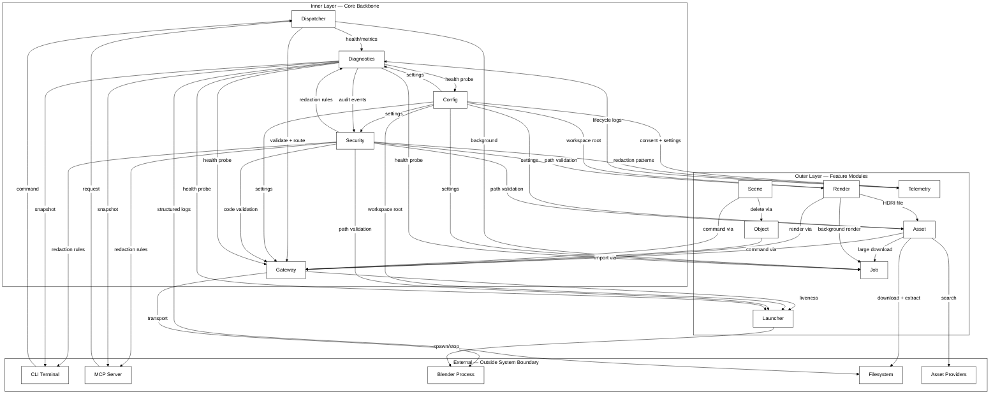

# PRD — blender-arwaky

**Version:** 1.0.0  
**Date:** 2026-07-29  

---

## Problem Statement

Blender artists and pipeline engineers lack a unified, programmable interface to control Blender remotely — for headless rendering, asset management, scene automation, and CI/CD integration. Existing solutions are either proprietary, Blender-version-locked, or require writing raw Python that bypasses safety guards. **blender-arwaky** solves this by providing an MCP (Model Context Protocol) server and CLI that expose every Blender capability through a secure, layered, AI-agent-friendly interface — from launching Blender and importing assets to rendering scenes and tracking background jobs — without ever exposing users to raw Blender Python API complexity or security risks.

---

## Goals & Success Metrics

| Goal | Success Metric |
|---|---|
| **Remote Blender control** | All core Blender operations (scene, object, render, asset, camera) executable via CLI and MCP without opening Blender GUI |
| **Safety by default** | Path traversal, code injection, and secret leakage prevented at architecture level — zero CVEs from delegated security layer |
| **Background job tracking** | Long-running renders and downloads report progress, support cancellation, and auto-cleanup without blocking the caller |
| **Observability built-in** | Health, metrics, audit, and structured logging available out of the box — no separate monitoring stack required |
| **AI-agent ready** | Every capability accessible through MCP with identical semantics as CLI; no business logic in surface layers |
| **Deterministic configuration** | Settings resolved from file → env → defaults with strict schema validation; all features derive workspace root from one source |

---

## Feature Overview

**blender-arwaky** consists of 14 interconnected feature modules:

| Module | Summary |
|---|---|
| **Launcher** | Finds, launches, and terminates the Blender process. Single authority for process lifecycle. |
| **Gateway** | Transport layer to Blender (socket/pipe). Manages connection, heartbeat, reconnection, operation queue, and raw Python code execution. |
| **Config** | Reads and validates settings from file, environment, and defaults. Provides immutable snapshot, workspace root, and redaction rules to all modules. |
| **Dispatcher** | Action catalog + routing. CLI and MCP never call domain modules directly — they submit requests to dispatcher, which validates, routes, and returns results in a standardized envelope. |
| **Asset** | Searches, downloads, extracts, and imports external assets (including HDRI) into Blender. Delegates path/archive security to Security module. |
| **Object** | Technical operations on 3D objects: create primitives, transform, material, modifier, delete, and inspect. One object per request. |
| **Scene** | Scene state inspection and bulk cleanup. Determines preservation policy (cameras, lights, protected) and delegates deletion execution to Object. |
| **Render** | Viewport screenshot, scene render, camera configuration (lens, framing, depth of field), and HDRI lighting. Long renders → Background Job. |
| **Job** | Tracks background task lifecycle: create, progress, cancel, cleanup, capacity. Single authority for task records. |
| **Security** | Path validation, archive extraction safety, untrusted code validation, sensitive value redaction, and audit events. All other modules delegate security decisions here. |
| **Diagnostics** | Observability: health composition, operational metrics, audit events, structured logging, and diagnostics snapshot. No other module computes its own health. |
| **CLI** | Terminal interface. Parses input, routes to owning feature aggregate, renders results. Zero business logic. |
| **MCP** | Model Context Protocol interface. Every capability available in CLI is also available through MCP with identical semantics. |
| **Telemetry** | Anonymous usage analytics (opt-in). Separate stream from diagnostics — never shares data, storage, or purpose. |

---

## End-to-End Data Flow Diagram

---

## User Personas

- **Blender Artist / TD**: Needs to automate renders, import assets, and clean up scenes without leaving their editor or CI pipeline.
- **AI Agent Orchestrator**: An LLM or agent framework that controls Blender through MCP — needs predictable, safe, and well-documented capabilities.
- **Pipeline Engineer**: Integrates Blender into a larger studio pipeline — needs headless operation, job tracking, and structured output (JSON).
- **Technical Product Manager**: Evaluates the system for adoption — needs clear boundaries, security guarantees, and observable behavior.

---

## Non-functional Requirements

| Area | Requirement |
|---|---|
| **Security** | All path/code/archive validation delegated to central Security feature. Redaction at ingestion for all outputs. Opt-in telemetry only. |
| **Performance** | Health probes bounded by timeout (one slow subsystem never stalls composition). Metrics pull-based at configured interval. |
| **Reliability** | Gateway reconnects with backoff. Audit/log sink failure → fallback buffer, never blocks originating op. Background jobs survive disconnects. |
| **Portability** | Cross-platform path handling. Blender version compatibility range configurable. |
| **Observability** | Structured logging, metrics, audit, and health snapshot available by default. No feature maintains private log format. |

---

## Open Questions / Risks

- **Blender addon dependency**: Gateway requires a Blender-side bridge addon — version compatibility must be maintained across Blender releases.
- **MCP protocol stability**: MCP is evolving — the server layer may need adaptation as the protocol specification changes.
- **Headless rendering limitations**: Some Blender features (viewport preview, certain modifiers) may not be available in headless mode.
